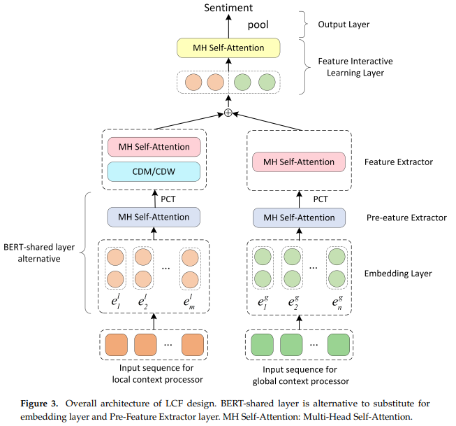
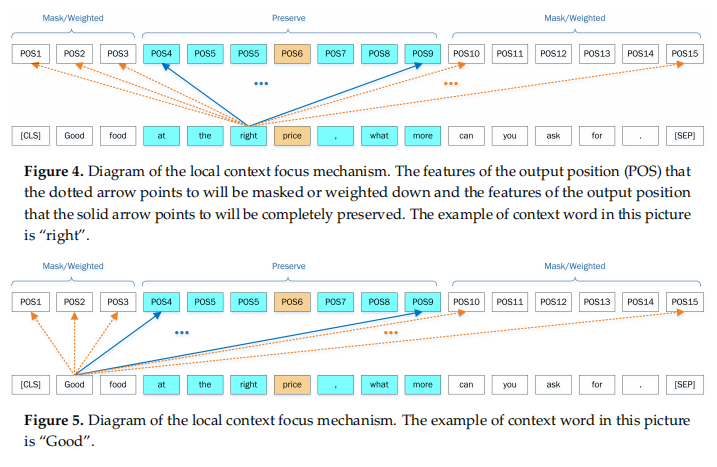

# 【关于 LCF】 那些的你不知道的事

> 作者：杨夕 
> 
> 个人github：https://github.com/km1994/nlp_paper_study 
> 
> 论文标题：LCF: A Local Context Focus Mechanism for Aspect-Based Sentiment Classification
> 
> 个人介绍：大佬们好，我叫杨夕，该项目主要是本人在研读顶会论文和复现经典论文过程中，所见、所思、所想、所闻，可能存在一些理解错误，希望大佬们多多指正。
> 
> 【注：手机阅读可能图片打不开！！！】

## 摘要

### 动机

Aspect-based sentiment classification (ABSC) aims to predict sentiment polarities of different aspects within sentences or documents. Many previous studies have been conducted to solve this problem, but previous works fail to notice the correlation between the aspect’s sentiment polarity and the local context.
没有考虑情感极性和局部上下文间关系

### 方法

 In this paper, a Local Context Focus (LCF) mechanism is proposed for aspect-based sentiment classification based on Multi-head Self-Attention (MHSA). （基于多头注意力机制）
 
 This mechanism is called LCF design, and utilizes the Context features Dynamic Mask (CDM) and Context Features Dynamic Weighted (CDW) layers to pay more attention to the local context words. 
 
 Moreover, a BERT-shared layer is adopted to LCF design to capture internal long-term dependencies of local context and global context. 
 
 ### 实验
 
 Experiments are conducted on three common ABSC datasets: the laptop and restaurant datasets of SemEval-2014 and the ACL twitter dataset. Experimental results demonstrate that the LCF baseline model achieves considerable performance. In addition, we conduct ablation experiments to prove the significance and effectiveness of LCF design. Especially, by incorporating with BERT-shared layer, the LCF-BERT model refreshes state-of-the-art performance on all three benchmark datasets.

 ## 前言

 Almost none of the previous studies took the significant emotional information contained in aspect’s local context into considerations. 
 
 Indeed, traditional DNN-based methods only focus on analyzing the correlations of the global context and sentiment polarities before identifying the sentiment polarity of targeted aspect based on global context features. 
 （在基于全局上下文特征识别目标实体的情感极性之前，分析全局上下文和情感极性）
 
 However, LCF design notices that sentiment polarity of an aspect is more relevant to the context words near to itself. Moreover, the context words far from the aspect probably tend to cause negative influence to precisely predict the polarity of specific aspect (see Figures 1 and 2). 
 （但是，LCF设计注意到，一个方面的情感极性与靠近其自身的上下文词更相关。 此外，远离该方面的上下文词可能会导致负面影响，从而无法准确预测特定方面的极性）
 
 For example, semantics, adjectives, adverbs, and other subjective presentations are usually placed to the aspects which they modify. 
 
 Further, they are more semantic-relative to the aspect which they are closed to. 
 
 In that case, Semantic-Relative Distance (SRD) (see Section 3.2) is proposed to determine if a contextual word is the local context of a specific aspect. 
 （SRD 判断 上下文词 是否 是 特定方面 的局部上下文）
 
 CDM and CDW layers concentrate on local context with the help of SRD. 
 （CDM 和 CDW 层在SRD 的 帮助下专注于 局部 上下文）

 Based on Multi-Head Self-Attention (MHSA) different from previous methods, LCF design models learn the features from the sequence-level global context, but also from local context words associated with a specific aspect. （基于与先前方法不同的多头自我注意（MHSA），LCF设计模型从序列级全局上下文中学习特征，但也从与特定方面相关联的局部上下文词中学习特征。）
 
 LCF design compute local context features according to SRD.（LCF设计根据SRD计算局部上下文特征。）

 ## 贡献

 1. LCF:利用自注意力机制同时捕获局部上下文特征和全局上下文特征，以推断 targeted aspect 的情感极性
 2. SRD:评估上下文词与 aspect 间的独立性，SRD对于弄清局部上下文具有重要意义，并且SRD阈值中的上下文单词的特征将得到保留和重点关注。
 3. CDM 和 CDW 层：强化 LCF，使其对 特殊 aspest 的局部上下文提供 更多 注意力。CDM层通过掩盖语义相对较少的上下文词的输出表示，将重点放在局部上下文上。 CDW 层根据 SRD 削弱语义相对较少的上下文词的特征；

## 方法

