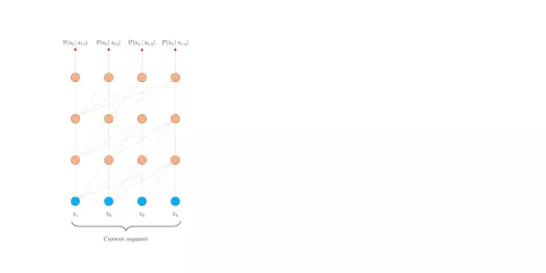

# 【关于 Transformer-XL】 那些的你不知道的事

> 作者：杨夕
> 
> 项目地址：https://github.com/km1994/nlp_paper_study
> 
> 面向任务：Language Understanding
> 
> 论文地址：[https://arxiv.org/abs/1901.02860](https://arxiv.org/abs/1901.02860)
> 
> 论文代码：[https://github.com/kimiyoung/transformer-xl](https://github.com/kimiyoung/transformer-xl)
> 
> 【注：手机阅读可能图片打不开！！！】

## 摘要

Transformer具有学习长程依赖关系的潜力，但是受到语言建模中上下文长度固定的限制。 

为此，本文提出一种新的神经网络架构Transformer-XL，该网络结构能够在不破坏时间一致性的情况下，学习到超越固定长度的依赖性。该网络结构由片段级的循环机制（segment-level recurrence）和全新的位置编码策略（positional encoding scheme）组成。 其优点是不仅可以捕获更长的依赖关系，还可以解决上下文碎片化（context fragmentation）的问题。

从实验结果上来看，Transformer-XL 学习到的依赖性比 RNN 学习到的长 80%，比标准 Transformer 学到的长 450%，无论在长序列还是短序列中都得到了更好的结果，而且在评估时比标准 Transformer 快 1800+ 倍。值得一提的是，Transformer-XL还刷新了 bpc 和perplexity（困惑度）的当前最佳结果：在 enwiki8 上 bpc 从 1.06 提升至 0.99，在 text8 上从 1.13 提升至 1.08；在 WikiText-103 上困惑度从 20.5 提升到 18.3，在 One Billion Word 上从 23.7 提升到 21.8，在宾州树库（不经过微调的情况下）上从 55.3 提升到 54.5。本文模型的代码、预训练模型以及超参数在 TensorFlow 和 PyTorch 中都可以使用。

## 动机

出发思想比较直接，就是奔着现有序列模型对于超长文本建模不足的问题而来。

RNN：主要面临梯度消失或爆炸（gradient vanishing and explosion），解决方法集中在优化方法、初始化策略、辅助记忆单元的研究上。

vanilla Transformer：最长建模长度是固定的，无法捕捉更长依赖关系；等长输入序列的获取通常没有遵循句子或语义边界（出于高效考虑，往往就是将文本按长度一段段截取，而没有采用padding机制），可能造成上下文碎片化（context fragmentation）。

## 论文思路

为了解决上述问题而提出Transformer-XL（extra long），这其中最关键的两项技术是：

引入循环机制（Reccurrence，让上一segment的隐含状态可以传递到下一个segment）：将循环（recurrence）概念引入了深度自注意力网络。不再从头计算每个新segment的隐藏状态，而是复用从之前segments中获得的隐藏状态。被复用的隐藏状态视为当前segment的memory，而当前的segment为segments之间建立了循环连接（recurrent connection）。因此，超长依赖性建模成为了可能，因为信息可以通过循环连接来传播。

提出一种新的相对位置编码方法，避免绝对位置编码在循环机制下的时序错乱：从之前的segment传递信息也可以解决上下文碎片化的问题。更重要的是，本文展示了使用相对位置而不是用绝对位置进行编码的必要性，这样做可以在不造成时间混乱（temporal confusion）的情况下，实现状态的复用。因此，作为额外的技术贡献，文本引入了简单但有效的相对位置编码公式，它可以泛化至比在训练过程中观察到的长度更长的注意力长度。

## 贡献

(1)在纯粹的自注意力模型中引入了recurrence的概念，即循环连接。

(2)推导了一种新的位置编码方案。这两种技术构成了一组完整的解决方案，因为其中任何一种单独都不能解决上下文长度固定的问题。

Transformer-XL是首个从实质上不管是character-level还是word-level都比RNN更优秀的自注意力模型。

## Model 

### Vanilla Transformer

普通的Transformer是如何编码的？[2]给了动图，很形象，每个segment分别编码，相互之间不产生任何交互。

### segment-level recurrence mechanism

为了解决长距离依赖，文章引入一个memory状态。

在训练过程中，每个片段的表示为最后的隐层状态​，​表示片段的序号，​表示片段的长度，​表示隐层维度。

在计算​片段的表示时，用memory缓存​片段​层的隐层状态​，用来更新​，这样就给下一个片段同了上文，长距离依赖也通过memory保存了下来。并且，最大可能的依赖长度线性增长，达到 $N*L$ 。

### relative position embedding scheme

在实现片段级递归时遇到一个问题：如果采用绝对位置编码，不同片段的位置编码是一样的，这很显然是不对的。公式如下：

$$
\begin{array}{l}{\mathbf{h}_{\tau+1}=f\left(\mathbf{h}_{\tau}, \mathbf{E}_{\mathbf{s}_{\tau+1}}+\mathbf{U}_{1: L}\right)} \\ {\mathbf{h}_{\tau}=f\left(\mathbf{h}_{\tau-1}, \mathbf{E}_{s_{r}}+\mathbf{U}_{1: L}\right)}\end{array}
$$

$E_{s_r}$ 表示片段 $s_r$ 的词向量，$U_{1:L}$ 表示绝对位置向量，可以看出，两个片段之间所用的位置向量是一样的。如果一个词出现在两个片段中 $x_{r:j}$ ​、 $U_{r+1:j}$ ​，按照绝对位置编码方式，它们的表示向量是一样的，难以区分。

因此，本文引入相对位置编码机制，计算self-attention公式如下：

$$
\begin{aligned} \mathbf{A}_{i, j}^{\mathbf{r}^{\mathrm{I}}} &=\underbrace{\mathbf{E}_{x_{i}}^{\top} \mathbf{W}_{q}^{\top} \mathbf{W}_{k, E} \mathbf{E}_{x_{j}}}_{(a)}+\underbrace{\mathbf{E}_{x_{i}}^{\top} \mathbf{W}_{q}^{\top} \mathbf{W}_{k, R} \mathbf{R}_{i-j}}_{(b)} \\ &+\underbrace{u^{\top} \mathbf{W}_{k, E} \mathbf{E}_{x_{j}}}_{(c)}+\underbrace{v^{\top} \mathbf{W}_{k, R} \mathbf{R}_{i-j}}_{(d)} \end{aligned}
$$

1. 引入相对位置编码​，用的是Transformer里用的sinusoid encoding matrix，不需要学。
​
1. $u$ 和 $v$ ​是需要学习的参数，这是这部分的关键。在计算self-attention时，由于query所有位置对应的query向量是一样的，因此不管的query位置如何，对不同单词的attention偏差应保持相同。
​ 
1. $W_{k,E}$ 和 $W_{k,R}$  ​也是需要学习的参数，分别产生基于内容的key向量和基于位置的key向量。

最后再经过Masked-Softmax、Layer Normalization、Positionwise-Feed-Forward得到最终预测用的​，

## Conclusion

Transformer-XL从提高语言模型的长距离依赖建模能力出发，提出了片段级递归机制，设计了更好的相对位置编码机制，对长文本的编码更有效。不仅如此，在评估阶段速度更快，很巧妙。在此基础上，XLNet[4]从无监督预训练方法出发，对比自回归语言模型和自编码语言模型的优缺点，设计出了排队语言模型，在自然语言处理下游任务中大放异彩。预训练语言模型属于自监督学习的范畴，这两篇论文从语言模型的根本问题出发（建模长距离依赖/更好地编码上下文），提出一个主要方法（片段级递归机制/排列语言模型），在实现过程中发现需要重新设计子模块（相对位置编码/双流注意力机制），最后完成significant work，使得设计的任务很有说服力，理论性强。

## Reference

[1]. Zihang Dai, Zhilin Yang, Yiming Yang, William W Cohen, Jaime Carbonell, Quoc V Le, and Ruslan Salakhutdinov. Transformer-xl: Attentive language models beyond a fixed-length context. arXiv preprint arXiv:1901.02860, 2019.

[2] [论文笔记 —— Transformer-XL](https://zhuanlan.zhihu.com/p/70745925)

[3] [Transformer-XL及XLNet论文笔记](https://www.ramlinbird.com/2019/08/05/transformer-xl及xlnet论文笔记/)

[4] [文献阅读笔记：Transformer-XL : Attentive Language Models Beyond a Fixed-Length Context](https://blog.csdn.net/ljp1919/article/details/94577523)

[5] [Transformer-XL解读（论文 + PyTorch源码）](https://blog.csdn.net/magical_bubble/article/details/89060213)

[6] [transformer-xl](https://github.com/kimiyoung/transformer-xl/tree/master/tf)
