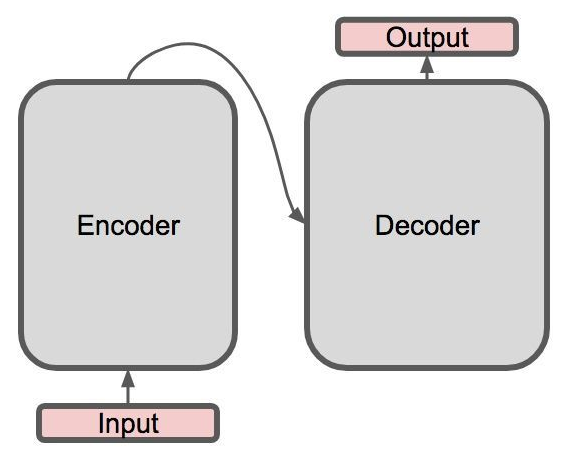
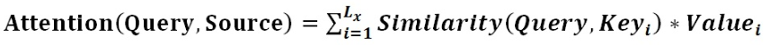
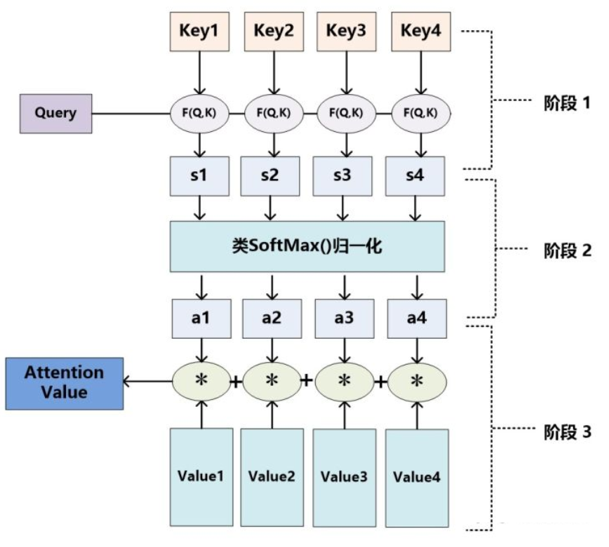
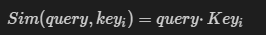
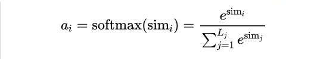
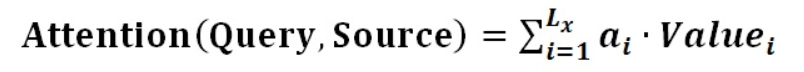
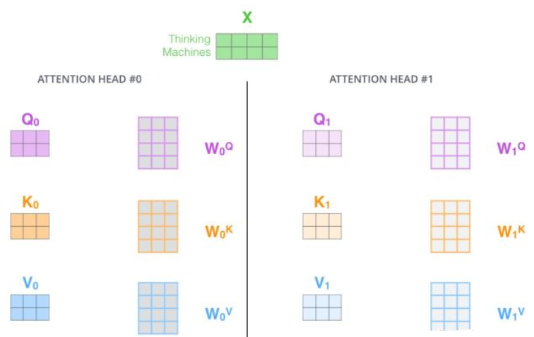
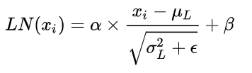
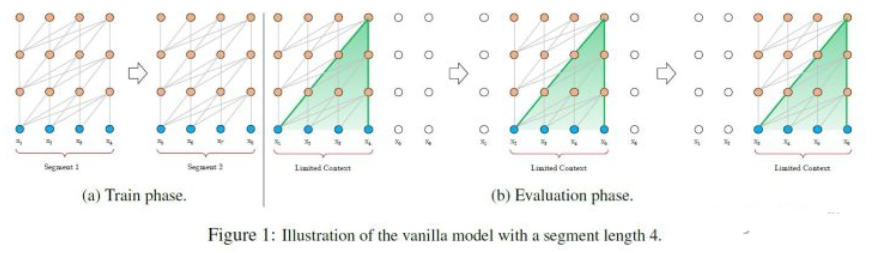
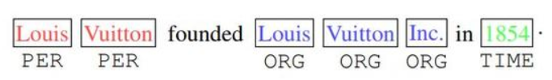

# 【关于Transformer】 那些的你不知道的事

> 作者：杨夕
> 
> 论文链接：https://arxiv.org/pdf/1706.03762.pdf
> 
> 【注：手机阅读可能图片打不开！！！】

## 引言

本博客 主要 是本人在学习 Transformer 时的**所遇、所思、所解**，通过以 **十六连弹** 的方式帮助大家更好的理解 该问题。

## 十六连弹

1. 为什么要有 Transformer?
2. Transformer 作用是什么？
3. Transformer 整体结构怎么样？
4. Transformer-encoder 结构怎么样？
5. Transformer-decoder 结构怎么样?
6. 传统 attention 是什么?
7. self-attention 长怎么样?
8. self-attention 如何解决长距离依赖问题？
9. self-attention 如何并行化？
10. multi-head attention 怎么解?
11. 为什么要 加入 position embedding ？
12. 为什么要 加入 残差模块？
13. Layer normalization。Normalization 是什么?
14. 什么是 Mask？
15. Transformer 存在问题？
16. Transformer 怎么 Coding?

## 问题解答

### 为什么要有 Transformer?

为什么要有 Transformer? 首先需要知道在 Transformer 之前都有哪些技术，这些技术所存在的问题：

- RNN：能够捕获长距离依赖信息，但是无法并行；
- CNN: 能够并行，无法捕获长距离依赖信息（需要通过层叠 or 扩张卷积核 来 增大感受野）；
- 传统 Attention
  - 方法：基于源端和目标端的隐向量计算Attention，
  - 结果：源端每个词与目标端每个词间的依赖关系 【源端->目标端】
  - 问题：忽略了 远端或目标端 词与词间 的依赖关系

### Transformer 作用是什么？

基于Transformer的架构主要用于建模语言理解任务，它避免了在神经网络中使用递归，而是完全依赖于self-attention机制来绘制输入和输出之间的全局依赖关系。

### Transformer 整体结构怎么样？

1. 整体结构

- Transformer 整体结构：
  -  encoder-decoder 结构
- 具体介绍：
  - 左边是一个 Encoder;
  - 右边是一个 Decoder;

1. 整体结构放大一点
   
从上一张 Transformer 结构图，可以知道 Transformer 是一个 encoder-decoder 结构，但是 encoder 和 decoder 又包含什么内容呢？
- Encoder 结构：
  - 内部包含6层小encoder 每一层里面有2个子层；
- Decoder 结构：
  - 内部也是包含6层小decoder ，每一层里面有3个子层

1. 整体结构再放大一点
   
 其中上图中每一层的内部结构如下图所求。
 - 上图左边的每一层encoder都是下图左边的结构；
 - 上图右边的每一层的decoder都是下图右边的结构；
  
具体内容，后面会逐一介绍。

### Transformer-encoder 结构怎么样？

- 特点：
  - 与 RNN,CNN 类似，可以当成一个特征提取器；
- 组成结构介绍
  - embedding 层：将 input 转化为 embedding 向量 $X$；
  - Position encodding: input的位置与 input 的 embedding $X$ 相加 得到 向量 $X$；
  - self-attention : 将融合input的位置信息 与 input 的 embedding 信息的 $X$ 输入 Self-Attention 层得到 $Z$;
  - 残差网络：$Z$ 与 $X$ 相加后经过 layernorm 层；
  - 前馈网络：经过一层前馈网络以及 Add&Normalize，（线性转换+relu+线性转换 如下式）
  

- 举例说明（假设序列长度固定，如100，如输入的序列是“我爱中国”）：
  - 首先需要 **encoding**：
    - 将词映射成一个数字，encoding后，由于序列不足固定长度，因此需要padding，
    - 然后输入 embedding层，假设embedding的维度是128，则输入的序列维度就是100*128；
  - 接着是**Position encodding**，论文中是直接将每个位置通过cos-sin函数进行映射；
    - 分析：这部分不需要在网络中进行训练，因为它是固定。但现在很多论文是将这块也embedding，如bert的模型，至于是encoding还是embedding可取决于语料的大小，语料足够大就用embedding。将位置信息也映射到128维与上一步的embedding相加，输出100*128
  - 经过**self-attention层**：
    - 操作：假设v的向量最后一维是64维(假设没有多头)，该部分输出100*64；
  - 经过残差网络：
    - 操作：即序列的embedding向量与上一步self-attention的向量加总；
  - 经过 **layer-norm**：
    - 原因：
      - 由于在self-attention里面更好操作而已；
      - 真实序列的长度一直在变化；
  - 经过 **前馈网络**：
    - 目的：增加非线性的表达能力，毕竟之前的结构基本都是简单的矩阵乘法。若前馈网络的隐向量是512维，则结构最后输出100*512；

### Transformer-decoder 结构怎么样?

- 特点：与 encoder 类似
- 组成结构介绍
  - masked 层：
    - 目的：确保了位置 i 的预测仅依赖于小于 i 的位置处的已知输出;
  - Linear layer：
    - 目的：将由解码器堆栈产生的向量投影到一个更大的向量中，称为对数向量。这个向量对应着模型的输出词汇表；向量中的每个值，对应着词汇表中每个单词的得分；
  - softmax层:
    - 操作：这些分数转换为概率（所有正数，都加起来为1.0）。选择具有最高概率的单元，并且将与其相关联的单词作为该时间步的输出

### 传统 attention 是什么?

- 注意力机制是什么呢？
  - 就是将精力集中于某一个点上
  - 举个例子：
    - 你在超市买东西，突然一个美女从你身边走过，这个时候你会做什么呢？
    - 没错，就是将视线【也就是注意力】集中于这个美女身上，而周围环境怎么样，你都不关注。
- 思路
  - 输入 给定 Target 中某个 query；
  - 计算权值 Score：
    - 计算 query 和 各个 Key 的相似度或相关性，得到每个 Key 对应 value 的权值系数；
  - 对 权值 Score 和 value 进行加权求和
- 核心：
  - Attention 机制 是对 source 中各个元素 的 value 进行加权求和，而 query 和 key 用于计算 对应 value 的权值系数

> $L_x=||Source||$代表Source的长度

- 概念：
  - attention 的核心 就是从 大量信息中 筛选出少量的 重要信息；
  - 具体操作：每个 value 的 权值系数，代表 其 重要度； 
  

- 具体流程介绍
  - step 1：计算权值系数
    - 采用 不同的函数或计算方式，对 query 和 key 进行计算，求出相似度或相关性
    - 采用的计算方法：
      - 向量点积：
        
      
        
      - Cosine 相似度计算：
        
      

      - MLP 网络：
        
      
        
  - step 2: softmax 归一化
    - 原因：
      1. score 值分布过散，将原始计算分值整理成所有元素权重之和为1 的概率分布；
      2. 可以通过SoftMax的内在机制更加突出重要元素的权重；
    - 公式介绍

    

  - step 3: 加权求和
    - 公式介绍：
      - 计算结果 $a_i$ 即为 $value_i$ 对应的权重系数，然后进行加权求和即可得到Attention数值

- 存在问题
  - 忽略了 源端或目标端 词与词间 的依赖关系【以上面栗子为例，就是把注意力集中于美女身上，而没看自己周围环境，结果可能就扑街了！】

### self-attention 长怎么样?

- 动机
  -  CNN 所存在的长距离依赖问题；
  -  RNN 所存在的无法并行化问题【虽然能够在一定长度上缓解 长距离依赖问题】；
- 传统 Attention
  - 方法：基于源端和目标端的隐向量计算Attention，
  - 结果：源端每个词与目标端每个词间的依赖关系 【源端->目标端】
  - 问题：忽略了 远端或目标端 词与词间 的依赖关系
- 核心思想：self-attention的结构在计算每个token时，总是会考虑整个序列其他token的表达；
  - 举例：“我爱中国”这个序列，在计算"我"这个词的时候，不但会考虑词本身的embedding，也同时会考虑其他词对这个词的影响
- 目的：学习句子内部的词依赖关系，捕获句子的内部结构。

- 步骤
  - embedding层：
    - 目的：将词转化成embedding向量；
  - Q，K，V 向量计算：
    - 根据 embedding 和权重矩阵，得到Q，K，V；
      - Q：查询向量，目标字作为 Query；
      - K：键向量，其上下文的各个字作为 Key；
      - V：值向量，上下文各个字的 Value；
  - 权重 score 计算：
    - 查询向量 query 点乘 key;
    - 目的：计算其他词对这个词的重要性，也就是权值；
  - scale 操作：
    - 乘以 $\frac{1}{\sqrt{d_{k}}}$；
    - 目的：起到调节作用，使得内积不至于太大。实际上是Q，K，V的最后一个维度，当 $d_k$ 越大， $QK^T$ 就越大，可能会将 Softmax 函数推入梯度极小的区域；
  - Softmax 归一化：
    - 经过 Softmax 归一化；
  - Attention 的输出计算：
    - 权值 score 和各个上下文字的 V 向量 的加权求和
    - 目的：把上下文各个字的 V 融入目标字的原始 V 中
- 举例
  - 答案就是文章中的Q，K，V，这三个向量都可以表示"我"这个词，但每个向量的作用并不一样，Q 代表 query，当计算"我"这个词时，它就能代表"我"去和其他词的 K 进行点乘计算其他词对这个词的重要性，所以此时其他词(包括自己)使用 K 也就是 key 代表自己，当计算完点乘后，我们只是得到了每个词对“我”这个词的权重，需要再乘以一个其他词(包括自己)的向量，也就是V(value)，才完成"我"这个词的计算，同时也是完成了用其他词来表征"我"的一个过程

- 优点
  - 捕获源端和目标端词与词间的依赖关系
  - 捕获源端或目标端自身词与词间的依赖关系

### self-attention 如何解决长距离依赖问题？

- 引言：
  - 在上一个问题中，我们提到 CNN 和 RNN 在处理长序列时，都存在 长距离依赖问题，那么你是否会有这样 几个问题：
    - 长距离依赖问题 是什么呢？
    - 为什么 CNN 和 RNN 无法解决长距离依赖问题？
    - 之前提出过哪些解决方法？
    - self-attention 是如何 解决 长距离依赖问题的呢?

下面，我们将会围绕着几个问题，进行一一解答。

- 长距离依赖问题 是什么呢？
  - 介绍：对于序列问题，第 $t$ 时刻 的 输出 $y_t$ 依赖于 $t$ 之前的输入，也就是 说 依赖于 $x_{t-k}, k=1,...,t$，当间隔 $k$ 逐渐增大时，$x_{t-k}$ 的信息将难以被 $y_t$ 所学习到，也就是说，很难建立 这种 长距离依赖关系，这个也就是 长距离依赖问题（Long-Term Dependencies Problem）。
- 为什么 CNN 和 RNN 无法解决长距离依赖问题？
  - CNN:
    - 捕获信息的方式：
      - CNN 主要采用 卷积核 的 方式捕获 句子内的局部信息，你可以把他理解为 **基于 n-gram 的局部编码方式**捕获局部信息
    - 问题：
      - 因为是 n-gram 的局部编码方式，那么当 $k$ 距离 大于 $n$ 时，那么 $y_t$ 将难以学习 $x_{t-k}$ 信息；
    - 举例：
      - 其实 n-gram 类似于 人的 视觉范围，人的视觉范围 在每一时刻 只能 捕获 一定 范围内 的信息，比如，你在看前面的时候，你是不可能注意到背后发生了什么，除非你转过身往后看。
  - RNN:
    - 捕获信息的方式：
      - RNN 主要 通过 循环 的方式学习(记忆) 之前的信息$x_{t}$；
    - 问题：
      - 但是随着时间 $t$ 的推移，你会出现**梯度消失或梯度爆炸**问题，这种问题使你只能建立短距离依赖信息。
    - 举例：
      - RNN 的学习模式好比于 人类 的记忆力，人类可能会对 短距离内发生的 事情特别清楚，但是随着时间的推移，人类开始 会对 好久之前所发生的事情变得印象模糊，比如，你对小时候发生的事情，印象模糊一样。
    - 解决方法：
      - 针对该问题，后期也提出了很多 RNN 变体，比如 LSTM、 GRU，这些变体 通过引入 门控的机制 来 有选择性 的记忆 一些 重要的信息，但是这种方法 也只能在 一定程度上缓解 长距离依赖问题，但是并不能 从根本上解决问题。

- 之前提出过哪些解决方法？
  - 引言：
    - 那么 之前 主要采用 什么方法 解决问题呢?
  - 解决方法：
    - 增加网络的层数
      - 通过一个深层网络来获取远距离的信息交互
    - 使用全连接网络
      - 通过全连接的方法对 长距离 建模；
      - 问题：
        - 无法处理变长的输入序列；
        - 不同的输入长度，其连接权重的大小也是不同的；

- self-attention 是如何 解决 长距离依赖问题的呢?
  - 解决方式：
    - 利用注意力机制来“动态”地生成不同连接的权重，从而处理变长的信息序列
  - 具体介绍：
    - 对于 当前query，你需要 与 句子中 所有 key 进行点乘后再 Softmax ，以获得 句子中 所有 key 对于 当前query 的 score(可以理解为 贡献度)，然后与 所有词 的 value 向量进行加权融合之后，就能使 当前 $y_t$ 学习到句子中 其他词$x_{t-k}$的信息；

### self-attention 如何并行化？

- 引言：
  - 在上一个问题中，我们主要讨论了 CNN 和 RNN 在处理长序列时，都存在 长距离依赖问题，以及 Transformer 是 如何解决 长距离依赖问题，但是对于 RNN ,还存在另外一个问题：
    - 无法并行化问题
  - 那么，Transformer 是如何进行并行化的呢？
- Transformer 如何进行并行化？
  - 核心：self-attention
  - 为什么 RNN 不能并行化：
    - 原因：RNN 在 计算 $x_i$ 的时候，需要考虑到 $x_1 ~ x_{i-1}$ 的 信息，使得 RNN 只能 从 $x_1$ 计算到 $x_i$;
  - 思路：
    - 在 self-attention 能够 并行的 计算 句子中不同 的 query，因为每个 query 之间并不存在 先后依赖关系，也使得 transformer 能够并行化；

### multi-head attention 怎么解?

- 思路：
  - 相当于 $h$ 个 不同的 self-attention 的集成
  - 就是把self-attention做 n 次，取决于 head 的个数；论文里面是做了8次。
- 步骤：
  - step 1 : 初始化 N 组 $Q，K，V$矩阵(论文为 8组)；
  

  - step 2 : 每组 分别 进行 self-attention;
  - step 3：
    - 问题：多个 self-attention 会得到 多个 矩阵，但是前馈神经网络没法输入8个矩阵；
    - 目标：把8个矩阵降为1个
    - 步骤：
      - 每次self-attention都会得到一个 Z 矩阵，把每个 Z 矩阵拼接起来，
      - 再乘以一个Wo矩阵，
      - 得到一个最终的矩阵，即 multi-head Attention 的结果；

最后，让我们来看一下完整的流程：

换一种表现方式：

- 动图介绍

### 为什么要 加入 position embedding ？

- 问题：
  - 介绍：缺乏 一种 表示 输入序列中 单词顺序 的方法
  - 说明：因为模型不包括Recurrence/Convolution，因此是无法捕捉到序列顺序信息的，例如将K、V按行进行打乱，那么Attention之后的结果是一样的。但是序列信息非常重要，代表着全局的结构，因此必须将序列的分词相对或者绝对position信息利用起来
- 目的：加入词序信息，使 Attention 能够分辨出不同位置的词
- 思路：
  - 在 encoder 层和 decoder 层的输入添加了一个额外的向量Positional Encoding，维度和embedding的维度一样，让模型学习到这个值
- 位置向量的作用：
  - 决定当前词的位置；
  - 计算在一个句子中不同的词之间的距离
- 步骤：
  - 将每个位置编号，
  - 然后每个编号对应一个向量，
  - 通过将位置向量和词向量相加，就给每个词都引入了一定的位置信息。

- 论文的位置编码是使用三角函数去计算的。好处：
  - 值域只有[-1,1]
  - 容易计算相对位置。

> 注：
> 
> $pos$ 表示当前词在句子中的位置
> 
> $i$ 表示向量中每个值 的 index
> 
> 在偶数位置：使用 正弦编码 $sin()$;
> 
> 在奇数位置：使用 余弦编码 $cos()$;

### 为什么要 加入 残差模块？

- 动机：因为 transformer 堆叠了 很多层，容易 梯度消失或者梯度爆炸

### Layer normalization。Normalization 是什么?

- 动机：因为 transformer 堆叠了 很多层，容易 梯度消失或者梯度爆炸；
- 原因：
  - 数据经过该网络层的作用后，不再是归一化，偏差会越来越大，所以需要将 数据 重新 做归一化处理；
- 目的：
  - 在数据送入激活函数之前进行normalization（归一化）之前，需要将输入的信息利用 normalization 转化成均值为0方差为1的数据，避免因输入数据落在激活函数的饱和区而出现 梯度消失或者梯度爆炸 问题
- 介绍：
  - 归一化的一种方式
  - 对每一个样本介绍均值和方差【这个与 BN 有所不同，因为他是在 批方向上 计算均值和方差】
- 公式
  
> BN 计算公式

> LN 计算公式

### 什么是 Mask？

- 介绍：掩盖某些值的信息，让模型信息不到该信息；
- 类别：padding mask and sequence mask
  - padding mask
    - 作用域：每一个 scaled dot-product attention 中
    - 动机：
      - 输入句子的长度不一问题
    - 方法：
      - 短句子：后面 采用 0 填充
      - 长句子：只截取 左边 部分内容，其他的丢弃
    - 原因：
      - 对于 填充 的位置，其所包含的信息量 对于 模型学习 作用不大，所以 self-attention 应该 抛弃对这些位置 进行学习；
    - 做法：
      - 在这些位置上加上 一个 非常大 的负数（负无穷），使 该位置的值经过 Softmax 后，值近似 0，利用 padding mask 标记哪些值需要做处理；
  - sequence mask
    - 作用域：只作用于 decoder 的 self-attention 中
    - 动机：不可预测性；
    - 目标：sequence mask 是为了使得 decoder 不能看见未来的信息。也就是对于一个序列，在 time_step 为 t 的时刻，我们的解码输出应该只能依赖于 t 时刻之前的输出，而不能依赖 t 之后的输出。因此我们需要想一个办法，把 t 之后的信息给隐藏起来。
    - 做法：
      - 产生一个上三角矩阵，上三角的值全为0。把这个矩阵作用在每一个序列上，就可以达到我们的目的
> 注：
> 
> 在 decoder 的 scaled dot-product attention 中，里面的 attn_mask = padding mask + sequence mask
> 
> 在 encoder 的 scaled dot-product attention 中，里面的 attn_mask = padding mask

### Transformer 存在问题？

- 引言
  - 居然 Transformer 怎么厉害，那么 是否也存在不足呢?
  - 答案: 有的
- 问题一：不能很好的处理超长输入问题？
  - 介绍：Transformer 固定了句子长度；
  - 举例：
    - 例如 在 Bert 里面，输入句子的默认长度 为 512；
  - 对于长度长短问题，做了以下处理：
    - 短于 512：填充句子方式；
    - 长于 512：
      - 处理方式一：截断句子方式（Transformer 处理方式）；
      - 处理方式二：将句子划分为 多个 seg ([Vanilla Transformer](https://aaai.org/ojs/index.php/AAAI/article/view/4182) 处理方式);
        - 思路：
          - 将文本划分为多个segments；
          - 训练的时候，对每个segment单独处理；
        - 问题：
          - 因为 segments 之间独立训练，所以不同的token之间，最长的依赖关系，就取决于segment的长度 (如图(a))；
          - 出于效率的考虑，在划分segments的时候，不考虑句子的自然边界，而是根据固定的长度来划分序列，导致分割出来的segments在语义上是不完整的 (如图(a))；
          - 在预测的时候，会对固定长度的 segment 做计算，一般取最后一个位置的隐向量作为输出。为了充分利用上下文关系，在每做完一次预测之后，就对整个序列向右移动一个位置，再做一次计算，这导致计算效率非常低 (如图(b))；
      
      

      - 处理方式三：Segment-Level Recurrenc ( [Transformer-XL](https://aaai.org/ojs/index.php/AAAI/article/view/4182) 处理方式);
        - 思路：
          - 在对当前segment进行处理的时候，**缓存**并利用上一个segment中所有layer的隐向量序列；
          - 上一个segment的所有隐向量序列只参与前向计算，不再进行反向传播；
  

- 问题二：方向信息以及相对位置 的 缺失 问题？
  - 动机：
    - 方向信息和位置信息的缺失，导致 Transformer 在 NLP 中表现性能较差，例如在 命名实体识别任务中；
      - 举例：
        - 如下图，“Inc”单词之前的词很有可能就是机构组织（ORG），“in”单词之后的词，很有可能是时间地点（TIME）；并且一个实体应该是连续的单词组成，标红的“Louis Vuitton”不会和标蓝的“Inc”组成一个实体。但是原始的Transformer无法捕获这些信息。

  - 解决方法：
    - 可以查看 [TENER: Adapting Transformer Encoder for Name Entity Recognition](https://arxiv.org/pdf/1911.04474.pdf) 【论文后期会做总结】

- 问题三：缺少Recurrent Inductive Bias
  - 动机：
    - 学习算法中Inductive Bias可以用来预测从未遇到的输入的输出（参考[10])。对于很多序列建模任务（如需要对输入的层次结构进行建模时，或者在训练和推理期间输入长度的分布不同时），Recurrent Inductive Bias至关重要【可以看论文[The Importance of Being Recurrent for Modeling Hierarchical Structure](https://arxiv.org/abs/1803.03585)】
- 问题四：Transformer是非图灵完备的： 非图灵完备通俗的理解，就是无法解决所有的问题
  - 动机：
    -  在Transformer中，单层中sequential operation (context two symbols需要的操作数)是$O(1)$ time，独立于输入序列的长度。那么总的sequenctial operation仅由层数$T$决定。这意味着transformer不能在计算上通用，即无法处理某些输入。如：输入是一个需要**对每个输入元素进行顺序处理**的函数，在这种情况下，对于任意给定的深度$T$的transformer，都可以构造一个长度为 $N>T$;
- 问题五：transformer缺少conditional computation
  - 动机：
    -  transformer在encoder的过程中，所有输入元素都有相同的计算量，比如对于“I arrived at the bank after crossing the river", 和"river"相比，需要更多的背景知识来推断单词"bank"的含义，然而transformer在编码这个句子的时候，无条件对于每个单词应用相同的计算量，这样的过程显然是低效的。
- 问题六：transformer 时间复杂度 和 空间复杂度 过大问题
  - 动机：
    - Transformer 中用到的自注意力与长度n呈现出$O(n^2)$的时间和空间复杂度
  - 解决方法：
    - [Linformer](https://arxiv.org/abs/2006.04768)

### Transformer 怎么 Coding?

- 最后的最后，送上 whalePaper 成员 逸神 的 【[Transformer 理论源码细节详解](https://zhuanlan.zhihu.com/p/106867810)】;

- 理论+实践，干活永不累！

## 参考资料

1. [Transformer理论源码细节详解](https://zhuanlan.zhihu.com/p/106867810)
2. [论文笔记：Attention is all you need（Transformer）](https://zhuanlan.zhihu.com/p/51089880)
3. [深度学习-论文阅读-Transformer-20191117](https://zhuanlan.zhihu.com/p/92234185)
4. [Transform详解(超详细) Attention is all you need论文](https://zhuanlan.zhihu.com/p/63191028)
5. [目前主流的attention方法都有哪些？](https://www.zhihu.com/question/68482809/answer/597944559)
6. [transformer三部曲](https://zhuanlan.zhihu.com/p/85612521)
7. [Character-Level Language Modeling with Deeper Self-Attention](https://aaai.org/ojs/index.php/AAAI/article/view/4182)
8. [Transformer-XL: Unleashing the Potential of Attention Models](https://ai.googleblog.com/2019/01/transformer-xl-unleashing-potential-of.html)
9. [The Importance of Being Recurrent for Modeling Hierarchical Structure](https://arxiv.org/abs/1803.03585)
10. [Linformer](https://arxiv.org/abs/2006.04768)

