# 【关于 Efficient Transformers: A Survey】 那些你不知道的事

> 作者：杨夕
> 
> 论文名称：Efficient Transformers: A Survey
> 
> 论文地址：https://arxiv.org/abs/2009.06732
> 
> 项目地址：https://github.com/km1994/nlp_paper_study
> 
> 个人介绍：大佬们好，我叫杨夕，该项目主要是本人在研读顶会论文和复现经典论文过程中，所见、所思、所想、所闻，可能存在一些理解错误，希望大佬们多多指正。
> 
> NLP 面经地址：https://github.com/km1994/NLP-Interview-Notes

- [【关于 Efficient Transformers: A Survey】 那些你不知道的事](#关于-efficient-transformers-a-survey-那些你不知道的事)
  - [一、摘要](#一摘要)
  - [二、Transformer 介绍](#二transformer-介绍)
  - [三、Efficient Transformers](#三efficient-transformers)
    - [3.1 Fixed patterns（FP）](#31-fixed-patternsfp)
      - [3.1.1 Fixed patterns（FP） 介绍](#311-fixed-patternsfp-介绍)
      - [3.1.2 Fixed patterns（FP） 类别](#312-fixed-patternsfp-类别)
    - [3.2 Combination of Patterns (CP)](#32-combination-of-patterns-cp)
      - [3.2.1 Combination of Patterns (CP) 介绍](#321-combination-of-patterns-cp-介绍)
      - [3.2.2 Combination of Patterns (CP)  类别](#322-combination-of-patterns-cp--类别)
      - [3.2.3 Fixed patterns（FP） vs 多Combination of Patterns (CP)](#323-fixed-patternsfp-vs-多combination-of-patterns-cp)
    - [3.3 Learnable Patterns (LP)](#33-learnable-patterns-lp)
      - [3.3.1 Learnable Patterns (LP) 介绍](#331-learnable-patterns-lp-介绍)
      - [3.3.2 Learnable Patterns (LP)  类别](#332-learnable-patterns-lp--类别)
      - [3.3.3 Learnable Patterns (LP)  优点](#333-learnable-patterns-lp--优点)
    - [3.4 Memory](#34-memory)
      - [3.4.1 Memory 介绍](#341-memory-介绍)
      - [3.4.2 Memory 类别](#342-memory-类别)
    - [3.5 Low-Rank 方法](#35-low-rank-方法)
      - [3.5.1 Low-Rank 方法 介绍](#351-low-rank-方法-介绍)
      - [3.5.2 Low-Rank 方法 类别](#352-low-rank-方法-类别)
    - [3.6 Kernels 方法](#36-kernels-方法)
      - [3.6.1  Kernels 方法 介绍](#361--kernels-方法-介绍)
      - [3.6.2  Kernels 方法 代表](#362--kernels-方法-代表)
    - [3.7  Recurrence 方法](#37--recurrence-方法)
      - [3.7.1  Recurrence 方法 介绍](#371--recurrence-方法-介绍)
      - [3.7.2  Kernels 方法 代表](#372--kernels-方法-代表)
  - [四、Transformer 变体 介绍](#四transformer-变体-介绍)
    - [4.1 引言](#41-引言)
    - [4.2 Memory Compressed Transformer [4]](#42-memory-compressed-transformer-4)
      - [4.2.1 Local Attention Span](#421-local-attention-span)
      - [4.2.2 Local Attention Span](#422-local-attention-span)
      - [4.2.3 Computation and Memory Complexity](#423-computation-and-memory-complexity)
    - [4.3 Image Transformer [5]](#43-image-transformer-5)
      - [4.3.1 Localized Attention Span](#431-localized-attention-span)
      - [4.3.2 Computational and Memory Complexity](#432-computational-and-memory-complexity)
    - [4.4 Set Transformer [6]](#44-set-transformer-6)
      - [4.4.1 应用场景](#441-应用场景)
      - [4.4.2 Diagrams of our attention-based set operations](#442-diagrams-of-our-attention-based-set-operations)
      - [4.4.3 Computational and Memory Complexity](#443-computational-and-memory-complexity)
    - [4.5 Sparse Transformer](#45-sparse-transformer)
      - [4.5.1 介绍](#451-介绍)
      - [4.5.2 Attention](#452-attention)
      - [4.5.3 Computational and Memory Complexity](#453-computational-and-memory-complexity)
      - [4.5.4 局限性](#454-局限性)
    - [4.6 Axial Transformer](#46-axial-transformer)
      - [4.6.1 介绍](#461-介绍)
      - [4.6.2 Computational and Memory Complexity](#462-computational-and-memory-complexity)
    - [4.7 Longformer](#47-longformer)
      - [4.7.1 介绍](#471-介绍)
      - [4.7.2 Computational and Memory Complexity](#472-computational-and-memory-complexity)
    - [4.8  Extended Transformer Construction (ETC)（2020）【9】](#48--extended-transformer-construction-etc20209)
      - [4.8.1 介绍](#481-介绍)
      - [4.8.2 Computational and Memory Complexity](#482-computational-and-memory-complexity)
      - [4.8.3 局限性](#483-局限性)
    - [4.9  BigBird（2020）](#49--bigbird2020)
      - [4.9.1 介绍](#491-介绍)
      - [4.9.2 Computational and Memory Complexity](#492-computational-and-memory-complexity)
      - [4.9.3 局限性](#493-局限性)
    - [4.10  Routing Transformer](#410--routing-transformer)
      - [4.10.1 介绍](#4101-介绍)
      - [4.10.2 Computational and Memory Complexity](#4102-computational-and-memory-complexity)
    - [4.11  Reformer（2020）](#411--reformer2020)
      - [4.11.1 介绍](#4111-介绍)
      - [4.11.2 Computational and Memory Complexity](#4112-computational-and-memory-complexity)
    - [4.12  Sinkhorn Transformers](#412--sinkhorn-transformers)
      - [4.12.1 介绍](#4121-介绍)
      - [4.12.2 Computational and Memory Complexity](#4122-computational-and-memory-complexity)
    - [4.13  Linformer](#413--linformer)
      - [4.13.1 介绍](#4131-介绍)
      - [4.13.2 Computational and Memory Complexity](#4132-computational-and-memory-complexity)
    - [4.14   Linear Transformer](#414---linear-transformer)
      - [4.14.1 介绍](#4141-介绍)
      - [4.14.2 Computational and Memory Complexity](#4142-computational-and-memory-complexity)
    - [4.15  Performer（2020）](#415--performer2020)
      - [4.15.1 介绍](#4151-介绍)
      - [4.15.2 Computational and Memory Complexity](#4152-computational-and-memory-complexity)
    - [4.16  Synthesizer models（2020）](#416--synthesizer-models2020)
      - [4.16.1 介绍](#4161-介绍)
      - [4.16.2 Computational and Memory Complexity](#4162-computational-and-memory-complexity)
    - [4.17  Transformer-XL（2020）](#417--transformer-xl2020)
      - [4.17.1 介绍](#4171-介绍)
      - [4.17.2 Computational and Memory Complexity](#4172-computational-and-memory-complexity)
    - [4.18  Compressive Transformers](#418--compressive-transformers)
      - [4.18.1 介绍](#4181-介绍)
      - [4.18.2 Computational and Memory Complexity](#4182-computational-and-memory-complexity)
  - [五、总结](#五总结)
  - [参考](#参考)

## 一、摘要

Transformer model architectures have garnered immense interest lately due to their effectiveness across a range of domains like language, vision and reinforcement learning. In the field of natural language processing for example, Transformers have become an indispensable staple in the modern deep learning stack. Recently, a dizzying number of "X-former" models have been proposed - Reformer, Linformer, Performer, Longformer, to name a few - which improve upon the original Transformer architecture, many of which make improvements around computational and memory efficiency. With the aim of helping the avid researcher navigate this flurry, this paper characterizes a large and thoughtful selection of recent efficiency-flavored "X-former" models, providing an organized and comprehensive overview of existing work and models across multiple domains.

Transformer模型体系结构由于其跨语言、视觉和强化学习等一系列领域的有效性，最近引起了人们极大的兴趣。例如，在自然语言处理领域，Transformer 已经成为现代深度学习中不可或缺的主要部分。最近，有许多令人眼花缭乱的“X-former”模型被提出，比如Reformer、Linformer、Performer、Longformer等等，它们改进了原有的Transformer架构，其中许多都围绕计算和内存效率进行了改进。为了帮助热心的研究人员驾驭这股热潮，本文描述了大量和深思熟虑的最近效率口味的“X-former”模型的选择，提供了跨多个领域的现有工作和模型的有组织和全面的概述。

## 二、Transformer 介绍

Transformer 介绍 可以 查看 [【关于Transformer】 那些的你不知道的事](https://github.com/km1994/nlp_paper_study/tree/master/DL_algorithm/transformer_study)

## 三、Efficient Transformers

### 3.1 Fixed patterns（FP）

#### 3.1.1 Fixed patterns（FP） 介绍

Fixed patterns（FP） 作为最早的针对 self-attention 的改进方法，通过限制attention的范围，从全局到局部，降低计算复杂度。

#### 3.1.2 Fixed patterns（FP） 类别

1. Blockwise Patterns

- 方式：在实践中最简单的示例是blockwise（或chunking）范式，该方式 主要事将输入序列切分成 多个 block，然后分别对 每个 block 进行 attention；
- 优点：通过这种方式将 复杂度 从 $O(N^2)$ 降低到 $O(B^2)$，这里的 B 为 Block size；
- 缺点：对于 输入序列 进行切割，容易导致 序列不连贯 问题，使得 attention 能力受到限制，性能下降；

2. Strided Patterns

- 方式： 利用 滑动窗口 的方法，即 分别对 每个 token 和其所相邻的 token 做 attention，相邻 token 的数量 即为 滑动窗口 的大小【window size】;
- 优点：这种方式类似于 卷积层，能够 捕获 每个 token 的 局部信息；
- 缺点：这种方式 和 卷积层一样，由于 只对 局部感受野 进行 attention，所以 对于 感受野 以外 的信息，无法捕获到；

3. Compressed Patterns 

- 方式：通过卷积池化的方式对序列进行负采样，比如用kernel 为2，stride为2的CNN，将2个token表征成一个向量，然后在做attention；
- 优点：降低attention的计算复杂度。其实就相当于通过CNN对序列进行n-gram的切分。
- 缺点：与 Strided Patterns 类似问题，这种方法不可避免 的 出现 长距离依赖问题；

### 3.2 Combination of Patterns (CP)

#### 3.2.1 Combination of Patterns (CP) 介绍

通过组合两个或多个不同的访问模式来提高覆盖范围。

#### 3.2.2 Combination of Patterns (CP)  类别

- Sparse Transformer 将其一半的头部分配给模式，结合strided 和 local attention；
- Axial Transformer 在给定高维张量作为输入的情况下，沿着输入张量的单轴应用一系列的self attention计算。

#### 3.2.3 Fixed patterns（FP） vs 多Combination of Patterns (CP)

- Fixed patterns（FP）：以固定模式相同的方式降低了内存的复杂度；
- Combination of Patterns (CP)：改善了self attention机制的总覆盖范围。

### 3.3 Learnable Patterns (LP)

#### 3.3.1 Learnable Patterns (LP) 介绍

上面 介绍的  Fixed patterns（FP），是通过认为认定好 attention的范围 的方式来减低 计算复杂度，但是 不同 的 token 所对应 的 attention的范围 不一样相同，容易出现 信息丢失问题。

那么，attention的范围 是否 可以 让模型 自学习 获得呢？

针对该问题，Learnable Patterns (LP) 通过引入可学习参数，让模型自己找到划分区域。LP的关键是确定token相关性，将token分配给buckets 或者clusters。

#### 3.3.2 Learnable Patterns (LP)  类别

- Reformer 引入了基于哈希的相似性度量，有效地将token聚类为chunks；
- Routing Transformer 在token上采用在线的k-means聚类；
- Sinkhorn排序网络（Sorting Network）通过学习对输入序列的blocks排序来显露attention weight的sparsity。

#### 3.3.3 Learnable Patterns (LP)  优点

所有这些模型中，相似性函数与网络的其它部分一起进行端到端训练。LP 的**关键点仍然是利用固定模式（chunked patterns）**。但是，此类方法**学会对输入token进行排序/聚类，即保持FP方法效率优势的同时，得到更优的序列全局视图**。

### 3.4 Memory

#### 3.4.1 Memory 介绍

用一个side memory模块，可以一次访问多个token。通用形式是全局存储器，能够访问整个序列。全局token充当记忆的一种形式，从输入序列的token中学习聚集。

#### 3.4.2 Memory 类别

1. Set Transformers

- 介绍：Set Transformers 中引入的inducing points方法，这个过程其实就是利用这m个向量将输入序列X的信息先通过attention进行压缩，再通过attention还原，达到抽取输入序列的特征的目的。这些参数通常被解释为“memory”，并用作将来处理的临时上下文信息。这可以看作是parameter attention的一种形式。
- 流程
  - 先单独设置了m个向量（m是超参数）；
  - 然后这m个向量与X做multihead attention，得到m个临时向量（这些个临时变量我们就称作“temporary memory”）；
  - 接着把X与这m个临时向量再做一次multihead attention得到输出。
- 缺点：在压缩编码解码的过程中肯定会有信息损失

2. ETC和Longformer

- 介绍：引入全局记忆，即设置一些token，它们可以与所有的token进行注意力交互，比如bert的[CLS]，由于这些token的数目远小于序列长度，因此也不会给计算带来负担，而且往往携带了整个输入序列的信息，这就是我们可以在bert上用[CLS]作文本分类任务的原因。

### 3.5 Low-Rank 方法

#### 3.5.1 Low-Rank 方法 介绍

Low-Rank 方法 采用 N*N 矩阵 的 low-rank 结构 近似 self-attention matrix，以提高计算效率

#### 3.5.2 Low-Rank 方法 类别

1. Linformer

由于 通过 softmax 计算之后的 $N*N$ attention 矩阵不是 一个满秩矩阵，所以 不需要 考虑 计算一个 完整 attention 矩阵，也就是说我们 可以将 一个 $n*d$ 的 K，V 映射 到 $k*d$ 维 空间上；

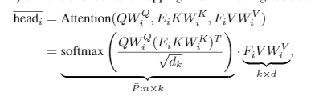

> 注：由于将 $n*d$ 维（n 为序列长度，d 为模型向量维度）的 key 和 val 映射到 $k*d$ 维 空间上，所以 attention矩阵被降到 $n*k$ 维，时间复杂度 降到 $O（n）$;

### 3.6 Kernels 方法

#### 3.6.1  Kernels 方法 介绍

- 前言：对于 Kernels 方法，大家可能都不陌生，因为在 SVM 方法中就有提到过 该方法， Kernels 方法 在 SVM 方法中的应用，主要是将 在给定空间中线性不可分 的 训练集 通过 Kernels 方法 映射到 线性可分的空间中。；
- 介绍：在 Transformer 优化方法中，可以利用 Kernels 方法 进行变换，并利用 变换后的结果 代替 原有的softmax注意力矩阵计算；
- 优点：这种方法可以将 计算复杂度 下降至 O(n);

#### 3.6.2  Kernels 方法 代表

1. Linear Transformers

### 3.7  Recurrence 方法

#### 3.7.1  Recurrence 方法 介绍

- 介绍：作为 3.1 节 提到的 fixed patterns 中 blockwise 的 扩展，Recurrence 方法 本质上仍是对输入序列进行区域划分，不过它进一步的对划分后的block做了一层循环连接，通过这样的层级关系就可以把一个长序列的输入更好的表征。

#### 3.7.2  Kernels 方法 代表

1. Transformer-XL

为了解决长距离依赖，Transformer-XL 提出了 segment-level recurrence mechanism， 即引入一个 memory 状态。

在训练过程中，每个片段的表示为最后的隐层状态​，​表示片段的序号，​表示片段的长度，​表示隐层维度。

在计算​片段的表示时，用memory缓存​片段​层的隐层状态​，用来更新​，这样就给下一个片段同了上文，长距离依赖也通过memory保存了下来。并且，最大可能的依赖长度线性增长，达到 $N*L$ 。

## 四、Transformer 变体 介绍

### 4.1 引言

这一节 主要将对 上一节 所提到的 Transformer 变体 进行介绍。

我们首先讨论 local and fixed patterns models ，例如Memory Compressed Transformer（Liu等人，2018）和Image Transformer（Parmaret等人，2018）。然后我们讨论Set Transformers（Lee等人，2019），这是一种利用 global memory 的早期方法。接下来，我们继续使用利用 combinationsof pattern 的模型，例如  Sparse Transformers (Child et al., 2019) 和 Axial Transformers (Hoet al., 2019) 。接下来，我们讨论 Longformer（Beltagy等，2020）和ETC（Ainslie等，2020），介绍了 memory-based  approaches 的 Sparse  Transformer  family 。我们的详细演练将继续研究结合了 learnable  patterns(LP) 的模型，例如 Routing Transformers (Roy et al., 2020) ，Reformer（Kitaev等人，2020）和 Sinkhorn  Transformers  (Tay  et  al.,  2020b)。之后，我们介绍了可以被视为 Linformer  (Wanget  al.,  2020b)  和 Synthesizers  (Tay  et  al.,  2020a) 。然后，我们讨论 based on kernel approaches 的模型，例如Performer（Choromanski等，2020）和 Linear Transformers（Katharopoulos等，2020）。最后，我们讨论ased on segment-based recurrence ，例如 Transformer-XL（Dai等人，2019）和 Compressive Transformers（Rae等人，2020）

### 4.2 Memory Compressed Transformer [4]

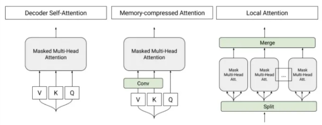

#### 4.2.1 Local Attention Span

- 介绍：将输入序列分为长度相似的模块，并在每个部分中运行自注意力机制，这样能保证每个部分的注意力成本不变，激活次数就能根据输入长度线性缩放。

#### 4.2.2 Local Attention Span

采用跨步卷积（strided convolution），减少注意力矩阵的大小、以及注意力的计算量，减少的量取决于跨步的步幅。

#### 4.2.3 Computation and Memory Complexity

- 时间复杂度：$O(n.n/k)$
- 空间复杂度：$O(n.n/k)$

> 对于 b 的块大小，self-attention 的计算区域存储成本为每个块 $O(b^2)$，并且给定 n/b 个块，则局部注意的计算和存储成本为 O(b.n)。对于内存压缩的注意力，应用具有内核大小和k的跨度的卷积，注意力机制的计算和内存成本降低到 $O(n.n/k)$。

### 4.3 Image Transformer [5]

#### 4.3.1 Localized Attention Span

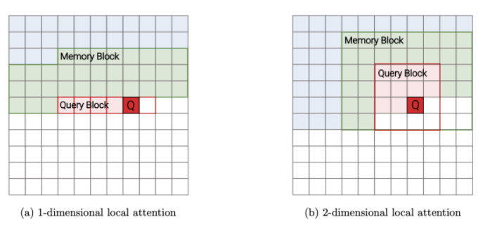

受卷积神经网络启发的Transformer变种，重点是局部注意范围，即将接受域限制为局部领域，主要有两种方案：一维局部注意和二维局部注意。

#### 4.3.2 Computational and Memory Complexity

- 时间复杂度：$O(n.m)$
- 空间复杂度：$O(n.m)$

> 在Image Transformer中，注意矩阵的形状为 $l_q × m$，其中查询块的选定长度和存储块的长度错误（实际上为 $l_q + l_m$）。考虑到存储块不重叠，我们必须计算 $n×l_q$ attention 矩阵。

### 4.4 Set Transformer [6]

#### 4.4.1 应用场景

输入是一组特征，输出是这组特征的函数

#### 4.4.2 Diagrams of our attention-based set operations

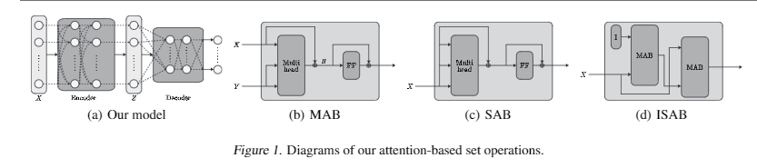

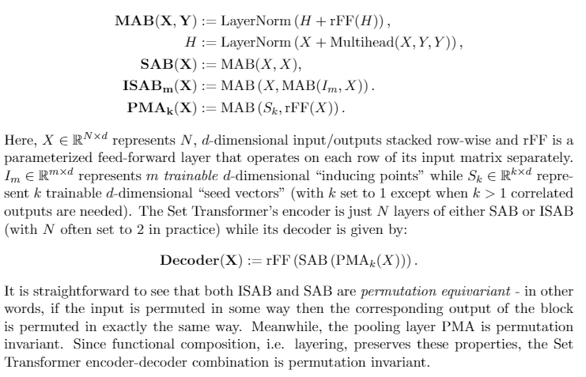

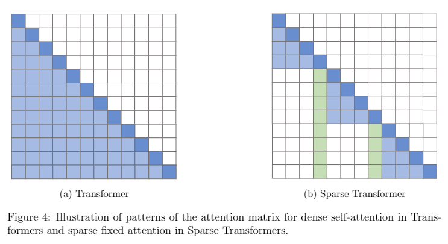

#### 4.4.3 Computational and Memory Complexity

利用了稀疏高斯过程，将输入集大小的注意复杂度从二次降为线性。

### 4.5 Sparse Transformer

#### 4.5.1 介绍

这个模型的关键思想，在于仅在一小部分稀疏的数据对上计算注意力，以将密集注意力矩阵简化为稀疏版本。

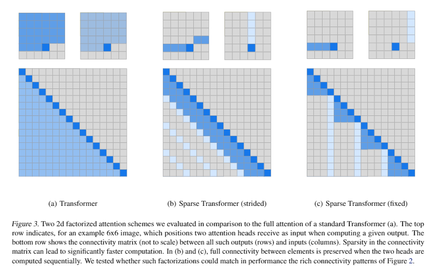

#### 4.5.2 Attention 

- Local Attention Heads

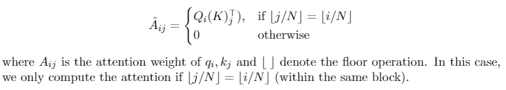

- Strided  Attention  Heads

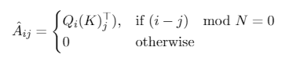

#### 4.5.3 Computational and Memory Complexity

自注意力机制的修改不会改变模型的参数成本，因为模型仍然保留了原始Transformer模型的Q，K，V变换。注意层的内存复杂度从 $O(n^2)$ 降低到 $O(nlogn)$

#### 4.5.4 局限性

不过这个模型对硬件有所要求，需要自定义GPU内核，且无法直接在TPU等其他硬件上使用。

### 4.6 Axial Transformer

#### 4.6.1 介绍

Axial Transformer 主要沿输入张量的单轴施加多个注意力，每个注意力都沿特定轴混合信息，从而使沿其他轴的信息保持独立。

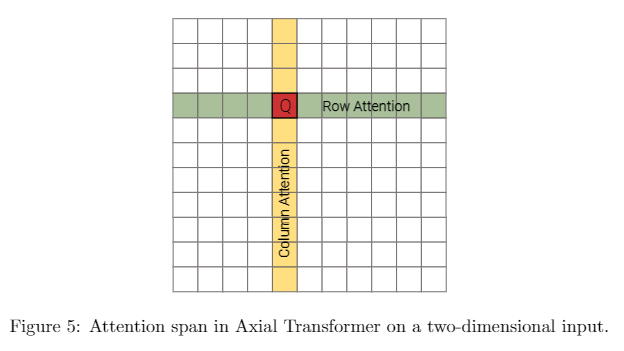

Axial Transformer 提供了 encoder-decoder 架构。对于 decoding ，为了能够实现 casual mask ，Axial Transformer 将 axial attentions 与 shift operations 相结合。例如，对于二维张量的模型，以栅格顺序生成像素，然后首先通过 unmasked   的行和 unmasked   的列 attention 对所有像素进行编码。然后，对于每一行，模型都会应用 unmasked 的行和 masked 的列，以集成先前采样的行。最后，模型将编码表示形式上移，以确保条件信息满足因果关系，并运行 masked 的行注意以对图像中的新行进行采样

#### 4.6.2 Computational and Memory Complexity

由于任何单轴的长度通常都比元素总数小得多，因此这个模型可以显著地节省计算和内存

### 4.7 Longformer

#### 4.7.1 介绍

Sparse Transformer的变体，通过在注意力模式中留有空隙、增加感受野来实现更好的远程覆盖。

在分类任务上，Longformer采用可以访问所有输入序列的全局token（例如CLS token）。

#### 4.7.2 Computational and Memory Complexity

O(n^2) -> O(nk)

> 注：k 为窗口大小

### 4.8  Extended Transformer Construction (ETC)（2020）【9】

#### 4.8.1 介绍

ETC 是Sparse Transformer的变体，引入了一种新的全局本地注意力机制，在引入全局token方面与Longformer相似。 这种新的关注机制有四个组成部分，即(1) global-to-global (g2g), global-to-local (g2l), local-to-global (l2g) and local-to-local (l2l);

#### 4.8.2 Computational and Memory Complexity

- 空间复杂度：

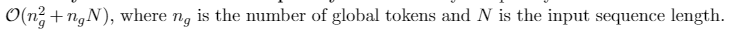

#### 4.8.3 局限性

但由于无法计算因果掩码，ETC不能用于自动回归解码。

### 4.9  BigBird（2020）

#### 4.9.1 介绍

与Longformer一样，同样使用全局内存，但不同的是，它有独特的“内部变压器构造（ITC）”，即全局内存已扩展为在sequence中包含token，而不是简单的参数化内存。

The Big Bird model com-prises of several key components, namely (1) global tokens, (2) random attention (queriesattend to random keys) and (3) fixed patterns (local sliding windows)

#### 4.9.2 Computational and Memory Complexity

- 空间复杂度：O(n)

#### 4.9.3 局限性

与ETC一样，BigBird同样不能用于自动回归解码。

### 4.10  Routing Transformer

#### 4.10.1 介绍

Routing Transformer 提出了一种基于聚类的注意力机制，以数据驱动的方式学习注意力稀疏。为了确保集群中的token数量相似，模型会初始化聚类，计算每个token相对于聚类质心的距离。

利用 Q 和 K 计算  routing  matrix R

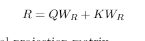

> 注：$W_R$ is a d×d orthonormal projection matrix

#### 4.10.2 Computational and Memory Complexity

- 空间复杂度：O(nlogn)

### 4.11  Reformer（2020）

#### 4.11.1 介绍

一个基于局部敏感哈希（LSH）的注意力模型，引入了可逆的Transformer层，有助于进一步减少内存占用量。

模型的关键思想，是附近的向量应获得相似的哈希值，而远距离的向量则不应获得相似的哈希值，因此被称为“局部敏感”。

#### 4.11.2 Computational and Memory Complexity

- 空间复杂度：O(nlogn)

### 4.12  Sinkhorn Transformers

#### 4.12.1 介绍

Sinkhorn Transformers 属于 learned  patterns， 是分块模型，以分块的方式对输入键和值进行重新排序，并应用基于块的局部注意力机制来学习稀疏模式。

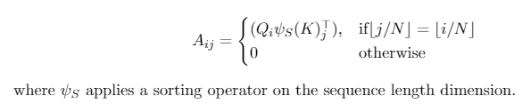

#### 4.12.2 Computational and Memory Complexity

- 空间复杂度：O(b^2)

### 4.13  Linformer

#### 4.13.1 介绍

Linformer 是基于低秩的自注意力机制的高效Transformer模型，主要在长度维度上进行低秩投影，在单次转换中按维度混合序列信息。

#### 4.13.2 Computational and Memory Complexity

- 空间复杂度：O(n)

### 4.14   Linear Transformer

#### 4.14.1 介绍

 Linear Transformer 通过使用 kernel-based  formulation  of  self-attention 、和  the associative property of matrix products ，将自注意力的复杂性从二次降低为线性。

目前，它已经被证明可以在基本保持预测性能的情况下，将推理速度提高多达三个数量级。

#### 4.14.2 Computational and Memory Complexity

- 时间复杂度：O(Ncd)
- 空间复杂度：O(N * d^2)

### 4.15  Performer（2020）

#### 4.15.1 介绍

Performer（2020） 利用正交随机特征（ORF），采用近似的方法避免存储和计算注意力矩阵。

#### 4.15.2 Computational and Memory Complexity

- 空间复杂度：O(Md + Nd + MN)

### 4.16  Synthesizer models（2020）

#### 4.16.1 介绍

Synthesizer models（2020） 研究了调节在自注意力机制中的作用，它合成了一个自注意力模块，近似了这个注意权重。

#### 4.16.2 Computational and Memory Complexity

- 空间复杂度：

### 4.17  Transformer-XL（2020）

#### 4.17.1 介绍

为了解决长距离依赖，Transformer-XL 提出了 segment-level recurrence mechanism， 即引入一个 memory 状态。

在训练过程中，每个片段的表示为最后的隐层状态​，​表示片段的序号，​表示片段的长度，​表示隐层维度。

在计算​片段的表示时，用memory缓存​片段​层的隐层状态​，用来更新​，这样就给下一个片段同了上文，长距离依赖也通过memory保存了下来。并且，最大可能的依赖长度线性增长，达到 $N*L$ 。

#### 4.17.2 Computational and Memory Complexity

- 空间复杂度：

### 4.18  Compressive Transformers

#### 4.18.1 介绍

这个模型是Transformer-XL的扩展，但不同于Transformer-XL，后者在跨段移动时会丢弃过去的激活，而它的关键思想则是保持对过去段激活的细粒度记忆。

#### 4.18.2 Computational and Memory Complexity

- 空间复杂度：

## 五、总结

在本文中，我们调查了有关高效 Transformers 模型 的文献，特别是关于 Self-attention 模块的二次复杂度的文献。我们提供了这些新模型类别中使用的核心技术的分类法和高级抽象。我们基于技术对现有模型进行了表征，并提供了一些高效 Transformer 模型的全面介绍。最后，我们讨论了这些模型的评估环境以及这些模型的设计趋势。最后，我们简要讨论了其他可能会总体上提高Transformer模型效率的并行正交工作。

## 参考

1. [Efficient Transformers: A Survey](https://www.jianshu.com/p/1b552f1888dc)
2. [Google团队发布，一文概览Transformer模型的17大高效变种](https://mp.weixin.qq.com/s/El0EFjVd9Kk94U5dC6sV6g)
3. [Transformers大家族——Efficient Transformers: A Survey](https://zhuanlan.zhihu.com/p/263031249)
4. [Generating Wikipedia by Summarizing Long Sequences](https://arxiv.org/abs/1801.10198)
5. [mage transformer](https://arxiv.org/abs/1802.05751)
6. [Set transformer: A framework for attention-based permutation-invariant neural networks](https://arxiv.org/abs/1810.00825)
7. [enerating  long  sequenceswith sparse transformers](https://arxiv.org/abs/1904.10509)
8. [最新Transformer模型大盘点，NLP学习必备，Google AI研究员出品丨资源](https://jishuin.proginn.com/p/763bfbd2d58d)
9. [Etc:   Encoding  long  and  structured  data  in  transformers](https://arxiv.org/abs/2004.08483)
10. [Efficient  content-based sparse attention with routing transformers.](https://arxiv.org/abs/2003.05997?url=girls.copypasteads.com)