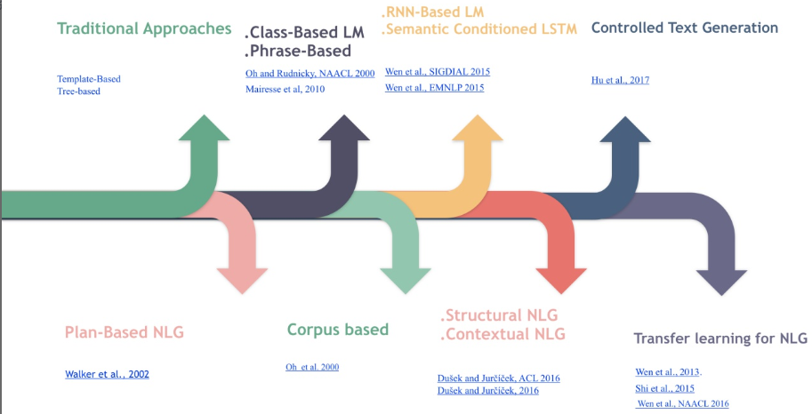

# 【关于 NLG】那些你不知道的事

> 笔者：杨夕
> 
> 项目地址：https://github.com/km1994/nlp_paper_study
> 
> 个人介绍：大佬们好，我叫杨夕，该项目主要是本人在研读顶会论文和复现经典论文过程中，所见、所思、所想、所闻，可能存在一些理解错误，希望大佬们多多指正。
> 
> 致谢：感谢 [cstghitpku](https://www.zhihu.com/people/cangshengtage) 大佬 所写的文章 【总结|对话系统中的自然语言生成技术（NLG）】(https://zhuanlan.zhihu.com/p/49197552)，在学习该 文章时，边学习边总结重要信息。如有侵权，请通知本人删除博文！

## 一、目录

- [【关于 上下文LU】那些你不知道的事](#关于-上下文lu那些你不知道的事)
  - [一、目录](#一目录)
  - [二、内容](#二内容)
    - [什么是上下文LU？](#什么是上下文lu)
  
  - [四、参考](#四参考)

## 二、内容

### 什么是 NLG ？

自然语言生成(NLG)是一种语言技术，其主要目的是构建能够“写”的软件系统的技术，即能够用汉语、英语等其他人类语言生成解释、摘要、叙述等。具体来说就是计算机的“编写语言”，它将结构化数据转换为文本，以人类语言表达。即能够根据一些关键信息及其在机器内部的表达形式，经过一个规划过程，来自动生成一段高质量的自然语言文本。NLG用于Email、手机短信，它可以为您自动创建答复；NLG用于图标说明时，可以根据公司数据自动生成图标说明。前段时间在一个有趣的用例中，美联社利用自然语言生成成功的从公司收益报表中生成了报告。这意味着他们不再需要人类消耗他们的时间和精力去解决这些问题。更重要的是，NLG一旦被完美设置就会自动生成数以千计的报告。

### NLG 的应用领域？

- 应用领域
  - 摘要生成
  - VQA(视觉问答)
  - 翻译
  - 写诗词
  - 写作文
  - 写新闻
  - NBA等赛事报道
  - 对话系统

### 对话系统划分？

- 划分
  - 闲聊型
  - 任务型
  - 知识问答型
  - 推荐型

### 不同对话系统中 NLG 的特点？

- 闲聊型对话中的NLG：**根据上下文进行意图识别、情感分析等，然后生成开放性回复**；
- 任务型对话中的NLG：在NLU(领域分类和意图识别、槽填充)、DST、DPL的基础上，根据学习到的策略来生成对话回复，一般回复包括澄清需求、引导用户、询问、确认、对话结束语等。
- 知识问答型对话中的NLG：根据问句类型识别与分类、信息检索或文本匹配而生成用户需要的知识（知识、实体、片段等），这类回复相比单纯的信息检索一般用户体验会更好，因为一般信息检索还需要用户根据搜索结果自己找所需信息。
- 推荐型对话系统中的NLG：根据用户的爱好来进行兴趣匹配以及候选推荐内容排序，然后生成给用户推荐的内容。

### NLG 发展史？

### NLG 有哪些技术？

### 传统方法【基于模版的NLG、基于树的NLG】

- 基于模版的NLG
  - 介绍： 定义规则和模板，用于映射 自然语言；
  - 问题：需要定义 大量 规则 和 模板

### 深度学习方法 

### 方法对比

## 四、参考

1. [总结|对话系统中的自然语言生成技术（NLG）](https://zhuanlan.zhihu.com/p/49197552)
