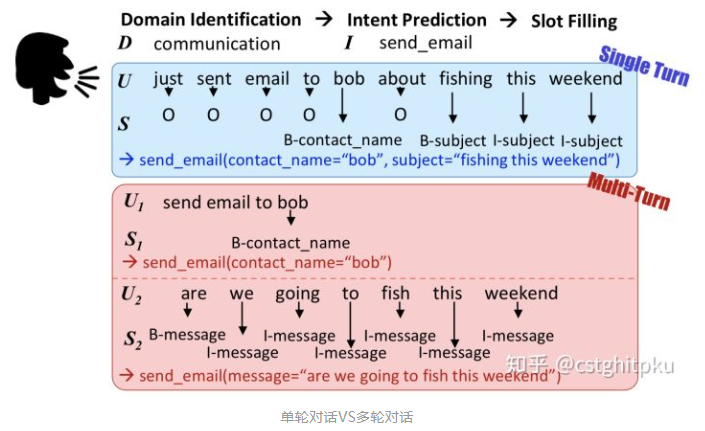
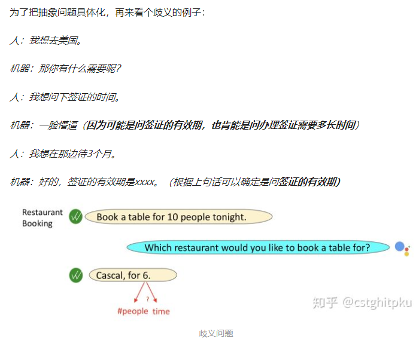
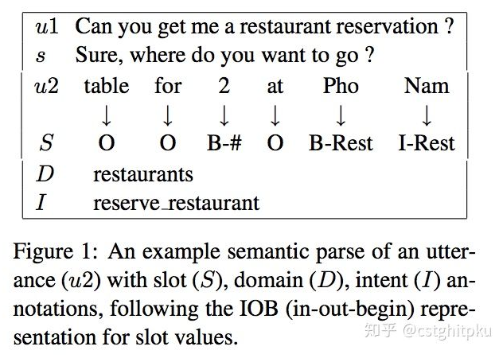
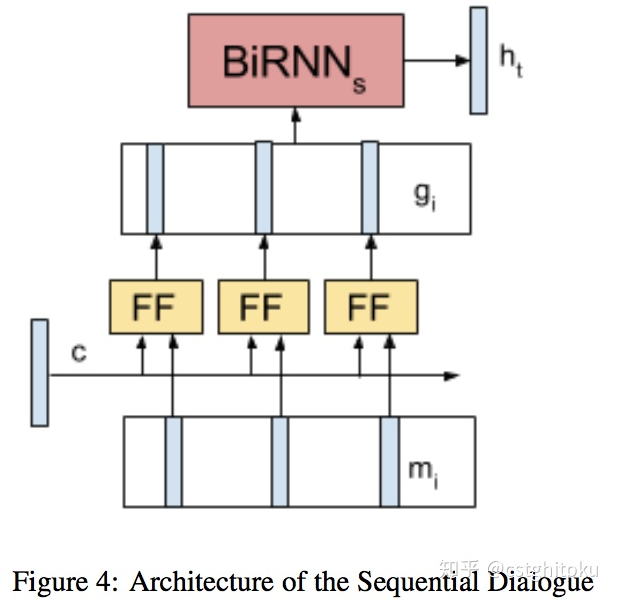
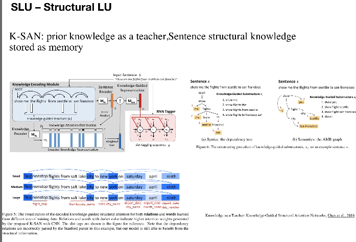
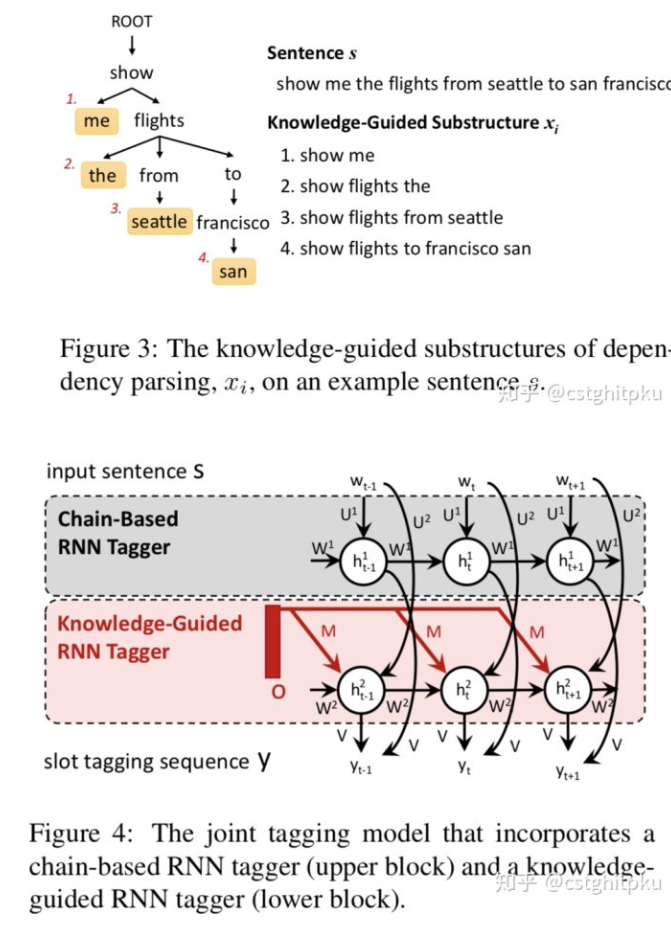
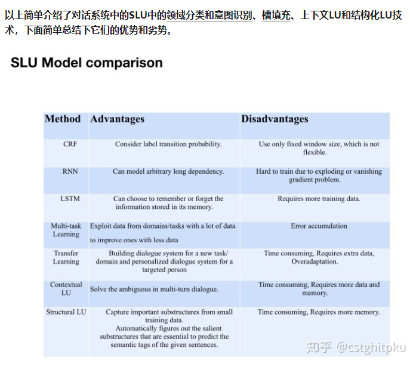

# 【关于 上下文LU】那些你不知道的事

> 作者：杨夕
> 
> 项目地址：https://github.com/km1994/nlp_paper_study
> 
> 个人介绍：大佬们好，我叫杨夕，该项目主要是本人在研读顶会论文和复现经典论文过程中，所见、所思、所想、所闻，可能存在一些理解错误，希望大佬们多多指正。
> 
> 致谢：感谢 [cstghitpku](https://www.zhihu.com/people/cangshengtage) 大佬 所写的文章 【总结|对话系统中的口语理解技术(SLU)（三）】(https://zhuanlan.zhihu.com/p/50704090)，在学习该 文章时，边学习边总结重要信息。如有侵权，请通知本人删除博文！

## 一、目录

- [【关于 上下文LU】那些你不知道的事](#关于-上下文lu那些你不知道的事)
  - [一、目录](#一目录)
  - [二、内容](#二内容)
    - [什么是上下文LU？](#什么是上下文lu)
    - [上下文LU 的发展史？](#上下文lu-的发展史)
    - [上下文LU 方法介绍](#上下文lu-方法介绍)
      - [Context Sensitive Spoken Language Understanding using Role Dependent LSTM layers（Hori et al, 2015）](#context-sensitive-spoken-language-understanding-using-role-dependent-lstm-layershori-et-al-2015)
      - [End-to-End Memory Networks with Knowledge Carryover for Multi-Turn Spoken Language Understanding（Chen et al., 2016）](#end-to-end-memory-networks-with-knowledge-carryover-for-multi-turn-spoken-language-understandingchen-et-al-2016)
      - [Sequential Dialogue Context Modeling for Spoken Language Understanding（Bapna et.al., SIGDIAL 2017）](#sequential-dialogue-context-modeling-for-spoken-language-understandingbapna-etal-sigdial-2017)
    - [什么是结构化LU？](#什么是结构化lu)
    - [结构化LU 的发展史？](#结构化lu-的发展史)
    - [结构化LU 方法介绍](#结构化lu-方法介绍)
      - [Knowledge as a Teacher: Knowledge-Guided Structural Attention Networks（Chen et al., 2016）](#knowledge-as-a-teacher-knowledge-guided-structural-attention-networkschen-et-al-2016)
    - [SLU各方法的对比](#slu各方法的对比)
  - [四、参考](#四参考)

## 二、内容

### 什么是上下文LU？

- 介绍：结合上下文进行 SLU
- 优点：
  - 在多轮对话中，解决歧义问题
- 多轮对话 vs 单论对话

### 上下文LU 的发展史？

### 上下文LU 方法介绍

#### [Context Sensitive Spoken Language Understanding using Role Dependent LSTM layers（Hori et al, 2015）](https://www.merl.com/publications/docs/TR2015-134.pdf)

- 介绍：
  - 基于Seq2Seq模型对上下文建模，一次输入一个词，每句结束时输出标签；
  - 具有对话者角色相关的LSTM层，并使用角色状态控制门来决定角色是不是active，而且角色状态随时间而线性传播，agent和client的角色也被加以区分
- 优点：对上下文比较敏感，能解决多轮对话的歧义问题

#### [End-to-End Memory Networks with Knowledge Carryover for Multi-Turn Spoken Language Understanding（Chen et al., 2016）](https://www.microsoft.com/en-us/research/wp-content/uploads/2016/06/IS16_ContextualSLU.pdf)

- 类型：
  - 基于端到端的记忆网络携带Knowledge来做多轮对话中的上下文理解，将RNN和Memory Networks结合起来应用于SLU模块；
- 思路：
  - 在作slot tagging时加入上下文知识， 然后以一种潜在的方式进行对话状态的追踪；
- 思路：
  - 记忆表示:为了存储前面对话轮中的知识，通过RNN将前面对话轮中的每个话语嵌入到连续的空间中，将每个话语转换成一个记忆向量；
  - 知识注意力分布：在嵌入空间中，通过取内积然后softmax来计算当前输入和每个记忆向量间的匹配，该结果可以被看作是为了理解当前输入而建模知识传递的注意力分布；
  - 知识编码表示：为了对来自历史的知识进行编码，历史向量是对由注意力分布加权的记忆嵌入的总和；
  - 序列标注：提供携带的知识来提高序列标注的效果。

#### [Sequential Dialogue Context Modeling for Spoken Language Understanding（Bapna et.al., SIGDIAL 2017）](https://www.aclweb.org/anthology/W17-5514/)

- 介绍：
  - 使用RNN探索新的建模对话上下文的方法，提出了序列对话编码网络，它允许按时间顺序对来自对话历史的上下文编码。之前轮和当前轮的encodings被输入一个共享所有存储器权重的前馈网络。并将序列对话编码网络的性能与仅使用先前的上下文的模型、在memory网络中编码失去对话顺序的上下文的模型进行比较；
- 优点：在多域对话数据集上的实验表明，序列对话编码网络能减少歧义。

### 什么是结构化LU？

### 结构化LU 的发展史？

### 结构化LU 方法介绍

#### [Knowledge as a Teacher: Knowledge-Guided Structural Attention Networks（Chen et al., 2016）](https://arxiv.org/abs/1609.03286)

- 介绍：提出了K-SAN:用先验知识当作引导，句子结构知识当作menory来存储。这是由先验知识引导的结构化注意力网络，其实就是RNN+attention+先验知识，但是跟RNN不同的是：该模型充分利用自然语言丰富的、结构化的信息而不再是线性扁平链。
- 优势
  - 可从少量数据中获取重要的子结构，增强模型的泛化能力；
  - 针对给定句子，可自动找出对其语义标签至关重要的显著子结构，从而缓解测试集中的unseen data，进一步提升NLU的效果。
- 实验结果：并在ATIS数据上表明 K-SAN 可以使用注意力机制有效地从子结构中提取出显著的知识，达到SOTA的效果。

### SLU各方法的对比

## 四、参考

1. [总结|对话系统中的口语理解技术(SLU)（三）](https://zhuanlan.zhihu.com/p/50704090)
