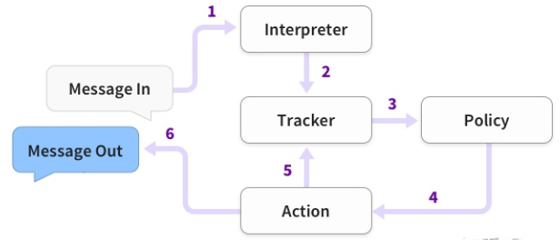
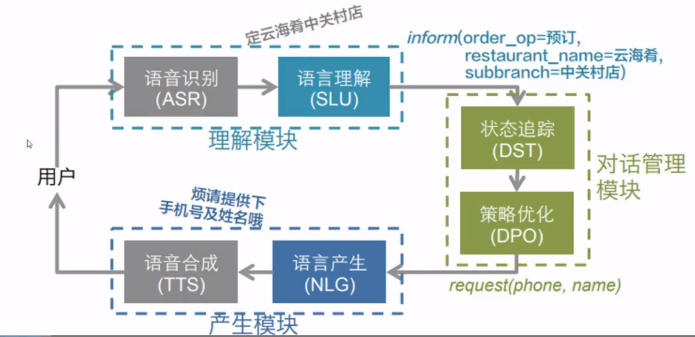
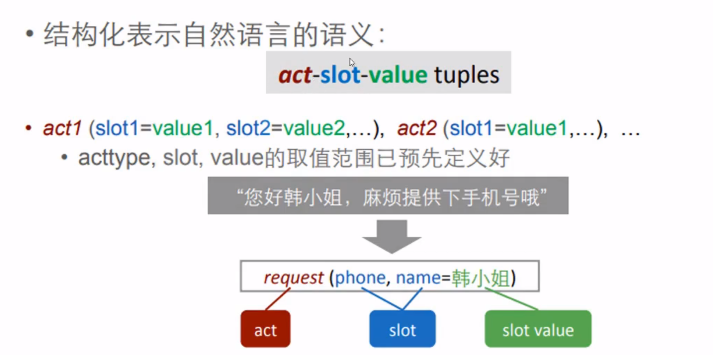
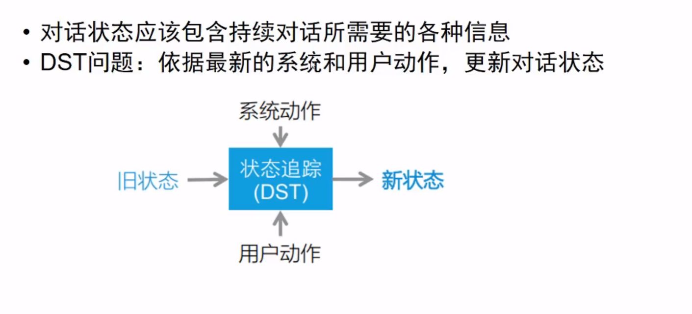
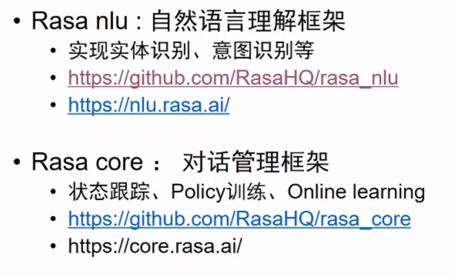

# 【关于 rasa 基本架构 】那些你不知道的事

> 作者：杨夕
> 
> 项目地址：https://github.com/km1994/nlp_paper_study
> 
> 个人介绍：大佬们好，我叫杨夕，该项目主要是本人在研读顶会论文和复现经典论文过程中，所见、所思、所想、所闻，可能存在一些理解错误，希望大佬们多多指正。
> 

## 目录

- [【关于 rasa 基本架构 】那些你不知道的事](#关于-rasa-基本架构-那些你不知道的事)
  - [目录](#目录)
  - [动机](#动机)
  - [常见的多轮对话解决方法](#常见的多轮对话解决方法)
  - [rasa 介绍](#rasa-介绍)
  - [基于任务的对话系统](#基于任务的对话系统)
    - [SLU](#slu)
    - [DST](#dst)
    - [DPO](#dpo)
    - [NLG](#nlg)
  - [其他框架(TC-Bot 经典框架)](#其他框架tc-bot-经典框架)
  - [rasa 实现 任务型的对话系统](#rasa-实现-任务型的对话系统)
  - [参考资料](#参考资料)

## 动机

2016年时大部分都是单轮对话机器人，无法理解上下文。

## 常见的多轮对话解决方法

- 基于手写规则，状态机state machines
  - 缺陷：硬编码，不灵活，各种 if-else 的集合，一个场景对应一段代码，逻辑会越来越复杂，基本没有扩展性，泛化能力较差；
  - eg:

- [学术界方法](https://www.semanticscholar.org/search?q=spoken%20dialog%20systems&sort=relevance&ae=false)
  - 增强学习， reinforcement learning (RL)
    - 介绍：需要大量数据和不停的与机器人对话，给予奖励才会变的智能，但是用户的对话是非理想状态不可控的

## rasa 介绍

- 基本架构

- 动机：借助 Rasa Core，我们面临的挑战是构建一个基于机器学习的对话框架，该框架可用于生产，足够灵活以支持研究和实验，并且非专业人员可以访问. Rasa Core 必须利用开发人员现有的领域知识来帮助他们 从零训练数据进行引导。 这就是导致我们采用交互式学习方法的原因。
- 流程：
  - 手动指定您的机器人可以说和做的所有事情。 我们称这些动作。 一种可能是打招呼，另一种可能是调用API或查询数据库。
  - 然后，您可以训练一个概率模型，以根据对话的历史预测要采取的行动。
- 目标：根据历史对话训练一个统计模型来预测机器人下一步对用户说什么
- 训练方式：
  - 直接标注数据，监督学习进行训练；
  - 在线交互学习，每一步有多个选择时直接告诉机器人选哪个回答，对话会自动加入到训练数据；

## 基于任务的对话系统

> 实例 一
> 

> 实例 二
> 

### SLU

### DST

### DPO

### NLG

## 其他框架(TC-Bot 经典框架)

## rasa 实现 任务型的对话系统

## 参考资料

1. [《如何基于 rasa 搭建一个中文对话系统》](https://www.cnblogs.com/cx2016/p/13468858.html)