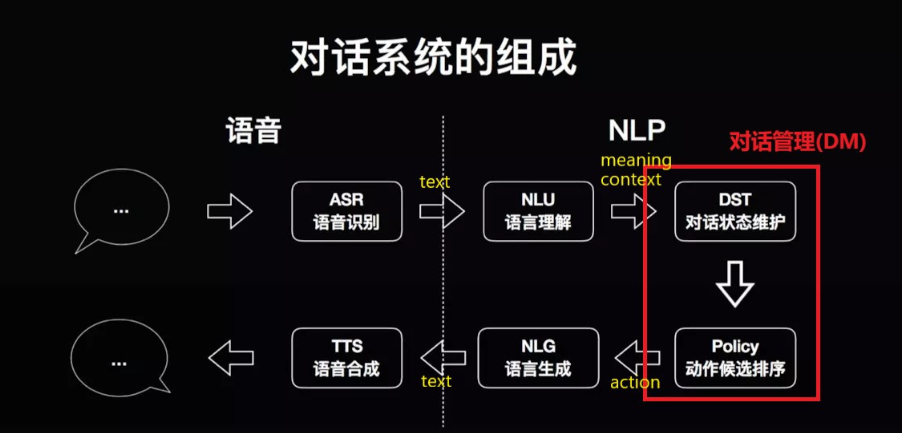

# 【关于 rasa -> Core -> FormAction 】那些你不知道的事

> 作者：杨夕
> 
> 项目地址：https://github.com/km1994/nlp_paper_study
> 
> 个人介绍：大佬们好，我叫杨夕，该项目主要是本人在研读顶会论文和复现经典论文过程中，所见、所思、所想、所闻，可能存在一些理解错误，希望大佬们多多指正。
> 

## 目录

- [【关于 rasa -> Core -> FormAction 】那些你不知道的事](#关于-rasa---core---formaction-那些你不知道的事)
  - [目录](#目录)
  - [概况图](#概况图)
  - [动机](#动机)
  - [为什么 可以 采用 FormAction 实现呢？](#为什么-可以-采用-formaction-实现呢)
  - [FormAction 的 工作流程](#formaction-的-工作流程)
  - [FormAction 怎么构建？](#formaction-怎么构建)
    - [（1） 构建 story](#1-构建-story)
    - [（2） 在 定义域 domain.yml 中添加 form 字段](#2-在-定义域-domainyml-中添加-form-字段)
    - [（3） 配置 FormPolicy 策略模块](#3-配置-formpolicy-策略模块)
    - [（4） 实现 WeatherForm  动作 Action](#4-实现-weatherform-动作-action)
  - [参考资料](#参考资料)

## 概况图



## 动机

在 Rasa Core 中，有时，我们需要执行 一个 Action 并 填充 多个 slots 时（eg：用户询问 天气时，Bot 需要知道 用户 想 查询的 是 哪一天（date-time），哪个地方（address），才能做出 正确 的 反馈），这个时候，需要怎么办么？

> 答案：采用 FormAction 实现

## 为什么 可以 采用 FormAction 实现呢？

- 原因：
  - FormAction 可以执行 一个 Action 并 填充 多个 slots；
  - FormAction 会 在每一轮 对话中，监控 所有 slots，并向 用户 咨询 未填槽 的 slot 值；

## FormAction 的 工作流程

1. 用户 输入 query;
2. FormAction 遍历监控所有 slots；
3. while 所有 slots 都被 填充？
   1. 发现 相关 slot 未被 填充时，主动 向 用户 发起 询问；
4. 所有 slots 填充 完毕；
5. 继续执行下一步 业务逻辑；

## FormAction 怎么构建？

### （1） 构建 story

- 注意：在 story 中，不仅需要考虑用户按照我们的设计准确的提供有效信息，而且还要考虑用户在中间过程改变要执行的意图情况或称输入无效信息，因为对于FormAction来说，如果无法获得预期的信息就会报错；
- 两种情况：
  - 情况一 happy path：
  - 情况二 unhappy path：

- 实例:

```shell
## happy path
* request_weather
    - weather_form
    - form{"name": "weather_form"}  激活form
    - form{"name": null}  使form无效
## unhappy path
* request_weather
    - weather_form
    - form{"name": "weather_form"}
* stop
    - utter_ask_continue
* deny
    - action_deactivate_form
    - form{"name": null}
```

> 注：</br>
> - “* request_weather”  : 意图 </br>
> - “- weather_form” ：form action，可以理解为 Core 针对意图 request_weather 所执行的 动作 Action；</br>
> - “- form{"name": "weather_form"}” ： 激活 form （这个 name 对应 action.py 中 Class WeatherForm 的 函数 name() 的返回值）；</br>
> - “- action_deactivate_form”：默认 的 action，作用是用户可能在表单操作过程中改变主意，决定不继续最初的请求，我们使用这个default action来禁止(取消)表单，同时重置要请求的所有slots；

### （2） 在 定义域 domain.yml 中添加 form 字段

- 动机：定义域 domain.yml 类似于 配置文件，该文件中 配置 该项目 所需要 的 intents、slots、entities、actions、forms、responses；
- 目标：配置 form

```shell
intents:
  - request_weather

forms:
  - weather_form
```

### （3） 配置 FormPolicy 策略模块

- 动机：前面 【[为什么可以采用 FormAction 实现呢？](#为什么-可以-采用-formaction-实现呢)】说了，FormAction 可以 持续 向用户 询问 未 填充 的 slot 的信息。那么，是什么 方法 使他具有该功能呢？
- 原因：主要 是 有 FormPolicy 方法
- 介绍：FormPolicy是MemoizationPolicy的扩展，用于处理(form)表单的填充事项；
- 思路：当一个FormAction被调用时，FormPolicy将持续预测表单动作，直到表单中的所有槽都被填满，然后再执行对应的FormAction；
- 如何 使用 FormActions ?
  - 在 config.yml 配置文件中配置

```s
policies:
  - name: EmbeddingPolicy
    epochs: 100
    max_history: 5
  - name: FallbackPolicy
    fallback_action_name: 'action_default_fallback'
  - name: MemoizationPolicy
    max_history: 5
  - name: FormPolicy
```

### （4） 实现 WeatherForm  动作 Action

- 动机：看完上面内容，你是否有以下疑问：
  - 1. 意图 request_weather 怎么知道要执行哪些 动作 Action 呢？
  - 2. FormPolicy 策略模块 怎么 知道 WeatherForm 需要 哪些 槽位呢？
- 答案：需要在 action.py 文件中 定义 WeatherForm 的相关 Action
- 样例代码：

```python
# action weather_form
class WeatherForm(FormAction):
    def name(self) -> Text:
        """Unique identifier of the form"""
        return "weather_form"

    @staticmethod
    def required_slots(tracker: Tracker) -> List[Text]:
        """A list of required slots that the form has to fill"""
        return ["date-time", "address"]

    def submit(
        self,
        dispatcher: CollectingDispatcher,
        tracker: Tracker,
        domain: Dict[Text, Any],
    ) -> List[Dict]:
        """Define what the form has to do
            after all required slots are filled"""
        address = tracker.get_slot('address')
        date_time = tracker.get_slot('date-time')
        print(f"action_default_fallback->address:{address}")
        print(f"action_default_fallback->date_time:{date_time}")
        dispatcher.utter_message("正在为你查询 {} {}的天气 ing".format(address,date_time))
        return [Restarted()]
```

- 代码解析：
  - name()：定义 Action 名称;
  - required_slots(tracker: Tracker)：定义 需要 填充 slots;
  - submit()：执行函数，当 所有 槽位 填充完，通过该函数 进行 responses；
- 流程解析：
  - 1. 当form action第一被调用时，form就会被激活并进入FormPolicy策略模式；
  - 2. 每次执行form action，required_slots会被调用，当发现某个还未被填充时，会主动去调用形式为uter_ask_{slotname}的模板(注：定义在domain.yml的templates字段中)；
  - 3. 当所有slot被填充完毕，submit方法就会被调用，此时本次form操作完毕被取消激活；


## 参考资料

1. [rasa 文档](https://rasa.com/docs/rasa/)
2. [Rasa中文聊天机器人开发指南(3)：Core篇](https://jiangdg.blog.csdn.net/article/details/105434136)【强烈推荐，小白入门经典】


