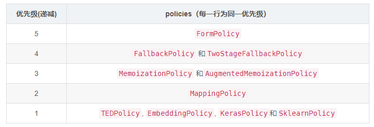
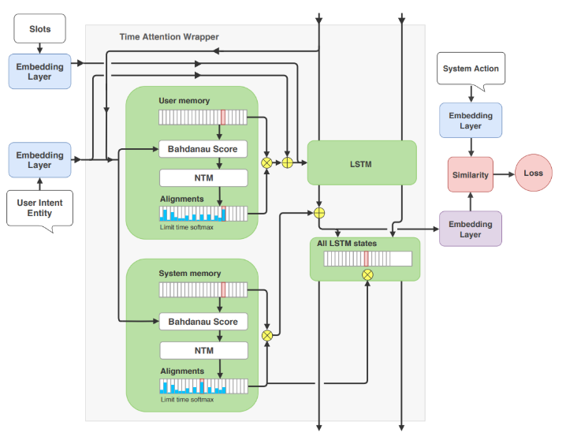

# 【关于 rasa -> Core -> Policies 】那些你不知道的事

> 作者：杨夕
> 
> 项目地址：https://github.com/km1994/nlp_paper_study
> 
> 个人介绍：大佬们好，我叫杨夕，该项目主要是本人在研读顶会论文和复现经典论文过程中，所见、所思、所想、所闻，可能存在一些理解错误，希望大佬们多多指正。
> 

## 目录

- [【关于 rasa -> Core -> Policies 】那些你不知道的事](#关于-rasa---core---policies-那些你不知道的事)
  - [目录](#目录)
  - [一、概况图](#一概况图)
  - [二、动机](#二动机)
  - [三、Policies 是什么？](#三policies-是什么)
  - [四、Policies 的 策略模块的作用？](#四policies-的-策略模块的作用)
    - [4.1 Memoization Policy](#41-memoization-policy)
    - [4.2 Keras Policy](#42-keras-policy)
    - [4.3 Embedding Policy](#43-embedding-policy)
    - [4.4 Form Policy](#44-form-policy)
    - [4.5 Mapping Policy](#45-mapping-policy)
    - [4.6 Fallback Policy](#46-fallback-policy)
  - [参考资料](#参考资料)


## 一、概况图


## 二、动机

在对话管理（DM）需要根据 用户输入 作出 相应的响应，该过程就需要 制定合适 的策略。

- 答案： Policies

## 三、Policies 是什么？

- 介绍：Policies 是 Rasa Core中的策略模块；
- 对应类：rasa_core.policies.Policy；
- 作用：使用合适的策略（Policy）来预测一次对话后要执行的行为（Actions）；
- 预测原理：衡量命中的哪些Policies哪个置信度高，由置信度高的Policy选择合适的Action执行。假如出现不同的Policy拥有相同的置信度，那么就由它们的优先级决定，即选择优先级高的Policy；
- 优先级表：



## 四、Policies 的 策略模块的作用？

### 4.1 Memoization Policy

- 作用：只记住(memorizes)训练数据中的对话。如果训练数据中存在这样的对话，那么它将以置信度为1.0预测下一个动作，否则将预测为None，此时置信度为0.0；
- 如何在策略配置文件config.yml文件中，配置MemoizationPlicy策略，其中，max_history(超参数)决定了模型查看多少个对话历史以决定下一个执行的action；

```s
 policies:
    - name: "MemoizationPolicy"
    max_history: 5
```

> 注：max_history值越大训练得到的模型就越大并且训练时间会变长，关于该值到底该设置多少，我们可以举这么个例子，比如有这么一个Intent：out_of_scope来描述用户输入的消息off-topic(离题)，当用户连续三次触发out_of_scope意图，这时候我们就需要主动告知用户需要向其提供帮助，如果要Rasa Core能够学习这种模型，max_history应该至少为3。story.md中表现如下：

```s
* out_of_scope
   - utter_default
* out_of_scope
   - utter_default
* out_of_scope
   - utter_help_message
```

### 4.2 Keras Policy

- 作用：Keras框架中实现的神经网络来预测选择执行下一个action；
- 默认的框架：使用LSTM(Long Short-Term Memory，长短期记忆网络)算法，但是我们也可以重写KerasPolicy.model_architecture函数来实现自己的框架(architecture)。KerasPolicy的模型很简单，只是单一的LSTM+Dense+softmax，这就需要我们不断地完善自己的story来把各种情况下的story进行补充；
- 如何在策略配置文件config.yml文件中，配置KerasPolicy策略，其中，epochs表示训练的次数，max_history同上：

```s
policies:
  - name: KerasPolicy
    epochs: 100
    max_history: 5
```
### 4.3 Embedding Policy

- 动机：基于机器学习的对话管理能够学习复杂的行为以完成任务，但是将其功能扩展到新领域并不简单，尤其是不同策略处理不合作用户行为的能力，以及在学习新任务(如预订酒店)时，如何将完成一项任务(如餐厅预订)重新应用于该任务时的情况；
- 作用：循环嵌入式对话策略(Recurrent Embedding Dialogue Policy，REDP)，它通过将actions和对话状态嵌入到相同的向量空间(vector space)能够获得较好的效果，REDP包含一个基于改进的Neural Turing Machine的记忆组件和注意机制，在该任务上显著优于基线LSTM分类器；



- 配置EmbeddingPolicy参数：

```s
policies:
  - name: EmbeddingPolicy
    epochs: 100
    featurizer:
    - name: FullDialogueTrackerFeaturizer
      state_featurizer:
        - name: LabelTokenizerSingleStateFeaturizer
```

### 4.4 Form Policy

- 作用：MemoizationPolicy的扩展，用于处理(form)表单的填充事项。当一个FormAction被调用时，FormPolicy将持续预测表单动作，直到表单中的所有槽都被填满，然后再执行对应的FormAction；
- 使用：

```s
policies:
  - name: FormPolicy
```

### 4.5 Mapping Policy

- 作用：M可用于直接将意图映射到要执行的action，从而实现被映射的action总会被执行，其中，这种映射是通过triggers属性实现的；
- 使用：

```s
intents:
 - greet: {triggers: utter_goodbye}
```

> 注：greet是意图；utter_goodbye是action。<br/>
> 一个意图最多只能映射到一个action，我们的机器人一旦收到映射意图的消息，它将执行对应的action。然后，继续监听下一条message。需要注意的是，对于上述映射，我们还需要要在story.md文件中添加如下样本，否则，任何机器学习策略都可能被预测的action_greet在dialouge历史中突然出现而混淆

### 4.6 Fallback Policy

- 作用：如果意图识别的置信度低于nlu_threshold，或者没有任何对话策略预测的action置信度高于core_threshold，FallbackPolicy将执行fallback action。通俗来说，就是我们的对话机器人意图识别和action预测的置信度没有满足对应的阈值，该策略将使机器人执行指定的默认action；
- 使用：

```s
policies:
  - name: "FallbackPolicy"
    # 意图理解置信度阈值
    nlu_threshold: 0.3
    # action预测置信度阈值
    core_threshold: 0.3
    # fallback action
    fallback_action_name: 'action_default_fallback'
```
> 注：其中，action_default_fallback是Rasa Core中的一个默认操作，它将向用户发送utter_default模板消息，因此我们需要确保在domain.yml文件中指定此模板；

- 自定义使用：在fallback_action_name字段自定义默认回复的action，比如my_fallback_cation，就可以这么改：

```s
policies:
  - name: "FallbackPolicy"
    nlu_threshold: 0.4
    core_threshold: 0.3
    fallback_action_name: "my_fallback_action"
```

## 参考资料

1. [rasa 文档](https://rasa.com/docs/rasa/)
2. [Rasa中文聊天机器人开发指南(3)：Core篇](https://jiangdg.blog.csdn.net/article/details/105434136)【强烈推荐，小白入门经典】


