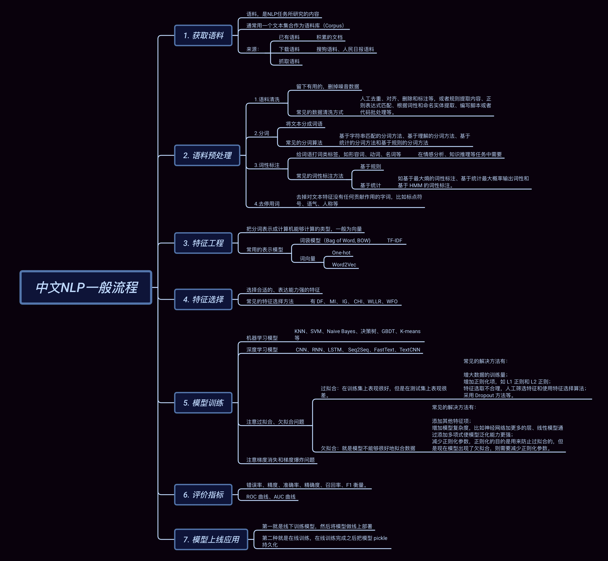

# 【关于 rasa->NLU 】那些你不知道的事

> 作者：杨夕
> 
> 项目地址：https://github.com/km1994/nlp_paper_study
> 
> 个人介绍：大佬们好，我叫杨夕，该项目主要是本人在研读顶会论文和复现经典论文过程中，所见、所思、所想、所闻，可能存在一些理解错误，希望大佬们多多指正。
> 

## 目录

- [【关于 rasa->NLU 】那些你不知道的事](#关于-rasa-nlu-那些你不知道的事)
  - [目录](#目录)
  - [概况图](#概况图)
  - [动机](#动机)
  - [什么是 自然语言理解？](#什么是-自然语言理解)
  - [自然语言理解 的 工作 是什么？](#自然语言理解-的-工作-是什么)
  - [自然语言理解 三层次，你知道么？](#自然语言理解-三层次你知道么)
  - [自然语言理解 一般理解 你知道么？](#自然语言理解-一般理解-你知道么)

## 概况图

## 动机

在人机对话中，首先需要 让 机器 理解 用户所说的 内容，才能 帮助 机器 知道用户意图，并作出 适当 的 反馈。那么 这个时候 需要怎么做呢？

> 答案：自然语言理解（NLU）

## 什么是 自然语言理解？

- 英文：（NLU，natural language understanding）
- 介绍：指机器能够理解执行人类所期望的某些语言功能，换句话说就是人与机器交流的桥梁；

## 自然语言理解 的 工作 是什么？

1. 理解句子的正确次序规则和概念，又能理解不含规则的句子；
2. 知道词的确切含义、形式、词类及构词法；
3. 了解词的语义分类、词的多义性、词的歧义性；
4. 指定和不定特性及所有特性；
5. 问题领域的结构知识和实践概念；
6. 语言的语气信息和韵律表现；
7. 有关语言表达形式的文字知识；
8. 论域的背景知识；

## 自然语言理解 三层次，你知道么？

- 三层次：
  - 词法分析：自然语言理解过程的第一层，它的性能直接影响到后面句法和语义分析的成果，主要包括自动分词、词性标注、中文命名实体标注三方面内容；
  - 句法分析的目标是自动推导出句子的句法结构，实现这个目标首先要确定语法体系，不同的语法体系会产生不同的句法结构，常见语法体系有短语结构语法、依存关系语法；
  - 语义分析就是指分析话语中所包含的含义，根本目的是理解自然语言。分为词汇级语义分析、句子级语义分析、段落／篇章级语义分析，即分别理解词语、句子、段落的意义。

> 参考：[自然语言理解技术NLU](https://www.aistudyblog.com/naturallanguage/20180731/13196.html)

## 自然语言理解 一般理解 你知道么？

> 该图来源于【[自然语言处理(NLP)的一般处理流程](https://blog.csdn.net/weixin_41510260/article/details/99876405?utm_source=distribute.pc_relevant.none-task)】，还提供了【[百度脑图查看点击链接](https://naotu.baidu.com/file/f644044a8fb37fdba2d3d0bb4eb350e1?token=fd9855a9fc353aca)】。

