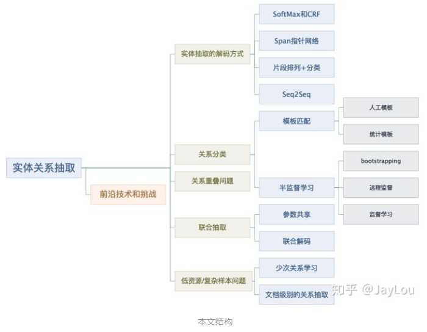
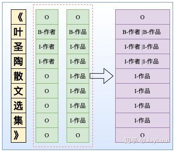
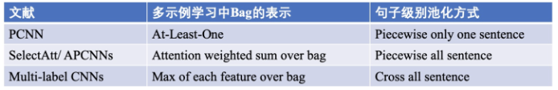
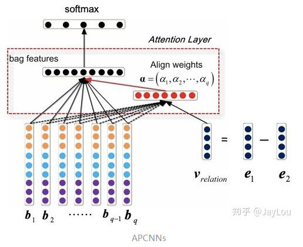
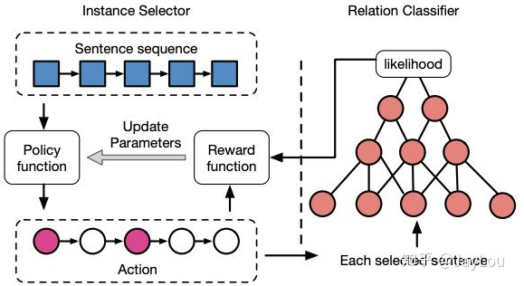
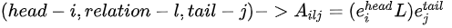

# nlp中的实体关系抽取方法总结

## 1. 学习资料

1. [DeepIE](https://link.zhihu.com/?target=https%3A//github.com/loujie0822/DeepIE)

说明：基于深度学习的信息抽取技术集散地，欢迎大家关注，包含实体、关系、属性、事件、链接&标准化等。

## 2. Question LIst 

- Q1：与联合抽取对比，Pipeline方法有哪些缺点？
- Q2：NER除了LSTM+CRF，还有哪些解码方式？如何解决嵌套实体问题？
- Q3：Pipeline中的关系分类有哪些常用方法？如何应用弱监督和预训练机制？怎么解决高复杂度问题、进行one-pass关系分类？
- Q4：什么是关系重叠问题？
- Q5：联合抽取难点在哪里？联合抽取总体上有哪些方法？各有哪些缺点？
- Q6：介绍基于共享参数的联合抽取方法？
- Q7：介绍基于联合解码的联合抽取方法？
- Q8：实体关系抽取的前沿技术和挑战有哪些？如何解决低资源和复杂样本下的实体关系抽取？如何应用图神经网络？

## 3. ERE 介绍

实体关系抽取（Entity and Relation Extraction，ERE）是信息抽取的关键任务之一。ERE是级联任务，分为两个子任务：实体抽取和关系抽取，如何更好处理这种类似的级联任务是NLP的一个热点研究方向。

## 4. 方法介绍及优缺点

### 4.1 Pipeline 方法

#### 4.1.1 介绍

Pipeline方法指先抽取实体、再抽取关系。相比于传统的Pipeline方法，联合抽取能获得更好的性能。

#### 4.1.2 优缺点

##### 4.1.2.1 优点

实体模型和关系模型可以使用独立的数据集，并不需要同时标注实体和关系的数据集

##### 4.1.2.2 缺点

1. 误差积累：实体抽取的错误会影响下一步关系抽取的性能。
2. 实体冗余：由于先对抽取的实体进行两两配对，然后再进行关系分类，没有关系的候选实体对所带来的冗余信息，会提升错误率、增加计算复杂度。
3. 交互缺失：忽略了这两个任务之间的内在联系和依赖关系。

（基于共享参数的联合抽取方法仍然存在训练和推断时的gap，推断时仍然存在误差积累问题，可以说只是缓解了误差积累问题。）

### 4.2 NER除了LSTM+CRF，还有哪些解码方式？如何解决嵌套实体问题？

#### 4.2.1 引言

虽然NER是一个比较常见的NLP任务，通常采用LSTM+CRF处理一些简单NER任务。NER还存在嵌套实体问题（实体重叠问题），如「《叶圣陶散文选集》」中会出现两个实体「叶圣陶」和「叶圣陶散文选集」分别代表「作者」和「作品」两个实体。而传统做法由于每一个token只能属于一种Tag，无法解决这类问题。笔者尝试通过归纳几种常见并易于理解的 实体抽取解码方式 来回答这个问题。

#### 4.2.2 系列标注：softmax 和 CRF

本质上是token-level 的多分类问题，通常采用CNNs/RNNs/BERT+CRF处理这类问题。与SoftMax相比，CRF进了标签约束。对这类方法的改进，介绍2篇比较有价值的工作：

- 针对CRF解码慢的问题，LAN[1]提出了一种逐层改进的基于标签注意力机制的网络，在保证效果的前提下比 CRF 解码速度更快。文中也发现BiLSTM-CRF在复杂类别情况下相比BiLSTM-softmax并没有显著优势。
- 由于分词边界错误会导致实体抽取错误，基于LatticeLSTM[2]+CRF的方法可引入词汇信息并避免分词错误（词汇边界通常为实体边界，根据大量语料构建词典，若当前字符与之前字符构成词汇，则从这些词汇中提取信息，联合更新记忆状态）。

##### 4.2.2.1 针对 重叠实体问题 提出 的改进方法

但由于这种序列标注采取BILOU标注框架，每一个token只能属于一种，不能解决重叠实体问题，如图所示。

基于BILOU标注框架，笔者尝试给出了2种改进方法去解决实体重叠问题：

1. 改进方法1

采取token-level 的多label分类，将SoftMax替换为Sigmoid，如图所示。当然这种方式可能会导致label之间依赖关系的缺失，可采取后处理规则进行约束。

2. 改进方法2

依然采用CRF，但设置多个标签层，对于每一个token给出其所有的label，然后将所有标签层合并。显然这可能会增加label数量[3]，导致label不平衡问题。基于这种方式，文献[4]也采取先验图的方式去解决重叠实体问题。

#### 4.2.3 Span抽取：指针网络

##### 4.2.3.1 引言

指针网络（PointerNet）最早应用于MRC中，而MRC中通常根据1个question从passage中抽取1个答案片段，转化为2个n元SoftMax分类预测头指针和尾指针。对于NER可能会存在多个实体Span，因此需要转化为n个2元Sigmoid分类预测头指针和尾指针。

##### 4.2.3.2 常用方式

第一种：**MRC-QA+单层指针网络**。在ShannonAI的文章中[5]，构建query问题指代所要抽取的实体类型，同时也引入了先验语义知识。如图所示，由于构建query问题已经指代了实体类型，所以使用单层指针网络即可；除了使用指针网络预测实体开始位置、结束位置外，还基于开始和结束位置对构成的所有实体Span预测实体概率[6]。此外，这种方法也适合于给定事件类型下的事件主体抽取，可以将事件类型当作query，也可以将单层指针网络替换为CRF。

第二种：**多层label指针网络**。由于只使用单层指针网络时，无法抽取多类型的实体，我们可以构建多层指针网络，每一层都对应一个实体类型。

##### 4.2.3.3 注意

1. MRC-QA会引入query进行实体类型编码，这会导致需要对愿文本重复编码输入，以构造不同的实体类型query，这会提升计算量。
2. 笔者在实践中发现，n个2元Sigmoid分类的指针网络，会导致样本Tag空间稀疏，同时收敛速度会较慢，特别是对于实体span长度较长的情况。

#### 4.2.4 片段排列+分类

##### 4.2.4.1 引言

上述序列标注和Span抽取的方法都是**停留在token-level进行NER**，**间接去提取span-level的特征**。而**基于片段排列的方式**[7]，显示的提取所有可能的片段排列，由于选择的每一个片段都是独立的，因此可以直接提取span-level的特征去解决重叠实体问题。

对于含T个token的文本，理论上共有 $N=T(T+1)/2$ 种片段排列。如果文本过长，会产生大量的负样本，在实际中需要限制span长度并合理削减负样本。

##### 4.2.4.2 注意

1. 实体span的编码表示：在span范围内采取注意力机制与基于原始输入的LSTM编码进行交互。然后所有的实体span表示并行的喂入SoftMax进行实体分类。
2. 这种片段排列的方式对于长文本复杂度是较高的。

#### 4.2.5 Seq2Seq

ACL2019的一篇paper中采取Seq2Seq方法[3]，encoder部分输入的原文tokens，而decoder部分采取hard attention方式one-by-one预测当前token所有可能的tag label，直至输出<eow> (end of word) label，然后转入下一个token再进行解码。

### 4.3 Q3：Pipeline中的关系分类有哪些常用方法？如何应用弱监督和预训练机制？怎么解决高复杂度问题、进行one-pass关系分类？

#### 4.3.1 引言

Pipeline方法中，关系抽取通常转化为一个分类问题，笔者这里称之为「关系分类」

#### 4.3.2 模板匹配

是关系分类中最常见的方法，使用一个模板库对输入文本两个给定实体进行上下文匹配，如果满足模板对应关系，则作为实体对之间的关系。常见的模板匹配方法主要包括：

- 人工模板：主要用于判断实体间是否存在上下位关系。上下位关系的自然语言表达方式相对有限，采用人工模板就可以很好完成关系分类。但对于自然语言表达形式非常多的关系类型而言，这就需要采取统计模板。
- 统计模板：无须人工构建，主要基于搜索引擎进行统计模板抽取。具体地，将已知实体对作为查询语句，抓取搜索引擎返回的前n个结果文档并保留包含该实体对的句子集合，寻找包含实体对的最长字串作为统计模板，保留置信度较高的模板用于关系分类。

基于模板匹配的关系分类构建简单、适用于小规模特定领域，但召回率低、可移植性差，当遇到另一个领域的关系分类需要重新构建模板。

#### 4.3.3 半监督学习

##### 4.3.3.1 bootstrapping（自举）

利用少量的实例作为初始种子集合，然后在种子集合上学习获得关系抽取的模板，再利用模板抽取更多的实例，加入种子集合中并不断迭代。

- bootstrapping比较常见的方法有DIPRE和Snowball。和DIPRE相比，Snowball通过对获得的模板pattern进行置信度计算，一定程度上可以保证抽取结果质量。
- bootstrapping的优点构建成本低，适合大规模的关系任务并且具备发现新关系的能力，但也存在对初始种子较为敏感、存在语义漂移、准确率等问题。

##### 4.3.3.2 远程监督

1. 基本假设

**如果一个实体对满足某个给定关系，那么同时包含该实体对的所有句子（构成一个Bag）都可能在阐述该关系**。可以看出，该假设是一个非常强的假设，实际上**很多包含该实体对的句子并不代表此种关系**，会**引入大量噪声**。为了缓解这一问题，主要采取「多示例学习」、「强化学习」和「预训练机制」：

2. 类别

- 多示例学习

主要基于Bag的特征进行关系分类，主要代表文献包括PCNN[8]、Selective Attention over Instances[9]、Multi-label CNNs[10]、APCNNs[11]，其中Bag的表示主要方式和池化方式为：

以APCNNs为例，采取PCNN模型[8]**提取单一句子的特征向量，最后通过attention加权得到Bag级别的特征**，关系分类是基于Bag特征进行的，而原始的PCNN模型只选择Bag中使得模型预测得分最高的句子用于模型参数的更新，这会损失很多信息。

- 强化学习

在采用多示例学习策略时，可能会出现整个Bag包含大量噪声的情况。基于强化学习的CNN+RL[12]比句子级别和Bag级别的关系分类模型取得更好效果。

模型主要由样例选择器和关系分类器构成。样例选择器负责从样例中选择高质量的句子，采取强化学习方式在考虑当前句子的选择状态下选择样例；关系分类器向样例选择器反馈，改进选择策略。

- 预训练机制

采取“Matching the Blank[13]”方法，首次在预训练过程中引入关系分类目标，但仍然是自监督的，没有引入知识库和额外的人工标注，将实体metion替换为「BLANK」标识符。

  - 该方法认为包含相同实体对的句子对为正样本，而实体对不一样的句子对为负样本。如图， $r_A$ 和 $r_B$ 构成正样本，$r_A$ 和 $r_C$ 构成  $r_B$ 和 $r_C$ 构负样本。
  - 不同于传统的远程监督，该方法训练中不使用关系标签，采用二元分类器对句子对进行相似度计算。预训练的损失包含2部分：MLM loss 和 二元交叉熵关系损失。
  - 在FewRel数据集上，不进行任何tuning就已经超过了有监督的结果。

#### 4.3.3.3 监督学习

##### 4.3.3.3.1 类别

- 基于特征的方法需要定义特征集合；
- 核函数不需要定义特征集合、在高维空间进行计算；
- 深度学习：很多基于深度学习的有监督关系分类被提出，大致都采用CNN、RNN、依存句法树、BERT的方法，由于这些方法大都很容易理解，笔者这里不再赘述，只选择介绍3篇比较新颖的文献进行介绍。

##### 4.3.3.3.2 论文介绍

###### 4.3.3.3.2.1 Matching the Blanks: Distributional Similarity for Relation Learning[13]

这篇文献来自GoogleAI，基于BERT，共采用6种不同结构来进行实体pair的pooling，然后将pooling进行关系分类或关系相似度计算，显示(f)效果最好。

- 标准输入+「CLS」输出；
- 标准输入+mention pooling输出；
- position embedding 输入+mention pooling输出；
- entity markers输入+「CLS」输出；
- entity markers输入+ mention pooling输出；
- entity markers输入+ entity start 输出；

###### 4.3.3.3.2.2 MExtracting Multiple-Relations in One-Pass with Pre-Trained Transformers[14]

Pipeline方法下的关系分类，同一个句子会有多个不同的实体对，过去的一些方法构造多个（句子，entity1，entity2）进行多次关系分类，本质上是一个multi pass问题，同一个句子会进行重复编码，耗费计算资源。

- 本文将多次关系抽取转化为one pass问题，将句子一次输入进行多个关系分类。在BERT顶层对不同的实体对进行不同的关系预测。
- 本文将还编码词和实体之间的相对距离计算Entity-Aware Self-Attention。如下图所示， $w_d(i-j)$ 代表实体 $x_i$ 到token $x_j$ 间相对距离的 embedding。

###### 4.3.3.3.2.3 Simultaneously Self-Attending to All Mentions for Full-Abstract Biological Relation Extraction[15]

与上篇文献[14]类似，这篇文献的依旧采用one-pass对所有实体mention进行关系分类，同时从所有实体mention中定位关系。

不同的地方是从句子级别拓展到文档级别，同时引入NER辅助进行多任务学习，此外，实体信息在进行mention pooling才给定，而不是输入时就给出 ；进行关系分类时采用Bi-affine方法(sigmoid)，而不是采用Softmax。具体地：

- Bi-affine Pairwise Scores：采用Transformer编码，对每个token通过两个独立MLP进行三元组中的head和tail表征，然后Bi-affine通过计算每个三元组的得分：

- 采用LogSumExp计算得分：

- 计算loss时，给定E个实体对信息再进行计算：

### 4.4 Q4:什么是关系重叠&复杂关系问题？

- a：正常关系问题
- b：关系重叠问题，一对多。如“张学友演唱过《吻别》《在你身边》”中，存在2种关系：「张学友-歌手-吻别」和「张学友-歌手-在你身边」
- c：关系重新问题，一对实体存在多种关系。如“周杰伦作曲并演唱《七里香》”中，存在2种关系：「周杰伦-歌手-七里香」和「周杰伦-作曲-七里香」
- d：复杂关系问题，由实体重叠导致。如《叶圣陶散文选集》中，叶圣陶-作品-叶圣陶散文选集；
- e：复杂关系问题，关系交叉导致。如“张学友、周杰伦分别演唱过《吻别》《七里香》”，「张学友-歌手-吻别」和「周杰伦-歌手-七里香」

### 4.5 Q5：联合抽取难点在哪里？联合抽取总体上有哪些方法？各有哪些缺点？

顾名思义，联合模型就是一个模型，将两个子模型统一建模。根据Q1，联合抽取可以进一步利用两个任务之间的潜在信息，以缓解错误传播的缺点（注意⚠️只是缓解，没有从根本上解决）。

**联合抽取的难点**是如何加强实体模型和关系模型之间的交互，比如实体模型和关系模型的输出之间存在着一定的约束，在建模的时候考虑到此类约束将有助于联合模型的性能。

现有联合抽取模型总体上有两大类[16]：

#### 4.5.1 **共享参数**的联合抽取模型

通过共享参数（共享输入特征或者内部隐层状态）实现联合，此种方法对子模型没有限制，但是由于使用独立的解码算法，导致实体模型和关系模型之间交互不强。

绝大数文献还是基于参数共享进行联合抽取的.

#### 4.5.2** 联合解码**的联合抽取模型

为了加强实体模型和关系模型的交互，复杂的联合解码算法被提出来，比如整数线性规划等。这种情况下需要**对子模型特征的丰富性以及联合解码的精确性之间做权衡**[16]：

- 一方面如果设计精确的联合解码算法，往往需要对特征进行限制，例如用条件随机场建模，使用维特比解码算法可以得到全局最优解，但是往往需要限制特征的阶数。
- 另一方面如果使用近似解码算法，比如集束搜索，在特征方面可以抽取任意阶的特征，但是解码得到的结果是不精确的。
因此，需要一个算法可以在不影响子模型特征丰富性的条件下加强子模型之间的交互。

此外，很多方法再进行实体抽取时并没有直接用到关系的信息，然而这种信息是很重要的。需要一个方法可以**同时考虑一个句子中所有实体、实体与关系、关系与关系之间的交互**。

### 4.6 Q6：介绍基于共享参数的联合抽取方法？

在联合抽取中的实体和关系抽取的解码方式与Q2中的实体抽取的解码方式基本一致，主要包括：序列标注CRF/SoftMax、指针网络、分类SoftMax、Seq2Seq等。基于共享参数的联合抽取，实体抽取loss会与关系抽取loss相加。

由于很多的相关文献实用性不高，我们只介绍其中具备代表性和易于应用的几篇文献，首先归纳如下：

## 参考

1.【[nlp中的实体关系抽取方法总结](https://zhuanlan.zhihu.com/p/77868938)】

D:\project\python_wp\nlp\nlp_paper_study\ERE_study\img