# 【关于 Complex KBQA】 那些你不知道的事

> 作者：杨夕
> 
> 项目地址：https://github.com/km1994/nlp_paper_study
> 
> 面经地址：https://github.com/km1994/NLP-Interview-Notes
> 
> 论文：A Survey on Complex Knowledge Base Question Answering:Methods, Challenges and Solutions
> 
> 会议：IJCAI'2021
> 
> 论文地址：https://www.ijcai.org/proceedings/2021/0611.pdf
> 
> 扩展长论文地址：https:////arxiv.org/pdf/2108.06688.pdf
> 
> 个人介绍：大佬们好，我叫杨夕，该项目主要是本人在研读顶会论文和复现经典论文过程中，所见、所思、所想、所闻，可能存在一些理解错误，希望大佬们多多指正。

## 摘要

知识库问答（KBQA）旨在回答知识库（KB）上的问题。最近，大量研究集中在语义或句法复杂的问题上。本文详细总结了复杂KBQA的典型挑战和解决方案. 我们开始介绍有关 KBQA 任务的背景。接下来，我们介绍了复杂 KBQA 的两种主流方法，即基于语义解析（SP-based）的方法和基于信息检索（IR-based）的方法。然后我们从两大类的角度综合回顾了先进的方法。具体地，我们阐述了它们对典型挑战的解决方案。最后，我们总结并讨论了未来研究的一些有希望的方向。

## 一、论文背景

知识库 (KB) 是一种结构化数据库，其中包含形式（主题、关系、对象）的事实集合。已经构建了大型知识库，例如 Freebase[Bollackeret al., 2008]、DBPedia [Lehmannet al., 2015] 和 Wikidata [Tanonet al., 2016]，以服务于许多下游任务。基于可用的知识库，知识库问答 (KBQA) 是一项旨在以知识库为知识源回答自然语言问题的任务。 KBQA 的早期工作 [Bordeset al., 2015; Donget al., 2015; Huet al., 2018a; Lanet al., 2019a]专注于回答简单的问题，其中只涉及一个事实。例如，“JK 罗琳出生在哪里？”是一个简单的问题，可以仅使用“（J.K.罗琳，出生地，英国）”这一事实来回答。

## 二、论文动机

相比仅包含单个关系事实的简单问题，复杂问题通常有以下几个特征。我们以文中的例子 “*谁是杰夫·普罗斯特秀提名的电视制片人的第一任妻子？*” 为例：

> 图 1：问题“谁是杰夫·普罗斯特秀提名的电视制片人的第一任妻子？”问题的复杂 KBQA 示例。我们为这个问题提供了相关的知识库子图。回答这个问题的真实路径用彩色边框标注。主题实体和答案实体分别以粗体和阴影框显示。 “多跳”推理、“约束”关系和“数值”操作在黑色虚线框内突出显示。我们使用不同的颜色来表示从主题实体到达每个实体的不同推理跳数

1. **需要在知识图谱中做多跳推理 (multi-hop reasoning)**：该问题主干需要两跳的推理，即“杰夫·普罗斯特秀提名的人”和“他的妻子”。
2. **需要考虑题目中给的限制词 (constrained relations)**：该问题中出现的限制词“电视制片人”需要在回答问题的时候被考虑到。
3. **需要考虑数字运算的情况 (numerical operations)**：该问题询问涉及序数“第一任”，因此需要对召回的实体进行排序操作。

直接将传统知识图谱问答模型运用到复杂问题上，不管是**基于语义解析的方法还是信息检索的方法都将遇到新的挑战**：

1. **传统方法无法支撑问题的复杂逻辑**：
   1. 现有的 **SP-based 的方法**中使用的解析器难以涵盖各种复杂的查询（例如，多跳推理、约束关系和数值运算）。
   2. 以前的 **IR-based  的方法**可能无法回答复杂的查询，因为它们排名是在没有可追溯推理的情况下对小范围实体进行的。
2. **复杂问题包含了更多的实体，导致在知识图谱中搜索空间变大**：复杂问题中更多的关系和主题意味着更大的潜在逻辑形式的搜索空间，这将大大增加计算成本。同时，更多的关系和主题可能会阻止 IR-based 的方法检索所有相关实体进行排名。
3.**两种方法都将问题理解作为首要步骤**：这两种方法都将问题理解视为首要步骤。当问题在语义和句法方面变得复杂时，模型需要具有强大的自然语言理解和泛化能力。
4. **通常 Complex KBQA 数据集缺少对正确路径的标注**：**对于复杂的问题，将真实路径标记为答案是很昂贵的。一般只提供问答对**。这表明 SP-based 的方法和 IR-based 的方法必须分别在没有正确逻辑形式和推理路径注释的情况下进行训练。这种微弱的监督信号给这两种方法带来了困难。

## 三、KBQA  benchmark  datasets

> 表 1：几个复杂的 KBQA 基准数据集。 “LF”表示数据集是否提供 **Logic Forms**，“NL”表示数据集是否包含 crowd workers 以重写 **Natural Language** 中的问题

## 四、知识图谱问答系统思路

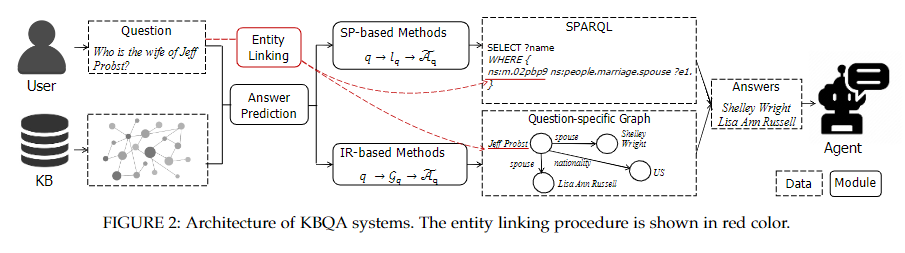

- s1：实体连接 (entity linking)，识别问题q的主题实体eq，其目的是将问题链接到知识库中的相关实体。在这一步中，进行命名实体识别、消歧和链接。通常使用一些现成的实体链接工具来完成，例如 S-MART [24]、DBpediaSpotlight [25] 和 AIDA [26];
- s2：利用答案预测模块来预测答案 ̃Aq。可以采用以下两种方法进行预测:
  - 基于语义解析 (SP-based) 方法：将问题解析为逻辑形式，并针对知识库执行它以找到答案;
  - 基于信息检索 (IR-based) 方法：检索特定于问题的图并应用一些排名算法从顶部位置选择实体。
- s3：最后，将 KBQA 预测得到的预测答案 ̃Aq 作为系统输出返回给用户；

## 五、预测答案两类主流的方法

#### 5.1 基于语义解析（SP-based）的方法

##### 5.1.1 基于语义解析（SP-based）的方法整体结构

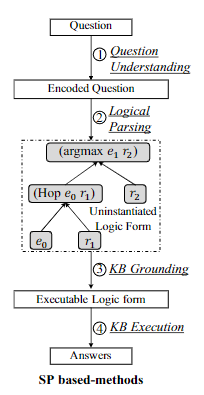

##### 5.1.2 自然语言理解 (NLU) 模块

- 介绍：从 自然语言的问题 中抽取出 意图和实体。

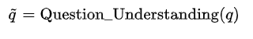

> 可以使用 神经网络（如：LSTM、GRU、CNN、Transformer等方法对问题进行解析，识别 问题中 意图和实体。

##### 5.1.3 逻辑解析 (logical parsing) 模块

- 介绍：将 NLU 结果转化成解析式

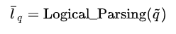

##### 5.1.4 知识图谱实例化 (KB grounding) 模块

- 介绍：生成的解析式 转化为 可被 指定图数据库识别的查询语句

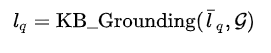

> 通常情况下，Iq 包含了主题实体 eq。在有些工作中，（2）和（3）可以同步进行。

##### 5.1.5 知识执行 (KB execution) 模块

- 介绍：利用 查询语句 查询 指定图数据库，返回问题答案

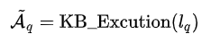

#### 5.2 基于信息检索（IR-based）的方法

##### 5.2.1 基于信息检索（IR-based）的方法整体结构

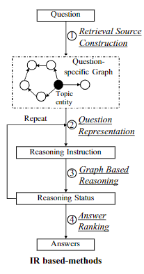

##### 5.2.3 子图构建 (retrieval source construction) 模块

- 介绍：从问题中的实体 eq 出发，从知识图谱中 抽取出和 查询问题相关的子图。

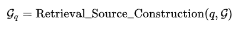

> 抽取的子图大小会随着抽取信息距离主题实体的距离增大呈指数增加。已有方法如 GraftNet 等通过 Personalized pagerank 保留重要实体控制子图大小。

##### 5.2.3 问题表达 (question representation) 模块

- 介绍：对 自然语言的问题 q 进行 encoding，得到该问题 q 的 向量 ，再结合其他方法生成指令。

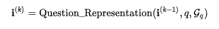

> 这里，${i^(k), k=1,...,n$ 是第 k 步推理得到的向量，该向量蕴含了问题在该步的指令。

##### 5.2.4 基于图结构的推理 (graph based reasoning) 模块

- 介绍：将在指令的指导下在抽取的子图中做传送和增强。推理过程将会产生推理状态向量 ${i^(k), k=1,...,n$。该向量在具体方法中定义有所不同，如：预测实体的分布，关系的表达等。

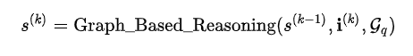

> 一些最新的工作重复（2）和（3）来实现显性的多步推理。

##### 5.2.5 答案排序 (answer ranking) 模块

- 介绍：将第 n 步推理状态向量用于最终的答案预测，排序高的实体被作为预测实体。

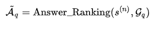

> 已有的工作通常会通过超参数阈值来选取预测答案实体。

基于信息检索的方法训练目标是让正确的答案实体排序高于其他实体。

#### 5.3 基于语义解析（SP-based）的方法 vs 基于信息检索（IR-based）的方法

- 基于语义解析（SP-based）的方法
  - 优点：可以通过生成表达逻辑形式来产生更可解释的推理过程；
  - 缺点：严重依赖于逻辑形式和解析算法的设计，这成为性能提升的瓶颈；
- 基于信息检索（IR-based）的方法
  - 优点：对图结构进行复杂的推理并执行语义匹配。这种范式自然适合流行的端到端 训练，并使基于语义解析（SP-based）的方法 更易于训练；
  - 缺点：推理模型的黑盒风格使得中间推理的可解释性较差。

## 六、基于语义解析（SP-based）的方法 vs 基于信息检索（IR-based）的方法 的 挑战和解决策略

在论文中，对 基于语义解析（SP-based）的方法 和 基于信息检索（IR-based）的方法 每个模块容易遇到的问题和常用的解决方法做了介绍：

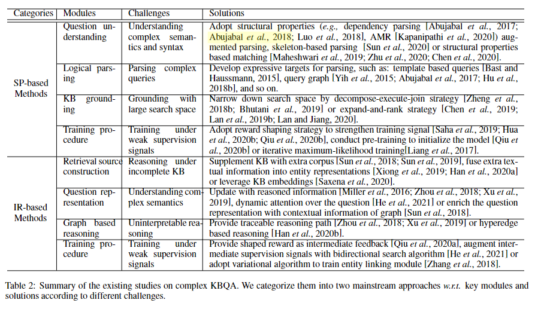
> 表 2：对复杂 KBQA 的现有研究总结。我们根据不同的挑战将它们分为两种主流方法w.r.t.key模块和解决方案。

### 6.1 Understanding Complex Semantics and Syntax

为了更好地理解复杂的自然语言问题，许多现有方法依赖句法解析，例如依赖关系和抽象意义表示 (AMR) ，以提供问题成分和逻辑之间更好的对齐表单元素（例如，实体、关系、实体类型和属性）。这条研究路线在图 4 的左侧进行了说明。

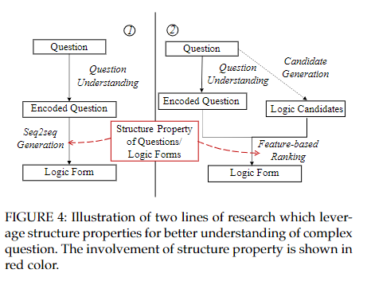
> 图 4：说明利用结构特性更好地理解复杂问题的两条研究路线。结构性质的参与以红色显示

### 6.2 Parsing Complex Queries

为了生成可执行的逻辑形式，传统方法首先利用现有的解析器将问题转换为 CCG 派生，然后通过将谓词和参数与知识库中的关系和实体对齐，将其映射到 SPARQL。

例如，问题“谁导演了泰坦尼克号？”可以通过 CCG 解析器解析为 “TARGET(x)∧directed.arg1(e, x)∧directed.arg2(e, T itanic)”。之后，谓词“directed”分别与关系“directedby”对齐，参数“Titanic”与KB中的实体“Titanic”对齐。这样的 CCG 推导可以转移到一个可执行的 SPARQL 查询。

然而，由于本体不匹配问题，这些方法对于复杂问题是次优的。因此，有必要利用知识库的结构进行准确解析，其中解析与知识库的基础一起执行。为了满足复杂问题的组合性，研究人员开发了多种表达逻辑形式作为解析目标。

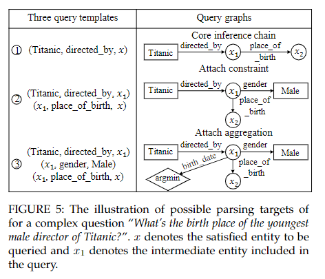
> 图5：复杂问题“泰坦尼克号最年轻男导演的出生地是什么？”的可能解析目标的说明。x表示要查询的满意实体，x1表示查询中包含的中间实体  
> 从主题实体入手，设计了三个查询模板作为解析目标。我们在图 5 中列出了这三个查询模板。前两个模板返回与主题实体“泰坦尼克号”相距 1 跳和 2 跳的实体。第三个模板返回与主题实体相距两跳并受另一个实体约束的实体.虽然这项工作可以成功解析几种类型的复杂问题，但它存在覆盖范围有限的问题。一项后续研究专注于设计模板来回答时间问题 

### 6.4 rounding with Large Search Space

- 动机：为了获得可执行的逻辑形式，KB 接地模块用 KB 实例化可能的逻辑形式。由于知识库中的一个实体可以链接到数百甚至数千个关系，因此考虑到计算资源和时间复杂度，无法为一个复杂问题探索和构建所有可能的逻辑形式。
- 方法：
  - decompose-execute-join:首先将一个复杂的问题分解为多个简单的问题，其中每个简单的问题都被解析成简单的逻辑形式。最终答案是通过部分逻辑形式的合取或组合获得的;
  - expand-and-rank: 通过以迭代方式扩展逻辑形式来减少搜索空间，作为候选逻辑在第一次迭代时形成，收集了主题实体的 1 跳邻域的所有查询图。根据问题和逻辑形式之间的语义相似性对这些候选进行排名。保留排名靠前的候选者进行进一步扩展，而过滤掉排名靠后的候选者。在接下来的迭代中，对beam中排名靠前的每个查询图进行扩展，从而产生一组新的更复杂的候选查询图。这个过程将重复，直到获得最佳查询图。

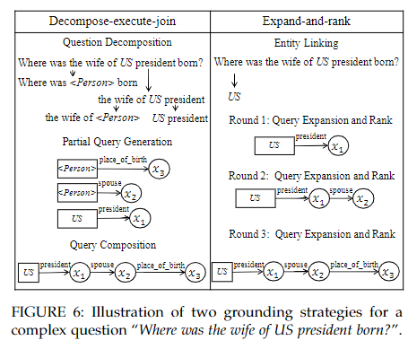

### 6.5 Training under Weak Supervision Signals

- 动机：为了应对训练数据有限或不足的问题，基于强化学习 (RL) 的优化已被用于最大化预期奖励。在这种情况下，基于 SP 的方法只能在完整解析的逻辑形式执行后才能收到反馈，这导致了严重的稀疏正奖励和虚假推理问题。
- 解决方法：采用了奖励塑造策略来进行解析评估。

## 七、方法总结

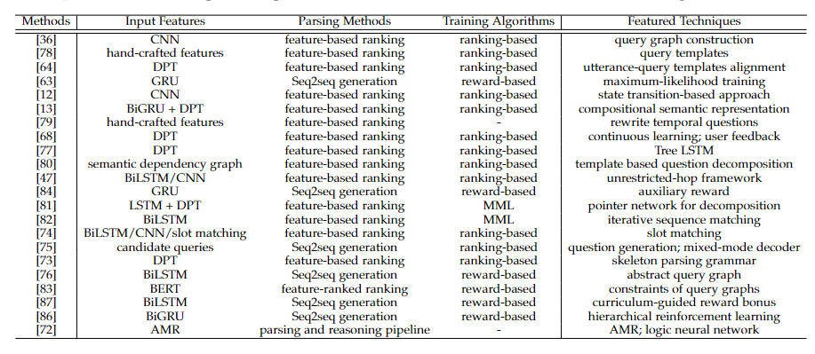

- 基于语义解析 (SP-based) 的方法：
  - 问题理解模块利用神经网络，结构化技术产生输入特征 (Input Features)
  - 逻辑解析模块主要包含序列到序列生成，基于排序解析两类解析方法 (Parsing Methods)
  - 不同解析方法采用不同训练目标 (Training Algorithms)
  - 总结了上述步骤中的重要技术 (Featured Techniques)

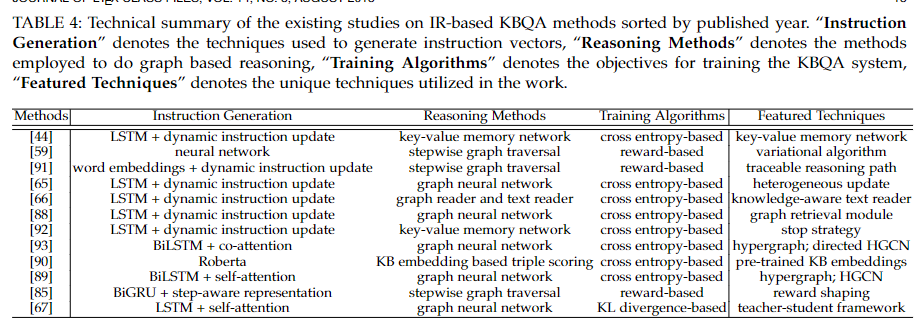

- 基于信息检索 (IR-based) 的方法：
  - 问题理解模块采用多种技术将问题语义转化成一系列指令 (Instruction Generation)
  - 指令向量根据不同推理方法进行状态更新 (Reasoning Methods)
  - 训练采用不同的目标函数 (Training Algorithms)
  - 总结了上述步骤中的重要技术 (Featured Techniques)

## 八、未来研究热点

### 8.1 不断进化的知识图谱问答系统

- 动机：下线数据 和 线上数据 的不对齐性。
- 解决方法：
  - 引入继续学习 (continuous learning) 的框架。当知识图谱问答系统遇到没见过的问题时，他们可以先将其和系统中已有的训练问题进行比对，召回最相似问题的解析式，让用户从中选出有效的解析式加入到训练数据中。再如让用户直接参与到系统中，当用户提出没见过的问题或者包含歧义的问题时，系统给出一些候选的消歧后的问题供用户选择。

### 8.2 鲁棒的知识图谱问答系统

- 动机：现有标注数据不足
- 解决方法：
  - 用元学习 (meta learning) 训练知识图谱问答系统；
  - 用无监督的双语词典归纳 (bilingual lexicon induction) 技术对低资源 (low-resource) 数据进行增强

### 8.3 更加一般定义的知识图谱

- 动机：除了显性地在任务中构建知识图谱，有部分工作将其他任务看作隐性的知识图谱。
- 解决方法：
  - 将预训练语言模型作为特殊的知识库，认为其具有储存知识和推理的能力。

### 8.4 对话型知识图谱问答

- 动机：对话型的知识图谱问答是新兴的任务。在单轮的问答之后，用户会围绕该主题提出一系列问题。目前对于对话型知识图谱问答的研究主要是针对如何判断后续问题的主题展开的。用户提出的问题间将具有某一些联系，而不是独立存在。对历史问题进行记忆和理解有助于回答当前问题。

## 参考

1. [A Survey on Complex Knowledge Base Question Answering:Methods, Challenges and Solutions](https://arxiv.org%2Fpdf%2F2108.06688.pdf#=&zoom=130)
2. [複雜知識庫問答：方法、挑戰與解決方案綜述](gushiciku.cn/pl/gyZR/zh-tw)
3. [可能是目前最全面的知识库复杂问答综述解读](https://zhuanlan.zhihu.com/p/409061361)
4. [[读综述] 关于知识图谱问答的神经网络方法的介绍](https://zhuanlan.zhihu.com/p/91821816)
5. [KBQA知识库问答论文分享](https://zhuanlan.zhihu.com/p/126268532)

