# 【关于 知识图谱补全】那些你不知道的事

> 作者：杨夕
> 
> 项目地址：https://github.com/km1994/nlp_paper_study
> 
> 个人介绍：大佬们好，我叫杨夕，该项目主要是本人在研读顶会论文和复现经典论文过程中，所见、所思、所想、所闻，可能存在一些理解错误，希望大佬们多多指正。

## 目录

## 一、为什么要做知识图谱补全？

- 知识图谱的局限性：存在不完备性，也就是不可能覆盖所有的实体和实体关系

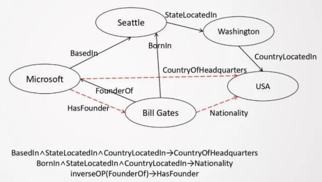

> 如上图，图片中黑色箭头的关系属于图谱中已经存在的关系，而对于红色关系表示缺失的关系，需要我们通过已有实体和关系进行推理得到的关系。

## 二、目前知识图谱补全存在哪些难度和挑战？

给定一个知识图谱，我们需要做以下问题：

1. 如何根据基于该图谱，更好的建模知识的结构和推理规则？
2. 如何从图谱中查询我们想要的路径？
3. 是否可以基于强化学习构建关系？
4. 如何建模逻辑规则？
5. 如何解决长尾数据问题？
6. few-shot learning ?

## 三、什么是 知识图谱补全？

### 3.1 知识图谱定义

对于知识图谱 G={E,R,F}
> 注：E 为图谱中所有实体的集合，R 为图谱中所有关系的集合，F 为图谱中所有三元组的集合。

### 3.2 知识图谱补全的任务

- 任务：结合已有的知识图谱，预测出图谱中所缺失的三元组 F‘={(h,r,t)|(h,r,t)∉F, r∈R}
- 根据 补全的实体是否存在于 实体集 E 中，可以将图谱补全细分为 两个子任务：

1. 封闭域的图谱补全任务，该任务前提是需要补全的三元组的实体都在 实体集 E 中；
2. 开放域的图谱补全任务，该任务不需要限制 需要补全的三元组的实体都在 实体集 E 中；

## 四、知识图谱补全有哪些技术？

### 4.1 技术介绍

1. 基于知识表示的方法；
2. 基于路径查找的 方法；
3. 基于推理规则的方法
4. 基于强化学习的方法
5. 基于元学习的方法

### 4.2 基于知识表示的知识图谱补全方法

#### 4.2.1  介绍

对图谱中的实体和关系学习其低维度的嵌入式表示；

#### 4.2.2 常用的知识表示方法表示

1. TransE

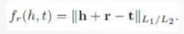

2. TransH

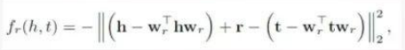

3. TransR

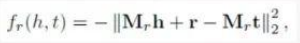

4. TransF

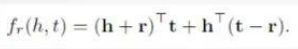

#### 4.2.3 思路

- 条件：对于 知识图谱，给定头实体和头实体所对应的关系，预测 与其所指向的尾实体
- 思路：
  - 将 头实体的 embedding 组合到一起；
  - 在尾实体的 candidate 列表中计算 score（可 自定义 score 计算方法，例如相似度）；
  - 从 candidate 中选择一个分数最高的尾 实体作为补全

#### 4.2.4 方法改进

- 改进方式：引入实体描述信息，通过让模型学习这些信息，来更好的处理开放域实体补全问题
- 方法介绍：
 
1. 使用类似于 attention 的机制进行描述内容的 masking，使得于关系关联的描述内容对结果影响最大
2. 使用 CNN 对 masking 后的实体描述进行特征抽取 (target fusion)

- 所提取的特征：
  - 含有三元组（即头实体、尾实体 和关系名）上下文信息的特征；
  - 偏向利用实体描述信息抽取新实体相关知 识的特征。

3. 将两类特征输入到全连接网络中，做最终补全结果的预测

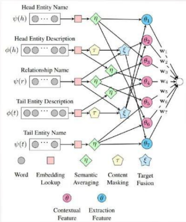

#### 4.2.5 局限性

- 基于知识表示方法的局限性在于 绝大大数不能处理多步知识推理

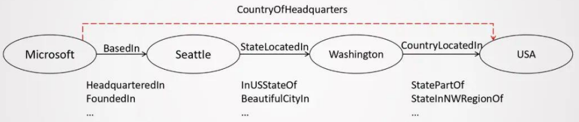
> 注：对于 图中 从微软到美国的路径，基于知识表示方法需要 4步推理才能获得结果

### 4.3 基于路径查找的知识图谱补全方法
 
#### 4.3.1 前言

由于 基于知识表示方法绝大大叔不能处理多步知识推理问题，所以有了 基于路径查找的知识图谱补全方法。

#### 4.3.2 传统的基于路径查找的知识图谱补全方法————PRA 方法

##### 4.3.2.1 介绍

路径排序方法（Path Ranking Algorithm，PRA）这个算法是枚举知识库中实体对之间的路径，利用这些路径作为特征训练一个模型去预测缺失的facts，是基于随机游走的一个对知识库进行推理的技术。

##### 4.3.2.2 思路

对于一个给定的实体对(h,t)，PR利用RW(随机游走)找出实体对之间的连接路径，根据一定策略选择一部分路径作为特征，计算 $P(t|h,p)$，即给定一个RW，从开始经过路径 p 到 t 的概率，将这个值作为路径 p 的特征值。

对于一个关系 r，训练数据为 $D_r$，标签为正的数据为由关系 r 连接的实体对，标签为负的数据为不是由关系 r 连接的实体对。PRA 针对$D_r$中每个实体对提取的路径特征，在 $D_r$ 构造的特征矩阵上训练二分类器。

##### 4.3.2.3 问题

1. 可扩展性差(占用大量内存)，因为对于一个实体对，需要判断它们是否满足每一种存在的关系；
2. 特征爆炸：因为有很多很多的路径，将这些路径作为特征，特征向量的长度就会呈指数增长。

##### 4.3.2.4 解决方法

以尝试用 **embedding 的方式表示关系**，对关系进行泛化，并基 于此对知识的补全进行建模，以缓解路径数量过多导致的特征空间膨胀问题。

#### 4.3.3 改进方法 1 

##### 4.3.3.1 思路

1. 给定实体对集合，利用 PRA 查找一定数量的路径；
2. 使用 RNN 沿着路径进行向量化建模； 
3. 通过比较路径向量与待预测关系向量间的关联度来进行关系补全。

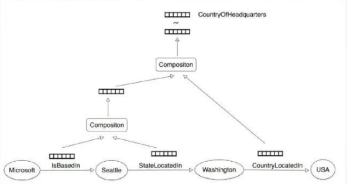

##### 4.3.3.2 存在问题

- 建模时未考虑路径上的实体信息； 
- 每个关系类型需要使用一个单独的 RNN 模型； 
- 建模时仅使用了实体对间的一条路径。

#### 4.3.4 改进方法 2

##### 4.3.4.1 思路

1. 路径计算过程中加入实体类型信息（减少长尾实体影响）； 
2.  RNN 模型参数在不同关系之间共享； 

3.  提出新的分数计算方式，可以综合运用多条路径信息：

> 假设{s1,s2, …, sn}为两个实体{es,et}间所有路径与关系 r 之间的相似度分数集合， 那么该实体对拥有关系 r 的概率可有以下几种计算方式:

- Top K pooling

- Average pooling

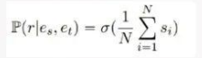

- LogSumExp

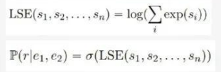

#### 4.3.5 存在问题

基于路径查找的知识图谱补全方法存在以下问题：

- 采用 random walk 方法查询路径，这种方法在离散空间中，无法对 图谱中 所包含的相似实体和关系进行评价；
- 超级结点可能影响 random walk 算法运行速度；

### 4.4 基于强化学习的知识图谱补全方法

#### 4.4.1 前言

由于 基于路径查找的知识图谱补全方法 中 采用 random walk 方法查询路径，而这种方法 在离散空间中，无法对 图谱中 所包含的相似实体和关系进行评价； 以及 当遇到超级结点时， random walk 算法运行速度会受到影响；

#### 4.4.2 基于强化学习的知识图谱补全方法 处理方法

- 在连续空间中进行路径搜索； 
- 通过引入多种奖励函数，使得路径查找更加灵活、可控。

#### 4.4.3 DeepPath 方法介绍【2】

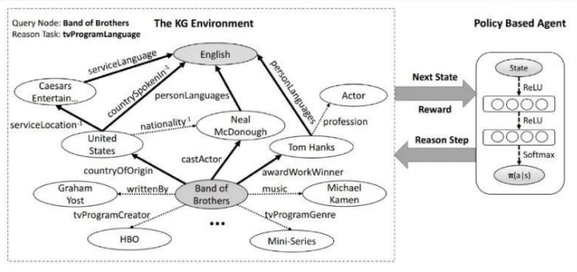

- 目标：对于图谱，给定路径起点，查找 与 该路径起点 相关联的终止实体和其间所对应关系；

> 如上图： 对于 路径起点 Band od Brothers，目标是需要 查找 Band od Brothers 和 English 间关系

- 状态：实体中的embedding
- 动作：图谱中关系
- 奖励：
  - Binary，是否到达终点；
  - 路径长度；
  - 路径多样性；
- 策略网络：使用全连接网络
- 存在问题：知识图谱本身的不完善很可能对路径查找造成影响

#### 4.4.2 基于关系抽取的知识图谱补全方法 【3】

- 动机： 知识图谱本身的不完善很可能对路径查找造成影响
- 创新点：在路径查找过程中，通过抽取关系，将缺失的路径补全

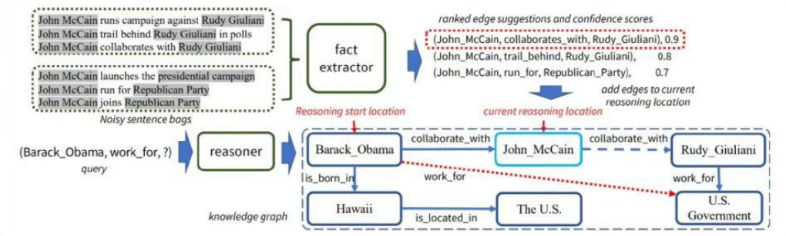
> 注：查找 Barack_Obama 为哪个组织工作。在原图谱中，John_McCain 和 Rudy_Giuliani 之间的路径是断的；通过弱监督的方式，从原文本中训练出一 个关系抽取器，通过这个关系抽取器将缺失的关键路径补充完整。至于是否有必 要做路径补充，以及哪一条路径需要补充，则是强化学习中策略选择的工作。

- 思路：
  - 关系抽取（Extractor）：使用 PCNN-ATT，将文本输入到模型中，可预测出 一部分关系；将原图谱中存在的关系和根据预测出来的关系结合，丰富了实体间 的关系网络，扩大了当前节点的关系选择范围。 
  - 关系推理（Reasoner）:基于 RNN 神经网络的推理，将节点当前状态和当前 节点可能存在的关系注入到模型中，从而判断推理路径。

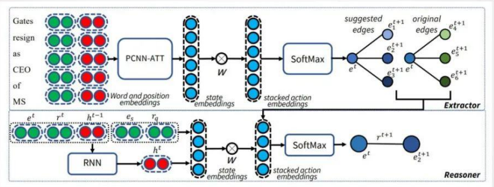

### 4.5 基于推理规则的知识图谱补全方法

#### 4.5.1 前言

传统的推理规则挖掘方法搜索空间庞大，会导致搜索速度慢。

#### 4.5.2 改进方法

1. 推理规则与 embedding 结合
2. 神经网络模型与传统的推理模型结合

#### 4.5.3 推理规则与 embedding 结合 【4】

- 问题：
  - 训练知识图谱的 embedding 的时候，可能会存在很多长尾的实体或关系，会使 模型的训练变得不可靠；
  - 单纯使用规则进行推理，挖掘规则本身是个搜索空间 非常大；
- 处理方法：
  - 对于长尾的实体或关系， 用规则进行扩充；
  - 对于搜索空间很大的规则来说，借助 embedding 转换成向量 计算，大大降低计算量；

- 思路：这 种 方 法 的 input 是 个 Knowledge Graph ， 通 过 该 Graph 训 练 出 一 个 embedding；选取一些已有规则（如自反规则、传递规则、逆转规则等 7 种规则， 如下表所示），对知识图谱中的已有规则进行扩展，进而生成命题： 
  - 针对每个关系，利用它周围的实体与关系随机获取具体的命题（随机抽取 k 个含有该关系的三元组，经证明 k 有一个可控上界）
  - 在整个图谱中查找能够支持命题的实例，如果能够查到则保留

命题形成后，可通过关系表达满足度分数等指标来判断命题是否成立；如命题成 立，可将其落地到原知识图谱中，形成可扩充的三元组，并根据命题分数和三元 组的分数去计算每个三元组的置信度；将高置信度的三元组扩充回到知识图谱中， 训练新的 embedding，不断迭代下去。

#### 4.5.4 神经网络模型与传统的推理模型结合【传统推理模型主要指马尔可夫逻辑网】

- 使用马尔科夫逻辑网定义三元组的联合分布： 

1. 假设：逻辑规则推理得到的三元组，与基于 KG embedding 获得的三元组，分 布一致。 
2. 基于以上假设，使用 EM 算法进行训练： 
   1. E-step: 限定逻辑规则的权重，基于逻辑规则生成三元组，学习 KGE 模型 权重；
   2. M-step: 限定 KGE 模型，更新逻辑规则的权重

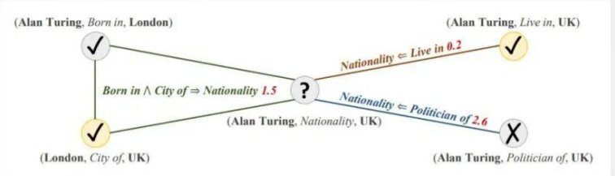

### 4.6 基于元学习的知识图谱补全方法

#### 4.6.1 引言

前面介绍的几种方法，往往都需要大量的训练数据；而在知识图谱中，大量关系 出现频次很低（即长尾数据）；而越是低频的关系，越可能需要补全。

#### 4.6.2 传统的机器学习 vs 元学习

传统的机器学习，通常是基于训练数据去学习一种“从数据到标签的映射”；而 元学习，学习的是“一种更高阶的映射”，即从数据到函数的映射。（见上图） 相较于传统机器学习，元学习可以用较少的数据去完成学习任务。

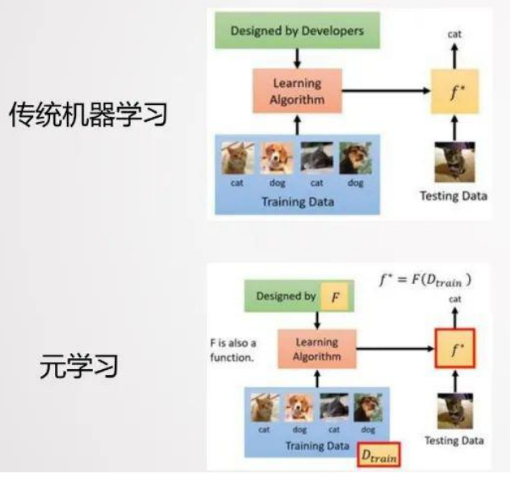

#### 4.6.3  基于元学习的知识图谱补全方法 的 问题定义

问题定义：基 于极少量的已知三元组，对缺失的三元组进行预测

> 注：以上表为例，Training 过程由几个 Task 组成，每个 Task 面向不同的关系；对于每个 Task，会有一个自己的训练集和测试集（其中训练集的数量会比较少）； Testing 过程中，会有很少标签数量的训练集，让模型很好地在该标签下工作。

#### 4.6.4  基于元学习的知识图谱补全方法 的 方法类别

- 基于度量的方法
- 基于优化的方法

#### 4.6.5 基于度量的方法 【6】

- 思路：利用知识图谱背景知识对实体对编码，进而让模型能够学习到含有相同关 系的实体对间的相似性，并基于此判断测试数据的实体对之间是否存在某关系。

#### 4.6.6 基于优化的方法 【7】

- 与基于度量的算法相比，主要的区别：
  - 直接寻找预测一个实体对间是否含有某个关系所需要的核心信息 
  - 不需要已有的知识图谱作为背景知识，具有更强的鲁棒性
- 模型训练的关键点：
  - 使用 support set 生成 gradient meta 协助快速学习 relation meta 
  - 使用 query set 结果的 Loss 更新模型参数

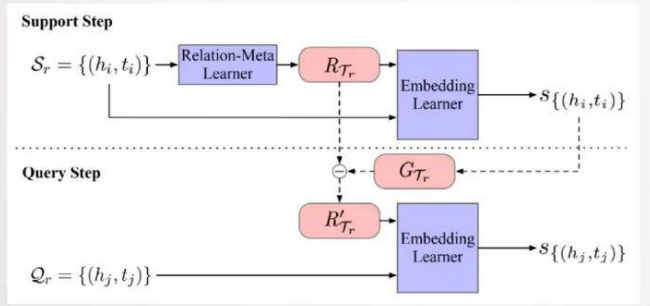

## 五、总结

- 基于知识表示的方法模型简单清晰，但是可解释性较差，并且难以对复杂 的知识推理建模 
- 在知识图谱中进行路径查找可以进行更加复杂的知识推理，重点在于如何 缓解大规模的图谱中的路径数量爆炸以及无用信息过多的问题 
- 基于推理的方法将逻辑规则与图谱表示相结合，缓解了稀疏数据的表示学 习问题，并且增强了逻辑规则的泛化能力 
- 元学习算法致力于解决知识图谱补全中长尾关系的问题，让模型在极少量 训练数据的情况下有快速适配的能力

## 六、未来的方向

- 概率化逻辑推理与知识表示结合，解决推理过程中的不确定性问题 
- 持续强化知识推理的可解释性  知识推理的可扩展性

## 参考

1. [阿里电商知识图谱核心技术揭秘]()
2. [DeepPath: A Reinforcement Learning Method for Knowledge Graph Reasoning](https://arxiv.org/abs/1707.06690) 【[github](https://github.com/xwhan/DeepPath)】
3. [Collaborative Policy Learning for Open Knowledge Graph Reasoning](https://arxiv.org/abs/1909.00230) 【[github](https://github.com/INK-USC/CPL)】
4. [Iteratively Learning Embeddings and Rules for Knowledge Graph Reasoning](https://arxiv.org/abs/1903.08948) 
5. [probabilistic logic neural networks for reasoning](https://arxiv.org/abs/1906.08495)
6. [One-Shot Relational Learning for Knowledge Graphs](https://www.aclweb.org/anthology/D18-1223/)
7. [Meta Relational Learning for Few-Shot Link Prediction in Knowledge Graphs](https://arxiv.org/abs/1909.01515) 【[github](https://github.com/AnselCmy/MetaR)】

