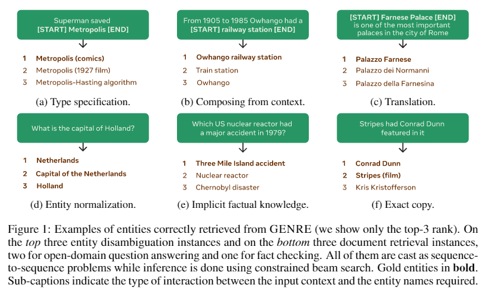
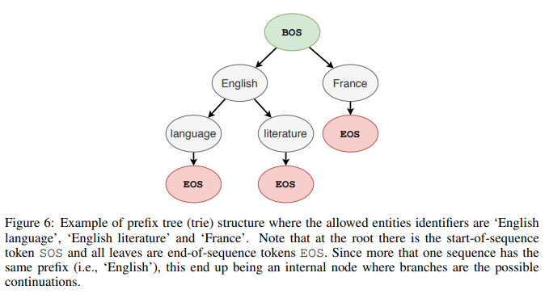
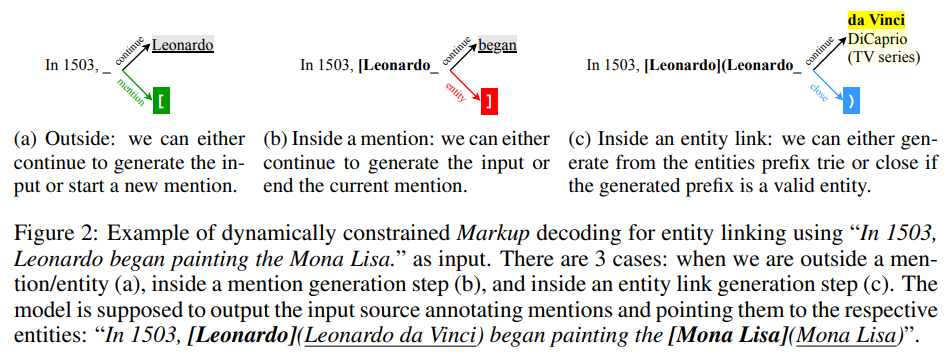
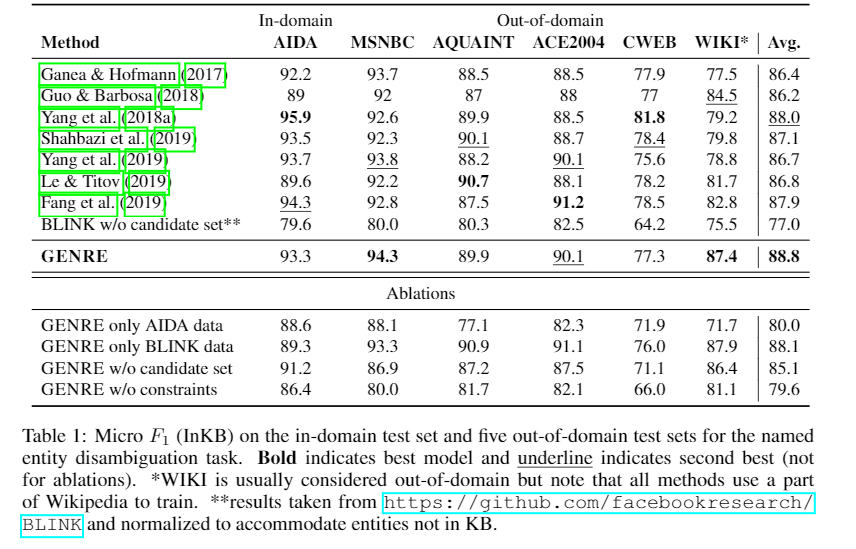
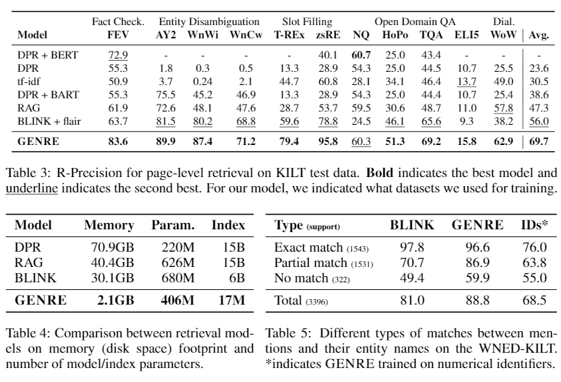

# 【关于 GENER 】 那些你不知道的事

> 作者：杨夕
> 
> 论文名称：AUTOREGRESSIVE ENTITY RETRIEVAL
> 
> 论文地址：https://openreview.net/pdf?id=5k8F6UU39V
> 
> 论文代码：https://github.com/facebookresearch/GENRE
> 
> 来源：ICLR 2021
> 
> 项目地址：https://github.com/km1994/nlp_paper_study
> 
> NLP 面筋：https://github.com/km1994/NLP-Interview-Notes
> 
> 个人介绍：大佬们好，我叫杨夕，该项目主要是本人在研读顶会论文和复现经典论文过程中，所见、所思、所想、所闻，可能存在一些理解错误，希望大佬们多多指正。

## 摘要

- 介绍：实体是我们表示和聚合知识的中心。例如，维基百科等百科全书是由实体构成的（例如，一篇维基百科文章）。检索给定查询的实体的能力是知识密集型任务（如实体链接和开放域问答）的基础。理解当前方法的一种方法是将分类器作为一个原子标签，每个实体一个。它们的权重向量是通过编码实体元信息（如它们的描述）产生的密集实体表示。
- 缺点：
  - （i）上下文和实体的亲和力主要是通过向量点积来获取的，可能会丢失两者之间的细粒度交互；
  - （ii）在考虑大型实体集时，需要大量内存来存储密集表示；
  - （iii）必须在训练时对一组适当硬的负面数据进行二次抽样[。
- 工作内容介绍：在这项工作中，我们提出了第一个 GENRE，通过生成其唯一的名称，从左到右，token-by-token 的自回归方式和条件的上下文。
- 这使得我们能够缓解上述技术问题，
  - （i）自回归公式允许我们直接捕获文本和实体名称之间的关系，有效地交叉编码两者 ；
  - （ii）由于我们的编码器-解码器结构的参数随词汇表大小而不是词汇量大小而缩放，因此内存足迹大大减少实体计数；
  - （iii）准确的softmax损失可以有效地计算，而无需对负数据进行子采样。
- 实验结果：我们展示了该方法的有效性，在实体消歧、端到端实体链接和文档检索任务上对20多个数据集进行了实验，在使用竞争系统内存占用的一小部分的情况下，获得了最新的或非常有竞争力的结果。他们的实体，我们只需简单地指定新的名称，就可以添加

## 一、实体检索任务

### 1.1 定义介绍

- 实体检索任务：给定一段输入文本和知识库，需要模型 根据知识库，从文本找出最关联的候选实体。

> 举例
```s
    给定文本：湖人队获得 2020 年 NBA 总决赛冠军；
    给定知识库：[洛杉矶湖人队，...]
    抽取出结果：
        湖人队 -> 洛杉矶湖人队
```

### 1.2 常用方法

<table>
    <tr>
        <td>任务类型</td>
        <td>分类式实体检索</td>
        <td>生成式实体检索</td>
    </tr>
    <tr>
        <td>类型</td>
        <td>实体 ID 分类</td>
        <td>实体名称生成</td>
    </tr>
    <tr>
        <td>内存</td>
        <td>高【需要加载 知识库】</td>
        <td>低【不需要加载 知识库】</td>
    </tr>
    <tr>
        <td>负采样</td>
        <td>需要【由于直接加载整个知识库内存占用大】</td>
        <td>不需要</td>
    </tr>
</table>

### 1.3 生成式实体消歧、实体链接、文档检索

- 实体消歧：给定一个包含mention的输入，需要生成mention所指代的是KB中的哪一个实体。
- 端到端实体链接：给定一个文档，系统需要检测其中的entity mentions，并将mentions链接到KB中相应的实体。

> 比如输入是 “In 1503, Leonardo began painting the Mona Lisa “, 则需要模型检测出其中的mention是 Leonardo 和 Mona Lisa “，然后将其链接到KB中的实体 Leonardo da Vinci 和 Mona Lisa 。

- 页面级别的文本检索：给定一个包含输入query，找到其所对应的Wikipedia的文章题目。

> 比如输入是“Which Florentine painter 1535-1607 used the name Bronzino after the death of his ‘uncle’?”，输出是文章题目名’Bronzino’。

## 二、为什么 生成式 能够 应用于 实体链指？

- 分类式实体检索特点：每一个实体带有一个唯一的原子标签，因此所以被视为 多分类任务
- 生成式实体检索特点：
  - 原子标签
  - 文章标题（实体名称）【存在唯一性，所以也可以作为 表示符，同时还具有高结构性和组合性，而且在内容上可提供更详细的信息，并且这些实体名称与mention context存在可预测的匹配模式。 】

> 注：mention 表示自然语言表示实体的文本片段，如 1.1 章，湖人队 为 mention，mention 的 context 指 mention 上下文，例如：2020 年 NBA 总决赛冠军

## 三、实体名称和mention+context的匹配类型？

将实体标识符视为分类器中的原子标签忽略了这样一个事实，即我们通常拥有明确、高度结构化和组合的实体名称。例如，Wikipedia将独特的标题与文章联系起来，这些标题可能是主题的名称或主题的描述，以及消除歧义的潜在独特信息（参见图1中的一些示例）。这些实体名称通常以一种可预测的、有规律的方式与 mention 上下文进行交互。

1. 实体名称和 mention 完全相同
2. 由上下文中的标记组成
3. 实体名称和 mention 规范化后相同
4. 需要“规范化”，例如 mention 的正确别名
5. 要求可能存储在模型参数中的事实知识
6. 实体名称和 mention 完全相同



> 从上面这六种类型说明实体名称和带mention的input之间存在着固定形式的映射，因此对于一个mention+context或者输入，是有可能采用 生成的方式 将其中的mention转换为一个唯一的实体名称的。

## 四、GENER 方法 如何生成实体呢？

- 生成式实体检索方式：生成 一个 给定输入到实体名称，也就是 模型 需要 根据 输入信息，生成 其所对应的实体，并且该实体 必须 存在于 知识库或知识图谱中 的 候选实体集合；
- GENER 所用 框架： seq2seq 方式 
- GENER 思路：

1. 采用 预训练语言模型(BART[1]) 计算输入与每个候选实体的log-likelihood分数；
2. 然后按照分数取top-N个候选实体。从技术上讲，GENRE通过fine-tune预训练语言模型来生成实体名称。

## 五、GENER 方法 所生成的实体 会不会不落在 知识库中？

- 动机：实体检索 的目标就是 从 知识库 或者 知识图谱 中 检索出 已存在的实体，如果采用 生成式方法 生成实体，是否会存在 生成的实体不在 知识库 中的情况呢？
- 传统方法方法及存在问题：在解码的过程中，是在WIkipedia的所有实体(~6M)进行搜索，也就是允许每个位置可以是任何的token，所以无法保证生成的实体一定属于 知识库 中实体；
- 论文解决方法：采用 一种 受约束的beam search 来解决该问题。 所谓的约束是通过前缀树（trie) 定义的，树上的每一个节点是词表中的一个token，节点的孩子表示所有可能的后续tokens 。


> 例如：Enligh的后续tokens是language和literature，那幺在解码时如果当前词是English, 那幺就下一个token只能从language和literature中选择。

## 六、生成式的端到端实体链接 问题解决方法？

- 前言：对于 1.3 所介绍的 实体消歧、端到端实体链接、页面级别的文本检索 三种任务，实体消歧和页面级别的文本检索 任务 可以直接将数据集中的输入喂给 预训练语言模型(BART[1]) 即可，但是对于 生成式的端到端实体链接任务 并不能 采用 这种方式解决，那么 该问题 需要如何处理呢？
- 思路：训练时encoder的输入是文本序列，decoder的输入是在基础上标注了mention和实体链接信息，从而监督模型的生成这两部分信息。

```s
    encoder输入: In 1503, Leonardo began painting the Mona Lisa .

    decoder输入: In 1503, [Leonardo](Leonardo da Vinci) began painting the [Mona Lisa](Mona Lisa) 。
```
> 注：从上面可以看出，在 decoder 阶段并没有太大不同，但是在 decoder 阶段，论文 会将 输入中 的 mention 用 [] 进行标注，并且 利用 () 标注出 mention 在 KB 中所对应的实体

- 问题：但是因为mention是free-form的文本，如果定义所有mentions的前缀树trie的话，则搜索空间会非常的大。那要怎幺办呢？
- 解决方法：采用了动态解码的方式

1. metion的生成: 由 “[” 激活—->从输入中复制mention span —-> 生成 “]” 结束。ps: 因为mention span的生成是直接从复制的，所以就不需要去进行大量的空间搜索~
2. entity的生成：由 “]” 激活 —-> 利用entities trie生成有效entity —-> 生成 “)” 结束。
3. 其余tokens的生成: 直接从中复制就好。

> 举例说明：



## 七、实验结果分析

### 7.1 整体效果


> 注：在8个实体链接数据集上的整体Micro F1比之前SOTA高出了1.8

### 7.2 页面级别的文本检索任务上的实验结果



## 八、总结

- 方法：一种新的范式体裁来解决实体检索：自动回归生成实体名。实体名称有几个属性可能有助于（甚至人类）重新检索它们，包括组成结构和与实体的可预测交互上下文自回归公式允许我们直接捕捉其中的一些性质
- 优点：相对于当前的解决方案
  - 一种有效的方法交叉编码上下文和实体候选；
  - 内存占用小得多；
  - 无需对负数据进行子采样即可计算精确的softmax。
- 实验结果：这些特征与受限的解码策略相结合，在大量的实体检索数据集上产生了最先进的性能，包括实体消歧、端到端实体链接和页面级文档检索，同时导致系统具有显著的内存bootprint、空间平均减少20倍。此外，我们还证明了在我们的系统中，通过简单地将新实体的明确名称附加到候选集，可以有效地考虑新实体。

## 参考

1. [Facebook提出生成式实体链接、文档检索，大幅刷新SOTA！](https://zhuanlan.zhihu.com/p/360577810)