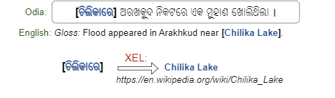
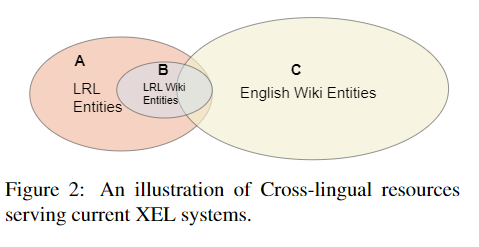

# 【关于  Low-resource Cross-lingual Entity Linking】 那些你不知道的事

> 作者：杨夕
> 
> 论文名称：Design Challenges in Low-resource Cross-lingual Entity Linking
> 
> 论文地址：https://arxiv.org/pdf/2005.00692.pdf
> 
> 来源：EMNLP 2020
> 
> 项目地址：https://github.com/km1994/nlp_paper_study
> 
> 个人介绍：大佬们好，我叫杨夕，该项目主要是本人在研读顶会论文和复现经典论文过程中，所见、所思、所想、所闻，可能存在一些理解错误，希望大佬们多多指正。

## 目录

## 摘要

- 介绍：跨语言实体链接（XEL）旨在将任一非英语文本中的实体提及匹配到英语知识库上（例如Wikipedia，图1所示）；
- 动机：近年来，大批研究成果被提出，但是现有的技术并不能很好的处理低资源语言（LRL）的挑战。且这些技术并不能轻松扩展到非基于Wikipedia的数据上（训练数据主要来自Wiki）；
- 方法：本文对LRL上的跨语言实体链接技术进行了深入分析，重点研究了识别与给定候选实体的关键步骤。作者的分析表明，现有方法受限于Wikipedia的inter-language links，但是在（Wiki中）语言规模较小的情况下性能拉跨。作者推断基于LRL的XEL需要借助于Wikipedia之外的跨语言资源，并且构建了一个简单有效的zero-shot XEL系统，名为QuEL，其实现利用了搜索引擎的查询日志。在25种语言的实验上，QuEL表现出平均达到25%的gold候选召回率提升，以及基于现有SOAT端到端实体链接模型13%的准确性提升。

## 动机

作者首先发现，现有的XEL模型大都严重依赖于Wiki所提供的inter-language links（ILLs）资源，但是如图2所示，ILLs（B）仅仅覆盖了LRL实体（A）中的一个小子集，因此能够被直接使用的部分主要是B∩C的区域。例如，Amharic Wikipedia 涵盖 14,854个条目，但其中仅有8176的部分具有指向英文的ILLs。因此现有的效果较好的候选实体生成模型所使用的数据集大多是基于Wikipedia的，但是对于非Wiki-based的文本和新闻或者社交媒体之类的数据则不具备这样的效果。

因此，本文的动机可以描述为，LRL-based XEL需要使用Wiki以外的跨语言数据，以覆盖更多类似图2中A区域的实体（从而跳出研究对Wikipedia数据集的依赖，且增加其实际可能的使用范围）。

## 方法介绍

