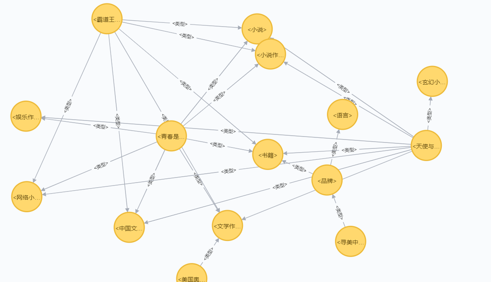

# 【关于 Neo4j 】 那些你不知道的事

> 作者：杨夕
> 
> 项目地址：https://github.com/km1994/nlp_paper_study
> 
> 个人介绍：大佬们好，我叫杨夕，该项目主要是本人在研读顶会论文和复现经典论文过程中，所见、所思、所想、所闻，可能存在一些理解错误，希望大佬们多多指正。

## 一、数据导入

### 1. neo4j 数据库 导入工具对比


### 2. 数据格式

#### 1.2.1 node.csv 节点数据

- 介绍：节点数据
- 数据格式：

```s
    id:ID,name,:LABEL
    1,<美国奥可斯（香港）国际控股集团>,Entity
    2,<文学作品>,Entity
    ...
```

#### 1.2.2 relation.csv 关系数据

- 介绍：关系数据
- 数据格式：

```s
    :START_ID,:END_ID,:TYPE,name
    1,2,Relation,<类型>
    1,3,Relation,<类型>
    ...
```

### 1.3 导入数据 

#### 1.3.1  使用  ./neo4j-admin import 导入数据 【3G 的数据 十几分钟搞定】

> 【注：需要转成CSV；必须停止neo4j；只能生成新的数据库，而不能在已存在的数据库中插入数据。】
1. 关闭  Neo4j 图数据库
2. 删除 Neo4j 目录下的 data/databases/ 中信息
3. 将 node.csv 和 relation.csv 放到 Neo4j 目录下的 import/ 中
4. 在 bin/ 目录下，调用导入命令：

- 代码
```s
        ./neo4j-admin.bat import --mode csv  --database ../databases/graph.db --id-type string --nodes:Entity ../import/node.csv --relationships:Rel ../import/relation.csv
```

- 输出
```s
    Neo4j version: 3.5.0
    
    ... 

    IMPORT DONE in 3m 37s 15ms.
    Imported:
      7486600 nodes
      20000000 relationships
      14973200 properties
    Peak memory usage: 1.10 GB
```

5. 数据导入结果



#### 1.3.2 ##### 使用 load 形式导入csv

- 如果不想删除原有数据，可以使用 load 形式导入csv

> 操作：https://cloud.tencent.com/developer/article/1387710