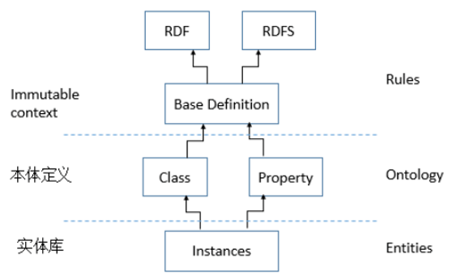
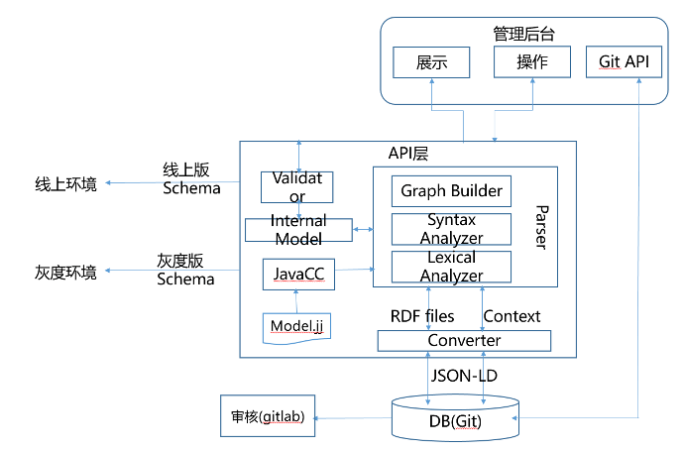
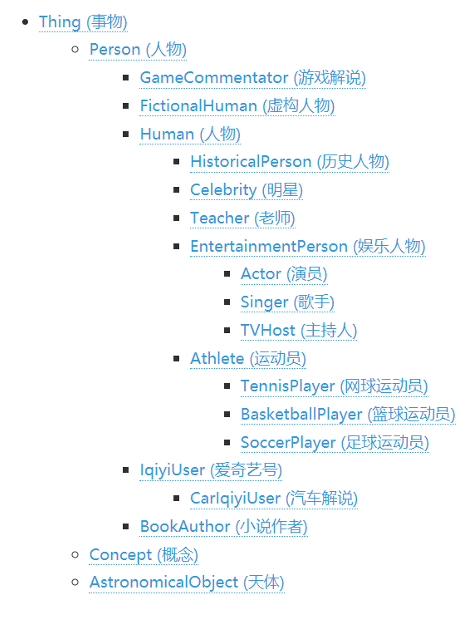
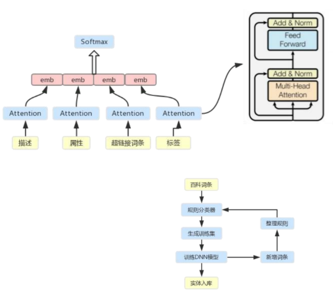
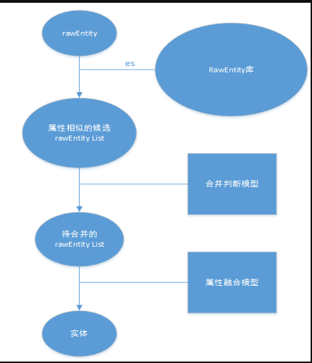
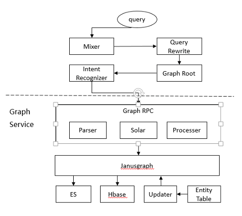

# 爱奇艺知识图谱落地实践

> 原文：[领域应用 | 完备的娱乐行业知识图谱库如何建成？爱奇艺知识图谱落地实践](https://mp.weixin.qq.com/s?__biz=MzU2NjAxNDYwMg==&mid=2247493658&idx=1&sn=cc2d7f82aa5c5a138dc7f267aaa26c16&chksm=fcb04fffcbc7c6e9575f5dcc3d1619425e4dd7fc0737976991bff687af6b1dadcdd20f906d04&mpshare=1&scene=22&srcid=0809aEdiDZ0DSoxjfzSF8Kcf&sharer_sharetime=1628471753625&sharer_shareid=da84f0d2d31380d783922b9e26cacfe2#rd)

## 一、什么是知识图谱？

知识图谱是一种揭示实体之间关系的语义网络，可以对现实世界的事物及其相互关系进行形式化地描述。

## 二、奇搜知识图谱的构建

### 2.1 动机

当传统的文本检索搜索方式不能满足给用户提供更为精准和智能的搜索体验的目标时，为了丰富用户视频娱乐搜索结果、为了对用户搜索意图实现精准理解与直观回答。

### 2.2 奇搜知识图谱的构建流程

#### 2.2.1 知识表示和建模

##### 2.2.1.1 知识建模方式

- 自顶向下的数据建模方法：设计数据模式（schema）-》 依据设计好的数据模式进行有针对性的数据抽取；
- 自底向上的数据建模方法：数据的收集和整理 -》 根据数据内容总结、归纳其特点 -》 提炼框架 -》 逐步形成确定的数据模式。

##### 2.2.1.2 奇搜知识图谱的构建采用的知识建模方式

- 奇搜知识图谱的构建采用：自顶向下的建模方式
- 数据模式（schema）定义方式：
  - 基于RDF三元组
  - RDFS的规则

###### 2.2.1.2.1 RDF(Resource Description Framework)

- 介绍：即资源描述框架，实际上是一种数据模型，由一系列的陈述即“对象-属性-值”三元组组成。
- Triples：[S, P, O] ：用Subject，Predicate，Object三元组与原陈述的三个部分联系起来。
  - 主体（subject）：声明被描述的事物
  - 谓词（predicate）：这个事物的属性
  - 客体（object）：这个属性的值

###### 2.2.1.2.2 RDFS（RDF Schema）

- 介绍：一个三元组就是一个关系。在RDF里我们可以声明一些规则，从一些关系推导出另一些关系。这些规则我们称为“schema”。这些规则用一些词汇（可以类比编程语言里的保留字，不过RDF里任何词汇都可以被重定义和扩展）表示，如常用的规则subClassOf，表示父类子类的关系。

###### 2.2.1.2.3 基于RDF/RDFS定义了图谱的实体类型、关系（属性）类型、以及实体本身的schema定义

- 实体层，保存在我们的实体库中的具体实体。每一层定义在schema的表示语法上都是一致的。
- 本体定义层，包括可实例化的实体类型（可继承）和属性（可继承）的定义，如Thing，Person，wife，name等。
- Rules层，是一些基础概念的定义，包括RDF/RDFS已有的定义及基于RDF/RDFS定义的、供实体类型/属性定义使用的规则定义，该层规则的定义一般在确定后是不可变的。

##### 2.2.1.3 奇搜知识图谱的schema定义系统

- 系统结构

- 定义的实体类型的继承关系片段

#### 2.2.2 知识获取

##### 2.2.2.1 数据来源

##### 2.2.2.2 实体分类

- 动机：主要**针对百度百科的数据**，因为**百度百科的数据没有类别信息**
- 做法：需要先对词条进行实体类型的识别。具体实现是为每种实体类型训练一个实体分类器，准确率可衡量，并且互不影响，可以快速拓展。
- 分类器的模型生成是通过启发式方法
- 思路：
  - 构建基于规则池的分类器，生成训练数据，训练DNN模型（self-attention）文本分类模型；
  - DNN分类器与规则分类器互相扩充迭代（一到两轮），最终线上使用规则分类器。
- 特征：生成过程中会用上百科词条中的描述文本、infobox字段、超链接词条、词条标签等信息。

##### 2.2.2.3 实体抽取

- 目标：从数据中的识别和抽取实体的属性与关系信息
- 抽取方式：
  - 结构化数据抽取：
    - 将抽取的流程写成统一的框架，利用策略模式将抽取的具体规则用groovy脚本来实现。当扩展新的来源和目标实体类型时，只需实现新的抽取脚本。
  - 半结构化数据抽取：
    - 采用基于有监督学习的包装器归纳方法进行抽取
  - 文本数据挖掘：
    - 一方面通过实体链接服务把从文本中抽取得到的实体对象，链接到实体库中对应的正确实体对象，以挖掘文本中关系。
    - 另一方面利用实体识别技术来识别来挖掘文本中的实体。

##### 2.2.2.4 知识融合

- 介绍：主要是实体对齐（Object Alignment），旨在发现具有不同ID但却代表真实世界中同一对象的那些实体，并将这些实体归并为一个具有全局唯一标识的实体对象添加到知识图谱中；
- 流程：
  - 首先我们所有来源的实体数据都会进入原始实体库（RawEntity库），并且对原始表中的数据建立索引。
  - 当一个原始实体rawEntity入最终实体库之前，要在原始实体库中找是否有其它原始实体和rawEntity实际上是同一个实体。步骤：
    - 首先在索引中根据名字、别名等字段查询出若干个可能是相同实体的候选列表，这个步骤的目的是减少接下来流程的计算量。
    - 然后经过实体判别模型，根据模型得分识别出待合并对齐的原始实体；
    - 最后经过属性融合模型，将各原始实体的属性字段进行融合，生成最终的实体。
  - 这个流程中的合并判断模型实际上是通过机器学习训练生成的二分类器。

##### 2.2.2.5 知识存储

## 参考

1. [领域应用 | 完备的娱乐行业知识图谱库如何建成？爱奇艺知识图谱落地实践](https://mp.weixin.qq.com/s?__biz=MzU2NjAxNDYwMg==&mid=2247493658&idx=1&sn=cc2d7f82aa5c5a138dc7f267aaa26c16&chksm=fcb04fffcbc7c6e9575f5dcc3d1619425e4dd7fc0737976991bff687af6b1dadcdd20f906d04&mpshare=1&scene=22&srcid=0809aEdiDZ0DSoxjfzSF8Kcf&sharer_sharetime=1628471753625&sharer_shareid=da84f0d2d31380d783922b9e26cacfe2#rd)