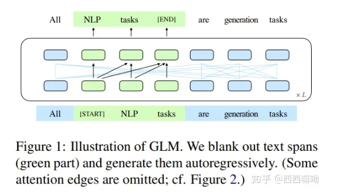
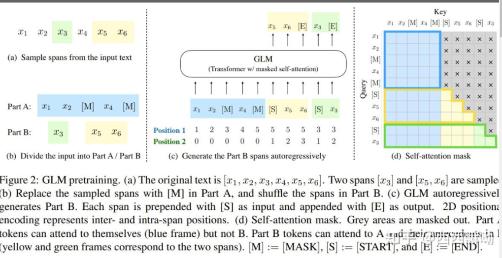
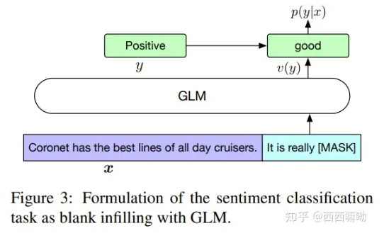
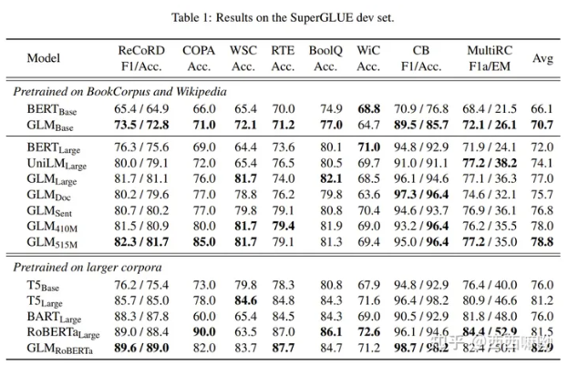
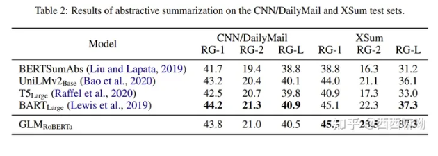
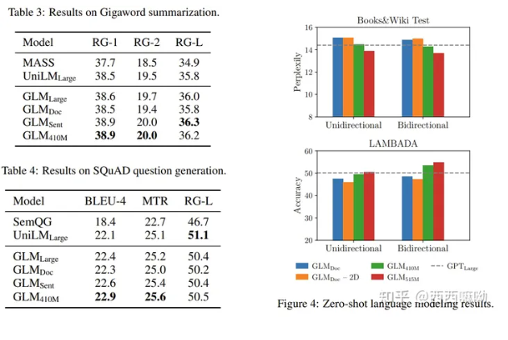
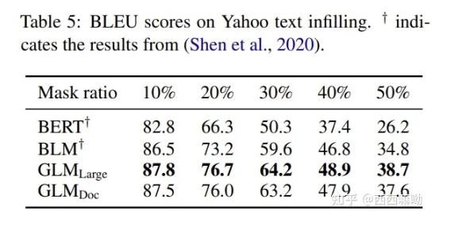
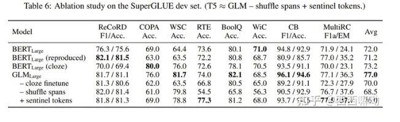

# ChatGLM-6B怎么火，你却还不懂 GLM？

> 作者：西西嘛呦
> 
> 原文地址：https://zhuanlan.zhihu.com/p/618166630
> 
> 论文名称：GLM: General Language Model Pretraining with Autoregressive Blank Infilling
> 
> 论文地址：https://aclanthology.org/2022.acl-long.26.pdf
> 
> github : https://github.com/THUDM/GLM
> NLP 百面百搭 地址：https://github.com/km1994/NLP-Interview-Notes
> 
> 推荐系统 百面百搭 地址：https://github.com/km1994/RES-Interview-Notes
> 
> 搜索引擎 百面百搭 地址：https://github.com/km1994/search-engine-Interview-Notes 【编写ing】
> 
> NLP论文学习笔记：https://github.com/km1994/nlp_paper_study
> 
> 推荐系统论文学习笔记：https://github.com/km1994/RS_paper_study
> 
> GCN 论文学习笔记：https://github.com/km1994/GCN_study
> 

- [ChatGLM-6B怎么火，你却还不懂 GLM？](#chatglm-6b怎么火你却还不懂-glm)
  - [一、前言](#一前言)
  - [二、动机](#二动机)
  - [三、 什么是 GLM？](#三-什么是-glm)
  - [三、GLM 的 多任务训练 是怎么样的呢？](#三glm-的-多任务训练-是怎么样的呢)
  - [四、GLM 模型架构 是怎么样的呢？](#四glm-模型架构-是怎么样的呢)
  - [五、在 NLG 中，GLM 如何让 模型 不知道 生成query 长度？](#五在-nlg-中glm-如何让-模型-不知道-生成query-长度)
  - [五、GLM 如何进行微调？](#五glm-如何进行微调)
    - [5.1 GLM 如何 对 NLU任务 进行微调？](#51-glm-如何-对-nlu任务-进行微调)
    - [5.2 GLM 如何 对 NLG任务 进行微调？](#52-glm-如何-对-nlg任务-进行微调)
    - [5.3 GLM 微调方式的优点是什么？](#53-glm-微调方式的优点是什么)
  - [六、GLM 实验结果](#六glm-实验结果)
  - [参考](#参考)

## 一、前言

ChatGPT已经火了一段时间了，国内也出现了一些平替，其中比较容易使用的是ChatGLM-6B：https://github.com/THUDM/ChatGLM-6B ，主要是能够让我们基于单卡自己部署。ChatGLM的基座是GLM: General Language Model Pretraining with Autoregressive Blank Infilling论文中提出的模型，接下来我们来看看。

## 二、动机

预训练语言吗模型大体可以分为三种：**自回归（GPT系列）、自编码（BERT系列）、编码-解码（T5、BART）**，它们每一个都在各自的领域上表现不俗，但是，目前**没有一个预训练模型能够很好地完成所有任务**。

## 三、 什么是 GLM？

GLM 是一个通用的预训练语言模型，它**在NLU（自然语言理解）、conditional（条件文本生成） and unconditional generation（非条件文本生成）上都有着不错的表现**。

**GLM的核心是：Autoregressive Blank Infilling**，如下图1所示：

> 注：将文本中的一段或多段空白进行填充识别

具体细节如图2所示：

> 说明，对于一个文本：x1, x2, x3,...,x5，空白长度会以 λ=3 的泊松分布进行采样。重复采样直到空白token的总数目占文本token数的15%。将文本分为两部分，A部分由原始token和[MASK]组成，B部分由空白token组成，最终将A部分和B部分进行拼接，同时B部分的每一个空白会被打乱，这样在自回归预测每个token的时候可以看到上下文的信息（具体通过注意力掩码来实现）。需要注意的是位置编码是2D的，位置编码1用于表示token在文本的位置，位置编码2用于表示原始文本和每一个空白中token的顺序。

## 三、GLM 的 多任务训练 是怎么样的呢？

都知道 NLU 和 NLG 的 训练方式 是存在差异的，那 GLM 是 如何 通过 多任务训练 兼顾 NLU 和 NLG 的呢？

GLM 对于文档和句子采用不同的空白填充方式：

- 文档：span的长度从原始长度的50%-100%的均匀分布中抽取。该目标旨在生成长文本；
- 句子：限制masked span必须是完整的句子。多个span(句子)被取样，以覆盖15%的的原始标记。这个目标是针对seq2seq任务，其预测往往是完整的句子或段落。

## 四、GLM 模型架构 是怎么样的呢？

GLM 主要 在 Transformer 的 架构上进行 修改：

1. **调整layer normalization和residual connection的顺序**；
2. **使用单一线性层进行输出token预测**；
3. **将ReLU激活函数替换为GeLUs**；

## 五、在 NLG 中，GLM 如何让 模型 不知道 生成query 长度？

**两个位置id通过可学习嵌入表投影到两个向量，这两个向量都被添加到输入标记嵌入中**。

该编码方法**确保模型在重建时不知道被屏蔽的跨度的长度**。

这种设计适合下游任务，因为通常**生成的文本的长度是事先未知的**。

## 五、GLM 如何进行微调？

### 5.1 GLM 如何 对 NLU任务 进行微调？

对于 NLU任务，在模板后面预测类别。

- It’s a beautiful day, I’m in a great mood. it is [MASK]. [S] good
- I failed in the exam today. I was very depressed. it is [MASK] [S] bad

### 5.2 GLM 如何 对 NLG任务 进行微调？

对于 NLG任务 ，输入的文本视为A部分，在该部分后面添加[MASK]，使用自回归来生成文本。

### 5.3 GLM 微调方式的优点是什么？

微调方式的优点 在于 **能够预训练和微调是保持一致的**。

## 六、GLM 实验结果

## 参考

1. [GLM: General Language Model Pretraining with Autoregressive Blank Infilling](https://aclanthology.org/2022.acl-long.26.pdf)
2. [THUDM/GLM](https://github.com/THUDM/GLM)
3. [GLM：ChatGLM的基座模型](https://zhuanlan.zhihu.com/p/618166630)
