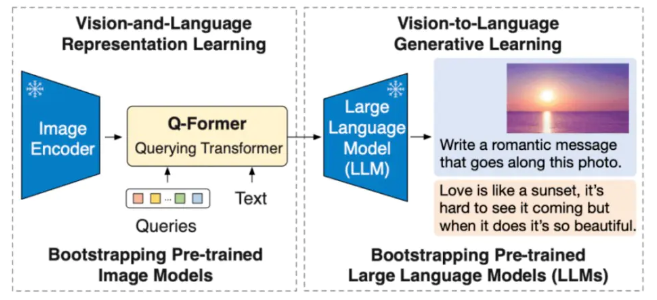
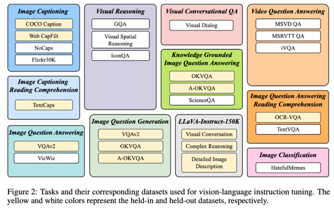
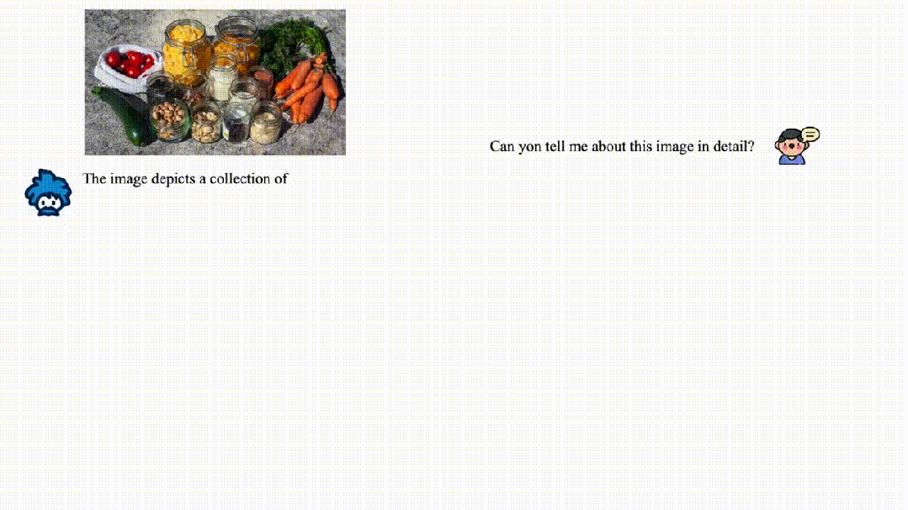
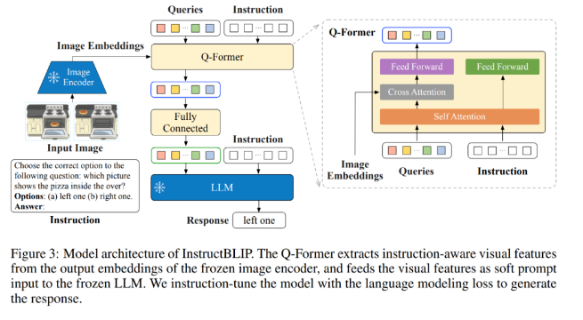
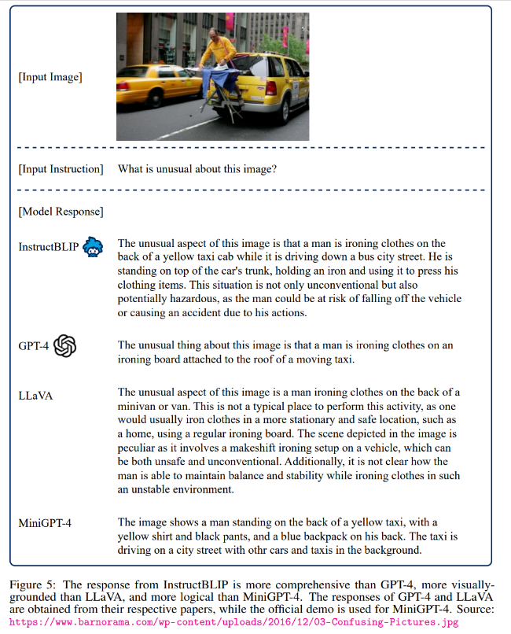

# InstructBLIP

> 论文地址 ：https://arxiv.org/pdf/2305.06500.pdf
> 
> githut 地址：https://github.com/salesforce/LAVIS/tree/main/projects/instructblip

## 一、动机

### 1.1 GPT-4 在技术上的几点突破

- 第一，多模态处理能力：GPT-4 可以接受包含文本和图片的输入，并生成包括自然语言和代码在内的文本输出。这使得它在处理文档、图表或屏幕截图等任务时表现出色。
- 第二，更好的性能和表现：相比前代 GPT-3.5，在处理复杂任务时表现更为出色，在各大面向人类的考试中展示出了更高的准确性、可靠性、创造力和理解能力。
- 第三，Test-Time Techniques扩展能力：GPT-4 使用了Test-Time Techniques如few-shot和chain-of-thought prompting进一步扩展了其能力，使其能够更好地处理新领域和任务。
- 第四，安全性优化：GPT-4重视安全性，生成回复的正确性得到了重点优化。它还进行了对抗性真实性评估，以避免潜在的安全隐患。
- 第五，开源框架支持：OpenAI开源了用于评价大语言模型的开源框架OpenAI Evals，可以帮助研究人员和开发者评估他们的模型，并提供更好的指导。
- 第六，模型训练和监控：OpenAI强调对模型进行评估和监控的重要性，以避免潜在的安全隐患。GPT-4 也已被应用在了OpenAI内部，例如内容生成、销售和编程，并在模型训练的第二阶段负责输出评估、对齐工作。

### 1.2 GPT-4 存在问题

- 第一，不开源。
- 第二，数据安全。商用API即使强调不会用于模型训练，敏感业务数据你敢用吗？
- 第三，资源消耗大。即使是 GPT-3 也有1750亿参数，所有的训练/推理都是极其消耗资源的，从 GPT-4 的价格上涨了 50% 来看，可以合理推测 GPT-4 的推理消耗资源也上升了约 50% 左右。

## 二、InstructBLIP 介绍

### 2.1 BLIP-2 模型介绍

Salesforce 研究院的 BLIP-2 模型，是一种视觉语言模型，可以用于图像字幕生成、有提示图像字幕生成、视觉问答及基于聊天的提示等多种应用场景。BLIP-2 通过引入一种新的视觉语言预训练范式来解决端到端视觉语言预训练的高成本问题，并实现了在多个视觉语言任务上最先进的结果，同时减少了训练参数量和预训练成本。

> 论文地址：https://arxiv.org/pdf/2301.12597.pdf

### 2.2 InstructBLIP 模型介绍

华人团队开源了多模态基础模型InstructBLIP，是从BLIP-2模型微调而来的模型。根据介绍，InstructBLIP 模型更擅长「看」、「推理」和「说」，即能够对复杂图像进行理解、推理、描述，还支持多轮对话等。研究人表示，正是基于强大 BLIP-2，才使得 InstructBLIP「看」的更好。

### 2.3 InstructBLIP 指令微调数据的构建

为了保证指令微调数据的多样性，同时考虑到它们的可及性，研究人员收集了大量公开可用的视觉语言数据集，并将它们转化为指令微调格式。下图中，研究人员最终收集的数据涵盖了 11 个任务类别和 28 个数据集。

具体地，包括图像字幕、带有阅读理解的图像字幕、视觉推理、图像问题回答、基于知识的图像问题回答，带阅读理解的图像问题回答，图像问题的生成（与QA数据集相反），视频问题回答，视觉对话问题回答，图像分类，以及LLaVA-Instruct-150K。

### 2.4 InstructBLIP 技术细节

InstructBLIP 分别从模型和数据的角度阐述了两种提高指令微调性能的技术。

InstructBLIP 通过充分利用BLIP-2模型中的Q-Former架构，提出了一种指令感知的视觉特征提取方法。

如下图所示，Q-Former被设计用来从一个冻结的图像编码器的输出中提取视觉特征。

根据BLIP-2的论文，Q-Former已经分成两个阶段进行了预训练，通过预训练，它学会了提取可以被LLM消化的文本对齐的视觉特征。在推理过程中，一个指令被附加在视觉提示之后，就可以指导LLM按照规定执行不同的任务。

而在InstructBLIP中，指令文本不仅作为输入给到LLM，同时也给到了QFormer。

## 三、InstructBLIP 性能

## 参考

1. [InstructBLIP: Towards General-purpose Vision-Language Models with Instruction Tuning](https://arxiv.org/pdf/2305.06500.pdf)
2. [salesforce/LAVIS](https://github.com/salesforce/LAVIS/tree/main/projects/instructblip)
3. [华人团队开源InstructBLIP，实现多项SOTA，超越GPT-4](https://mp.weixin.qq.com/s/_UzmyTua9FQk1LafmEw28Q)

