# 概率图模型串烧 （HMM->MEMM->CRF）

## 前言

本课程主要对概率图模型中采用的几个模型（随机场、马尔可夫过程、HMM、MEMM、CRF）进行介绍，为了帮助大家理解这些模型，我们将以时间轴的形式介绍各个模型，并以上一个模型所存在的问题，下一个模型如何针对该模型进行改进的方式进行讲解，为了方便大家理解，建议大家 在看这个教程时，先看一下 [CRF 视频介绍](https://b23.tv/BV19t411R7QU/p1)，并结合着李航老师的《统计学习方法》中CRF章节进行学习。

## 从两个例子说起

### 照片排序

这里举一个简单的例子：假设有Bob一天从早到晚的一系列照片，Bob想考考我们，要我们猜这一系列的每张照片对应的活动，比如: 工作的照片，吃饭的照片，唱歌的照片等等。一个比较直观的办法就是，我们找到Bob之前的日常生活的一系列照片，然后找Bob问清楚这些照片代表的活动标记，这样我们就可以用监督学习的方法来训练一个分类模型，比如逻辑回归，接着用模型去预测这一天的每张照片最可能的活动标记。

这种办法虽然是可行的，但是却忽略了一个重要的问题，**就是这些照片之间的顺序其实是有很大的时间顺序关系的，而用上面的方法则会忽略这种关系**。比如我们现在看到了一张Bob闭着嘴的照片，那么这张照片我们怎么标记Bob的活动呢？比较难去打标记。但是如果我们有Bob在这一张照片前一点点时间的照片的话，那么这张照片就好标记了。如果在时间序列上前一张的照片里Bob在吃饭，那么这张闭嘴的照片很有可能是在吃饭咀嚼。而如果在时间序列上前一张的照片里Bob在唱歌，那么这张闭嘴的照片很有可能是在唱歌。

为了让我们的分类器表现的更好，可以在标记数据的时候，可以考虑相邻数据的标记信息。这一点，是普通的分类器难以做到的。而这一块，也是CRF比较擅长的地方。

### 词性标注

非常简单的，就是给一个句子中的每个单词注明词性。比如这句话：“Bob drank coffee at Starbucks”，注明每个单词的词性后是这样的：“Bob (名词)  drank(动词)  coffee(名词)  at(介词)    Starbucks(名词)”。

下面，就用条件随机场来解决这个问题。

以上面的话为例，有5个单词，我们将：(名词，动词，名词，介词，名词)作为一个标注序列，称为l，可选的标注序列有很多种，比如l还可以是这样：（名词，动词，动词，介词，名词），我们要在这么多的可选标注序列中，挑选出一个最靠谱的作为我们对这句话的标注。

怎么判断一个标注序列靠谱不靠谱呢？

就我们上面展示的两个标注序列来说，第二个显然不如第一个靠谱，因为它把第二、第三个单词都标注成了动词，动词后面接动词，这在一个句子中通常是说不通的。

假如我们给每一个标注序列打分，打分越高代表这个标注序列越靠谱，我们至少可以说，凡是标注中出现了动词后面还是动词的标注序列，要给它负分！！

上面所说的动词后面还是动词就是一个特征函数，我们可以定义一个特征函数集合，用这个特征函数集合来为一个标注序列打分，并据此选出最靠谱的标注序列。也就是说，每一个特征函数都可以用来为一个标注序列评分，把集合中所有特征函数对同一个标注序列的评分综合起来，就是这个标注序列最终的评分值。

### **小小笔记**

在实际应用中，对于序列排序或序列标注（eg:词性标注（POS Tagging））就是非常适合CRF使用的地方。词性标注的目标是给出一个句子中每个词的词性（名词，动词，形容词等）。而**这些词的词性往往和上下文的词的词性有关**，因此，使用CRF来处理是很适合的，当然CRF不是唯一的选择，也有很多其他的词性标注方法。


## 从历史变迁出发

### 随机场

#### 定义

每个位置按照某种分布随机赋予一个值 所构成 的 整体。

### 马尔可夫过程

#### 定义

假设一个随机过程中，$t_n$ 时刻的状态$x_n$的条件发布，只与其前一状态$x_{n-1}$ 相关，即：

$$
    P(x_n|x_1,x_2,...,x_{n-1}) = P(x_n|x_{n-1})
$$

则将其称为 马尔可夫过程。


#### **小小笔记**

对于 马尔可夫过程 的 思想，用一句话去概括：**当前时刻状态 仅与上一时刻状态相关，与其他时刻不相关。**

可以从 马尔可夫过程 图 去理解，由于 每个状态间 是以 有向直线连接，也就是 当前时刻状态 仅与上一时刻状态相关。

### 隐马尔科夫算法

#### 定义

隐马尔科夫算法是对含有未知参数（隐状态）的马尔可夫链进行建模的**生成模型**，如下图所示：

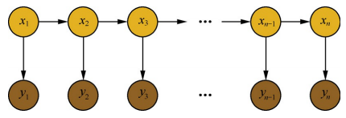

在隐马尔科夫模型中，包含隐状态 和 观察状态，隐状态 $i_i$ 对于观察者而言是不可见的，而观察状态 $o_i$ 对于观察者而言是可见的。隐状态间存在转移概率，隐状态 $i_i$到对应的观察状态 $o_i$ 间存在输出概率。

#### 核心概念


- 两序列
  - 隐藏序列：隐状态 $i_i$ 对于观察者而言是不可见的
  - 观测序列：$o_i$ 对于观察者而言是可见的
- 三矩阵
  - 初始状态矩阵：每个标签的概率矩阵
  - 发射状态矩阵：一个字变成每个标签的概率 $B=\left[b_{i j}\right]_{N \times M}$（$N$为隐藏状态集元素个数，M为观测集元素个数），其中$b_{i j}=P\left(o_{t} | i_{t}\right)$，$(o_{t}$为第i个观测节点 ，$i_t$ 为第i个隐状态节点,即所谓的观测概率（发射概率）；
  - 状态转移级证：标签到每个标签的概率 $A=\left[a_{i j}\right]_{N \times N}$ （N 表示隐藏状态集元素的个数），其中 $a_{i j}=P\left(i_{t+1} | i_{t}\right)$，$i_t$ 即第i个隐状态节点，即所谓的状态转移；
- 两假设
  - 假设一：输出观测值间严格独立，仅取决于对应隐状态
  - 假设二：状态转移过程中，当前状态只与前一状态相关

#### 两假设

1. 假设隐状态$x_i$ 的状态满足马尔可夫过程，i时刻的状态$x_i$ 的条件分布，仅与其前一个状态$x_{i-1}$相关，即：

$$
    P(x_i|x_1,x_2,...,x_{i-1}) = P(x_i|x_{i-1})
$$

2. 假设观测序列中各个状态仅取决于它所对应的隐状态，即：

$$
    P(y_i|x_1,x_2,...,x_{i-1},y_1,y_2,...,y_{i-1},y_{i+1},...) = P(y_i|x_{i})
$$

#### HMM工作流程

1. 隐状态节点 $i_t$ 是不能直接观测到的数据节点， $o_t$ 才是能观测到的节点，并且注意箭头的指向表示了依赖生成条件关系；
2. $i_t$在$A$的指导下生成下一个隐状态节点$i_{t+1}$;
3. $i_t$在$B$的指导下生成依赖于该$i_t$的观测节点$o_{t}$;

#### 深层次理解

由于 为有向图，而且属于生成式模型，直接对联合概率分布建模 

$$
  P(O, I)=\sum_{t=1}^{T} P\left(O_{t} | O_{t-1}\right) P\left(I_{t} | O_{t}\right)
$$

#### 模型计算过程

##### 1. 学习训练过程

1. 思想
   
  找出数据的分布情况，也就是模型参数的确定；

2. 常用方法

- 极大似然估计：该算法在训练数据是**会 将 观测状态序列 $O$ 和 隐状态序列 $I$**;
- Baum-Welch(前向后向)：该算法在训练数据是**只会 将 观测状态序列 $O$**;

##### 2. 序列标注（解码）过程

1. 思想

也就是“预测过程”，通常称为解码过程。在给定的观测序列下找出一条隐状态序列，条件是这个隐状态序列的概率是最大的那个

$$Q_{\max }=\operatorname{argmax}_{\text {allQ}} \frac{P(Q, O)}{P(O)}$$

2. 常用方法：Viterbi算法

Viterbi计算有向无环图的一条最大路径：


##### 3. 序列概率过程

1. 思想

如何对一条序列计算其整体的概率。即目标是计算出 $P(O | \lambda)$ ;

2. 常用方法

- 直接计算法（穷举搜索）
- 前向算法
- 后向算法

#### 例子讲解

1. [天气预测例子讲解](https://blog.csdn.net/bitcarmanlee/article/details/77488620)
2. [筛子预测例子讲解](https://www.cnblogs.com/skyme/p/4651331.html)

#### 存在问题

在序列标注问题中，隐状态（标注）不仅和单个观测状态相关，还和观察序列的长度、上下文等信息相关。例如词性标注问题中，一个词被标注为动词还是名词，不仅与它本身以及它前一个词的标注有关，还依赖于上下文中的其他词。

#### 参考资料

1. [HMM 介绍](https://zhuanlan.zhihu.com/p/27907806)

### 最大熵马尔科夫模型（MEMM）

#### 动机

HMM中，观测节点 $o_i$ 依赖隐藏状态节点 $i_i$ ,也就意味着我的观测节点只依赖当前时刻的隐藏状态。但在更多的实际场景下，**观测序列是需要很多的特征来刻画的**，比如说，我在做NER时，我的标注 $i_i$ 不仅跟当前状态 $o_i$ 相关，而且还跟前后标注 $o_{j}(j \neq i)$ 相关，比如字母大小写、词性等等。

#### 定义


通过 “定义特征” 的方式，学习条件概率：

$$P(I | O)=\prod_{t=1}^{n} P\left(i_{i} | i_{i-1}, o_{i}\right), i=1, \cdots, n$$

并且， $P(i|i',o)$ 这个概率通过最大熵分类器建模（取名MEMM的原因）:


重点来了，这是ME的内容，也是理解MEMM的关键： $Z(o,i')$ 这部分是归一化； $f_{a}(o, i)$ 是特征函数，具体点，这个函数是需要去定义的; $\lambda$ 是特征函数的权重，这是个未知参数，需要从训练阶段学习而得。

定义特征函数：


其中，特征函数 $f_{a}(o, i)$ 的 个数 可以任意制定，（a=1,...,n）

所以总体上，MEMM的建模公式这样：


请务必注意，理解判别模型和定义特征两部分含义，这已经涉及到CRF的雏形了。

#### 注意

1. 在前面介绍 HMM 时，HMM 提出了 **观测节点 $o_i$ 依赖隐藏状态节点 $i_i$** 假设，该假设不合理的，针对该问题， MEMM 提出 **观测节点 $i_i$ 依赖隐藏状态节点 $o_i$ 以及上一时刻的隐藏节点$i_{i-1}$** 假设。（HMM 和 MEMM 箭头）；

#### 思路重温

1. 定义特征函数 $f_{a}(o,i)$;
2. 在给定的数据上，训练 MEMM 模型参数；
3. 利用 MEMM 做序列标注问题或者序列求概率问题；

#### 存在问题

1. 问题简述
   
MEMM 容易出现标注偏置问题，MEMM倾向于选择拥有更少转移的状态。

1. 问题介绍
   


用Viterbi算法解码MEMM，状态1倾向于转换到状态2，同时状态2倾向于保留在状态2。 解码过程细节（需要会viterbi算法这个前提）：

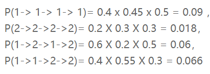

但是得到的最优的状态转换路径是1->1->1->1，为什么呢？因为状态2可以转换的状态比状态1要多，从而使转移概率降低,即MEMM倾向于选择拥有更少转移的状态。

3. 问题原因分析

对于MEMM公式：


求和的作用在概率中是归一化，但是这里归一化放在了指数内部，管这叫local归一化。 来了，viterbi求解过程，是用dp的状态转移公式（MEMM的没展开，请参考CRF下面的公式），因为是局部归一化，所以MEMM的viterbi的转移公式的第二部分出现了问题，导致dp无法正确的递归到全局的最优。

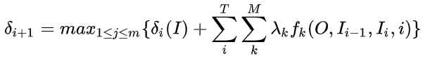

### 条件随机场（CRF）

#### 定义

给定 $X=(x_1,x_2,...,x_n)$ ，$Y=(y_1,y_2,...,y_n)$ 均为线性链表示的随机变量序列，若在给随机变量序列 X 的条件下，随机变量序列 Y 的条件概率分布 $P(Y|X)$ 构成条件随机场，即满足马尔可夫性：

$$
    P(y_i|x_1,x_2,...,x_{i-1},y_1,y_2,...,y_{i-1},y_{i+1})
       = P(y_i|x,y_{i-1},y_{i+1})
$$

则称为 P(Y|X) 为线性链条件随机场。

通过去除了隐马尔科夫算法中的观测状态相互独立假设，使算法在计算当前隐状态$x_i$时，会考虑整个观测序列，从而获得更高的表达能力，并进行全局归一化解决标注偏置问题。

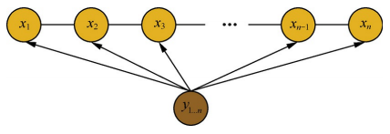

##### 参数化形式

$$
p\left(y | x\right)=\frac{1}{Z\left(x\right)} \prod_{i=1}^{n} \exp \left(\sum_{i, k} \lambda_{k} t_{k}\left(y_{i-1}, y_{i}, x, i\right)+\sum_{i, l} \mu_{l} s_{l}\left(y_{i}, x, i\right)\right)
$$

其中：

> $Z(x)$ 为归一化因子，是在全局范围进行归一化，枚举了整个隐状态序列$x_{1…n}$的全部可能，从而解决了局部归一化带来的标注偏置问题。

$$
Z(x)=\sum_{y} \exp \left(\sum_{i, k} \lambda_{x} t_{k}\left(y_{i-1}, y_{i}, x, i\right)+\sum_{i, l} \mu_{l} s_{l}\left(y_{i}, x, i\right)\right)
$$

> $t_k$ 为定义在边上的特征函数，转移特征，依赖于前一个和当前位置

> $s_1$ 为定义在节点上的特征函数，状态特征，依赖于当前位置。

##### 简化形式

因为条件随机场中同一特征在各个位置都有定义，所以可以对同一个特征在各个位置求和，将局部特征函数转化为一个全局特征函数，这样就可以将条件随机场写成权值向量和特征向量的内积形式，即条件随机场的简化形式。

###### step 1

将转移特征和状态特征及其权值用统一的符号表示，设有k1个转移特征，$k_2$个状态特征，$K=k_1+k_2$,记

 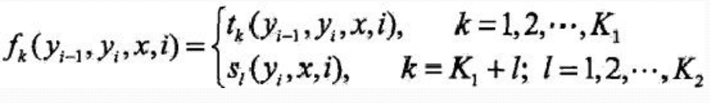

###### step 2

对转移与状态特征在各个位置i求和，记作

 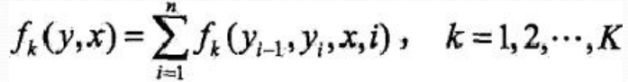

###### step 3

将 $\lambda_{x}$ 和 $\mu_{l}$ 用统一的权重表示，记作

 

###### step 4

转化后的条件随机场可表示为：

 

###### step 5

若 $w$ 表示权重向量：

$$
    w = (w_1,w_2,...,w_K)^T
$$

以 $F(y,x)$ 表示特征向量，即

 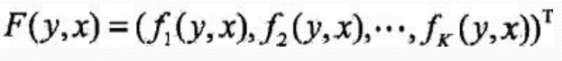

则，条件随机场写成内积形式为：

  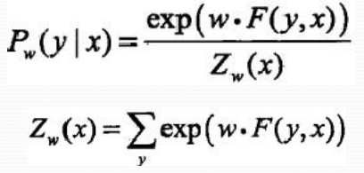

#### 基本问题

条件随机场包含概率计算问题、学习问题和预测问题三个问题。

> 1. 概率计算问题：已知模型的所有参数，计算观测序列 $Y$ 出现的概率，常用方法：前向和后向算法；

> 2. 学习问题：已知观测序列 $Y$，求解使得该观测序列概率最大的模型参数，包括隐状态序列、隐状态间的转移概率分布和从隐状态到观测状态的概率分布，常用方法：Baum-Wehch 算法；

> 3. 预测问题：一直模型所有参数和观测序列 $Y$ ，计算最可能的隐状态序列 $X$,常用算法：维特比算法。

##### 概率计算问题

> 给定条件随机场$P(Y|X)$，输入序列 $x$ 和 输出序列 $y$;

> 计算条件概率

$$
    P(Y_i=y_i|x), P(Y_{i-1} = y_{i-1},Y_i = y_i|x)
$$

> 计算相应的数学期望问题；

###### 前向-后向算法

###### step 1 前向计算

对观测序列 $x$ 的每个位置 $i=1,2,...,n+1$ ，定义一个 $m$ 阶矩阵（$m$ 为标记$Y_i$取值的个数）

 

对每个指标 $i=0,1,...,n+1$，定义前向向量 $\alpha_{i}(x)$，则递推公式:


其中，

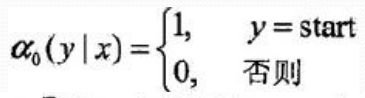
 
 

###### step 2 后向计算

对每个指标 $i=0,1,...,n+1$，定义前向向量 $\beta_{i}(x)$，则递推公式:

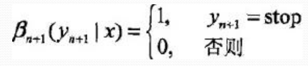
 


###### step 3

 

###### step 4 概率计算

所以，标注序列在位置 $i$ 是标注 $y_i$ 的条件概率为：


 


其中，

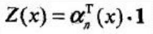

###### step 5 期望值计算

通过利用前向-后向向量，计算特征函数关于联合概率分布 $P(X,Y)$ 和 条件概率分布 $P(Y|X)$ 的数学期望，即特征函数 $f_k$ 关于条件概率分布 $P(Y|X)$ 的数学期望：


其中：


##### 学习问题

这里主要介绍一下 BFGS 算法的思路。


   输入：特征函数 $f_1,f_2,...,f_n$：经验分布 $\widetilde{P}(X,Y)$；
   
   输出：最优参数值 $\widehat{w}$，最优模型$P_{\widehat{w}}(y|x)$。
   
   1. 选定初始点 w^{(0)}， 取 $B_0$ 为正定对称矩阵，k = 0;
   2. 计算 $g_k = g(w^(k))$，若 $g_k = 0$ ，则停止计算，否则转 (3) ；
   3. 利用 $B_k p_k = -g_k$ 计算 $p_k$；
   4. 一维搜索：求 $\lambda_k$使得
   
    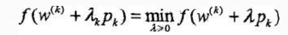
   
   1. 设 $w^{(k+1)} = w^{(k)} + \lambda_k * p_k$
   2. 计算 $g_{k+1}$ = g(w^{(k+1)}),
   
       若 $g_k = 0$， 则停止计算；否则，利用下面公式计算 $B_{k+1}$:
       
       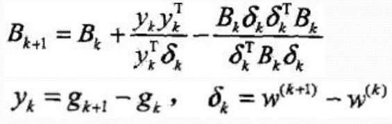
       
   3. 令 $k=k+1$，转步骤（3）；

##### 预测问题

对于预测问题，常用的方法是维特比算法，其思路如下：

输入：模型特征向量 $F(y,x)$ 和权重向量 $w$，输入序列（观测序列） $x={x_1,x_2,...,x_n}$；

输出：条件概率最大的输出序列（标记序列）$y^{*}= (y_1^*,y_2^*,...,y_n^*)$，也就是最优路径；

1. 初始化


  
2. 递推，对$i=2,3,...,n$


3. 终止

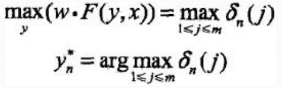

4. 返回路径


求得最优路径 $y^{*}= (y_1^*,y_2^*,...,y_n^*)$

###### 例子说明

利用维特比算法计算给定输入序列$x$ 对应的最优输出序列$y^*$：


1. 初始化


  
2. 递推，对$i=2,3,...,n$


3. 终止

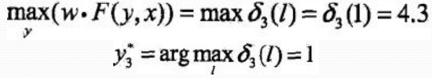

1. 返回路径

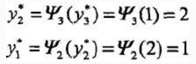


求得最优路径 $y^{*}= (y_1^*,y_2^*,...,y_n^*) = (1,2,1)$

```python
  import numpy as np
 
class CRF(object):
    '''实现条件随机场预测问题的维特比算法
    '''
    def __init__(self, V, VW, E, EW):
        '''
        :param V:是定义在节点上的特征函数，称为状态特征
        :param VW:是V对应的权值
        :param E:是定义在边上的特征函数，称为转移特征
        :param EW:是E对应的权值
        '''
        self.V  = V  #点分布表
        self.VW = VW #点权值表
        self.E  = E  #边分布表
        self.EW = EW #边权值表
        self.D  = [] #Delta表，最大非规范化概率的局部状态路径概率
        self.P  = [] #Psi表，当前状态和最优前导状态的索引表s
        self.BP = [] #BestPath，最优路径
        return 
        
    def Viterbi(self):
        '''
        条件随机场预测问题的维特比算法，此算法一定要结合CRF参数化形式对应的状态路径图来理解，更容易理解.
        '''
        self.D = np.full(shape=(np.shape(self.V)), fill_value=.0)
        self.P = np.full(shape=(np.shape(self.V)), fill_value=.0)
        for i in range(np.shape(self.V)[0]):
            #初始化
            if 0 == i:
                self.D[i] = np.multiply(self.V[i], self.VW[i])
                self.P[i] = np.array([0, 0])
                print('self.V[%d]='%i, self.V[i], 'self.VW[%d]='%i, self.VW[i], 'self.D[%d]='%i, self.D[i])
                print('self.P:', self.P)
                pass
            #递推求解布局最优状态路径
            else:
                for y in range(np.shape(self.V)[1]): #delta[i][y=1,2...]
                    for l in range(np.shape(self.V)[1]): #V[i-1][l=1,2...]
                        delta = 0.0
                        delta += self.D[i-1, l]                      #前导状态的最优状态路径的概率
                        delta += self.E[i-1][l,y]*self.EW[i-1][l,y]  #前导状态到当前状体的转移概率
                        delta += self.V[i,y]*self.VW[i,y]            #当前状态的概率
                        print('(x%d,y=%d)-->(x%d,y=%d):%.2f + %.2f + %.2f='%(i-1, l, i, y, \
                              self.D[i-1, l], \
                              self.E[i-1][l,y]*self.EW[i-1][l,y], \
                              self.V[i,y]*self.VW[i,y]), delta)
                        if 0 == l or delta > self.D[i, y]:
                            self.D[i, y] = delta
                            self.P[i, y] = l
                    print('self.D[x%d,y=%d]=%.2f\n'%(i, y, self.D[i,y]))
        print('self.Delta:\n', self.D)
        print('self.Psi:\n', self.P)
        
        #返回，得到所有的最优前导状态
        N = np.shape(self.V)[0]
        self.BP = np.full(shape=(N,), fill_value=0.0)
        t_range = -1 * np.array(sorted(-1*np.arange(N)))
        for t in t_range:
            if N-1 == t:#得到最优状态
                self.BP[t] = np.argmax(self.D[-1])
            else: #得到最优前导状态
                self.BP[t] = self.P[t+1, int(self.BP[t+1])]
        
        #最优状态路径表现在存储的是状态的下标，我们执行存储值+1转换成示例中的状态值
        #也可以不用转换，只要你能理解，self.BP中存储的0是状态1就可以~~~~
        self.BP += 1
        
        print('最优状态路径为：', self.BP)
        return self.BP
        
def CRF_manual():   
    S = np.array([[1,1],   #X1:S(Y1=1), S(Y1=2)
                  [1,1],   #X2:S(Y2=1), S(Y2=2)
                  [1,1]])  #X3:S(Y3=1), S(Y3=1)
    SW = np.array([[1.0, 0.5], #X1:SW(Y1=1), SW(Y1=2)
                   [0.8, 0.5], #X2:SW(Y2=1), SW(Y2=2)
                   [0.8, 0.5]])#X3:SW(Y3=1), SW(Y3=1)
    E = np.array([[[1, 1],  #Edge:Y1=1--->(Y2=1, Y2=2)
                   [1, 0]], #Edge:Y1=2--->(Y2=1, Y2=2)
                  [[0, 1],  #Edge:Y2=1--->(Y3=1, Y3=2) 
                   [1, 1]]])#Edge:Y2=2--->(Y3=1, Y3=2)
    EW= np.array([[[0.6, 1],  #EdgeW:Y1=1--->(Y2=1, Y2=2)
                   [1, 0.0]], #EdgeW:Y1=2--->(Y2=1, Y2=2)
                  [[0.0, 1],  #EdgeW:Y2=1--->(Y3=1, Y3=2)
                   [1, 0.2]]])#EdgeW:Y2=2--->(Y3=1, Y3=2)
    
    crf = CRF(S, SW, E, EW)
    ret = crf.Viterbi()
    print('最优状态路径为:', ret)
    return
    
if __name__=='__main__':
    CRF_manual()

```


## CRF vs LSTM vs HMM

- LSTM
  - 优点
    - 在序列任务中，能够 capture 长远的上下文信息；
    - 具有神经网络的拟合非线性的能力；
  - 缺点
    - $y_t$ 与 $y_{t}'$ 相互独立（point wise）
      - 解释：因为对于 $t$ 时刻，输出层 $y_t$ 仅受隐层 $h_{t}$ (包含上下文信息)和输入层$x_t$（当前输入）的影响；通过去概率最大的标注作为$y_t$，与$y_{t}'$无关；
  - 数据规模大时，有优势
- CRF
  - 优点
    - 考虑的是整个句子的局部特征的线性加权组合（通过特征模版去扫描整个句子）
      - 解释：CRF的模型为$p(y|x, w)$，注意这里y和x都是序列，它有点像list wise，优化的是一个序列$y = (y_1, y_2, …, y_n)$，而不是某个时刻的y_t，即找到一个概率最高的序列$y = (y_1, y_2, …, y_n)$使得$p(y_1, y_2, …, y_n| x, w)$最高，它计算的是一种联合概率，优化的是整个序列（最终目标），而不是将每个时刻的最优拼接起来，在这一点上CRF要优于LSTM。
  - 缺点
    - 无法考虑长远的上下文信息；
    - 不具有神经网络的拟合非线性的能力；
  - 数据规模小时，有优势

- HMM
  - CRF不管是在实践还是理论上都要优于HMM，HMM模型的参数主要是“初始的状态分布”，“状态之间的概率转移矩阵”，“状态到观测的概率转移矩阵”，这些信息在CRF中都可以有，例如：在特征模版中考虑$h(y1), f(y_i-1, y_i), g(y_i, x_i)$等特征。

## CNN-CRF vs BILSTM-CRF

- CNN-CRF
  - 应用：处理英文序列标注问题
    - 原因：英文单词是由更细粒度的字母组成，这些字母潜藏着一些特征（例如：前缀后缀特征），通过CNN的卷积操作提取这些特征
- BILSTM-CRF
  - 应用：处理英文序列标注问题
    - 原因：以字为单位，无法分解


## 参考资料

1. [条件随机场CRF](https://zhuanlan.zhihu.com/p/29989121)
2. [朴素贝叶斯(NB)、逻辑回归(LR)、隐马尔科夫模型(HMM)、条件随机场(CRF)](https://blog.csdn.net/u013010889/article/details/81148809)
3. [学习笔记：条件随机场（CRF）](https://hit-computer.github.io/2017/06/10/CRF/)
4. [如何轻松愉快地理解条件随机场（CRF）？](https://www.jianshu.com/p/55755fc649b1)
5. [概率图模型体系：HMM、MEMM、CRF](https://zhuanlan.zhihu.com/p/33397147)
6. [CRF 视频介绍](https://b23.tv/BV19t411R7QU/p1)