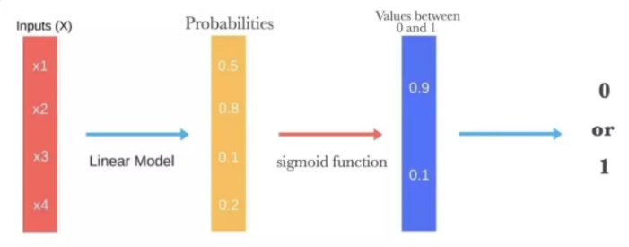

# 【关于 Logistic Regression 】那些你不知道的事

> 作者：杨夕
> 
> 项目地址：https://github.com/km1994/nlp_paper_study
> 
> 个人介绍：大佬们好，我叫杨夕，该项目主要是本人在研读顶会论文和复现经典论文过程中，所见、所思、所想、所闻，可能存在一些理解错误，希望大佬们多多指正。
> 

## 目录

- [【关于 Logistic Regression 】那些你不知道的事](#关于-logistic-regression-那些你不知道的事)
  - [目录](#目录)
  - [Logistic Regression 是 什么？](#logistic-regression-是-什么)
  - [Logistic Regression 的 动机?](#logistic-regression-的-动机)
  - [Logistic Regression 的 工作原理？](#logistic-regression-的-工作原理)
  - [sigmoid 函数 是什么?](#sigmoid-函数-是什么)
  - [Logistic Regression 的 计算公式？](#logistic-regression-的-计算公式)
  - [Logistic Regression 的 相关内容？](#logistic-regression-的-相关内容)
  - [Logistic Regression 推导？](#logistic-regression-推导)
  - [Logistic Regression 的优点？](#logistic-regression-的优点)
  - [Logistic Regression 的缺点？](#logistic-regression-的缺点)

## Logistic Regression 是 什么？

- 介绍： Logistic Regression 是 一种 处理 **二分类问题** 的 线性模型

## Logistic Regression 的 动机?

- 动机：连续的线性函数不适合处理 分类问题

## Logistic Regression 的 工作原理？

- 首先通过使用其固有的 logistic 函数估计概率，来衡量因变量（我们想要预测的标签）与一个或多个自变量（特征）之间的关系。
- 然后这些概率必须二值化才能真地进行预测

线性回归 +  sigmoid = 逻辑回归

## sigmoid 函数 是什么?

## Logistic Regression 的 计算公式？

## Logistic Regression 的 相关内容？

- 损失函数：交叉熵
- 优化方式：梯度下降法

## Logistic Regression 推导？

- Step 1： 得到概率函数

- Step 2： 因为样本数据(m个)独立，所以它们的联合分布可以表示为各边际分布的乘积,取似然函数为：

- Step 3： 取对数似然函数

- Step 4： 最大似然估计就是要求得使 l(θ)取最大值时的θ ，这里可以使用梯度上升法求解。我们稍微变换一下

- Step 5： 损失函数的梯度计算方法

## Logistic Regression 的优点？

- 实现简单，广泛的应用于工业问题上
- 分类时计算量非常小，速度很快，存储资源低；
- 便利的观测样本概率分数；
- 对逻辑回归而言，多重共线性并不是问题，它可以结合L2正则化来解决该问题；
- 计算代价不高，易于理解和实现；

## Logistic Regression 的缺点？

- 当特征空间很大时，逻辑回归的性能不是很好；
- 容易欠拟合，一般准确度不太高
- 不能很好地处理大量多类特征或变量；
- 只能处理两分类问题（在此基础上衍生出来的softmax可以用于多分类），且必须线性可分；
- 对于非线性特征，需要进行转换；

