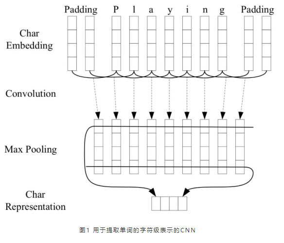
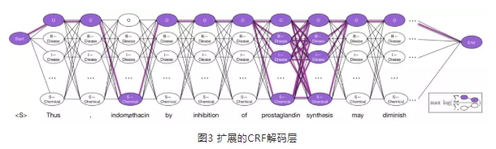
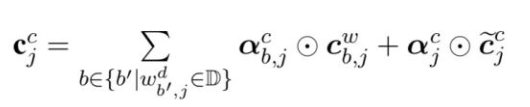
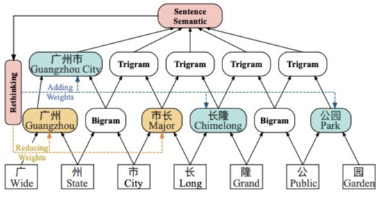
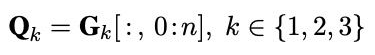
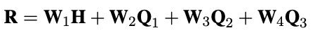
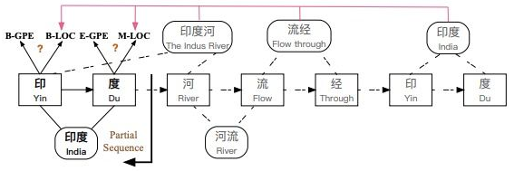
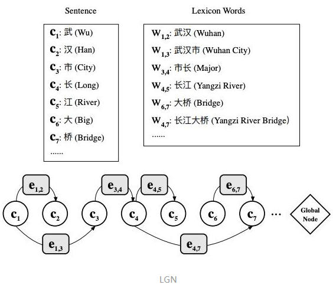
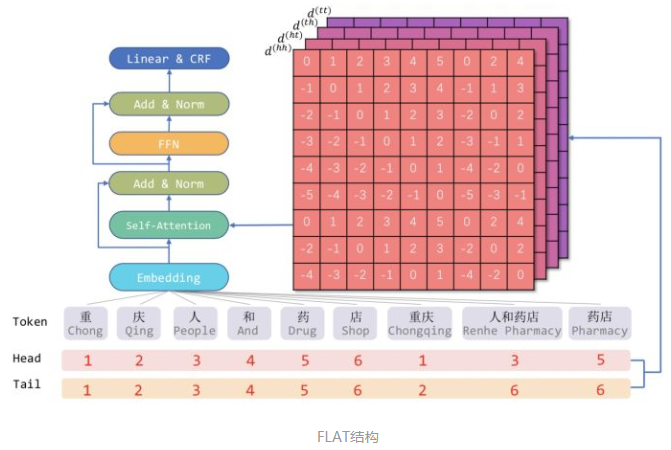
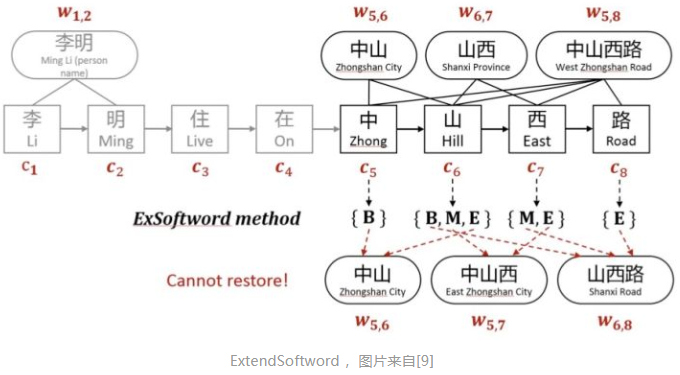

# 命名实体识别

## 一、命名实体识别研究进展概述

命名实体识别任务旨在从自然语言文本中识别具有特定意义的实体，如人名、地名、组织名等。在自然语言处理（Natural Language Processing, NLP）中，命名实体识别通常是自然语言理解的第一步，它的结果被用于许多后续的NLP任务，如实体链接（Entity linking）、关系抽取（Relation extraction）和句法分析（Syntactic parsing）等，因此，命名实体识别任务的效果好坏就至关重要了。举例来讲，如果命名实体识别任务从“南京市长江大桥于1968年12月29日建成通车”这句话中错误地识别出职务名——“南京市长”和人名——“江大桥”，而不是正确地识别出地名——“南京市”和桥名——“长江大桥”，则后续基于错误识别结果的NLP任务也无法得到期望的结果。

命名实体识别任务往往被看作语言序列标注（Linguistic sequence labeling）任务。传统的序列标注任务多使用线性模型，如隐马尔可夫模型（Hidden Markov Models, HMM）和条件随机场（Conditional Random Fields, CRF），并且依赖专家知识（Task-specific knowledge）和人工提取特征（Hand-crafted features）。近年来随着机器算力的增长和深度学习算法的发展，命名实体识别任务利用分布式表示学习方法和非线性的神经网络构建了端到端的模型，从而在无专家知识和人工提取特征的基础上实现了更好的效果。进一步的，针对命名实体识别现阶段面临的各类问题，近期的研究工作相应地对模型做了精细化的调整，也提出了一些新颖的想法。下文将首先介绍现阶段命名实体识别的基本套路，接着在此基础上介绍一些新的、有意思的探索，最后是个人的一点体会。

## 二、 基本套路

现阶段主流的命名实体识别的基本套路可以总结为“三板斧”：单词的字符级表示、（双向）LSTM编码和CRF解码。代表性工作是2016年发表在ACL的工作[1]。

首先，在对句子中的单词进行向量表示的时候，除了常用的词嵌入向量（word embedding），文章还利用CNN来学习每个单词字符级别的特征，如图1所示。

将单词“playing”的各字符嵌入向量作为CNN的输入，经过卷积和池化后，得到单词“playing”的字符级表示。通过这种方式，文章认为可以学习到单词的词法特征，如单词的前缀、后缀等特征。

接着，文章使用双向LSTM作为编码层，学习每个单词在句子中上下文的特征，如图2所示。

将每个单词的词嵌入向量和字符级表示向量拼接之后作为编码层的输入，通过双向LSTM为每个单词得到两个（前向和后向）隐藏层向量表示，将这两个隐藏层向量拼接后作为解码层——CRF的输入。

最后，文章选用CRF作为解码层的原因是，CRF会考虑相邻label间的关系，而不是独立地将每个单词解码成label，例如，在词性标注任务中，“形容词”后更可能跟一个“名词”而不是“动词”，或者是在利用BIOES（Begin, Inside, Other, End & Single）标注模式的实体识别任务中，“I-ORG”不可能紧跟在“I-PER”后。从而能够为一个给定的文本序列解码出一个最好的label链。

## 三、 新的探索

随着深度学习的发展，命名实体识别任务也有了一些新的探索，包括解决标注数据规模和模型参数量不匹配的问题、文本中命名实体嵌套的问题、中文分词对实体识别的影响问题和模型的并行化问题等等，本章节主要就前两个问题及相关工作做进一步叙述。

### 3.1 标注数据不足

随着模型的愈发精细复杂，需要训练的参数日益庞大，但其训练所需的人工标注数据却因为标注成本的问题难以得到相应地增长。为解决这个问题，一个常用的方法是使用远程监督的方法来得到大量的远程监督标注数据，但由于用于远程监督的知识库规模有限，大量的实体存在于文本中而未出现在知识库中，导致在远程监督时，将这些未出现在知识库中的实体标注为非实体，从而产生大量的假负例，这即是远程监督标注数据带来的有限覆盖问题（Limited Coverage）。除此之外，另外一种思路是通过优化模型，限制参数量，从而使得模型能够在较小的标注数据集上也能够完成训练。

#### 3.1.1 有限覆盖问题

为了缓解有限覆盖问题对模型训练的影响，Shang J等人在2018年的工作中提出了两种方式。首先是利用最先进的短语挖掘方法在文本中挖掘出“高质量短语”，然后在利用知识库远程监督标注时，将文本中未出现在知识库中的“高质量短语”标注为“Unknow”。这样标注数据除了实体类别和非实体以外，还多了“Unknown”类别。随着标签的扩展，上一章中提到的基本套路中的CRF解码层就需要做相应改变，如图3所示。

基于BIOES序列标注模式进行实体标注，句子中每个单词的标签是“位置-实体类别”的形式，于是，每个单词有5*实体类别数量个可能的标签（图3中的每一列）。在传统的数据标注上，CRF解码层是从图中所有的路径中找出最大可能性的“一条”路径进行解码标注，即每列找出一个最可能的标签。而增加了“Unknow”类别后，文章认为“Unknown”类别即意味着其单词可能是任意的标签（图3中“prostaglandin”和“synthesis”对应的两列），则CRF解码层需要从图中所有路径中找出最大可能性的“一簇”路径进行解码标注。

进一步的为了缓解有限覆盖问题带了的负面影响，文章提出了第二种方法——“Tie or Break”序列标注模式。不同于传统的标准的BIO2标注模式，“Tie or Break”不再直接对文本中的单词进行标注，而是对文本中相邻单词的关系进行标注。其规则如下，

1. 相邻的两个单词出现在同一个（知识库）实体中，这两个单词间的关系标注为“Tie”；

2. 相邻的两个单词中但凡有一个出现在Unknown类型的“高质量短语”中，这两个单词间的关系标注为“Unknown”；

3. 其它情况，标注为“Break”。

这种标注模式有两点好处，其一，当文本中的短语在远程监督时被知识库中的实体部分匹配或者错误匹配时，这些短语内单词间的Tie关系是正确的不受影响的；其二，在远程监督标注时，文本中的单词极容易被知识库中unigram entity即由单独单词组成的实体错误地标注成假正例。而使用“Tie or Break”序列标注模式，无论一个单词时真正的unigram entity或者是假正例，它与两边的单词间的关系都是“Break”，由此减少了假正例对模型的影响。为了匹配这种新的标注模式，文章提出了一种新的命名实体识别模型——AutoNER，如图4所示。

自下而上，我们依然能看到单词的字符级别表示和双向LSTM编码，虽然与上一章提到的具体方法有所差异，但其思想基本是一致的，我们重点关注在LSTM编码层之后的解码层。在这个模型中，文章没有继续使用CRF而是分为两步去做解码：第一步，使用双向LSTM表示出单词间关系的隐藏层向量表示后，然后使用一个二分类器区分“Break”和“Tie”，不对“Unknown”做判断；第二步，将第一步预测出的两个相邻“Break”之间的短语视为一个待预测的候选实体，用单词的隐藏层向量综合表示该短语，然后输入到一个多分类器中。

#### 3.1.2 领域敏感特征

为了使得模型能在较小的标注数据集上完成训练，2018年Liu L等人发表在AAAI上的工作[3]提出了一种可行的思路。文章提出了一种LM-LSTM-CRF模型，通过模型的名称，我们就可以看出在该模型的编码层和解码层应当和第一章提到的主流方法相同，文章的主要贡献在单词的字符级表示，准确来讲，文章的主要贡献在对字符级别的特征的挑选。文章认为，单词字符级的特征虽然在已有的工作中被证明有效，但其是在大规模预料上经过预训练得到，包含了大量领域无关的特征，这些领域无关的特征需要更多的数据、更大的模型来训练更长的时间。而本文利用多任务学习提取共享特征的思路，以及语言模型（Neural Language Model）可以学习领域敏感特征的特性，使用语言模型从文本的大量特征中只提取领域相关的特征用于序列标注模型的训练，屏蔽掉了大量的任务无关特征，从而使得序列标注模型可以用少量的参数达到较好的效果，具体模型如图5所示。

图中使用了双向LSTM提取字符级别的特征，而隐藏层向量却是用于两个任务：序列标注（主要任务）和语言模型（辅助任务）。其中，序列标注任务不再赘述，语言模型就是利用已知序列预测下一个单词是什么，在该模型中，利用单词的前一个隐藏层输出来表示该单词，如前向LSTM中用“Pierre”前一个字符的隐藏层向量来表示“Pierre”，然后进行Softmax分类操作。并且由于这两个任务是不相关的（相关的任务如实体识别和关系抽取），所以文章中在字符级别的LSTM后特意使用了highway层，将隐层向量映射到两个不同的向量空间，各自完成不同的任务。

#### 3.2 命名实体嵌套

实体嵌套是指在一句文本中出现的实体，存在某个较短实体完全包含在另外一个较长实体内部的情况，如“南京市长”中地名“南京”就嵌套在职务名“南京市长”中。而传统的命名实体识别任务关注的都是平坦实体（Flat entities），即文本中的实体之间不交叉、不嵌套。为了解决嵌套命名实体识别的问题，近年来的研究做了不同的尝试，本文就我了解的几篇工作作简要的介绍，希望能对大家有所启发。

首先，第一篇是Ju M等人于2018年发表在NAACL上的工作[4]，该工作提出一种层模型，其思路其实非常简单，就是对文本一遍一遍的识别，直到识别不出实体为止。具体就是将前面提到的LSTM+CRF看作一个平坦命名实体识别层（flat NER layer），通过动态的堆叠flat NER layer，自内而外的一层一层的识别嵌套实体（先识别inner entities，再识别outer entities），直到flat NER layer识别不出实体，停止堆叠，模型如图6所示。

自下而上，在第一个flat NER layer内，文章把每个token经过双向LSTM后对应的隐藏层表示输入到CRF中，用于识别最内层实体（most inner entities），然后将构成每个最内层实体的单词的隐藏层向量相加并平均来表示最内层实体，然后将其看作一个新的“单词”，替换组成最内层实体的所有单词，然后和其他被识别为Other的单词组成新的序列输入到下一个flat NER layer中，重复以上内容，直到某个flat NER layer将其输入的token都标记为Other后结束堆叠。作者认为通过这样的方式不但可以将嵌套的实体识别出来，还能考虑到inner entities和其outer entities之间的关系。

接着，第二篇是Sohrab M G等人于2018年发表在EMNLP上的工作[5]，该工作的主要内容集中在解码层，单词的字符级表示和双向LSTM编码层与前面的工作大同小异。如图7所示，在解码层，文章不再使用CRF，而是使用一个可变长的滑动窗口在编码层输出的隐藏层向量序列上滑动，枚举出所有可能的片段作为候选实体，然后利用隐藏层向量表示这些候选实体，最后分别通过Softmax进行分类。虽然试验结果不错，但我认为这种穷举的方法比较适合于序列长度较短的情况，因为一方面它忽略了标签间的相关性，另一方面当序列长度较长的情况下，穷举法会得到大量的负样本，使得正负样本不均衡，影响模型效果。

最后，同样是一篇来自2018年EMNLP的工作[6]，不同于前面两篇工作对平坦命名实体识别主流方法的修修改改，本文的核心思想是将文本进行一定的转化之后，实现对嵌套实体的平坦访问（顺序访问）。

首先，如图8所示，作者将嵌套实体表示成一棵句法成分树，文本中的多个嵌套实体便被表示成一个森林。其中，树的叶子节点是文本中的token，而非叶子节点便是实体类别，这样实体的嵌套关系便被表示成了树中非叶子节点的父子关系。

同时自底向上构建句法成分树的过程中，便实现了嵌套实体平坦访问，即构建树的过程中，用非叶子节点的构建动作对应了相应的实体类别，而这些动作是顺序的，不存在嵌套关系。而森林的构建过程是由多个树的顺序构建过程组成，其被放入一个栈中。如图9所示，

构建动作的执行是由系统的当前状态决定的，系统的当前状态包含栈的状态，文本序列的剩余部分，构建动作的历史。这样，以系统状态作为输入，当前状态应执行的动作为输出，即可完成模型的训练。

具体而言，文章首先定义了三类动作：SHIFT，REDUCE-X和UNARY-X，其中X是指实体类别，属于一个预定义的类别集合。SHIFT操作是指将文本序列中的当前单词入栈；REDUCE-X是给栈顶的两个元素出栈，并给他们设置一个共同父节点X，然后将这个树元素入栈；UNARY-X则是将栈顶元素出栈，为其设置一个父节点X，然后将这个新的树元素入栈。定义好动作之后即得到了模型的输出（label），而其输入——系统的状态，则分三部分表示：

1. 栈的向量化表示使用了stack LSTM模型，在传统的LSTM上加入了栈顶指针，用栈顶指针所指向的unit的隐藏层输出来表示栈的状态；

2. 文本序列的剩余部分则通过一个后向的LSTM建模，使用顺序第一个单词的隐藏层输出表示文本序列的剩余部分的状态；

3. 历史构建动作则通过一个前向的LSTM进行学习，最近一次动作的隐藏层输出表示历史动作的状态。

将这三种状态的向量表示拼接起来表示系统状态，作为Softmax的输入。

## 四、中文 NER 技术的探索

> 引用文章：[中文NER的正确打开方式: 词汇增强方法总结 (从Lattice LSTM到FLAT)](https://zhuanlan.zhihu.com/p/142615620)
> 作者：[JayLou娄杰【知乎专栏《高能NLP》作者】](https://zhuanlan.zhihu.com/p/142615620)
> github: [DeepIE: Deep Learning for Information Extraction](https://github.com/loujie0822/DeepIE)

### 4.1 前言

和英文 NER 每个单词都使用空格分隔不同，中文 NER 是基于字的表示方法，所以一般会涉及到中文分词和中文NER技术，导致 中文 NER 技术容易受到中文分词的误差的影响。

所以在早期的中文NER技术中，基于字符的 NER 方法往往具有高于 基于词汇（分词后）的方法，为了提高 基于词汇方法的效果，一般会采取引入词汇信息（词汇增强）的方法。

这一节，我们主要对「词汇增强」的系列方法进行介绍，这些方法包括：

- Lattice LSTM
- LR-CNN
- CGN
- LGN
- WC-LSTM
- Multi-digraph
- Simple-Lexicon
- FLAT

通过从以下几方面讲解：

1. 为什么说 「词汇增强」 方法对于中文 NER 任务有效；
2. 「词汇增强」 的方法有哪些；
   1. Dynamic Architecture
   2. Adaptive Embedding
3. 总结与对比：关键结果分析

### 4.2 为什么说 「词汇增强」 方法对于中文 NER 任务有效

虽然**基于字符的NER系统通常好于基于词汇（经过分词）的方法**，但**基于字符的NER没有利用词汇信息**，而**词汇边界对于实体边界通常起着至关重要的作用**。

**如何在基于字符的NER系统中引入词汇信息**，是近年来NER的一个研究重点。本文将这种引入词汇的方法称之为「词汇增强」，以表达引入词汇信息可以增强NER性能。

从另一个角度看，**由于NER标注数据资源的稀缺，BERT等预训练语言模型在一些NER任务上表现不佳。特别是在一些中文NER任务上，词汇增强的方法会好于或逼近BERT的性能**。因此，关注「词汇增强」方法在中文NER任务很有必要。

### 4.3 「词汇增强」 的方法有哪些

#### 4.3.1 引言

近年来，基于词汇增强的中文NER主要分为2条主线[9]：

- Dynamic Architecture：设计一个动态框架，能够兼容词汇输入；
- Adaptive Embedding ：基于词汇信息，构建自适应Embedding；

本文按照上述2条主线，将近年来各大顶会的相关论文归纳如下：

#### 4.3.2 Dynamic Architecture 范式

> Dynamic Architecture范式通常需要设计相应结构以融入词汇信息。

##### [1] [Lattice LSTM：Chinese NER Using Lattice LSTM（ACL2018）](https://arxiv.org/abs/1805.02023) 

###### 方法介绍

本文是基于词汇增强方法的中文NER的开篇之作，提出了一种Lattice LSTM以融合词汇信息。

具体地，当我们通过词汇信息（词典）匹配一个句子时，可以获得一个类似Lattice的结构。

Lattice是一个有向无环图，词汇的开始和结束字符决定了其位置。Lattice LSTM结构则融合了词汇信息到原生的LSTM中：

如上图所示，Lattice LSTM引入了一个word cell结构，对于当前的字符，融合以该字符结束的所有word信息，如对于「桥」融合了「长江大桥」和「大桥」的信息。对于每一个字符，Lattice LSTM采取注意力机制去融合个数可变的word cell单元，其主要的数学形式化表达为：

本文不再堆砌繁杂的数学公式，具体看参考原论文。需要指出的是，当前字符有词汇融入时，则采取上述公式进行计算；如当前字符没有词汇时，则采取原生的LSTM进行计算。当有词汇信息时，Lattice LSTM并没有利用前一时刻的记忆向量 $c^c_{j-1}$，即不保留对词汇信息的持续记忆。

###### 存在问题

Lattice LSTM 的提出，将词汇信息引入，有效提升了NER性能；但其也存在一些缺点：

- 计算性能低下，不能batch并行化。究其原因主要是每个字符之间的增加word cell（看作节点）数目不一致；
- 信息损失：
  - 1）每个字符只能获取以它为结尾的词汇信息，对于其之前的词汇信息也没有持续记忆。如对于「大」，并无法获得‘inside’的「长江大桥」信息。
  - 2）由于RNN特性，采取BiLSTM时其前向和后向的词汇信息不能共享。
- 可迁移性差：只适配于LSTM，不具备向其他网络迁移的特性。

##### [2] [LR-CNN:CNN-Based Chinese NER with Lexicon Rethinking(IJCAI2019)](https://pdfs.semanticscholar.org/1698/d96c6fffee9ec969e07a58bab62cb4836614.pdf)

###### 动机

Lattice LSTM 存在问题：
- 采取RNN结构，导致其**不能充分利用GPU进行并行化**；
- Lattice LSTM **无法有效处理词汇信息冲突问题**

如上图所示：字符 [长] 可以匹配到词汇 [市长] 和 [长隆]，不同的匹配会导致 [长] 得到不同的标签，而对于 RNN 结构：仅仅依靠前一步的信息输入、而不是利用全局信息，无法有效处理这一冲突问题。显而易见，对于中文NER，这种冲突问题很常见，在不参考整个句子上下文和高层信息的前提下很难有效解决。

###### 思路

本篇论文LR-CNN为解决这一问题，提出了Lexicon-Based CNNs和Refining Networks with Lexicon Rethinking。

- Lexicon-Based CNNs：采取CNN对字符特征进行编码，感受野大小为2提取bi-gram特征，堆叠多层获得multi-gram信息；同时采取注意力机制融入词汇信息（word embed）；
- Refining Networks with Lexicon Rethinking：由于上述提到的词汇信息冲突问题，**LR-CNN采取rethinking机制增加feedback layer来调整词汇信息的权值**：具体地，将高层特征作为输入通过注意力模块调节每一层词汇特征分布。如上图，高层特征得到的 [广州市] 和 [长隆]会降低 [市长] 在输出特征中的权重分布。最终对每一个字符位置提取对应的调整词汇信息分布后的multi-gram特征，喂入CRF中解码。

###### 优缺点

- 优点
  - LR-CNN最终相比于Lattice LSTM加速3.21倍

- 缺点
  - LR-CNN仍然计算复杂；
  - 不具备可迁移性

##### [3] [CGN: Leverage Lexical Knowledge for Chinese Named Entity Recognition via Collaborative Graph Network（ EMNLP2019）](https://www.aclweb.org/anthology/D19-1396.pdf)

###### 动机

由于Lattice LSTM存在信息损失，特别是无法获得‘inside’的词汇信息。

###### 思路

针对这一问题，本篇论文构建了基于协作的图网络，由编码层、图网络层、融合层、解码层组成。在图网络层，构建了三种不同的建图方式：

- Word-Character Containing graph (C-graph)：字与字之间无连接，词与其inside的字之间有连接。
- Word-Character Transition graph(T-graph)：相邻字符相连接，词与其前后字符连接。
- Word-Character Lattice graph(L-graph)：相邻字符相连接，词与其开始结束字符相连。

图网络层通过Graph Attention Network(GAN)进行特征提取，提取3种图网络中的前n个字符节点的特征：

特征融合则将基于字符的上下文表征H与图网络表征加权融合：

涉及GAN的相关计算公式可参考原论文。

##### [4] [LGN: A Lexicon-Based Graph Neural Network for Chinese NER(EMNLP2019)](https://www.aclweb.org/anthology/D19-1096.pdf)

###### 动机

本篇论文与LR-CNN出发点类似，**Lattice LSTM这种RNN结构仅仅依靠前一步的信息输入，而不是利用全局信息**，如上图所示：字符 [流]可以匹配到词汇 [河流] 和 [流经]两个词汇信息，但Lattice LSTM却只能利用 [河流] ；字符 [度]只能看到前序信息，不能充分利用 [印度河] 信息，从而造成标注冲突问题。

###### 思路

本篇论文通过采取 lexicon-based graph neural network (LGN)来解决上述问题。如上图所示，将每一个字符作为节点，匹配到的词汇信息构成边。通过图结构实现局部信息的聚合，并增加全局节点进行全局信息融入。聚合方式采取Multi-Head Attention，具体计算公式可参考原论文。

##### [5] [FLAT: Chinese NER Using Flat-Lattice Transformer（ACL2020）](https://arxiv.org/pdf/2004.11795.pdf)

###### 动机

1. 动机一：Lattice-LSTM 和 LR-CNN 问题
   1. 这些模型采取的RNN和CNN结构无法捕捉长距离依赖；
   2. 动态的Lattice结构也不能充分进行GPU并行；
2. 动机二：CGN 和 LGN 问题
   1. 采取的图网络虽然可以捕捉对于NER任务至关重要的顺序结构，但这两者之间的gap是不可忽略的；
   2. 这类图网络通常需要RNN作为底层编码器来捕捉顺序性，通常需要复杂的模型结构

###### 思路

众所周知，Transformer采取全连接的自注意力机制可以很好捕捉长距离依赖，由于自注意力机制对位置是无偏的，因此Transformer引入位置向量来保持位置信息。受到位置向量表征的启发，这篇论文提出的FLAT设计了一种巧妙position encoding来融合Lattice 结构，具体地，如上图所示，对于每一个字符和词汇都构建两个head position encoding 和 tail position encoding，可以证明，这种方式可以重构原有的Lattice结构。也正是由于此，FLAT可以直接建模字符与所有匹配的词汇信息间的交互，例如，字符[药]可以匹配词汇[人和药店]和[药店]。

因此，我们可以将Lattice结构展平，将其从一个有向无环图展平为一个平面的Flat-Lattice Transformer结构，由多个span构成：每个字符的head和tail是相同的，每个词汇的head和tail是skipped的。

在知乎专栏文章《[如何解决Transformer在NER任务中效果不佳的问题？](https://zhuanlan.zhihu.com/p/137315695)》，我们介绍了对于Tranformer结构，绝对位置编码并不适用于NER任务。因此，FLAT这篇论文采取XLNet论文中提出相对位置编码计算attention score：

论文提出四种相对距离表示 $x_i$ 和 $x_j$ 之间的关系，同时也考虑字符和词汇之间的关系：

$d^{(hh)}_{ij}$ 表示 $x_i$ 的head到 $x_j$ 的head距离，其余类似。相对位置encoding为：

$p_d$的计算方式与vanilla Transformer相同。

综上，FLAT采取这种全连接自注意力结构，可以直接字符与其所匹配词汇间的交互，同时捕捉长距离依赖。如果将字符与词汇间的attention进行masked，性能下降明显，可见引入词汇信息对于中文NER 的重要性。此外，相关实验表明，FLAT有效的原因是：新的相对位置encoding有利于定位实体span，而引入词汇的word embedding有利于实体type的分类。

#### 4.3.2 Adaptive Embedding 范式

> Adaptive Embedding范式仅在embedding层对于词汇信息进行自适应，后面通常接入LSTM+CRF和其他通用网络，这种范式与模型无关，具备可迁移性。

##### [6] [WC-LSTM: An Encoding Strategy Based Word-Character LSTM for Chinese NER Lattice LSTM（NAACL2019）](https://pdfs.semanticscholar.org/43d7/4cd04fb22bbe61d650861766528e369e08cc.pdf%3F_ga%3D2.158312058.1142019791.1590478401-1756505226.1584453795)

###### 引言

**Lattice LSTM中每个字符只能获取以它为结尾的词汇数量是动态的、不固定**的，这也是导致Lattice LSTM**不能batch并行化**的原因。

###### 思路

WC-LSTM为改进这一问题，采取** Words Encoding Strategy**，**将每个字符为结尾的词汇信息进行固定编码表示**，即每一个字符引入的词汇表征是静态的、固定的，如果没有对应的词汇则用<PAD>代替，从而可以进行batch并行化。

这四种 encoding 策略分别为：最短词汇信息、最长词汇信息、average、self-attenion。以「average」为例：即将当前字符引入所有相关的词汇信息对应的词向量进行平均。

###### 存在问题

WC-LSTM仍然**存在信息损失问题**，无法获得‘inside’的词汇信息，不能充分利用词汇信息。虽然是Adaptive Embedding范式，但WC-LSTM仍然采取LSTM进行编码，建模能力有限、存在效率问题。

##### [7] [Multi-digraph: A Neural Multi-digraph Model for Chinese NER with Gazetteers（ACL2019）](https://www.aclweb.org/anthology/P19-1141.pdf)

###### 引言

之前介绍的论文通过利用一个词表来引入词汇信息（由论文Lattice LSTM 提供，没有实体标签，通常需要提取对应的word embedding）。

本篇论文引入词汇信息的方式是利用实体词典（Gazetteers，含实体类型标签）。

###### 思路

虽然引入实体词典等有关知识信息对NER性能可能会有所帮助，但实体词典可能会包含不相关甚至错误的信息，这会损害系统的性能。如上图所示，利用4个实体词典：「PER1」、「PER2」、「LOC1」、「LOC2」进行匹配，错误实体就有2个。

为了更好的利用词典信息，本文提出了一种多图结构更好地显示建模字符和词典的交互。如上图所示，结合自适应的Gated Graph Sequence Neural Networks (GGNN)和LSTM+CRF，基于上下文信息对来自不同词典的信息进行加权融合，解决词典匹配冲突的问题。

具体地，本文通过图结构建模Gazetteers信息，关键在于怎么融入不同词典的信息。上述图结构中「边」的label信息即包含字符间的连接信息，也包含来自不同m个Gazetteers的实体匹配信息，共有L个label：

而传统的GGNN不能处理带有不同label信息的「边」，为了能够处理上述的多图结构，本文将邻接矩阵A扩展为包括不同标签的边，对边的每一个label分配相应的可训练参数：

上述图结构的隐状态采用GRU更新，具体更新方式可参考原论文。最后，将基于GGNN提取字符所对应的特征表示喂入LSTM+CRF中。

##### [8] [Simple-Lexicon：Simplify the Usage of Lexicon in Chinese NER（ACL2020）](https://arxiv.org/pdf/1908.05969.pdf)

###### 引言

由上述分析可以发现Lattice LSTM只适配于LSTM，不具备向其他网络迁移的特性，同样Lattice LSTM存在的信息损失也不容小觑。

###### 思路

本篇论文为避免设计复杂的模型结构、同时为便于迁移到其他序列标注框架，提出了一种在embedding层简单利用词汇的方法。本文先后对比了三种不同的融合词汇的方式：

**第一种：Softword**

如上图所示，Softword通过中文分词模型后，对每一个字符进行BMESO的embedding嵌入。显而易见，这种Softword方式存在由分词造成的误差传播问题，同时也无法引入词汇对应word embedding。

**第二种：ExtendSoftword**

ExtendSoftword则将所有可能匹配到的词汇结果对字符进行编码表示。如上图中，对于字符「山」来说，其可匹配到的词汇有中山、中山西、山西路，「山」隶属 {B,M,E}。论文对于字符对应的词汇信息按照BMESO编码构建5维二元向量，如「山」表示为[1,1,1,0,0].

ExtendSoftword也会存在一些问题：1）仍然无法引入词汇对应的word embedding；2）也会造成信息损失，无法恢复词汇匹配结果，例如，假设有两个词汇列表[中山，山西，中山西路]和[中山，中山西，山西路]，按照ExtendSoftword方式，两个词汇列表对应字符匹配结果是一致的；换句话说，当前ExtendSoftword匹配结果无法复原原始的词汇信息是怎样的，从而导致信息损失。

**第三种：Soft-lexicon**

为了解决Softword和ExtendSoftword存在的问题，Soft-lexicon对当前字符，依次获取BMES对应所有词汇集合，然后再进行编码表示。

为了解决Softword和ExtendSoftword存在的问题，Soft-lexicon对当前字符，依次获取BMES对应所有词汇集合，然后再进行编码表示。

由上图可以看出，对于字符[语]，其标签B对应的词汇集合涵盖[语言，语言学]；标签M对应[中国语言]；标签E对应[国语、中国语]；标签S对应[语]。当前字符引入词汇信息后的特征表示为：

很容易理解，上述公式则将BMES对应的词汇编码 $v^s$ 与字符编码 $x^c$ 进行拼接。$v^s$表示当前标签（BMES）下对应的词汇集合编码，其计算方式为：

$S$ 为词汇集合， $z(w)$ 代表词频。考虑计算复杂度，本文没有采取动态加权方法，而采取如同上式的静态加权方法，即：对词汇集合中的词汇对应的word embedding通过其词频大小进行加权。词频根据训练集和测试集可离线统计。

综上可见，Soft-lexicon这种方法没有造成信息损失，同时又可以引入word embedding，此外，本方法的一个特点就是模型无关，可以适配于其他序列标注框架。

### 4.4 总结

通过第二部分对于「词汇增强」方法主要论文的介绍，我们可以发现无论是Dynamic Architecture还是Adaptive Embedding，都是想**如何更好的融入词汇信息**。这些方法的出发点无外于两点：
- 1）如何更充分的利用词汇信息、最大程度避免词汇信息损失；
- 2）如何设计更为兼容词汇的Architecture，加快推断速度。

下面对于上述「词汇增强」方法进行汇总：

ACL2020中的两篇论文FLAT和Simple-Lexicon分别对应于Dynamic Architecture和Adaptive Embedding，这两种方法相比于其他方法：
- 1）能够充分利用词汇信息，避免信息损失；
- 2）FLAT不去设计或改变原生编码结构，设计巧妙的位置向量就融合了词汇信息；Simple-Lexicon对于词汇信息的引入更加简单有效，采取静态加权的方法可以提前离线计算。

最后，我们来看一下，上述各种「词汇增强」方法在中文NER任务上的性能：

上图可以发现：总的来看，ACL2020中的FLAT和Simple-Lexicon效果最佳。具体地说：

1. 引入词汇信息的方法，都相较于baseline模型biLSTM+CRF有较大提升，可见引入词汇信息可以有效提升中文NER性能。
2. 采用相同词表对比时，FLAT和Simple-Lexicon好于其他方法。
3. 结合BERT效果会更佳。

除了上述中文NER任务，笔者还在医疗NER任务（CCKS2019）上进行了简单实验：

同样也可以发现，词汇增强可有效提升中文NER性能。

而在推断速度方面，FLAT论文也与其他方法进行了对比，在指标领先的同时推断速度明显优于其他方法。

## 五、常用数据集

### 5.1 字向量

1. Character embeddings (gigaword_chn.all.a2b.uni.ite50.vec): [Google Drive](https://drive.google.com/file/d/1_Zlf0OAZKVdydk7loUpkzD2KPEotUE8u/view?usp=sharing) or [Baidu Pan](https://pan.baidu.com/s/1pLO6T9D)

### 5.2 词向量

1. Word(Lattice) embeddings (ctb.50d.vec): [Google Drive](https://drive.google.com/file/d/1K_lG3FlXTgOOf8aQ4brR9g3R40qi1Chv/view?usp=sharing) or [Baidu Pan](https://pan.baidu.com/s/1pLO6T9D)

### 5.3 语料库

 1. [OntoNotes](https://catalog.ldc.upenn.edu/LDC2011T03)
 2. [MSRA](http://sighan.cs.uchicago.edu/bakeoff2006/)
 3. [Weibo](https://github.com/hltcoe/golden-horse)
 4. [Resume](https://github.com/jiesutd/LatticeLSTM/tree/master/ResumeNER)

## 总结

科研有时候是使用新技术解决旧问题，而同时，新技术的使用也会带来新的问题，这一点在命名实体识别领域让我感触尤为深刻。一方面，得益于深度学习的发展，命名实体识别模型实现了更好的效果，对各种细节问题也有了精细化的建模；而另一方面，深度学习技术也带来了一些问题，比如标注数据同参数规模不匹配的问题，精细模型并行化程度不高的问题等。

针对命名实体识别领域的研究现状，本文首先介绍了该领域的主要任务和主流方法，并在此基础上，就近年来的最新进展挑选了两个有意思的问题和相关探索进行了介绍。此外还有中文分词对命名实体识别的影响，以及模型并行话程度不高等问题，由于篇幅所限，这里未作介绍，感兴趣的话可以查看[7][8]两篇工作。

## 参考文献

[1] Ma X, Hovy E H. End-to-end Sequence Labeling via Bi-directional LSTM-CNNs-CRF[J]. meeting of the association for computational linguistics, 2016: 1064-1074.

[2] Shang J, Liu L, Ren X, et al. Learning Named Entity Tagger using Domain-Specific Dictionary[J]. arXiv preprint arXiv:1809.03599, 2018.

[3] Liu L, Shang J, Ren X, et al. Empower sequence labeling with task-aware neural language model[C]//Thirty-Second AAAI Conference on Artificial Intelligence. 2018.

[4] Ju M, Miwa M, Ananiadou S. A neural layered model for nested named entity recognition[C]//Proceedings of the 2018 Conference of the North American Chapter of the Association for Computational Linguistics: Human Language Technologies, Volume 1 (Long Papers). 2018, 1: 1446-1459.

[5] Sohrab M G, Miwa M. Deep Exhaustive Model for Nested Named Entity Recognition[C]//Proceedings of the 2018 Conference on Empirical Methods in Natural Language Processing. 2018: 2843-2849.

[6] Wang B, Lu W, Wang Y, et al. A neural transition-based model for nested mention recognition[J]. arXiv preprint arXiv:1810.01808, 2018.

[7] Zhang Y, Yang J. Chinese NER Using Lattice LSTM[J]. meeting of the association for computational linguistics, 2018: 1554-1564.

[8] Strubell E, Verga P, Belanger D, et al. Fast and Accurate Entity Recognition with Iterated Dilated Convolutions[J]. empirical methods in natural language processing, 2017: 2670-2680.
