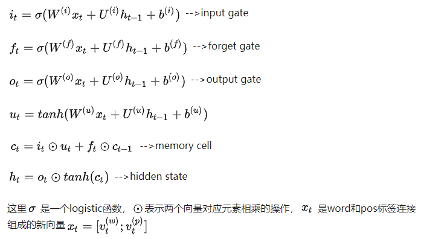

# End-to-End Relation Extraction using LSTMs on Sequences and Tree Structures

## 摘要

We present a novel end-to-end neural model to extract entities and relations between them. Our recurrent neural network based model captures both word sequence and dependency tree substructure information by stacking bidirectional tree structured LSTM-RNNs on bidirectional sequential LSTM-RNNs. (论文提出了一种端到端的神经网络模型，用于抽取实体和实体间的关系。该方法同时考虑了句子的词序信息和依存句法树的子结构信息，这两部分信息都是利用双向序列LSTM-RNN建模，并将两个模型堆叠起来，使得关系抽取的过程中可以利用实体相关的信息。)

This allows our model to jointly represent both entities and relations with shared parameters in a single model. We further encourage detection of entities during training and use of entity information in relation extraction via entity pretraining and scheduled sampling. (这使我们的模型可以在单个模型中共同表示实体和具有共享参数的关系。 我们进一步在训练中检测实体，并通过 entity-pretrain 和 scheduled sampling 在关系提取中使用实体信息。)

Our model improves over the state-of-the-art feature-based model on end-to-end relation extraction, achieving 12.1% and 5.7% relative error reductions in F1- score on ACE2005 and ACE2004, respectively. We also show that our LSTM-RNN based model compares favorably to the state-of-the-art CNN based model (in F1-score) on nominal relation classification (SemEval-2010 Task 8). Finally, we present an extensive ablation analysis of several model components.

实验结果表明：

1）词序和依存树的结构对关系抽取非常有用；

2）共享实体发现的参数对于关系抽取是有效的，特别是加入了entity pretrain、scheduled sampling和label embeding等优化之后；

3）常用于关系分类的“最短路径”结构在Tree-Structural LSTM-RNN的表示方面也非常有效。

## 论文方法描述

总体上来说，论文所述模型包括三个类型的表示层：第一类是嵌入层，用于表示word、part-of-speech tag、dependency type和entity label；第二类是序列层，用于表示word sequence，这一层是一个双向LSTM-RNN；第三类是依存层，在依存树上表示两个目标词（实体）之间的关系。该神经网络模型的结构如图1所示。

### 嵌入层

嵌入层包含：词emb(RNN的输入)、pos emb(RNN的输入)、entity emb(sequence层的输出) 和 dependency emb(dependency 层的输入)

### sequence层

sequence层主要描述句子的上下文信息和实体，通过一个双向LSTM-RNN表示句子序列信息，双向LSTM-RNN的单元包括以下信息：

### 实体发现层

本质上实体检测任务是一个序列标注任务，文中实体的tag采用BILOU（Begin，Inside，Last，Outside和Unit）编码模式，每个tag表示entity的类型和一个词在entity中的位置。实体发现任务通过两个神经网络层实现：隐藏层$$h_{t}^{(e)}$$和softmax输出层。

在解码过程中，会利用一个已经预测的词标签去预测下一个词的标签。其输入是sequence层的输出和上一个label的embeding结果的连接。

### Dependency层

Dependency层用于描述依存树中一对目标词的关系，这一层主要关注这对目标词在依存树上的最短路径。文中采用了双向树结构的LSTM-RNN来抓住目标词对周围的依存结构，信息可以从根节点传到叶节点，也可从叶节点传到跟节点。对于需要利用页节点附近的argument节点的关系分类任务来说，双向信息传递可以取得更好的效果。Tai 2015也采用了tree-structural的LSTM-RNN，但他们的方法限定类型子节点的数目必须固定。

作者提出了tree-structural LSTM-RNN的变种，对于类型相同的子节点共享相同的权重$U_S$，并且允许子节点的数目是可变的。对于有$C(t)$子节点的LSTM单元，其定义如下：

这里$m(·)$是一个类型映射函数。三种表示目标词对的结构：1）SPTree（最短路径结构)；2）SubTree（最近公共祖先）；3）Full-Tree（整棵依存树）
one node type:采用SPTree
two node types：采用subTree和SPTree

###  在sequence层上添加Dependency层

###  关系分类

## 参考资料

1. [论文阅读笔记--End-to-End Relation Extraction using LSTMs on Sequences and Tree Structures](https://zhuanlan.zhihu.com/p/26381714)
2. [知识图谱4-【再看一篇论文《End-to-End Relation Extraction using LSTMs on Sequences and Tree Structures》】](https://blog.csdn.net/qq_21460525/article/details/74918242)