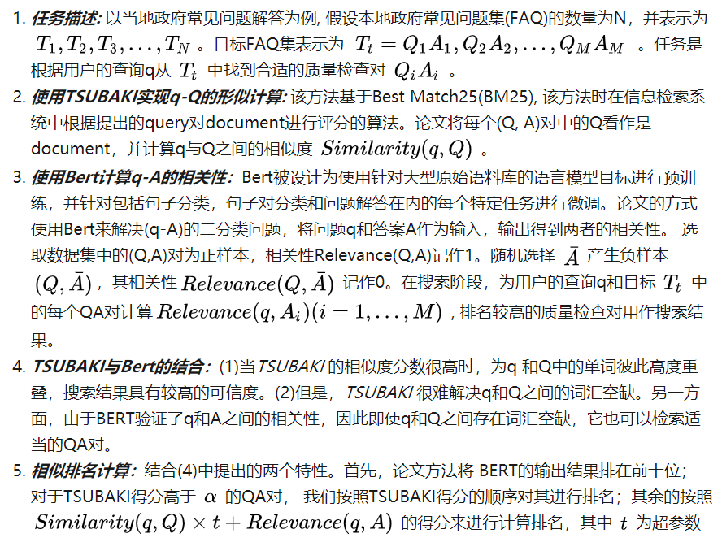

# FAQ retrieval using query-question similarity and BERT-based query-answer relevance

> 作者：杨夕
> 
> 项目地址：https://github.com/km1994/nlp_paper_study
> 
> 个人介绍：大佬们好，我叫杨夕，该项目主要是本人在研读顶会论文和复现经典论文过程中，所见、所思、所想、所闻，可能存在一些理解错误，希望大佬们多多指正。

## 前言

FAQ是一种常见任务检索的任务，其目标是根据用户的查询从数据库中检索适当的问答(QA)。该文章提出了一种FAQ检索系统，它们的的方法考虑了用户查询(q)和常见问题(Q)之间的相似性以及查询问题(q)和答案(A)之间的相关性。

许多 FAQ检索模型使用q和QA对之间具有相关性标签的数据集。但是，构造这样的标记数据花费很多。为了解决这个问题，论文采用了一种无监督的方法来计算查询和问题之间的相似度。 另一方面，可以通过在FAQ数据库中使用QA对来计算查询(q)和答案(A)之间的相关性，这显示了给定q的FAQ答案的合理性。

## 方法介绍

## 参考

1. [查询问题相似与基于Bert的qA相关---FAQ问答系统(笔记)](https://zhuanlan.zhihu.com/p/197990040)