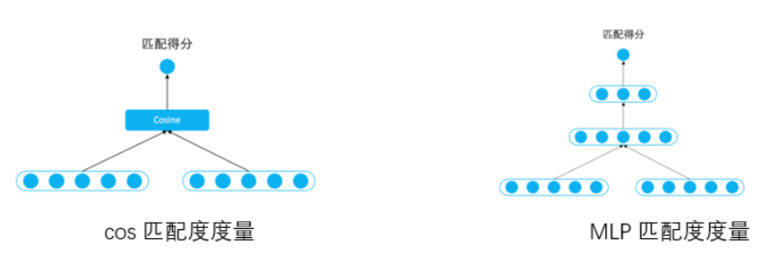

# 【FAQ 检索式问答系统】 那些你不知道的事

> 作者：杨夕
> 
> 项目地址：https://github.com/km1994/nlp_paper_study
> 
> 个人介绍：大佬们好，我叫杨夕，该项目主要是本人在研读顶会论文和复现经典论文过程中，所见、所思、所想、所闻，可能存在一些理解错误，希望大佬们多多指正。

## 目录

1. FAQ 检索式问答系统的动机？
2. 问答系统 是什么？
3. FAQ 检索式问答系统 是 什么？
4. 什么是 文本匹配？
5. query 匹配标准 QA 的核心是什么?
6. FAQ 检索式问答系统 准备工作?
7. FAQ 检索式问答系统 流程？
 
## 内容

### FAQ 检索式问答系统的动机？

- 场景：假设 你有 一个 标准的问题库，此时 有一个 新 query 进来。

- 灵魂三连问：
  - 如何根据 这个 query，你怎么返回一个标准答案呢？
  - 如何从 问题库 里面找 答案？
  - 如何 判断 你 找到 答案 是 对的？

### 问答系统 是什么？

- 介绍：信息检索的一种高级形式，能够更加准确地理解用户用自然语言提出的问题，并通过检索语料库、知识图谱或问答知识库返回简洁、准确的匹配答案；
- 目标对象：用户输入的 query 和 答案；
- 领域类型分类：
  - 面向限定域的问答系统；
  - 面向开放域的问答系统；
  - 面向常用问题集的问答系统；
- 根据答案来源分类：
  - 基于结构化数据的问答系统（eg：KBQA）；
  - 基于文本的问答系统（eg：阅读理解）;
  - 基于问答对的问答系统（eg：FAQ）;
- 答案的反馈机制分类：
  - 基于检索式的问答系统；
  - 基于生成式的问答系统；

### FAQ 检索式问答系统 是 什么？

- 名称：（Frequently asked Questions），是检索式问答系统
- 目标：给定 标准问题库，匹配与用户输入 query 最相近的问题并返回答案；
- 流程：
  - 分析 用户输入 的 query;
  - 计算 与 query 最相近 的 标准问题；
  - 做 Rank，并 取 Top1 的 标准问题；
  - 返回 Top1 的 标准问题的答案；

### 什么是 文本匹配？

- 介绍：计算 文本间相似度；
- 分类：
  - 基于句子级别的相似度模型；
  - 基于词级别的相似度模型；
- 相似度计算方法：
  - cos() 余弦相似度；
  - 皮尔逊相似度；

### query 匹配标准 QA 的核心是什么?

- 核心组成
  - 用户输入 的 query 和 标准问题 的 的相似度；
    - 常用方法：
      - 关键字匹配；
      - TF-idf 相似度计算；
  - 用户输入 的 query 和 标准答案 的 匹配度；
    - 常用方法：
      - DL 模型 相似度计算；
      - Bert 句向量 语义相似度计算；

### FAQ  方案

- 方案一：QA 做匹配:拿输入Query 与候选的所有Answer 去做匹配，去找哪一个最合适
- 方案二：QQ 做匹配：拿输入Query与历史语料库里的Query去找哪一个最相似，然后把找到的query对应的Answer取出即可；【常用】

### 为什么 QQ 匹配比较常用？

#### 原因 1：语义空间

- 介绍：**问题和问题的语义空间是一致的，而问题与回答的语义空间可能是不一致的。**这个很好理解，问题都是用户方说的自然语言，其说话的出发点和形式是一样的，所以其学习的空间也是同一个空间。而回答基本都是公司的产品经理、业务运营、客服经理等等制订和编辑的，所以在语义空间上就与用户的问题有着明显的不同。而这个语义空间的不一致性会极大影响算法的选择与学习。
- 举例：
  - 深度学习方法：句子相似度典型算法中以两侧向量相似度为目标和损失函数的孪生网络算法（Siamese network系列）就需要两边的语义空间一样，两边抽取特征的网络结构和参数也是共享的。而其他任务的匹配算法，如推理SLI任务往往就不是参数共享的，且往往需要额外的一个交互映射层来完成两边句子表示的语义映射关系。
  - 传统手工特征：那么句法树的解析出的中心节点是否相同，两句子的编辑距离大小，两句子的关键词overlap情况，这些特征在相似问题判断时会有更好的体现，且具有很高的可解释性（比如编辑距离越小，越可能是同一个意思）。而QA Match 在特征抽取上就会受限很多。

#### 原因 2：语料的稳定性

- 动机：问题遵循一个固定的状态，而回答容易随着业务的发展发生变化，所以采用 QQ 效果更好

#### 原因3：业务回答与算法模型的解耦

- 介绍：把问题与回答分离，只对问题建模，可以将算法模型的学习与业务方编辑的答案充分解耦，让不同问题与回答之间的映射比较随意可控；

#### 原因4：新问题发现与去重

- 介绍：FAQ的系统在构建好后，并不会是一成不变的，因为公司的业务需要也还是在不断发生变化和增长，用户会有新的频繁需要询问的问题，或者其实有些问题跟已有的问题其实是一致的，或者历史上配置的问题其实是不必要的。

#### 原因5：上线运行速度

- 动机：如果使用QA Match的话，如果FAQ语料库的候选很大，即A有很多的话，那么在线上预测的时候，就会存在一个问题，进来的问题需要和那么多的A分别去做Match，（假设有1000条A，那么就需要执行QA Match模型1000次）虽然可以使用Batch机制来批量match，但始终整体的计算资源消耗和计算速度是比较大的。
- 做法：如果使用问题与问题相似的思路，那么就可以提前把历史文本语料索引在Elastic search这样的搜索引擎中，或者可以把相似模型对于问题的建模稠密向量用Faiss或者annoy工具索引起来。当来了一个新问题的时候，就通过索引去搜索召回出历史语料中比较粗粒度的最相似TopK（这个时候TopK就可以降低到10或者20）问题即可，然后再用精细化的耗时的复杂语义模型去进一步匹配，就可以节约很多的计算资源和提高速度。

### FAQ 解决方案

#### FAQ 一般处理流程

1. 问答对数据集的清洗
2. Embedding
3. 模型训练
4. 计算文本相似度
5. 在问答库中选出与输入问题相似度最高的问题
6. 返回相似度最高的问题所对应的答案

#### 实现方法

- 基于ES的智能问题系统：通过关键词匹配获取答案，类似电商、新闻搜索领域关键词召回；
- 基于TF-IDF方式：计算每个单词的tfidf数值，分词后换算句子表示。 TF-IDF 方式也在用在关键词提取
- 基于Doc2Vec 模型：考虑词和段，相比于word2vec来说有了段落信息；
- 基于深度学习 模型：通过深度学习语言模型bert 提取向量，然后计算相似度
- 以图搜索（resnet 图片向量化表示）
- 新闻领域文本相似推荐（相似新闻推荐等）
- 基于文本语义匹配检索系统（文本相似性rank ）

#### 核心介绍

1. 文本等通过某种方式进行向量化表示（word2vec、doc2vec、elmo、bert等）；
2. 然后把这种特征向量进行索引（faiss/Milus) ；
3. 最终实现在线服务系统的检索，然后再通过一定的规则进行过滤，获取最终的数据内容

#### 问题分析

##### 传统文本匹配方法存在问题

- 方法：BoW、VSM、TF-IDF、BM25、Jaccord、SimHash等算法；
- 针对问题：解决字面相似度问题；
- 存在问题：由 于中文含义的丰富性，通常很难直接根据关键字匹配或者基于机器学习的浅层模型来确定两个句子之间的语义相似度；

##### 深度学习文本匹配

- 优点：
  - 能够节省人工提取特征的大量人力物力；
  - 从大量的样本中自动提取出词语之间的关系，并能结合短语匹配中的结构信息和文本匹配的层次化特性，发掘传统模型很难发掘的隐含在大量数据中含义不明显的特征；
- 深度语义匹配模型：
  - representation-based method 和 interaction-based method
- representation-based method
  - 步骤：
    - 首先将待匹配的两个对象通过深度学习模型进行表示；
    - 之后计算这两个表示之间的相似度便可输出两个对象的匹配度。
  - 针对匹配度函数f(x,y)的计算通常有两种方法: cosine 函数 和 多层感知器网络（MLP）
    - cosine 函数：通过相似度度量函数进行计算，实际使用过程中最常用的就是 cosine 函数，这种方式简单高效，并且得分区间可控意义明确
    - 多层感知器网络（MLP）：将两个向量再接一个多层感知器网络（MLP），通过数据去训练拟合出一个匹配度得分，更加灵活拟合能力更强，但对训练的要求也更高

### FAQ 检索式问答系统 准备工作?

1. 标准 QA 库读取；
2. 标准 QA 文本 预处理；
3. 构建 倒排表；
4. 构建 归一表；
5. 构建 纠错表；
6. 文本表示；
7. 文本相似度计算；
8. 训练意图分类模型

### FAQ 检索式问答系统 流程？

1. 用户输入 query；
2. 利用 归一表 对 query 进行 归一处理；
3. 利用 纠错表 对 query 进行 纠错处理；
4. 文本预处理；
5. 文本表示；
6. 利用 意图分类模型 进行分类，确定 query 意图；
7. 利用 倒排表 做 粗排；
8. 利用 TF-idf、ngram+TF-idf、bert 计算相似度，做 精排；

## 参考

1. [相似问答检索——汽车之家的 Milvus 实践](https://zhuanlan.zhihu.com/p/212184561)
2. [基于检索式的问答系统](https://zhuanlan.zhihu.com/p/89621843)
3. [FAQ检索式问答系统及文本匹配计算](https://zhuanlan.zhihu.com/p/79698318)
4. [QA问答系统(Question Answering)](https://zhuanlan.zhihu.com/p/61914325)
5. [FAQ检索式问答系统及文本匹配计算](https://zhuanlan.zhihu.com/p/79698318)
6. [自然语言处理（NLP）：24基于文本语义的智能问答系统](https://blog.csdn.net/shenfuli/article/details/107823959)