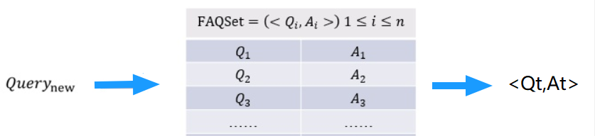

# 【关于 FAQ 检索式问答系统】 那些的你不知道的事

> 作者：杨夕
> 
> 论文链接：https://arxiv.org/pdf/1810.04805.pdf
> 
> 本文链接：https://github.com/km1994/nlp_paper_study
> 
> 个人介绍：大佬们好，我叫杨夕，该项目主要是本人在研读顶会论文和复现经典论文过程中，所见、所思、所想、所闻，可能存在一些理解错误，希望大佬们多多指正。
> 
> 【注：手机阅读可能图片打不开！！！】

## 目录

- [【关于 FAQ 检索式问答系统】 那些的你不知道的事](#关于-faq-检索式问答系统-那些的你不知道的事)
  - [目录](#目录)
  - [一、动机](#一动机)
    - [1.1 问答系统的动机？](#11-问答系统的动机)
    - [1.2 问答系统 是什么？](#12-问答系统-是什么)
  - [二、FAQ 检索式问答系统介绍篇](#二faq-检索式问答系统介绍篇)
    - [2.1 FAQ 检索式问答系统 是 什么？](#21-faq-检索式问答系统-是-什么)
    - [2.2 query 匹配标准 QA 的核心是什么?](#22-query-匹配标准-qa-的核心是什么)
  - [三、FAQ 检索式问答系统 方案篇](#三faq-检索式问答系统-方案篇)
    - [3.1 常用 方案有哪些？](#31-常用-方案有哪些)
    - [3.2 为什么 QQ 匹配比较常用？](#32-为什么-qq-匹配比较常用)
      - [3.2.1 QQ 匹配的优点有哪些？](#321-qq-匹配的优点有哪些)
      - [3.2.2 QQ 匹配的语义空间是什么？](#322-qq-匹配的语义空间是什么)
      - [3.2.3 QQ 匹配的语料的稳定性是什么？](#323-qq-匹配的语料的稳定性是什么)
      - [3.2.4 QQ 匹配的业务回答与算法模型的解耦是什么？](#324-qq-匹配的业务回答与算法模型的解耦是什么)
      - [3.2.5 QQ 匹配的新问题发现与去重是什么？](#325-qq-匹配的新问题发现与去重是什么)
      - [3.2.6 QQ 匹配的上线运行速度是什么？](#326-qq-匹配的上线运行速度是什么)
    - [3.3  QQ 匹配一般处理流程是怎么样？ 【假设 标准问题库 已处理好】](#33--qq-匹配一般处理流程是怎么样-假设-标准问题库-已处理好)
- [四、FAQ 标准问题库构建篇](#四faq-标准问题库构建篇)
    - [4.1 如何发现 FAQ 中标准问题？](#41-如何发现-faq-中标准问题)
    - [4.2 FAQ 如何做拆分？](#42-faq-如何做拆分)
    - [4.3 FAQ 如何做合并？](#43-faq-如何做合并)
    - [4.4 FAQ 标准库如何实时更新？](#44-faq-标准库如何实时更新)
  - [五、FAQ 标准问题库答案优化篇](#五faq-标准问题库答案优化篇)
    - [5.1 FAQ 标准问题库答案如何优化？](#51-faq-标准问题库答案如何优化)
  - [参考](#参考)

## 一、动机

### 1.1 问答系统的动机？

- 场景：假设 你有 一个 标准的问题库，此时 有一个 新 query 进来，你会做什么操作？

- 灵魂三连问：
  - 如何根据 这个 query，你怎么返回一个标准答案呢？
  - 如何从 问题库 里面找 答案？
  - 如何 判断 你 找到 答案 是 对的？

### 1.2 问答系统 是什么？

- 介绍：问答系统是信息检索的一种高级形式，能够更加准确地理解用户用自然语言提出的问题，并通过检索语料库、知识图谱或问答知识库返回简洁、准确的匹配答案。相较于搜索引擎，问答系统能更好地理解用户提问的真实意图, 进一步能更有效地满足用户的信息需求。
- 目标对象：用户输入的 query 和 答案；
- 领域类型分类：
  - 面向限定域的问答系统；
  - 面向开放域的问答系统；
  - 面向常用问题集的问答系统；
- 根据答案来源分类：
  - 基于结构化数据的问答系统（eg：KBQA）；
  - 基于文本的问答系统（eg：阅读理解）;
  - 基于问答对的问答系统（eg：FAQ）;
- 答案的反馈机制分类：
  - 基于检索式的问答系统；
  - 基于生成式的问答系统；

## 二、FAQ 检索式问答系统介绍篇

### 2.1 FAQ 检索式问答系统 是 什么？

- 名称：（Frequently asked Questions），是检索式问答系统
- 目标：给定 标准问题库，匹配与用户输入 query 最相近的问题并返回答案；
- 流程：
  - 分析 用户输入 的 query;
  - 计算 与 query 最相近 的 标准问题；
  - 做 Rank，并 取 Top1 的 标准问题；
  - 返回 Top1 的 标准问题的答案；

### 2.2 query 匹配标准 QA 的核心是什么?

- 核心组成
  - 用户输入 的 query 和 标准问题 的 的相似度；
    - 常用方法：
      - 关键字匹配；
      - TF-idf 相似度计算；
  - 用户输入 的 query 和 标准答案 的 匹配度；
    - 常用方法：
      - DL 模型 相似度计算；
      - Bert 句向量 语义相似度计算；

## 三、FAQ 检索式问答系统 方案篇

### 3.1 常用 方案有哪些？

- 方案一：QA 匹配：输入Query与候选的所有Answer 计算相似度，去找哪一个最合适
- 方案二：QQ 匹配：输入Query与历史语料库里的Query去找哪一个最相似，然后把找到的query对应的Answer取出即可；【常用】

### 3.2 为什么 QQ 匹配比较常用？

#### 3.2.1 QQ 匹配的优点有哪些？

- 原因 1：语义空间
- 原因 2：语料的稳定性
- 原因 3：业务回答与算法模型的解耦
- 原因 4：新问题发现与去重
- 原因 5：新问题发现与去重

#### 3.2.2 QQ 匹配的语义空间是什么？

- 介绍：**问题和问题的语义空间是一致的，而问题与回答的语义空间可能是不一致的。**
- 分析：假设对于一个 医疗FAQ系统，query 主要来自于患者的问题，而患者间对于问题的出发点和形式是一样的，但是 Answer 主要来自于 医生，而医生的回答相对于 专业化，所以在语义空间上就与用户的问题有着明显的不同。而这个语义空间的不一致性会极大影响算法的选择与学习。
- 举例：
  - 深度学习方法：句子相似度典型算法中以两侧向量相似度为目标和损失函数的孪生网络算法（Siamese network系列）就需要两边的语义空间一样，两边抽取特征的网络结构和参数也是共享的。而其他任务的匹配算法，如推理SLI任务往往就不是参数共享的，且往往需要额外的一个交互映射层来完成两边句子表示的语义映射关系。
  - 传统手工特征：那么句法树的解析出的中心节点是否相同，两句子的编辑距离大小，两句子的关键词overlap情况，这些特征在相似问题判断时会有更好的体现，且具有很高的可解释性（比如编辑距离越小，越可能是同一个意思）。而QA Match 在特征抽取上就会受限很多。

#### 3.2.3 QQ 匹配的语料的稳定性是什么？

- 介绍：问题遵循一个固定的状态，而回答容易随着业务的发展发生变化，所以采用 QQ 效果更好

#### 3.2.4 QQ 匹配的业务回答与算法模型的解耦是什么？

- 介绍：把问题与回答分离，只对问题建模，可以将算法模型的学习与业务方编辑的答案充分解耦，让不同问题与回答之间的映射比较随意可控；

#### 3.2.5 QQ 匹配的新问题发现与去重是什么？

- 介绍：FAQ的系统在构建好后，并不会是一成不变的，因为公司的业务需要也还是在不断发生变化和增长，用户会有新的频繁需要询问的问题，或者其实有些问题跟已有的问题其实是一致的，或者历史上配置的问题其实是不必要的。

#### 3.2.6 QQ 匹配的上线运行速度是什么？

- 动机：如果使用QA Match的话，如果FAQ语料库的候选很大，即A有很多的话，那么在线上预测的时候，就会存在一个问题，进来的问题需要和那么多的A分别去做Match，（假设有1000条A，那么就需要执行QA Match模型1000次）虽然可以使用Batch机制来批量match，但始终整体的计算资源消耗和计算速度是比较大的。
- 做法：如果使用问题与问题相似的思路，那么就可以提前把历史文本语料索引在Elastic search这样的搜索引擎中，或者可以把相似模型对于问题的建模稠密向量用Faiss或者annoy工具索引起来。当来了一个新问题的时候，就通过索引去搜索召回出历史语料中比较粗粒度的最相似TopK（这个时候TopK就可以降低到10或者20）问题即可，然后再用精细化的耗时的复杂语义模型去进一步匹配，就可以节约很多的计算资源和提高速度。

### 3.3  QQ 匹配一般处理流程是怎么样？ 【假设 标准问题库 已处理好】

1. 数据清洗：用户 query 数据清洗；
2. 文本纠正：利用 纠错表 或 pycorrector 对 query 进行 纠错处理；
3. 意图识别：利用 意图分类模型 进行分类，确定 query 意图；【第一层粗召】
4. Embedding 表示：文本等通过某种方式进行向量化表示（word2vec、doc2vec、elmo、bert等）；
5. 语义召回：用户 query 特征向量进行索引（faiss/Milus) ，找到 一定数量 相似的 标准问题 ；
6. 多路召回：
    1. 关键词召回：可以利用 ES 计算 关键词相似度；
    2. ML 语义相似度召回：利用 TF-idf、ngram+TF-idf计算相似度；
    3. DL 语义相似度召回：DSSM、ESIM 等深度模型 计算相似度；
7. 问题答案获取：各相似度加权求和，精排，取 Top 作为 问题答案；

# 四、FAQ 标准问题库构建篇

### 4.1 如何发现 FAQ 中标准问题？

- s1：对 问题库 中的问题进行预处理；
- s2：将 问题库 中的问题向量化；
- s3：对 问题库 进行聚类；
- s4：对比已有的FAQ，发现并补足未覆盖的知识点。将FAQ与知识点一一对应

### 4.2 FAQ 如何做拆分？

- FAQ拆分：当一个FAQ里包含多个意图或者说多种情况的时候，需要对触达率较高的FAQ进行自动分析，聚类FAQ对应的问句，按照意图将其拆分开来；

### 4.3 FAQ 如何做合并？

- FAQ 的最终目标：用户的每一个意图都能对应到唯一的FAQ，这样用户每次提问的时候，可能会出现以下两种情况：
  - 一一对应：后台能够根据意图对应的FAQ直接给出一个直接的回答；
  - 模糊回复：当用户的提问，所对应的多个FAQ意思过于相近，那么当用户问到相关问题时，就不会出现一个直接的回答，而是多个意图相关的推荐问题，此时，需要用户选择比较符合的回答，后台需要对触达率较高的FAQ进行自动分析，分析哪一些问句总是被推荐相同的答案，将问句对应的意图合并。

### 4.4 FAQ 标准库如何实时更新？

- 淘汰机制：后台需要定期分析历史日志，采用淘汰机制淘汰废弃知识点，如已下线业务知识点等。

## 五、FAQ 标准问题库答案优化篇

### 5.1 FAQ 标准问题库答案如何优化？

- 挖掘对话，进行答案优化：如果机器人已经正确识别意图但最后仍然转人工，说明知识库的答案不对，需要进一步修正这一类知识点相对应的答案。
- 分析头部场景，回答应用文本、图片、自动化解决方案等多元化方式：比如在电商场景中，经常会有查询发货到货时间、订单状态等的场景。利用图示指引、具体订单处理等方式让用户操作更便捷。

## 参考

1. [【FAQ 检索式问答系统】 那些你不知道的事](https://github.com/km1994/nlp_paper_study/blob/master/QA_study/FAQ.md)