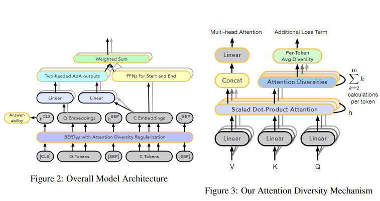

# 【关于 Robust Industry-scale Question Answering System】 那些你不知道的事

> 作者：杨夕
> 
> 论文：Towards building a Robust Industry-scale Question Answering System
> 
> 论文地址：https://www.aclweb.org/anthology/2020.coling-industry.9.pdf
> 
> 会议：COLING 2020
> 
> NLP论文学习笔记：https://github.com/km1994/nlp_paper_study
> 
> **[手机版NLP论文学习笔记](https://mp.weixin.qq.com/s?__biz=MzAxMTU5Njg4NQ==&mid=100005719&idx=1&sn=14d34d70a7e7cbf9700f804cca5be2d0&chksm=1bbff26d2cc87b7b9d2ed12c8d280cd737e270cd82c8850f7ca2ee44ec8883873ff5e9904e7e&scene=18#wechat_redirect)**
> 
> 个人介绍：大佬们好，我叫杨夕，该项目主要是本人在研读顶会论文和复现经典论文过程中，所见、所思、所想、所闻，可能存在一些理解错误，希望大佬们多多指正。
> 
> NLP 百面百搭 地址：https://github.com/km1994/NLP-Interview-Notes
> 
> **[手机版NLP百面百搭](https://mp.weixin.qq.com/s?__biz=MzAxMTU5Njg4NQ==&mid=100005719&idx=3&sn=5d8e62993e5ecd4582703684c0d12e44&chksm=1bbff26d2cc87b7bf2504a8a4cafc60919d722b6e9acbcee81a626924d80f53a49301df9bd97&scene=18#wechat_redirect)**
> 
> 推荐系统 百面百搭 地址：https://github.com/km1994/RES-Interview-Notes
> 
> **[手机版推荐系统百面百搭](https://mp.weixin.qq.com/s/b_KBT6rUw09cLGRHV_EUtw)**

## 一、引言

- 工业规模的 NLP 系统需要两个功能。 
  - 1. 鲁棒性：“零样本迁移学习”(ZSTL) 的性能值得称道； 
  - 2. 效率：系统必须高效训练并即时响应。
- 论文方法：介绍了一种称为GAAMA（Go Ahead Ask Me Anything）的生产模型的发展，它具有上述两个特征：
  - 为了稳健性，它在最近引入的Natural Questions（NQ）数据集上进行训练。 NQ 对 SQuAD 等旧数据集提出了额外的挑战：
    - (a) QA 系统需要阅读和理解整篇 Wikipedia 文章而不是一小段文章；
    - (b) NQ 在构建过程中不会受到观察偏差的影响，从而减少问题和问题之间的词汇重叠文章。 
  - GAAMA 由Attention-over-Attention、注意力头的多样性、分层迁移学习和合成数据增强组成，同时计算成本低廉。

- 实验结果：
  - 建立在强大的 BERTQA 模型之上，GAAMA 在 F1 中比 NQ 上的行业规模最先进 (SOTA) 系统提供了 2.0% 的绝对提升；
  -  GAAMA 将零样本转移到了看不见的现实生活和重要领域，因为它在两个基准上产生了可观的性能：BioASQ 和新引入的 CovidQA 数据集。

