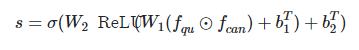
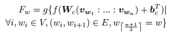
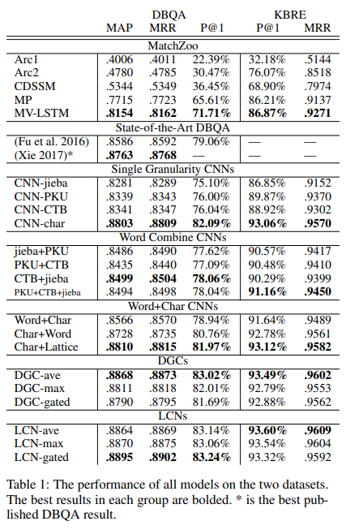

# Lattice CNNs for Matching Based Chinese Question Answering

## 摘要

Short text matching often faces the challenges that there are great word mismatch and expression diversity between the two texts, which would be further aggravated in languages like Chinese where there is no natural space to segment words explicitly. （短文本匹配经常面临两个文本之间存在巨大的词不匹配和表达差异的挑战，而在像中文这样的语言中，由于没有自然的空间来明确划分词，这种情况会进一步加剧。）

In this paper, we propose a novel lattice-based CNN model (LCNs) to utilize multi-granularity information inherent in the word lattice while maintaining a strong ability to deal with the introduced noisy information for matching based question-answering in Chinese. （在本文中，我们提出了一种新颖的 lattice-based 的CNN模型（LCN），该模型可以利用 word lattice 中固有的多粒度信息，同时保持强大的能力来处理引入的嘈杂信息以匹配基于中文的问题。） 

We conduct extensive experiments on both document-based question answering and knowledge-based question answering tasks, and experimental results show that the LCNs models can significantly outperform state-of-the-art matching models and strong baselines by taking advantage of better ability to distill rich but discriminative information from the word lattice input. （我们对基于文档的问答和基于知识的问答任务进行了广泛的实验，实验结果表明，LCNs模型可以利用更好的提炼能力，大大胜过最新的匹配模型和强大的基线 来自字格输入的丰富但有区别的信息。）

## 动机

- 短文本匹配受分词效果影响。针对中文或类似语言的匹配文本序列经常会遭受分词的困扰，因为在这种情况下，通常没有完美的中文分词工具可以适合每种情况。 文本匹配通常需要捕获多个粒度的两个序列之间的相关性。 例如，在图1中，示例短语通常被标记为“中国–公民–生活–质量–高”，但是当我们计划将其与“中国人–生活–好”相匹配时，将其细分为“中国人-生计-生活”更有帮助，而不是普通的细分。

- 融合词级和字级信息的方法，在一定程度上可以缓解不同分词方法之间的不匹配问题，但这些方法仍然受到原有词序结构的影响。 它们通常依赖于一个现有的词的标记，这必须在同一时间做出分词选择，例如，“中国”(China)和“中国人”(Chinese)处理“中国人民”(Chinese people)。 混合只是在它们的框架中的一个位置进行指导。

- 特定的任务，如问题回答(QA)可以提出进一步的挑战，短文本匹配。 
  - 基于文档的问答系统(DBQA)。匹配度反映对一个给定的问题，一个句子是他的回答的概率，问题和回答来源不同，因此会存在风格和句法结构都不同的问题。
  
  - 基于知识的问题回答(KBQA)。一个关键任务是对知识库的谓词短语来匹配问题的关系表达式。

- 最近的研究进展致力于多粒度信息的匹配建模。 [ Seo 等人2016，Wang，Hamza 和 Florian2017]将单词和字符混合成一个简单的序列(单词级) ，并且[ Chen 等人2018]利用多个卷积内核大小来捕获不同的 n-grams。 但是汉语中的大多数字都可以看作是单独的词，因此直接将汉字与相应的词组合起来可能会失去这些字所能表达的意义。 由于顺序输入的原因，他们要么在处理字符序列时丢失字级信息，要么不得不做出分词选择。

## 方法

在本文中，我们提出了一种用于中文问答中短文本匹配的多粒度方法，该方法利用基于格的CNN提取单词格上的句子级特征。 具体而言，LCN不再依赖于字符或单词级别序列，而是将单词格作为输入，其中每个可能的单词和字符将被平等对待并具有各自的上下文，以便它们可以在每一层进行交互。 对于每层中的每个单词，LCN可以通过合并方法以不同的粒度捕获不同的上下文单词。 

## 相关工作介绍

基于 siamese architecture 的 Lattice CNNs 框架。

### SIAMESE ARCHITECTURE

SIAMESE ARCHITECTURE 及其变体已被广泛应用于句子匹配和基于匹配的问答中，这种结构具有对称分量，可以从不同的输入通道中提取高级特征，这些特征共享相同的矢量空间中的参数和映射输入。 然后对句子表征进行合并，并与输出的相似性进行比较。

对于我们的模型，我们使用多层 cnn 学习句子表示。 卷积层之间采用残差连接的方法以丰富特征且易于训练。然后采用池化层总结全局特征以获得句子级别的表示，并通过逐元素乘法进行合并。匹配分数通过多层感知器产生：

> $f_{qu}$ 和 $f_{can}$ 分别表示通过 CNNs 编码之后的 question 和 candidate 的特征向量。⊙是元素级乘法。 

训练目标是最小化二进制交叉熵损失，定义为:

> $f_{i}$ 是第 i 哥训练对的 {0，1} 标签。

**关键问题：** 句子表示可以是原始 CNN，也可以是 Lattice CNN。在原始 CNN 中，卷积核按照顺序扫描每个 n-gram，并得到一个特征向量，该向量可以看作是中心词的表示，并被传递至下一层。但是，每一个词在每一个 lattice 中可能具有不同粒度的上下文词，并且可以被视为具有相同长度的卷积核的中心。因此，不同于原始 CNN，lattice CNN 对于一个词可能产生多个特征向量，这是将标准CNN直接用于lattice输入的关键挑战。

如图 2 所示，“citizen”具有四个长度为3的上下文的中心词（China -citizen - life, China - citizen - alive, country - citizen -life, country - citizen - alive）。对于“citizen"，尺寸为3的卷积核会产生4个特征向量。

> 图注：将”citizen“看作中心词，卷积核尺寸为3时，将会涉及到5个词和四个上下文组成，如上文所述，每个词用不同的颜色标记。然后，使用3个卷积核扫描所有的位置，产生4个3维特征向量。门控权重是通过dense layer根据这些特征向量计算的，反映了不同上下文构成的重要性。中心词的输出向量是他们的权重和，嘈杂上下文通过平滑处理会具有较小的权重。这些在不同上下文的池化操作，允许LCNs在word lattice上工作。

### Word Lattice

如图1所示，一个word lattice是一个有向图 $G=<V，E>$ ，$V$是点集，$E$是边集。对于一个中文句子，是一个中文字符序列$S=c_{1:n}$，其所有可被视为单词的字符的子字符串都被视为顶点，即 V={ c_{i:j} |c_{i:j} 是单词}，然后所有相邻单词都根据其在原始句子中的位置，以有向边相连。即$E={e(c_{i:j}，c_{j:k}) | ∀ i，j，k s.t. c_{i:j}，c_{j:k} ∈ V }$

**关键问题：** 如何决定一个字符序列可以被描述成一个词？作者通过查询现有的词汇来解决这个问题，这些词是百度百科中的频繁词。注意到，大部分中国字符本身都可以被看作词，百度百科的语料库中就会包含这些词。
但这样就会不可避免的对word lattice引入噪声，通过模型的池化过程平滑处理。 构造的图可能会因为存在词汇表以外的词断开，因此，添加$<unk>$标签来替换这些词，以连接图。
显然，word lattice 是字符和所有可能的单词的集合。**因此不需要进行分词，只需要将所有可能的信息嵌入lattice并且将其输入CNN。** word lattice内在的图结构允许所有可能的单词都被清晰表示。

### lattice based CNN layer

采用 lattice based CNN layer 作为输入，而不是标准的 CNN，并利用池化机制合并由多个卷积核在不同上下文产生的特征向量。

形式上，卷积核尺寸为n 的lattice CNN层对词w在word lattice $G=<V,E>$ 下的输出特征向量是:

> 其中，$f$ 为激活函数，$v_{w_{i}}$ 为该层中词 $w_{i}$ 对应的输入向量，$v_{w_{1}}:...:v_{w_{n}}$ 为这些向量的级联，$g$ 为池化函数，有最大池化、均值池化、门池化。
> 门池化的公式表示如下所示：

> 其中，$v_g$ 和 $b_g$ 为参数，$ɑ_i$ 为 softmax 函数归一化的门控权重。门代表n-gram上下文的重要性，加权和可以控制嘈杂上下文词的传输。必要的时候进行padding。

word lattice可以看作有向图，并通过 Direct Graph Convolutional networks(DGCs)建模，该模型在相邻顶点上采用池化操作，忽略了n-gram的语义结构。但是，对某些情况来说，他们的构想可能和我们的相似。比如，如果我们将LCNs的卷积核尺寸设置为3，使用线性激活函数，假设LCN和DGC的池化是均值池化，则在每一层的每个词处，DGC计算中心词及其一阶邻居的平均值，LCN计算分别计算前一个和后一个词的均值，然后将他们加在中心词上。具体见实验部分。

最后，给定一个已经被构造成word lattice格式的句子，对于lattice的每一个节点，LCN层会产生一个类似于原始CNN的特征向量，这使得堆叠多个LCN以获得更抽象的特征表示更加容易。

## 实验

### 实验目标

(1) word lattice 中的多粒度信息是否有助于基于问答任务的匹配；

(2) LCNs 是否能很好地通过 lattice 捕获多粒度信息；

(3) 如何平衡 word lattice 引入的噪声和带有丰富信息的词。

### 数据集选取

数据集选自 NLPCC-2016 评估任务的中文问答数据集：

- DBQA：是一个基于文档的问题回答数据集。 在测试集中有8.8 k 的问题和182k 的问句对用于训练，6k 的问题和123k 的问句对用于测试。 平均每个问题有20.6个候选句子和1.04个黄金答案。 问题的平均长度为15.9个字符，每个候选句子平均有38.4个字符。 问句和句子都是自然语言的句子，可能比 KBQA 更多地共享相似的词语和表达方式。 但是候选句子是从网页上提取出来的，而且通常比问句长得多，还有许多不相关的从句。
- KBQA：是一种基于知识的关系抽取数据集。 我们按照与[ Lai 等人2017]相同的预处理过程来清理数据集，并将问题中提到的实体替换为特殊标记。 在训练集中有14.3 k 问题，其中问题谓词对为273k，问题谓词对为156k，问题谓词对为9.4 k。 每个问题只包含一个黄金谓词。 每个问题平均有18.1个候选谓词和8.1个字符长度，而一个 KB 谓词平均只有3.4个字符长。 注意，知识库谓词通常是一个简洁的短语，与自然语言问题相比，用词选择有很大的不同，这给解决带来了不同的挑战。

我们用来构造 word lattice 的词汇表包含 156k 个单词，其中包括 9.1k 个单字符的单词。 平均而言，每个 DBQA 问题在其 lattice 中包含 22.3 个标记(单词或字符) ，每个 DBQA 候选句子有 55.8 个标记，每个 KBQA 问题有 10.7 个标记，每个 KBQA 谓词包含 5.1 个标记。

### 实验结果

## 结论

In this paper, we propose a novel neural network matching method (LCNs) for matching based question-answering in Chinese. Rather than relying on a word sequence only, our model takes word lattice as input. By performing CNNs over multiple n-gram context to exploit multi-granularity information, LCNs can relieve the word mismatch challenges. Thorough experiments show that our model can better explore the word lattice via convolutional operations and rich context-aware pooling, thus outperforms the state-of-the-art models and competitive baselines by a large margin. Further analyses exhibit that lattice input takes advantage of the word and character-level information, and the vocabulary-based lattice constructor outperforms the strategies that combine characters and different word segmentation together. （在本文中，我们提出了一种新的基于神经网络的中文匹配问题的神经网络匹配方法（LCN）。 我们的模型不是仅依赖单词序列，而是将单词晶格作为输入。 通过在多个n-gram上下文上执行CNN以利用多粒度信息，LCN可以缓解单词不匹配的挑战。 全面的实验表明，我们的模型可以通过卷积运算和丰富的上下文感知池更好地探索单词晶格，因此在很大程度上优于最新模型和竞争基准。 进一步的分析表明，晶格输入利用了单词和字符级别的信息，而基于词汇的晶格构造器的性能优于将字符和不同的单词分割组合在一起的策略。） 

## 参考资料

1. [Lattice CNNs for Matching Based Chinese Question Answering](https://arxiv.org/pdf/1902.09087)
2. [github: Lattice CNNs for Matching Based Chinese Question Answering](https://github.com/Erutan-pku/LCN-for-Chinese-QA)
3. [Lattice CNNs for Matching Based Chinese Question Answering 读书笔记](https://blog.csdn.net/weixin_40341844/article/details/101767163)
