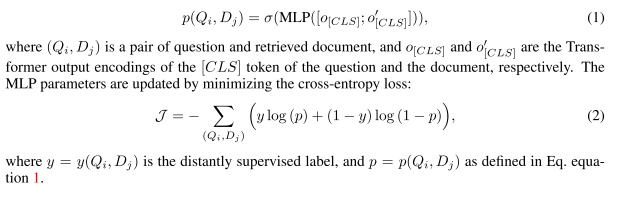
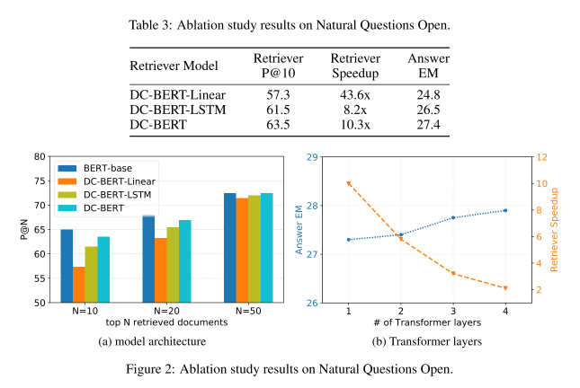

# 【关于 DC-BERT】 那些你不知道的事

> 作者：杨夕
> 
> 项目地址：https://github.com/km1994/nlp_paper_study
> 
> 论文：DC-BERT : DECOUPLING QUESTION AND DOCUMENT FOR EFFICIENT CONTEXTUAL ENCODING
> 地址：https://arxiv.org/pdf/2002.12591.pdf
> 
> 个人介绍：大佬们好，我叫杨夕，该项目主要是本人在研读顶会论文和复现经典论文过程中，所见、所思、所想、所闻，可能存在一些理解错误，希望大佬们多多指正。

## 目录

- [【关于 DC-BERT】 那些你不知道的事](#关于-dc-bert-那些你不知道的事)
  - [目录](#目录)
  - [摘要](#摘要)
  - [现有方法](#现有方法)
  - [论文工作介绍](#论文工作介绍)
  - [论文共享介绍](#论文共享介绍)
  - [论文结构介绍](#论文结构介绍)
    - [论文整体结构](#论文整体结构)
    - [a dual-BERT component for decoupled encoding](#a-dual-bert-component-for-decoupled-encoding)
    - [a Transformer component for question-document interactions](#a-transformer-component-for-question-document-interactions)
    - [a classifier component for document reranking](#a-classifier-component-for-document-reranking)
  - [实验结果及分析](#实验结果及分析)

## 摘要

Recent studies on open-domain question answering have achieved prominent performance improvement using pre-trained language models such as BERT. (Bert 预训练模型在 QA 领域上的 显著效果)

State-of-the-art approaches typically follow the “retrieve and read” pipeline and employ BERT-based reranker to filter retrieved documents before feeding them into the reader module. （最先进的方法通常遵循“检索和读取”管道，并使用基于BERT的重新排序器对检索到的文档进行筛选，然后再将其馈送到阅读器模块中。）The BERT retriever takes as input the concatenation of question and each retrieved document. （BERT检索器将问题和每个检索到的文档的连接作为输入。）

Despite the success of these approaches in terms of QA accuracy, due to the concatenation, they can barely handle high-throughput of incoming questions each with a large collection of retrieved documents. （尽管这些方法在QA准确性方面取得了成功，但由于进行了级联，它们几乎无法处理传入问题的高吞吐量，每个问题都有大量检索到的文档。）

To address the efficiency problem, we propose DC-BERT, a decoupled contextual encoding framework that has dual BERT models: an online BERT which encodes the question only once, and an offline BERT which pre-encodes all the documents and caches their encodings. （我们提出了DC-BERT，它是一个具有双重BERT模型的解耦上下文编码框架：一个在线BERT，仅对问题进行一次编码；一个正式的BERT，对所有文档进行预编码并缓存其编码。）

On SQuAD Open and Natural Questions Open datasets, DC-BERT achieves 10x speedup on document retrieval, while retaining most (about 98%) of the QA performance compared to state-of-the-art approaches for open-domain question answering. （在SQuAD开放式和自然问题开放式数据集上，与最新的开放域问题解答方法相比，DC-BERT的文档检索速度提高了10倍，同时保留了大多数（约98％）的QA性能。）

- 常用方法：
  - 遵循“检索和读取”管道，并使用基于BERT的重新排序器对检索到的文档进行筛选，
  - 然后再将其馈送到阅读器模块中。
  - BERT检索器将问题和每个检索到的文档的连接作为输入。
- 问题：
  - 无法处理传入问题的高吞吐量，每个问题都有大量检索到的文档；
- 论文方法：具有双重BERT模型的解耦上下文编码框架：
  - 一个在线BERT，仅对问题进行一次编码；
  - 一个正式的BERT，对所有文档进行预编码并缓存其编码；

## 现有方法

- “检索和读取”管道：
  - 信息检索（IR）：使用非在线形式检索文档。基于TF-IDF或BM25的现成的IR系统
  - 机器阅读理解（MRC）：读取读取的文档以提取答案
- 存在问题：
  - IR系统完全基于n元语法匹配，并且**对上下文有较浅的理解**。因此，包含正确答案的文档可能不会被IR系统排在首位。如果我们只是将更多文档输入阅读器模块中，以增加点击包含答案的排名不足的文档的机会，那么这可能会导致计算量大，并给阅读器模块带来更多噪音，从而使查找答案变得更加困难。
- 解决方法：提出了一种训练基于BERT的重新排序器的方法，该方法是将检索到的文档输入阅读器模块之前对其进行过滤的二进制分类器。
  - 利用 Bert，其 结构 构建：  $[CLS] Question [SEP] Document [SEP]$
  - 优点：由于BERT生成了高质量的上下文编码，因此这些方法显着提高了非参数化IR系统的检索性能，从而提高了开放域QA的答案准确性；
  - 问题：由于连接，这些方法必须对每个检索到的文档重复编码一个问题，这很难处理高吞吐量的传入问题，每个问题都有大量的检索到的文档。 这个严重的效率问题使现有的开放域QA方法无法部署为实时QA系统。
- 加快基于BERT的模型以进行有效推理是一项活跃的研究领域。 与该方向有关的先前工作主要包括：
  - 1）模型压缩，其中提出了通过权重修剪或模型量化来减小模型大小的方法； 
  - 2）模型蒸馏，提出了从大型教师网络（例如DistilBERT）中训练小型学生网络的方法。 

## 论文工作介绍

- 动机：探究并可视化了BERT以了解其有效性，这表明：
  - BERT的较低层编码更多的本地语法信息，例如词性（POS）标签和组成部分；
  - 较高的层则倾向于捕获更复杂的语法语义依赖更广泛的上下文；
- 方法：提出了DC-BERT，
  - 将BERT的较低层解耦到本地上下文（问题和文档），
  - 然后在独立编码之上应用Transformer层以实现问题文档的交互。
- 思路：DC-BERT具有两个单独的BERT模型：
  - 一个仅对问题编码一次的在线BERT，
  - 一个对所有文档进行预编码并缓存其编码的普通BERT。
- 特点：启用缓存后，DC-BERT可以立即读取任何文档的编码。然后将问题和文档的解耦编码输入到具有问题和文档交互的全局位置和类型嵌入的Transformer层中，从而生成（问题，文档）对的上下文编码。 DC-BERT可以同时应用于文档检索器和阅读器。
- 在这项工作中，我们专注于加快检索器的速度，因为每个问题检索的文档数量可能很大，而馈入阅读器模块的文档数量则受到很大的控制。因此，解决文档检索器的效率问题更为重要。

## 论文共享介绍

- 解耦QA编码：我们建议将问题和文档解耦，以实现有效的上下文编码。 据我们所知，我们的工作是第一个探索将局部上下文编码和全局上下文编码与BERT结合使用以进行开放域质量检查的工作。
- 有效的问题文档交互：我们为问题文档交互提出了一种有效的模型架构，该模型采用带有Transformer层的可训练全局嵌入。
- 快速的文档检索：我们将DC-BERT成功地应用于文档重新排序，这是开放域质量检查的关键组成部分，使它比现有方法快10倍以上，同时保留了基准数据集上大部分（约98％）的质量检查性能 。
- 新的评估指标：我们提出了两个对称的新评估指标，以评估检索者发现TF-IDF分数较低但包含答案的文档的能力。

## 论文结构介绍

### 论文整体结构

- DC-BERT 组成：
  - a dual-BERT component for decoupled encoding （用于解耦编码的双BERT组件）；
  - a Transformer component for question-document interactions （用于问题文档交互的Transformer组件）；
  - a classifier component for document reranking （用于文档重新排名的分类器组件）

### a dual-BERT component for decoupled encoding

- 两个 Bert：
  - 一个 编码 问题；
  - 一个 编码 每一个检索答案；
- 训练：
  - 两个BERT模型的参数都进行了更新以优化学习目标，这将在稍后的分类器组件部分中进行介绍。 训练模型后，我们会对所有文档进行预编码，并将其编码存储在正式缓存中；
- 测试：
  - 使用在线 BERT 对问题进行一次编码，然后立即读取由现成的IR系统检索的所有候选文档的缓存编码;
- 优点：减少 时间

### a Transformer component for question-document interactions

- 方法：利用双BERT分量，我们获得问题编码T∈RN×d和文档编码T'∈RM×d，其中d是词嵌入的维数，N和M是问题和文档的长度， 由于文档重新排序任务是预测问题文档的相关性，因此我们引入了带有可训练全局嵌入的Transformer组件，以对问题文档交互进行建模。
- 问题：
  - Q1：什么还要进行交互呢？直接做问题和文档编码然后进行内积排序不应该速度更快吗？
  - A1：之前已经有人尝试用BERT模型独立地编码问题和文档，并计算它们编码的内积来检索文档，但效果比最先进的方法差的较多。因为问题和文档之间如果缺乏交互，其实是会严重影响性能效果的。但是这种方法，是可以应用的retrieve模块，提高第一步召回结果。
  - Q2：直接做问题和文档编码然后进行内积应用在retrieve模块的效果如何？
  - A2：在工业界做过尝试，其实效果并不理想。因为只使用BERT模型的一个【CLS】向量来表征一个较长（大于384）的文档，是不充分的，并不能表征完全，会丢失较多的特征。那么如何表征一个长文档，其实是一个有意思的研究点。

### a classifier component for document reranking 

- 方法：在Transformer层之后，DC-BERT将文档重新排序任务视为二进制分类问题，以预测检索到的文档是否与该问题相关。 在之前的工作之后，我们采用段落级远程监督来收集标签以训练分类器，其中包含确切的地面真实答案范围的段落被标记为一个积极的例子。
- binary classifier as a MLP layer on top of the Transformer layers：
  

## 实验结果及分析

- 指标介绍：
  - P@N：在以前的工作中定义为答案范围出现在前N个文档之一中的问题的百分比；
  - PBT@N：一种新的评估指标来评估文档重新排名者的语义检索能力，这是问题的百分比，其中**包含答案范围的前N个文档中至少有一个不在TF-IDF前N个文档中**。 换句话说，这项新指标**衡量的是除TF-IDF检索器之外的检索器功能**（越高越好）
  - PTB@N：我们提出的与PBT@N对称的度量标准，即**在至少N个TF-IDF检索文档中至少有一个包含答案范围的问题所占的百分比**，而不是在检索者的前N个文档中。 此指标衡量的是**检索器保留TF-IDF检索器返回的相关文档的能力**（越低越好）

- Ablation study
  - 1）DC-BERT-Linear，它使用线性层 而不是 Transformers 进行交互； 
  - 2）DC-BERT-LSTM，它使用LSTM和双线性层进行交互，遵循先前的工作。
- 我们将结果报告在表3中。由于交互层的结构简单，DC-BERT-Linear实现了最佳的加速，但性能下降明显，而DC-BERT-LSTM的性能和加速比DC-BERT稍差。
- 图2a显示，对于不同数量的顶部检索文档，DC-BERT始终优于其变体，并且在检索较少文档时具有更大的余量。我们还调查了Transformer层数对问题文档交互的影响，并在图2b中报告了结果。当我们增加Transformer层的数量时，QA性能会不断提高，并且由于计算成本的增加，加速也会降低。这显示了我们的方法的模型容量和效率之间的权衡。

