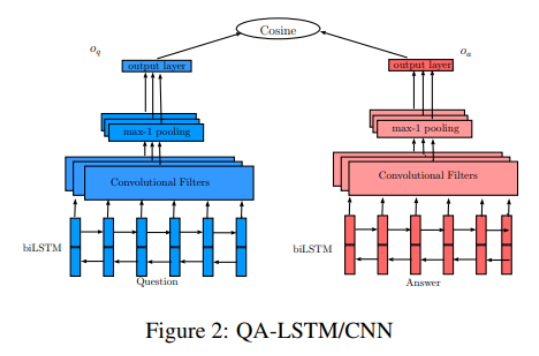
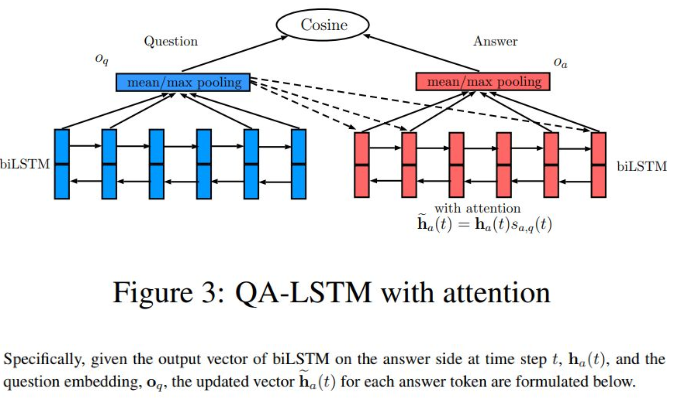
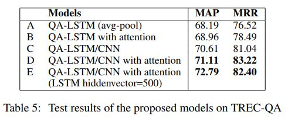

# LSTM-based Deep Learning Models for Non-factoid Answer Selection

> 作者：杨开漠
> 
> 学校：水校研究生
> 
> 研究方向：信息抽取
> 
> 研读论文：LSTM-based Deep Learning Models for Non-factoid Answer Selection
> 
> 论文链接：https://arxiv.org/abs/1511.04108

## 一、摘要

在本文中，我们将一般深度学习（DL）框架应用于答案选择任务，该任务不依赖于手动定义的功能或语言工具。 

基本框架基于对基于双向长期短期记忆（BILSTM）模型的问答的出价，并通过余弦相似性测量它们的接近程度。 

我们进一步将这个基本模型扩展到两个方向。 

第一个：通过合并带有基础框架的 CNN 来对问题和答案定义一些综合表示；

第二个：为了根据问题上下文生成回答表示，我们使用了一个简单但是有效的注意力机制。 

这些模型由两个数据集认证，包括TREC-QA和InsuranceQA。 实验结果表明，所提出的模型基本上优于几个强基线。

## 二、知识预热

answer selection problem: 给定一个问题及一个答案候选池，我们的任务是从中找出最符合问题的答案。

类别：

一、通过某些相似性度量来学习和匹配问答表达；

二、基于问题和答案构建联合特征向量，然后可以将任务转换为分类或 learning-to-rank 问题；

三、用于文本生成的模型本质上可用于答案选择和生成。

## 三、动机

一、传统的方法是使用 特征工程，语言工具或者 外部资源，这些方法虽然能够获得较高的准确性，但是需要引入语言工具：语义树，依赖树等；

二、正确答案不一定和问题具有相同的词汇，而是存在语义相关；

三、答案存在噪声，比如与问题不相关的内容。

## 四、论文所提出的方法

基础框架：分别在问题与答案上建立bilstm，连接一个 pooling layer，并使用一个相似度度量来计算匹配度。

对基础模型进行两个方面改进:

1、简单 pooling 层无法保留 局部语言信息。为了获得问题和答案更好的 emb，我们在 BiLSTM 上面加了一个 CNN。

2、为了根据问题区分候选答案。根据问题上下文为模型引入一个简单但有效的 Attention，用于 答案 emb 生成。

## 五、模型介绍

### 1、 QA-LSTM

思路：

BiLSTM generates distributed representations for both the question and answer independently, and then utilize cosine similarity to measure their distance.

Following the same ranking loss in (Feng et al., 2015; Weston et al., 2014; Hu et al., 2014), we define the training objective as a hinge loss.

$$
L=\max {0, M-\operatorname{cosin} e(q, a_{+})+\operatorname{cosin} e(q, a_{-})}
$$

优点：因为对于共享层网络，问题和答案向量中的对应元素表示相同的biLSTM输出。

缺点：对于具有单独问答参数的网络，没有这样的约束，并且模型具有双倍大小的参数，使得难以学习优化器。

### 2、 QA-LSTM/CNN

Same as typical CNNs, a max-k pooling layer is built on the top of the convolutional layer. Intuitively, we want to emphasize the top-k values from each convolutional filter. By k-MaxPooling, the maximum k values will be kept for one filter, which indicate the highest degree that a filter matches the input sequence.

### 3、ATTENTION-BASED QA-LSTM

动机：当双向LSTM模型必须在问题和答案上长距离传播依赖关系时，隐藏向量的固定宽度成为瓶颈。注意机制用于通过动态地将问题的答案的更多信息部分对齐来缓解这种弱点。

思路：In this work, we directly use the attention-based representations to measure the question/answer distances. Experiments indicate the attention mechanism can more efficiently distinguish correct answers from incorrect ones according to the question text.

### 4、QA-LSTM/CNN WITH ATTENTION 

## 六、实验结果

### 1、datasets

We report experimental results for two answer selection datasets:

 (1) InsuranceQA (Feng et al., 2015) 1 , a recently released large-scale non-factoid QA dataset from the insurance domain. The proposed models demonstrate a significant out-performance compared to two non-DL baselines and a strong DL baseline based on CNN. 

(2) TREC-QA 2 , which was created by Wang et al. (2007) based on Text REtrieval Conference (TREC) QA track data. The proposed models outperform various strong baselines.

### 2、result

## 七、Conclusion

在本文中，我们通过采用基于双向LSTM的深度学习框架来研究答案选择任务。建议的框架不依赖于特征工程，语言工具或外部资源，并且可以应用于任何域。

我们进一步扩展了两个方向的基本框架。

首先，我们将卷积神经网络结合到这个框架中，以便提供更多。

其次，我们正在将一个简单但有效的注意机制整合到问题答案的生成中。

最后，两个扩展组合在一起。

我们使用TRECQA数据集和最近发布的InsuranceQA数据集进行实验。我们的实验结果优于各种强大的基线。在未来，我们希望进一步评估针对不同任务的建议方法，以及在社区质量保证中寻找质量预测并识别文本蕴涵。在结构方面，我们计划引起对短语或句子水平的关注。