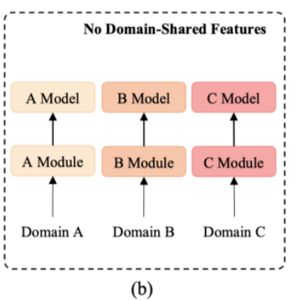
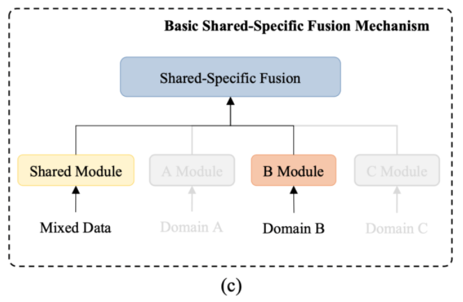

# 【关于 DF-Net 】 那些的你不知道的事

> 作者：杨夕
> 
> 项目地址：https://github.com/km1994/nlp_paper_study
> 
> NLP 面经地址：https://github.com/km1994/NLP-Interview-Notes
> 
> 个人介绍：大佬们好，我叫杨夕，该项目主要是本人在研读顶会论文和复现经典论文过程中，所见、所思、所想、所闻，可能存在一些理解错误，希望大佬们多多指正。
> 
> 论文：Dynamic Fusion Network for Multi-Domain End-to-end Task-Oriented Dialog
> 
> 发表会议：ACL2020
> 
> 论文地址：https://arxiv.org/abs/2004.11019
> 
> github：https://github.com/LooperXX/DF-Netmd

## 一、论文摘要

- 背景：近期的研究已经在端到端面向任务对话系统中取得了很多的进步。
- 动机：
  - 大部分模型还是依赖于大规模的训练数据，且只适用于一些特定的任务如导航和时间安排。这样的模型很难扩展到一个只有少量标注数据的新领域；
  - 目前很少有研究针对如何有效利用来自所有领域的数据去提升模型在各个领域以及未发掘的领域的表现进行研究。
- 论文方法：提出了能够充分利用领域知识的方法，并引入了一个共享-私有网络来学习一些共享的和特有的知识。此外，本文还提出了一种新颖的动态融合网络（Dynamic Fusion Network, DF-Net），能够自动地探索目标领域和各个源领域之间的相关性。
- 实验结果：此模型表现优于现有的多领域对话模型，获得了 SOTA 的效果。此外，在训练数据较少的情况下，模型的迁移能力比之前最好的模型平均超过了 13.9%。

## 二、论文背景

- 对话系统一般按照涉及的领域分为两类：
  - 开放域 (open-domin) 对话系统
  - 面向任务的对话系统：用于帮助用户达到特定的目标比如预定餐厅和询问导航。

## 三、论文动机

1. 依赖大量标准数据：端到端的模型依赖于大量的标注数据，这就导致了模型在一个新拓展的领域上很难利用。
2. 对于一个新的领域，总是很难收集足够多的数据。这就使得将知识从具有充足标注数据的源领域迁移到一个只有少量标注数据的新领域成为非常重要的问题。

## 四、前沿工作总结

- 第一类：简单地结合多领域的数据集进行训练，如图 (a)
  - 优点：隐含地提取共享的特征
  - 缺点：很难有效捕捉领域特有的知识

- 第二类是在各个领域单独地训练模型，如图 (b)
  - 优点：能够很好地捕捉领域特有的知识；
  - 缺点：却忽视了不同领域间共有的知识。

- 第三类：通过建模不同领域间知识的连接来解决已有方法的局限。已有的一个简单的baseline如图 (c)，将领域共享的和领域私有的特征合并在一个共享-私有 (shared-private) 架构中。
  - 优点：区分了共享以及私有的知识
  - 缺点：
    - 一是面对一个几乎不具备数据的新领域时，私有模块无法有效提取对应的领域知识；
    - 二是这个架构忽略了一些领域子集间细粒度的想关性（比如和天气领域相比，导航领域和规划领域更相关）。

## 五、Dynamic Fusion Network (DF-Net) 方法提出

- 用一个门来自动地找到当前输入和所有领域特有知识模型间的相关性，进一步在提取知识时对各个领域安排一个权重。这种机制可以用在 encoder 和 decoder 上；
- 用一个记忆模块来基于特征查询知识。这种模型能够在面对一个几乎没有训练数据的模型时最大程度利用已有的领域，这是 baseline 模型不能达到的。

## 六、模型架构

- 结构介绍：基于 Seq2Seq 对话生成模型
- 思路：

1. shared-private 架构：学习共享的知识以及对应的领域特有特征；
2. 动态融合网络：动态地利用所有领域间的相关性提供给下一步细粒度知识迁移；
3. 对抗训练 (adversarial training) ：促使共享模块生成领域共享特征

## 参考

1. [Dynamic Fusion Network for Multi-Domain End-to-end Task-Oriented Dialog](https://www.aminer.cn/pub/5ea2b8bf91e01167f5a89cd6/dynamic-fusion-network-for-multi-domain-end-to-end-task-oriented-dialog)
2. [ACL 2020 | 用于多领域端到端任务型对话系统的动态融合网络 ](https://www.sohu.com/a/406415877_500659)