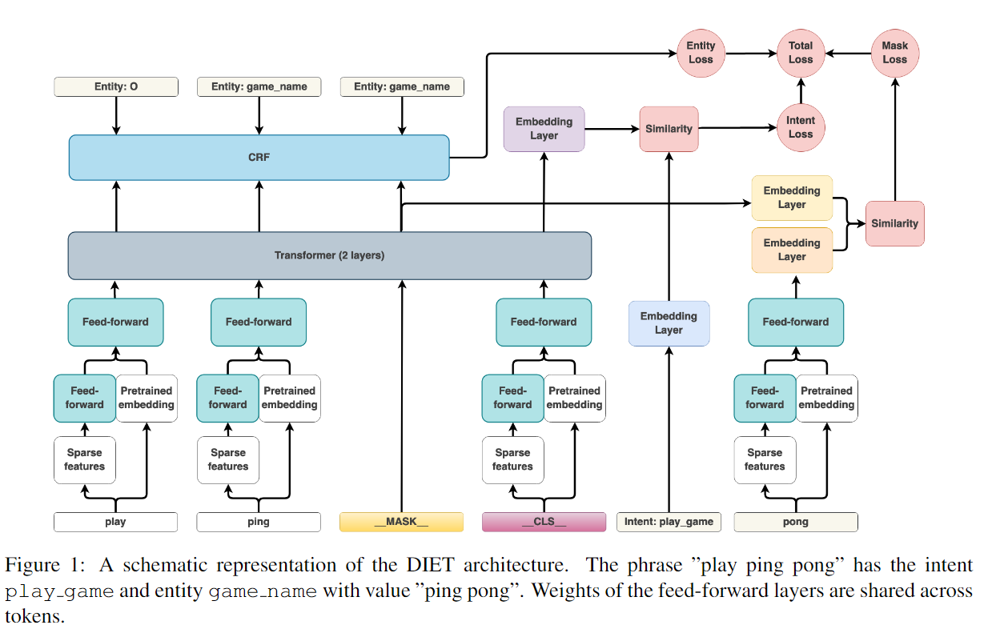
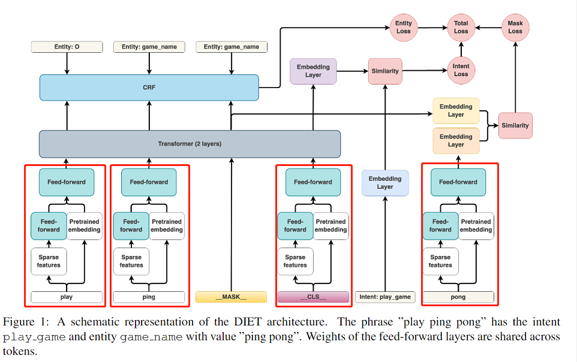
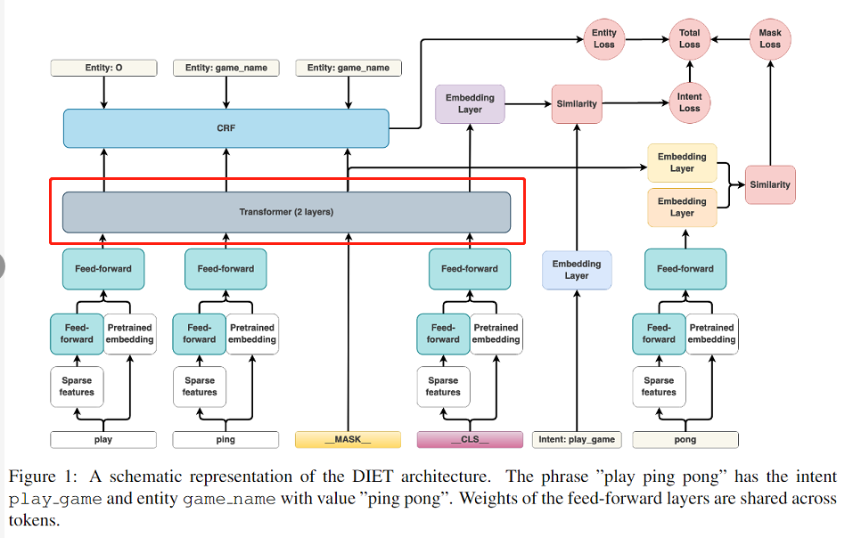
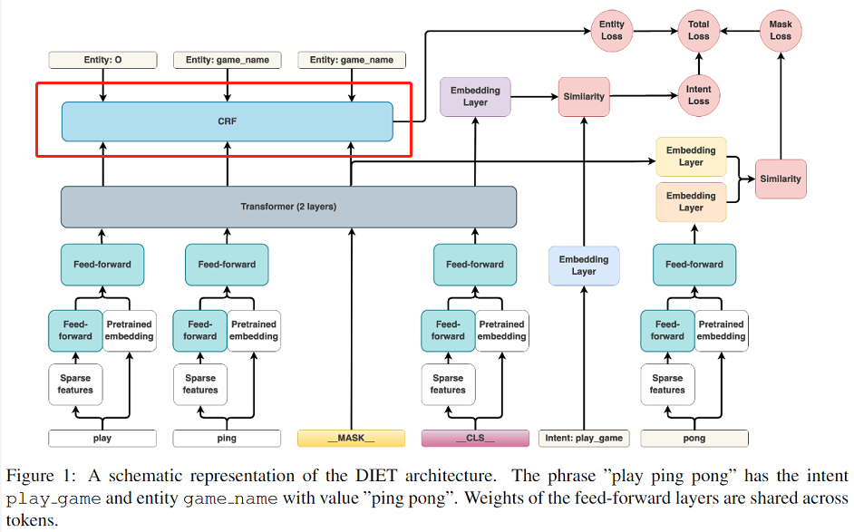
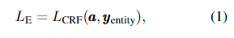
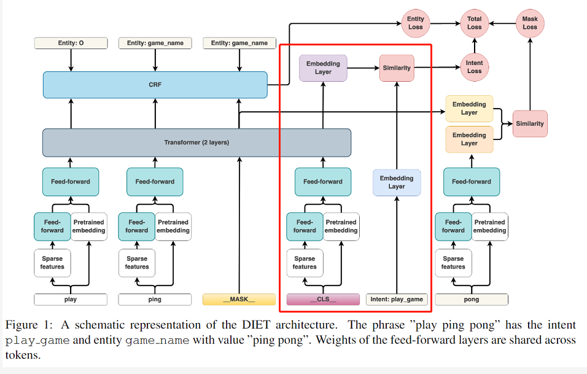
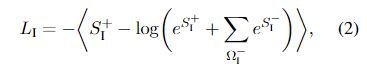
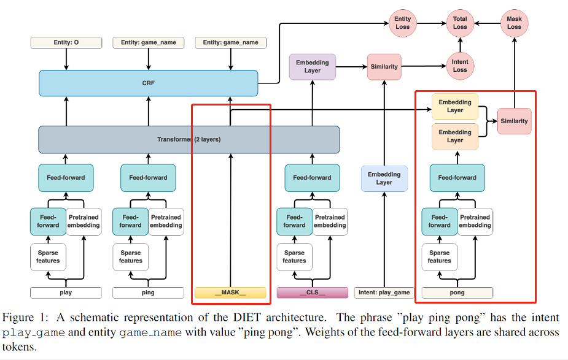
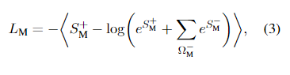
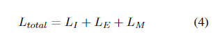

# 【关于 DIET】 那些你不知道的事

> 论文名称：DIET：Dual Intent and Entity Transformer
> 
> 论文地址：https://arxiv.org/pdf/2004.09936.pdf
> 
> 论文代码 1：https://github.com/WeiNyn/DIETClassifier-pytorch

## 一、前言

- 动机：
  - 大规模的预训练语言模型在 GLUE 和 SuperGLUE 等语言理解基准上显示出令人印象深刻的结果，与分布式表示 (GloVe) 和纯监督方法等其他预训练方法相比有了显着改善。
- 论文方法：我们介绍了 the Dual Intent and Entity Transformer (DIET) (DIET) 架构（基于两个任务共享的Transformer）：
  - 1 实体标签序列通过Transformer后，输出序列进入顶层条件随机场（CRF）标记层预测，输出每个Token成为BIOE的概率；
  - 2 完整话语和意图标签经过Transformer输出到单个语义向量空间中；
  - 3 利用点积损失最大化与目标标签的相似度，最小化与负样本的相似度。
- 优点：
  - 它是一种模块化体系结构，适合典型的软件开发工作流程；
  - 在准确性和性能方面，能达到大规模预训练语言模型的效果；
  - 改进了现有技术，胜过当时的SOTA，并且训练速度提高了6倍。

## 二、背景知识

### 2.1 对话系统介绍

- 对话系统常用方法：
  - 模块化方法
    - 自然语言理解（NLU）：对 query 进行 意图分类和实体识别；
    - 对话策略：获取 NLU 输出结果之后，选择下一步系统操作；
    - NLG 系统：生成 对应 反馈；
  - 端到端方法：用户信息直接输入到对话策略中预测下一个系统语句

### 2.2 自然语言理解（NLU） 介绍

- pipeline 方法：
  - 介绍：将 自然语言理解（NLU） 分成 意图分类和实体识别 两个任务；
  - 存在问题：误差传递问题；
- 多任务体系结构:
  - 介绍：意图分类和实体识别 当成一个联合任务 一起做

## 三、动机

- pipeline 方法 误差传递问题；
- 多任务体系结构应该有益于两个任务之间相互增强;
- 经过预先训练的大型语言模型在具有挑战性的语言理解基准方面产生最佳性能，但是 这些模型 在 预训练和微调 都需要消耗 比较高的 计算资源；

## 四、论文方法

### 4.1 介绍

- 特点：
  - 一种用于**意图分类和实体识别的新型多任务体系结构**；
  - 能够以**即插即用的方式结合语言模型的预训练单词嵌入，并将它们与单词和字符级 n-gram 稀疏特征结合起来**

### 4.2 DIET体系结构

#### 4.2.1 Featurization, 特征

- 稀疏特征sparse features
  - 介绍：n-grams(n<=5)的one-hot 或者multi-hot编码；
  - 存在问题：稀疏特征包含很多冗余特征，容易出现过拟合；
  - 改进方法：加入 dropout
- 稠密特征 dense features
  - 介绍：来自预训练模型（eg：Bert、GloVe 等）；
  - 特征选取：
    - 单词信息之外的句子信息特征：使用ConveRT作为句子的编码器，ConveRT的_CLS向量作为DIET的初始输入；
    - Bert 预训练模型：使用 BERT [CLS] token；
    - GloVe 预训练模型：使用句子所有token的均值作为_CLS_；

- 思路：

1. 首先 稀疏特征 sparse features 经过 一个 全连接层 FFW（其中全连接的权重是和其它序列的时间步全连接共享的，目的是**为了让稀疏特征的维度和稠密特征的维度一致**）；
2. 然后将 稀疏特征的FFW的输出 和 稠密特征的向量 进行concat拼接；
3. 最后，将拼接后的向量 再经过一个FFW，FFW的权重也是共享的

#### 4.2.2 Transformer

- 动机：对整个句子中的上下文进行编码；
- 思路：使用了两层具有相对位置attention（Shaw 等人，2018）的transformer（Vaswani 等人，2017 ）。 

> 注：Transformer 体系结构要求其输入与 transformer 层的尺寸相同。 因此，连接起来的特征在所有序列步骤中均传递给另外一个具有共享权重的全连接层，以匹配 transformer 层的尺寸

#### 4.2.3 Named entity recognition 命名实体识别

- 思路：将 Transformer 输出的向量 输入 条件随机场Conditional Random Field (CRF) 中，进行 命名实体识别；
- 计算公式：

#### 4.2.4 Intent classification 意图分类

- 思路

1. __CLS__ 向量 输入到 transformer 层；
2. transformer 层 的 输出 和 意图标签 都 经过 Embedding Layer 进行 向量化；
3. 利用 dot-product loss 点积损失 计算 两个向量 的 相似度；
4. 使得这个相似度和真实意图的相似性最高，使用负采样计算与其它意图的相似性降低。

> 注：LI表示的是意图损失，SI+表示的是与正样本意图的相似度，SI-表示与负样本的相似度，Ω−I表示的是负样本的集合。大尖括号<>表示的是所有样本的总和，就是每个意图的损失总和。

#### 4.2.5 Masking 遮罩部分

- 动机： 受屏蔽语言模型任务的启发（Taylor，1953；Devlin 等人，2018年）
- 方法：添加了一个额外的训练目标来预测随机masked的输入token。
  - 随机选择一个句子的15%的token，对于这些token：
    - 有70%的概率会被我们的__MASK__ 向量替换；
    - 10%的概率我们会替换成一个随机的token向量；
    - 剩余20%的概率保持原始输入不变。
  - 然后对这个部分的token经过transformer计算后，与这个原始的单词进行向量和FFN后计算点击损失。

> 注：SM+是正样本的相似度，SM-是负采样后计算的相似性。Ω−M是负样本的集合，大尖括号<>是所有样本的总和

#### 4.2.6 Total Loss 总的损失

#### 4.2.7 Batching 批次

使用平衡的batching策略来减轻类别的不平衡性，因为有些意图可能比其他意图更为频繁。另一方面通过增加批次大小作为另一种正则项的方式，减少过拟合。

## 参考资料

1. [DIET：Dual Intent and Entity Transformer](https://arxiv.org/pdf/2004.09936.pdf)
2. [DIET：Dual Intent and Entity Transformer——RASA论文翻译](https://zhuanlan.zhihu.com/p/337181983)
3. [DIET：Dual Intent and Entity Transformer 笔记](https://blog.csdn.net/qq_27586341/article/details/113871056)
4. [DIET in Rasa](https://www.jianshu.com/p/3372a5c772ad)
5. [（六）RASA NLU意图分类器](https://zhuanlan.zhihu.com/p/333309670)

