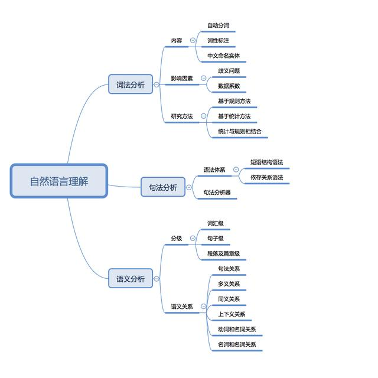
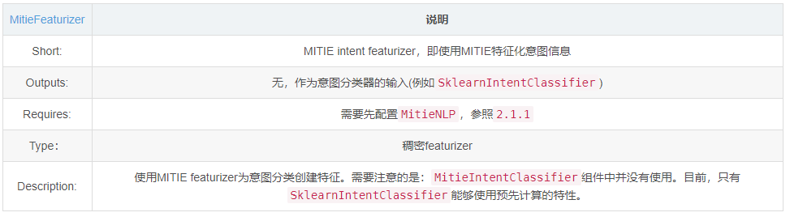
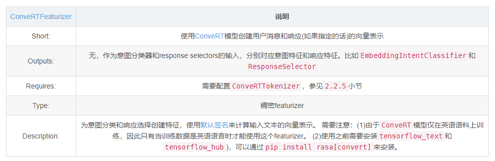

# 【关于 rasa->NLU 】那些你不知道的事

> 作者：杨夕
> 
> 项目地址：https://github.com/km1994/nlp_paper_study
> 
> 个人介绍：大佬们好，我叫杨夕，该项目主要是本人在研读顶会论文和复现经典论文过程中，所见、所思、所想、所闻，可能存在一些理解错误，希望大佬们多多指正。
> 

## 目录

- [【关于 rasa->NLU 】那些你不知道的事](#关于-rasa-nlu-那些你不知道的事)
  - [目录](#目录)
  - [一、概况图](#一概况图)
  - [二、动机](#二动机)
  - [三、什么是 自然语言理解？](#三什么是-自然语言理解)
  - [四、自然语言理解 的 工作 是什么？](#四自然语言理解-的-工作-是什么)
  - [五、自然语言理解 三层次，你知道么？](#五自然语言理解-三层次你知道么)
  - [六、自然语言理解 一般理解 你知道么？](#六自然语言理解-一般理解-你知道么)
  - [七、NLU 训练数据如何准备？](#七nlu-训练数据如何准备)
    - [7.1 NLU 训练样本数据格式？](#71-nlu-训练样本数据格式)
    - [7.2 NLU 训练样本数据格式如何验证？](#72-nlu-训练样本数据格式如何验证)
  - [八、Rasa NLU Components](#八rasa-nlu-components)
    - [8.1 词向量资源（Word Vector Sources）](#81-词向量资源word-vector-sources)
      - [（一）MitieNLP （做中文任务时，一般选用做一个，因为他是基于中文的词向量）](#一mitienlp-做中文任务时一般选用做一个因为他是基于中文的词向量)
      - [（二）SpacyNLP （英文）](#二spacynlp-英文)
    - [8.2 分词（Tokenizers）](#82-分词tokenizers)
      - [（一）WhitespaceTokenizer](#一whitespacetokenizer)
      - [（二）JiebaTokenizer](#二jiebatokenizer)
      - [（三）MitieTokenizer](#三mitietokenizer)
      - [（四）SpacyTokenizer](#四spacytokenizer)
      - [（五）ConveRTTokenizer](#五converttokenizer)
    - [8.3 文本特征化（Text Featurizers）](#83-文本特征化text-featurizers)
      - [（一）MitieFeaturizer](#一mitiefeaturizer)
      - [（二）SpacyFeaturizer](#二spacyfeaturizer)
      - [（三）ConveRTFeaturizer](#三convertfeaturizer)
      - [（四）RegexFeaturizer](#四regexfeaturizer)
      - [（五）CountVectorsFeaturizer](#五countvectorsfeaturizer)
    - [8.4 意图分类（Intent Classifiers）](#84-意图分类intent-classifiers)
      - [（一）MitieIntentClassifier](#一mitieintentclassifier)
      - [（二）SklearnIntentClassifier](#二sklearnintentclassifier)
      - [（三）EmbeddingIntentClassifier](#三embeddingintentclassifier)
      - [（四）KeywordIntentClassifier](#四keywordintentclassifier)
    - [8.5 选择器（Selectors）](#85-选择器selectors)
      - [（一）Response Selector](#一response-selector)
    - [8.6 实体提取（Entity Extractors）](#86-实体提取entity-extractors)
      - [（一）MitieEntityExtractor](#一mitieentityextractor)
      - [（二）SpacyEntityExtractor](#二spacyentityextractor)
      - [（三）EntitySynonymMapper](#三entitysynonymmapper)
      - [（四）CRFEntityExtractor](#四crfentityextractor)
      - [（五）DucklingHTTPExtractor](#五ducklinghttpextractor)
  - [九、Rasa NLU Pipline](#九rasa-nlu-pipline)
    - [9.1 动机](#91-动机)
    - [9.2 介绍](#92-介绍)
    - [9.3 使用Template Pipline](#93-使用template-pipline)
      - [（一）pretrained_embeddings_spacy](#一pretrained_embeddings_spacy)
      - [（二）supervised_embeddings](#二supervised_embeddings)
      - [（三）pretrained_embeddings_convert](#三pretrained_embeddings_convert)
      - [（四）MITIE](#四mitie)
    - [9.4 使用Custome Pipline](#94-使用custome-pipline)
      - [（一）zh_jieba_mitie_sklearn](#一zh_jieba_mitie_sklearn)
      - [（二）zh_crf_supervised_embeddings](#二zh_crf_supervised_embeddings)
  - [参考资料](#参考资料)

## 一、概况图


## 二、动机


在人机对话中，首先需要 让 机器 理解 用户所说的 内容，才能 帮助 机器 知道用户意图，并作出 适当 的 反馈。那么 这个时候 需要怎么做呢？

> 答案：自然语言理解（NLU）


## 三、什么是 自然语言理解？

- 英文：（NLU，natural language understanding）
- 介绍：指机器能够理解执行人类所期望的某些语言功能，换句话说就是人与机器交流的桥梁；


## 四、自然语言理解 的 工作 是什么？

1. 理解句子的正确次序规则和概念，又能理解不含规则的句子；
2. 知道词的确切含义、形式、词类及构词法；
3. 了解词的语义分类、词的多义性、词的歧义性；
4. 指定和不定特性及所有特性；
5. 问题领域的结构知识和实践概念；
6. 语言的语气信息和韵律表现；
7. 有关语言表达形式的文字知识；
8. 论域的背景知识；

## 五、自然语言理解 三层次，你知道么？

- 三层次：
  - 词法分析：自然语言理解过程的第一层，它的性能直接影响到后面句法和语义分析的成果，主要包括自动分词、词性标注、中文命名实体标注三方面内容；
  - 句法分析的目标是自动推导出句子的句法结构，实现这个目标首先要确定语法体系，不同的语法体系会产生不同的句法结构，常见语法体系有短语结构语法、依存关系语法；
  - 语义分析就是指分析话语中所包含的含义，根本目的是理解自然语言。分为词汇级语义分析、句子级语义分析、段落／篇章级语义分析，即分别理解词语、句子、段落的意义。



> 参考：[自然语言理解技术NLU](https://www.aistudyblog.com/naturallanguage/20180731/13196.html)


## 六、自然语言理解 一般理解 你知道么？


> 该图来源于【[自然语言处理(NLP)的一般处理流程](https://blog.csdn.net/weixin_41510260/article/details/99876405?utm_source=distribute.pc_relevant.none-task)】，还提供了【[百度脑图查看点击链接](https://naotu.baidu.com/file/f644044a8fb37fdba2d3d0bb4eb350e1?token=fd9855a9fc353aca)】。

## 七、NLU 训练数据如何准备？

### 7.1 NLU 训练样本数据格式？

> 注：将NLU训练数据保存到单独的文件或者多个文件的目录

- markdown:
  - Common Examples:（唯一必须，NLU模型核心，也是训练NLU模型基础）
    - intent：某个意图，它应于某些text相对应；
    - text：用户自然语言文本，即用户Message（text中可以不包括实体，但如果包含需要用[entityText](entityName)进行标志）；
    - entities：将要被提取的目标实体，我们需要在text文本中标出(如果该text存在实体的话)；
  - synonyms：同义词，在实体提取时会统一被解析成同一个意思；
    - 举例说明：NLU 能够将（余额、话费、话费余额、账号余额）-映射-> 余额；
    - 注：**需要pipeline中包含EntitySynonmMapper组件，才能使用**；
  - Regular Expression Features：
    - 介绍：有助于意图分类和实体提取，但是它并不参与实体和意图的定义，仅仅是提供规则来协助意图分类和实体提取，因此，在训练文本text中，该添加的实体和意图样本需要照样添加
    - 举例：当需要用户输入的手机号实体时，我们可以再nlu.md文件中添加正则表达式特征支持，当用户输入的Message包含符合手机号正则表达式规则的内容时，Rasa可以更加容易地将其提取出来；
    - 说明：phone_number表示的既不是实体名也不是意图名，它只是一个便于我们阅读的标志而已。除了实体识别，我们还可以编写符合意图分类的正则表达式，这里就不演示了。
    - 对于**实体提取**来说，目前**只有CRFEntityExtractor 实体提取器支持正则特征，像``MitieEntityExtractor和SpacyEntityExtractor目前还不支持**；
    - 对于**意图分类器**，**目前均已支持正则特征**。
    - 注：**需要pipeline中包含RegexFeaturizer组件，才能使用 正则特性**；
  - lookup tables：
    - 查找表有利于在加载训练数据时，生成与Regular Expression Features相同的正则特征。当在训练数据中提供查找表时，内容被组合成一个大型、不区分大小写的regex模式，该模式在训练示例中查找精确匹配。这些正则表达式匹配多个token，其处理与训练数据中直接指定的正则表达式模式相同。查找表可以包括在训练数据中，如果外部提供的数据必须要以换行进行分隔；
    - 注：mobile_data_package表示实体名。为了查找表能够有效的被使用，训练数据中必须要有一些示例被匹配上。否则，模型不会使用查找表特征向查找表添加数据时必须小心，比如如果表中有误报或其他噪声，就会影响性能，因此请确保查找表包含干净的数据 【eg：查下[腾讯视频流量包](mobile_data_package)被匹配时，才会去 查找 data/lookup_tables/DataPackage.txt 表】

```s
# data/lookup_tables/DataPackage.txt 格式
腾讯视频流量包
...
```

```s
  <!--Common Examples-->
  ## intent:你的意图名称  
  - text
  ## intent:request_phone_business
  - 查个手机号
  - 查电话号码[19800222425](phone_number)
  - [余额](business)
  - 查下[腾讯视频流量包](mobile_data_package)
  - 你好！请帮我查询一下电话[12260618425](phone_number)的[账户余额](business)
  - 帮我查个手机号[19860612222](phone_number)的[话费](business)
  - 查下号码[19860222425](phone_number)的[抖音免流包](mobile_data_package)

  <!--synonyms-->
  ## synonym:余额
  - 余额
  - 话费
  ...

  <!--Regular Expression Features-->
  ## regex:phone_number
  - ((\d{3,4}-)?\d{7,8})|(((\+86)|(86))?(1)\d{10})

  ## lookup: mobile_data_package
  data/lookup_tables/DataPackage.txt
```

- JSON:

> markdown 类似

```json
{
  "rasa_nlu_data": {
    "common_examples": [
      {
        "text": "帮我查一下我的流量有多少",
        "intent": "request_search",
        "entities": [
          {
            "start": 7,
            "end": 9,
            "value": "流量",
            "entity": "item"
          }
        ]
      },
  ],
  "regex_features": [
    {
      "name": "inform_package",
      "pattern": "套餐[0-9一二三四五六七八九十百俩两]+"
    },
    {
      "name": "inform_time",
      "pattern": "([0-9一二三四五六七八九十百俩两]+)月份?的?"
    }
  ],
  "entity_synonyms": [{
      "value": "消费",
      "synonyms": ["话费", "钱"]
    }]
  },
  "lookup_tables": [{
      "value": "constellation",
      "ookup": "data/lookup_tables/constellation.txt"
    }]
  }
}
  

```

### 7.2 NLU 训练样本数据格式如何验证？

- 动机：对于 domian.yml、NLU data和Story data，如何检查这些文件是否有错误呢？
- 使用命令：

```s
  python -m rasa data validate
```

> 参数说明：

```s
  usage: rasa data validate [-h] [-v] [-vv] [--quiet] [--fail-on-warnings]
                          [-d DOMAIN] [--data DATA]

  optional arguments:
    -h, --help            show this help message and exit
    --fail-on-warnings    Fail validation on warnings and errors. If omitted
                          only errors will result in a non zero exit code.
                          (default: False)
    -d DOMAIN, --domain DOMAIN
                          Domain specification (yml file). (default: domain.yml)
    --data DATA           Path to the file or directory containing Rasa data.
                          (default: data)

  Python Logging Options:
    -v, --verbose         Be verbose. Sets logging level to INFO. (default:
                          None)
    -vv, --debug          Print lots of debugging statements. Sets logging level
                          to DEBUG. (default: None)
    --quiet               Be quiet! Sets logging level to WARNING. (default:
                          None)
```

- 代码：

```python
import logging
from rasa import utils
from rasa.core.validator import Validator

logger = logging.getLogger(__name__)

utils.configure_colored_logging('DEBUG')

validator = Validator.from_files(domain_file='domain.yml',
                                 nlu_data='data/nlu_data.md',
                                 stories='data/stories.md')

validator.verify_all()
```

## 八、Rasa NLU Components

### 8.1 词向量资源（Word Vector Sources）

#### （一）MitieNLP （做中文任务时，一般选用做一个，因为他是基于中文的词向量）


- configs.yml 配置

```s
pipeline:
- name: "MitieNLP"
  # 语言模型
  model: "data/total_word_feature_extractor_zh.dat"
```

#### （二）SpacyNLP （英文）


- configs.yml 配置

```s
pipeline:
- name: "SpacyNLP"
  # 指定语言模型
  model: "en_core_web_md"
  # 设定在检索单词向量时，这将决定单词的大小写是否相关
  # 当为false时，表示不区分大小写。比如`hello` and `Hello`
  # 检索到的向量是相同的。
  case_sensitive: false
```

### 8.2 分词（Tokenizers）

#### （一）WhitespaceTokenizer


- configs.yml 配置

```s
pipeline:
- name: "WhitespaceTokenizer"
  # 指定是否大小写敏感，默认true为敏感
  case_sensitive: false
```

#### （二）JiebaTokenizer


- configs.yml 配置

```s
pipeline:
- name: "JiebaTokenizer"
  # 指定自定义词典
  dictionary_path: "path/to/custom/dictionary/dir"
```
#### （三）MitieTokenizer


- configs.yml 配置

```s
pipeline:
- name: "MitieTokenizer"
```

#### （四）SpacyTokenizer


- configs.yml 配置

```s
pipeline:
- name: "SpacyTokenizer"
```

#### （五）ConveRTTokenizer


- configs.yml 配置

```s
pipeline:
- name: "ConveRTTokenizer"
```

### 8.3 文本特征化（Text Featurizers）

#### （一）MitieFeaturizer



- configs.yml 配置

```s
pipeline:
- name: "MitieFeaturizer"
```

#### （二）SpacyFeaturizer


- configs.yml 配置

```s
pipeline:
- name: "SpacyFeaturizer"
```

#### （三）ConveRTFeaturizer



- configs.yml 配置

```s
pipeline:
- name: "ConveRTFeaturizer"
```

#### （四）RegexFeaturizer


- configs.yml 配置

```s
pipeline:
- name: "RegexFeaturizer"
```
#### （五）CountVectorsFeaturizer


- configs.yml 配置

```s
pipeline:
- name: "CountVectorsFeaturizer"
  "use_shared_vocab": False,
  analyzer: 'word' 
  token_pattern: r'(?u)\b\w\w+\b'
  strip_accents: None  
  stop_words: None 
  min_df: 1 
  max_df: 1.0 
  min_ngram: 1  
  max_ngram: 1  
  max_features: None  
  lowercase: true
  OOV_token: None  
  OOV_words: []  
```

### 8.4 意图分类（Intent Classifiers）

#### （一）MitieIntentClassifier


- configs.yml 配置

```s
pipeline:
- name: "MitieIntentClassifier" 
```

- 输出格式：

```s
{
    "intent": {"name": "greet", "confidence": 0.98343}
}
```

#### （二）SklearnIntentClassifier


- configs.yml 配置

```s
pipeline:
- name: "SklearnIntentClassifier"
  # 指定SVM训练时要尝试的参数
  # 通过运行超参数搜索，以找到最佳的参数集
  C: [1, 2, 5, 10, 20, 100]
  # 指定C-SVM使用的内核
  # 它与GridSearchCV中的“C”超参数一起使用
  kernels: ["linear"]
```

- 输出格式：

```s
{
    "intent": {"name": "greet", "confidence": 0.78343},
    "intent_ranking": [
        {
            "confidence": 0.1485910906220309,
            "name": "goodbye"
        },
        {
            "confidence": 0.08161531595656784,
            "name": "restaurant_search"
        }
    ]
}
```

#### （三）EmbeddingIntentClassifier


- configs.yml 配置

```s
pipeline:
- name: "EmbeddingIntentClassifier"
# Embedding算法的控制参数非常多
# 具体参照官方文档，这里以指定训练次数为例
  epochs: 500
```

- 输出格式：

```s
{
    "intent": {"name": "greet", "confidence": 0.8343},
    "intent_ranking": [
        {
            "confidence": 0.385910906220309,
            "name": "goodbye"
        },
        {
            "confidence": 0.28161531595656784,
            "name": "restaurant_search"
        }
    ]
}
```

#### （四）KeywordIntentClassifier


- configs.yml 配置

```s
pipeline:
- name: "KeywordIntentClassifier"
  case_sensitive: True
```

- 输出格式：

```s
{
    "intent": {"name": "greet", "confidence": 1.0}
}
```

### 8.5 选择器（Selectors）

#### （一）Response Selector


- configs.yml 配置

```s
pipeline:
- name: "KeywordIntentClassifier" 
  # 算法支持很多参数配置，详情见文档
  case_sensitive: True
```

- 输出格式：

```s
{
    "text": "What is the recommend python version to install?",
    "entities": [],
    "intent": {"confidence": 0.6485910906220309, "name": "faq"},
    "intent_ranking": [
        {"confidence": 0.6485910906220309, "name": "faq"},
        {"confidence": 0.1416153159565678, "name": "greet"}
    ],
    "response_selector": {
      "faq": {
        "response": {"confidence": 0.7356462617, "name": "Supports 3.5, 3.6 and 3.7, 
                    							 +"recommended version is 3.6"},
        "ranking": [
            {"confidence": 0.7356462617, "name": "Supports 3.5, 3.6 and 3.7, 
             										+"recommended version is 3.6"},
            {"confidence": 0.2134543431, "name": "You can ask me about how 
             										+"to get started"}
        ]
      }
    }
}
```

### 8.6 实体提取（Entity Extractors）


#### （一）MitieEntityExtractor


- configs.yml 配置

```s
pipeline:
- name: "MitieEntityExtractor"
```

- 输出格式：

```s
{
    "entities": [{"value": "New York City",
                  "start": 20,
                  "end": 33,
                  "confidence": null,
                  "entity": "city",
                  "extractor": "MitieEntityExtractor"}]
}
```
#### （二）SpacyEntityExtractor


- configs.yml 配置

```s
pipeline:
- name: "SpacyEntityExtractor"
  # dimensions to extract
  dimensions: ["PERSON", "LOC", "ORG", "PRODUCT"]
```

- 输出格式：

```s
{
    "entities": [{"value": "New York City",
                  "start": 20,
                  "end": 33,
                  "entity": "city",
                  "confidence": null,
                  "extractor": "SpacyEntityExtractor"}]
}
```

#### （三）EntitySynonymMapper


- configs.yml 配置

```s
pipeline:
- name: "EntitySynonymMapper"
```

- 训练数据与实体提取示例：

```s
[{
  "text": "I moved to New York City",
  "intent": "inform_relocation",
  "entities": [{"value": "nyc",
                "start": 11,
                "end": 24,
                "entity": "city",
               }]
},
{
  "text": "I got a new flat in NYC.",
  "intent": "inform_relocation",
  "entities": [{"value": "nyc",
                "start": 20,
                "end": 23,
                "entity": "city",
               }]
}]
```
> 说明：在上述例子中，该组件将实体New York City和NYC映射到nyc。即使消息包含NYC，实体提取将返回nyc。当该组件更改现有实体时，它将自己附加到该实体的处理器列表中。

#### （四）CRFEntityExtractor


- configs.yml 配置

```s
pipeline:
- name: "CRFEntityExtractor"
  features: [["low", "title"], ["bias", "suffix3"], ["upper", "pos", "pos2"]]
  # 决定是否使用BILOU_flag
  BILOU_flag: true
  # 在训练前将该参数设定给sklearn_crfcuite.CRF tagger
  max_iterations: 50
  # 指定L1正则化系数
  # 在训练前将该参数设定给sklearn_crfcuite.CRF tagger
  L1_c: 0.1
  # 指定L2正则化系数
  # 在训练前将该参数设定给sklearn_crfcuite.CRF tagger
  L2_c: 0.1
```

- 实体提取示例：

```s
{
    "entities": [{"value":"New York City",
                  "start": 20,
                  "end": 33,
                  "entity": "city",
                  "confidence": 0.874,
                  "extractor": "CRFEntityExtractor"}]
}
```

#### （五）DucklingHTTPExtractor


- configs.yml 配置

```s
pipeline:
- name: "DucklingHTTPExtractor"
  # duckling server的url
  url: "http://localhost:8000"
  # 指定提取哪些维度，即实体类型
  dimensions: ["time", "number", "amount-of-money", "distance"]
  # 配置语言环境
  locale: "de_DE"
  # 指定时区
  timezone: "Europe/Berlin"
  # 访问ducking server超时时间
  timeout : 3
```

- 实体提取示例：

```s
{
    "entities": [{"end": 53,
                  "entity": "time",
                  "start": 48,
                  "value": "2017-04-10T00:00:00.000+02:00",
                  "confidence": 1.0,
                  "extractor": "DucklingHTTPExtractor"}]
}
```

## 九、Rasa NLU Pipline

### 9.1 动机

- 动机：前面介绍了怎么多 组件(Component)，问题来了：怎么多 招式，我们需要怎么搭配 才能 治敌呢？
- 解答：本节将继续讲解如何使用这些组件将准备好的样本数据(nlu.md)训练得到NLU模型

### 9.2 介绍

在Rasa NLU模块中，提供了一种名为Pipline(管道)配置方式，传入的消息(Message)通过管道中一系列组件处理后得到最终的模型。管道(Pipline)由多个组件(Component)构成，每个组件有各自的功能，比如实体提取、意图分类、响应选择、预处理等，这些组件在管道中一个接着一个的执行，每个组件处理输入并创建输出，并且输出可以被该组件之后管道中任何组件使用。当然，有些组件只生成管道中其他组件使用的信息，有些组件生成Output属性，这些Output属性将在处理完成后返回。下图为"pipeline": ["Component A", "Component B", "Last Component"]训练时调用顺序：


在Rasa NLU模块中，已为我们提供了几种模板(Template) Pipline，比如pretrained_embeddings_spacy、supervised_embeddings等，每一种Pipline组件构成不同，可以根据训练数据的特性选择使用。当然，Pipline的配置非常的灵活，我们可以自定义Pipline中的组件，实现不同特性的Pipline。

### 9.3 使用Template Pipline

#### （一）pretrained_embeddings_spacy

在config.yaml文件中配置如下：

```s
  language: "en"
  pipeline: "pretrained_embeddings_spacy"
```

 当然，上述配置等价于：

```s
language: "en"

pipeline:
- name: "SpacyNLP"        # 预训练词向量        
- name: "SpacyTokenizer"  # 文本分词器          
- name: "SpacyFeaturizer" # 文本特征化  
- name: "RegexFeaturizer" # 支持正则表达式  
- name: "CRFEntityExtractor" # 实体提取器  
- name: "EntitySynonymMapper" # 实体同义词映射  
- name: "SklearnIntentClassifier" # 意图分类器 
```

>  pretrained_embeddings_spacy管道使用GloVe或 fastText的预训练词向量，因此，它的优势在于当你有一个训练样本如I want to buy apples，Rasa会预测意图为get pears。因为模型已经知道“苹果”和“梨”是非常相似的。如果没有足够大的训练数据，这一点尤其有用。

#### （二）supervised_embeddings

在config.yaml文件中配置如下：

```s
  language: "en"
  pipeline: "supervised_embeddings"
```

 当然，上述配置等价于：

```s
language: "en"

pipeline:
- name: "WhitespaceTokenizer"   # 分词器
- name: "RegexFeaturizer"       # 正则
- name: "CRFEntityExtractor"	 # 实体提取器
- name: "EntitySynonymMapper"	 # 同义词映射
- name: "CountVectorsFeaturizer"  # featurizes文本基于词
- name: "CountVectorsFeaturizer"  # featurizes文本基于n-grams character，保留词边界 
  analyzer: "char_wb"
  min_ngram: 1
  max_ngram: 4
- name: "EmbeddingIntentClassifier"  # 意图分类器
```

>  supervised_embeddings 管道不使用任何的预训练词向量或句向量，而是针对自己的数据集特别做的训练。它的优势是面向自己特定数据集的词向量(your word vectors will be customised for your domain)，比如，在通用英语中，单词“balance” (平衡)与单词 “symmetry”(对称)意思非常相近，而与单词"cash"意思截然不同。但是，在银行领域(domain)，“balance”与"cash"意思相近，而supervised_embeddings训练得到的模型就能够捕捉到这一点。该pipline不需要任何指定的语言模型，因此适用于任何语言，当然，需要指定对应的分词器。比如默认使用WhitespaceTokenizer，对于中文可以使用Jieba分词器等等，也就是该Pipline的组件是可以自定义的。

#### （三）pretrained_embeddings_convert

在config.yaml文件中配置如下：

```s
language: "en"

pipeline: "pretrained_embeddings_convert"
```

 当然，上述配置等价于：

```s
language: "en"

pipeline:
- name: "ConveRTTokenizer"
- name: "ConveRTFeaturizer"
- name: "EmbeddingIntentClassifier"
```

>  pretrained_embeddings_convert使用预训练的句子编码模型ConveRT以抽取用户输入句子的整体向量表征。该pipeline使用ConveRT模型抽取句子表征，并将句子表征输入到EmbeddingIntentClassifier以进行意图分类。使用pretrained_embeddings_convert的好处是不独立地处理用户输入句子中的每个词，而是为完整的句子创建上下文向量表征。比如，句子can I book a car?Rasa 会预测意图为I need a ride from my place。由于这两个示例的上下文向量表征已经非常相似，因此对它们进行分类的意图很可能是相同的。如果没有足够大的训练数据，这也很有用。需要注意的是，由于ConveRT模型仅在英语语料上进行训练，因此只有在训练数据是英语时才能够使用该pipeline。

#### （四）MITIE

在config.yaml文件中配置如下：

```s
language: "en"

# 1. 使用SklearnIntentClassifier意图分类器
# 这里的模型为英文

pipeline:
- name: "MitieNLP"       # 预训练词向量
  model: "data/total_word_feature_extractor.dat"
- name: "MitieTokenizer"  # 分词器
- name: "MitieEntityExtractor" # 实体提取器
- name: "EntitySynonymMapper" # 同义词映射
- name: "RegexFeaturizer" # 正则
- name: "MitieFeaturizer" # 特征化
- name: "SklearnIntentClassifier" # 意图分类器

# 2. 使用MitieIntentClassifier意图分类器
# 数据量大的时候，训练非常慢(不推荐)

# pipeline:
# - name: "MitieNLP"
#   model: "data/total_word_feature_extractor.dat"
# - name: "MitieTokenizer"
# - name: "MitieEntityExtractor"
# - name: "EntitySynonymMapper"
# - name: "RegexFeaturizer"
# - name: "MitieIntentClassifier"
```

>  Rasa NLU模块支持在Pipline中使用Mitie，但是在使用前需要训练词向量，然后使用MitieNLP组件指定。MITIE后端对于小型数据集执行得很好，但是如果数据量超过几百个示例，则训练可能需要很长时间。Rasa官网不建议使用它，因为mitie支持在将来的版本中可能会被弃用。

### 9.4 使用Custome Pipline

#### （一）zh_jieba_mitie_sklearn

在config.yaml文件中配置如下：

```s
language: "zh"

pipeline:
- name: "MitieNLP" # 使用中文词向量模型
  model: "data/total_word_feature_extractor_zh.dat"
- name: "JiebaTokenizer" # 使用jieba分词
- name: "MitieEntityExtractor"
- name: "EntitySynonymMapper"
- name: "RegexFeaturizer"
- name: "MitieFeaturizer"
- name: "SklearnIntentClassifier"
```

 当然，上述配置等价于：

```s
Received user message '"广州明天的天气怎么样"' with 
intent 
	'{'name': 'request_weather', 'confidence': 0.5182071733645418}' 
and entities 
	'[{'entity': 'address', 'value': '广州', 'start': 1, 'end': 3, 
	'confidence': None, 'extractor': 'MitieEntityExtractor'}, 
	{'entity': 'date-time', 'value': '明天', 'start': 3, 'end': 5, 'confidence': 	
     	None,'extractor': 'MitieEntityExtractor'}]'
		confidence': None, 'extractor': 'MitieEntityExtractor'}
     ]'
```

>  由于Rasa NLU模块提供的模板Pipline主要适用于英文，假如我们需要训练中文NLU模型的话，就需要使用中文分词器，比如jieba分词器，因此，我们修改MITIE Pipline将分词器改为Jieba，并修改MitieNLP预训练词向量模型为中文模型，其他不变，如MitieEntityExtractor，SklearnIntentClassifier等。根据NLU识别结果可知，输入文本经过处理后输出的intent和entities，从而可知，intent意图识别和entities实体识别是相互独立的。

#### （二）zh_crf_supervised_embeddings

在config.yaml文件中配置如下：

```s
language: "zh"

pipeline:
- name: "JiebaTokenizer"  # 使用jieba分词
- name: "RegexFeaturizer"
- name: "CRFEntityExtractor"
- name: "EntitySynonymMapper"
- name: "CountVectorsFeaturizer"
- name: "CountVectorsFeaturizer"
  analyzer: "char_wb"
  min_ngram: 1
  max_ngram: 4
- name: "EmbeddingIntentClassifier"
```

- NLU识别结果示例1：

```s
Received user message '"广州明天的天气怎么样"' with 
intent 
	'{'name': 'request_weather', 'confidence': 0.9965207576751709}' 
and entities 
	'[{'start': 1, 'end': 3, 'value': '广州', 'entity': 'address',
	'confidence': 0.4974091477686857, 'extractor': 'CRFEntityExtractor'}, 
	{'start': 3, 'end': 5, 'value': '明天', 'entity': 'date-time', 
     'confidence': 0.8807040793780636, 'extractor': 'CRFEntityExtractor'}]'
```

- NLU识别结果示例2：

```s
Received user message '"查下138383834381的账户余额"' with 
intent 
	'{'name': 'request_phone_business', 'confidence': 0.9994893074035645}' 
and entities 
	'[{'start': 3, 'end': 15, 'value': '138383834381', 'entity': 'phone_number', 
        'confidence': 0.5848492378103071, 'extractor': 'CRFEntityExtractor'},
		{'start': 16, 'end': 20, 'value': '余额', 'entity': 'business',
         'confidence': 0.9023286498337025, 'extractor': 'CRFEntityExtractor', 
         'processors': ['EntitySynonymMapper']}]'
```

> 注：该Pipline修改自模板管道supervised_embeddings，由于该模板默认支持英文，为了实现支持中文，我们将分词器由WhitespaceTokenizer改为JiebaTokenizer，其他配置不变。经过测试可知，在意图分类方面，CountVectorsFeaturizer、EmbeddingIntentClassifier组合意图提取置信度高于MitieFeaturizer、SklearnIntentClassifier组合；在实体提取方面。CRFEntityExtractor也优于MitieEntityExtractor。另外，supervised_embeddings不需要任何指定的语言模型，因此适用于任何语言，并且完全依赖于训练数据，因此训练得到的模型拥有更好的适应性，训练的时间也非常快。但是，目前我遇到的有一点就是，有可能在训练数据不足时，在实体提取时可能会出现无法提取到实体的问题，当然，这只是我的推测，有待进一步验证。

> 当然，除了对已有的模板Pipline进行重新组合，我们完全可以自定义Pipline中的组件，定制你想要的功能和改进每个环节，这或许就是Rasa的优秀之处，非常灵活。比如，我们只希望支持实体识别，不做意图分类，那么我们可以这样自定义一个Pipline：

```s
pipeline:
- name: "SpacyNLP"
- name: "CRFEntityExtractor"
- name: "EntitySynonymMapper"
```


## 参考资料

1. [Rasa中文聊天机器人开发指南(2)：NLU篇](https://jiangdg.blog.csdn.net/article/details/104530994)
