# 《【社区说】一起来聊聊 Rasa 3.0》 不完全笔记

> 编辑者：杨夕
> 
> NLP 百面百搭 地址：https://github.com/km1994/NLP-Interview-Notes
> 
> **[手机版NLP百面百搭](https://mp.weixin.qq.com/s?__biz=MzAxMTU5Njg4NQ==&mid=100005719&idx=3&sn=5d8e62993e5ecd4582703684c0d12e44&chksm=1bbff26d2cc87b7bf2504a8a4cafc60919d722b6e9acbcee81a626924d80f53a49301df9bd97&scene=18#wechat_redirect)**
> 
> 推荐系统 百面百搭 地址：https://github.com/km1994/RES-Interview-Notes
> 
> **[手机版推荐系统百面百搭](https://mp.weixin.qq.com/s/b_KBT6rUw09cLGRHV_EUtw)**
> 
> NLP论文学习笔记：https://github.com/km1994/nlp_paper_study
> 
> **[手机版NLP论文学习笔记](https://mp.weixin.qq.com/s?__biz=MzAxMTU5Njg4NQ==&mid=100005719&idx=1&sn=14d34d70a7e7cbf9700f804cca5be2d0&chksm=1bbff26d2cc87b7b9d2ed12c8d280cd737e270cd82c8850f7ca2ee44ec8883873ff5e9904e7e&scene=18#wechat_redirect)**

## 前言

很感谢 **社区说** 举办这次活动，也很感谢 **孔晓泉孔大佬**的精彩分享，听完收获很大。

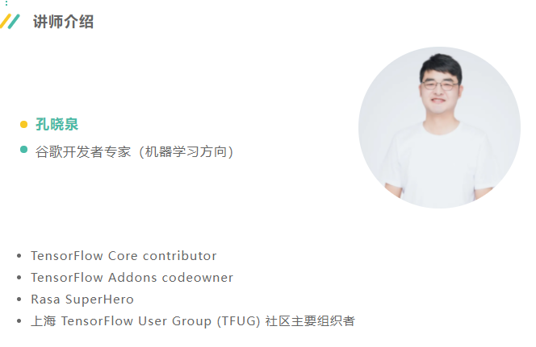

> **注：本博文的所有内容和图片均来着 孔晓泉孔大佬的分享 PPT,如有侵权，麻烦告知删除！！！**

## 目录

- [《【社区说】一起来聊聊 Rasa 3.0》 不完全笔记](#社区说一起来聊聊-rasa-30-不完全笔记)
  - [前言](#前言)
  - [目录](#目录)
  - [一、Chatbot 结构](#一chatbot-结构)
    - [1.1 NLU 介绍](#11-nlu-介绍)
    - [1.2 对话管理（DM） 介绍](#12-对话管理dm-介绍)
    - [1.3 NLG](#13-nlg)
  - [二、算法工程师的 看不见的 90% 工作](#二算法工程师的-看不见的-90-工作)
  - [三、Rasa 简介](#三rasa-简介)
  - [四、Rasa 架构](#四rasa-架构)
    - [4.1 从 宏观角度看 Rasa](#41-从-宏观角度看-rasa)
    - [4.2 功能模块](#42-功能模块)
      - [4.2.1 组件配置](#421-组件配置)
      - [4.2.2 Domain 数据](#422-domain-数据)
      - [4.2.3 Rasa NLU](#423-rasa-nlu)
      - [4.2.4 Rasa Core](#424-rasa-core)
        - [4.2.4.1 Policy](#4241-policy)
        - [4.2.4.2 Tracker](#4242-tracker)
      - [4.2.5 Rasa SDK](#425-rasa-sdk)
      - [4.2.6 Rasa CLI](#426-rasa-cli)
  - [五、为什么说 Rasa 是工业级产品？](#五为什么说-rasa-是工业级产品)
  - [六、Rasa X](#六rasa-x)
  - [七、Rasa 架构 带来的启示](#七rasa-架构-带来的启示)
  - [八、Rasa 3.0](#八rasa-30)
    - [8.1 Rasa 3.0 介绍](#81-rasa-30-介绍)
    - [8.2 Rasa2.0 -> Rasa3.0 你必须知道的事](#82-rasa20---rasa30-你必须知道的事)
      - [8.2.1 对 普通开发者影响](#821-对-普通开发者影响)
      - [8.2.2 对 写自定义组件的影响](#822-对-写自定义组件的影响)
      - [8.2.3 对研究 Rasa 代码的人的影响](#823-对研究-rasa-代码的人的影响)
  - [九、Rasa 2.0 小小笔记](#九rasa-20-小小笔记)
    - [9.1 学习篇](#91-学习篇)
    - [9.2 实战篇](#92-实战篇)
  - [参考](#参考)

## 一、Chatbot 结构

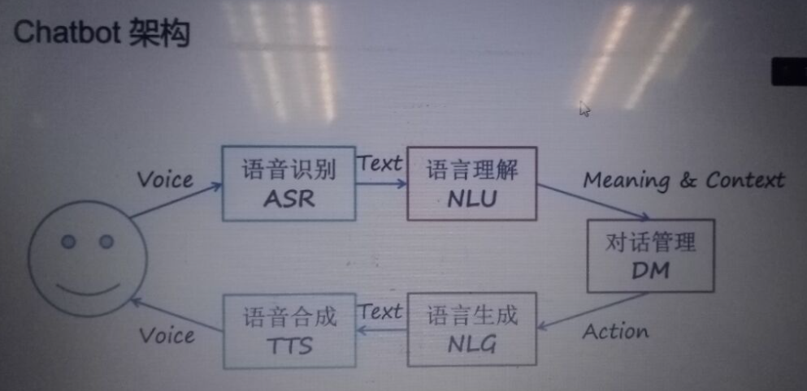

### 1.1 NLU 介绍

- 功能：
  - 将非结构的文本转化为结构化语义（意图和槽位）；
  - 将无限种可能转化成有限组合
- NLU 要做的事：
  - 意图识别
  - 槽位提取

### 1.2 对话管理（DM） 介绍

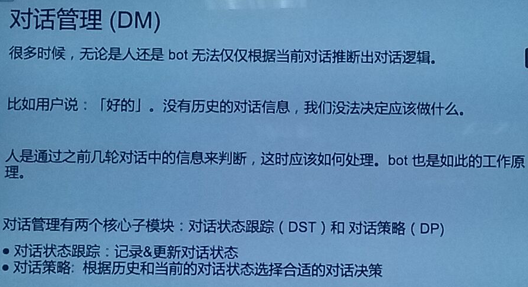

### 1.3 NLG

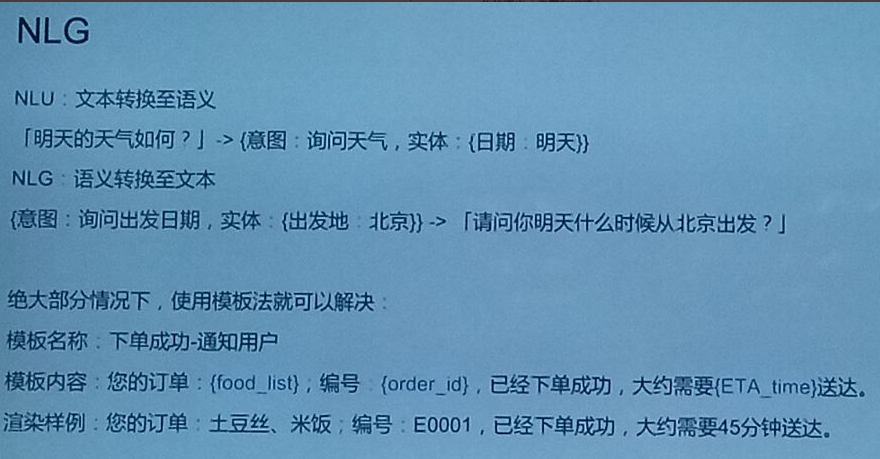

## 二、算法工程师的 看不见的 90% 工作

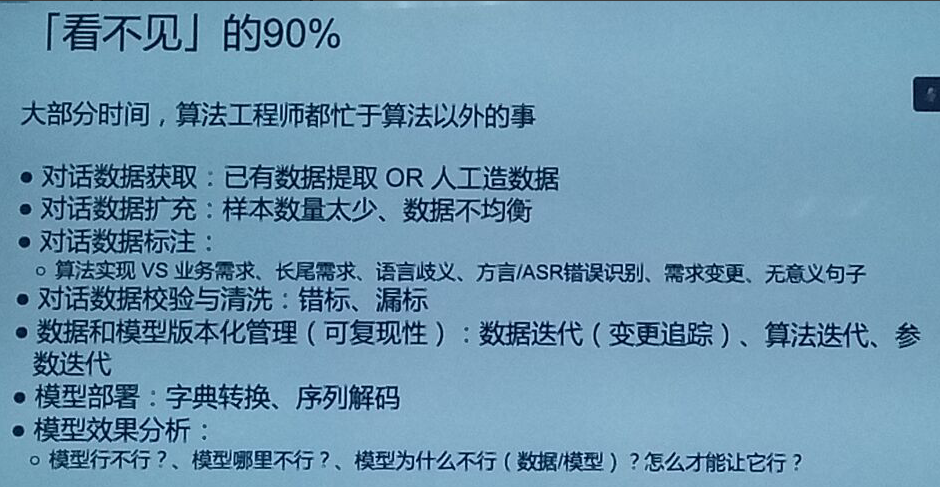

1. 对话数据获取:已有数据提取OR人工造数据
2. 对话数据扩充:样本数量太少、数据不均衡
3. 对话数据标注:  算法实现VS业务需求、长尾需求、语言歧义、方言/ASR错误识别、需求变更、无意义句子
4. 对话数据校验与清洗:错标、漏标
5. 数据和模型版本化管理(可复现性) : 数据迭代(变更追踪)、算法迭代、参数迭代
6. 模型部署:字典转换、序列解码
7. 模型效果分析: 模型行不行?、模型哪里不行?、模型为什么不行(数据/模型) ?怎么才能让它行?

## 三、Rasa 简介

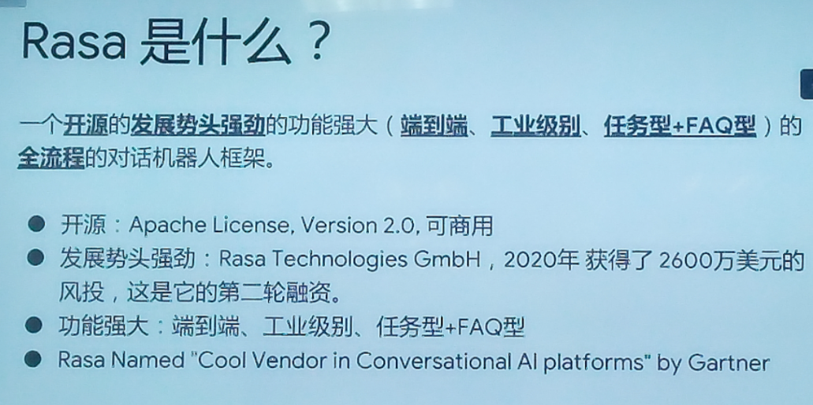

- 特点：
  - 开源：Apache License, Version 2.0,可商用
  - 发展势头强劲
    - Rasa Technologies GmbH
    - 2020年获得了2600万美元的风投,这是它的第二轮融资
  - 功能强大
    - 端到端
    - 工业级别
    - 任务型+FAQ型

## 四、Rasa 架构

### 4.1 从 宏观角度看 Rasa 

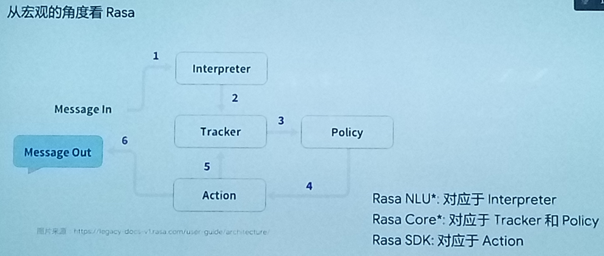
> 从 宏观角度看 Rasa 

### 4.2 功能模块

#### 4.2.1 组件配置

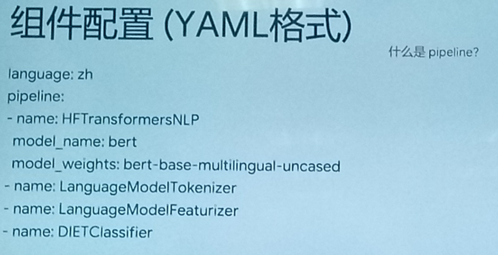

> 注：大佬分享干货太多来不及记，具体可以查看：  [（九）RASA自定义pipeline组件](https://mp.weixin.qq.com/s/Q5Z_n9yiLk2YcnpFLGzBqQ)

#### 4.2.2 Domain 数据

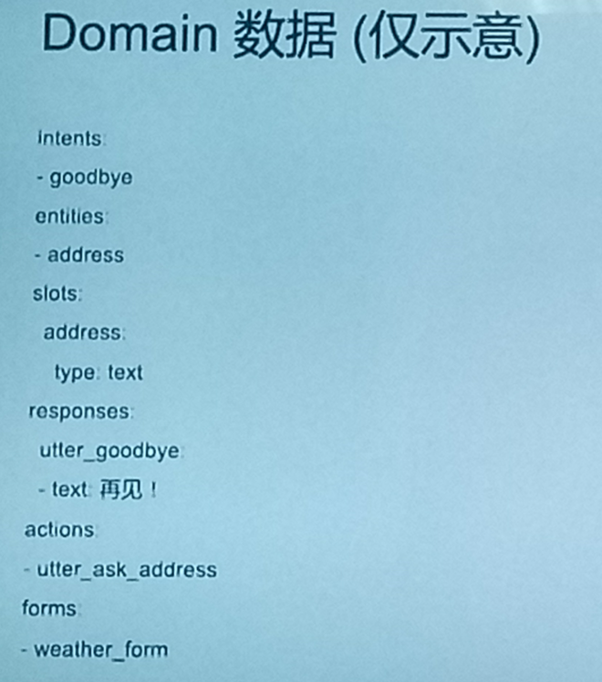

> 注：大佬分享干货太多来不及记，具体可以查看：  [（十二）RASA Domain](https://mp.weixin.qq.com/s/4O18bSNH-U8kjxRzRn4Mfg)

#### 4.2.3 Rasa NLU

意图识别+槽位提取

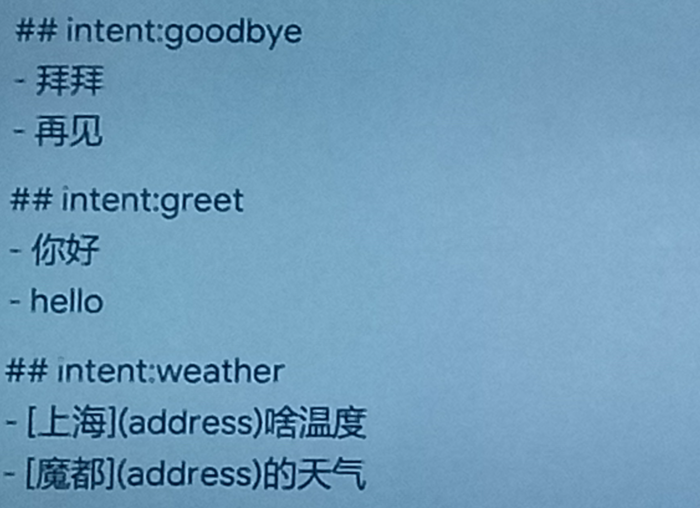
> 训练数据格式

> 注：大佬分享干货太多来不及记，具体可以查看： [（三）RASA NLU语言模型](https://mp.weixin.qq.com/s/Hc0ggnu9Twav4y3p6LLguA)

#### 4.2.4 Rasa Core

##### 4.2.4.1 Policy

- 介绍：Policy是负责决策Action的调用在Tracker的状态发生变更之后，Policy来决定下一步的Action。

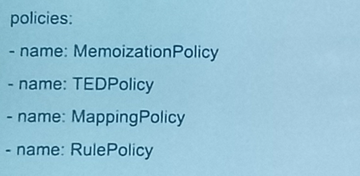
> 数据格式

1. 基于 规则 Policy类型
2. 基于 记忆 Policy类型
   1. MemoizationPolicy:当用户当前的对话状态和训练数据中的某个story状态完全一致时 ，那么就使用story中的后续动作作为输出。
3. 基于 DNN 预测 Policy类型：KerasPolicy

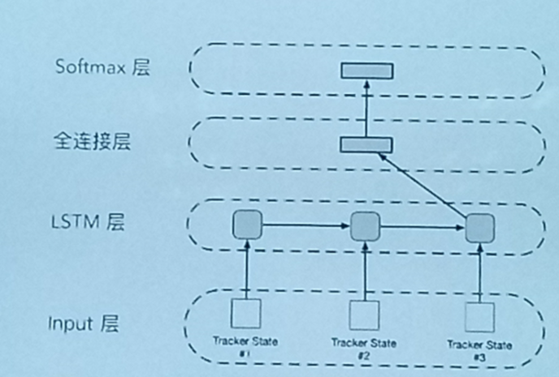

4. 基于编程 Policy类型：一般使用 表单

5. Policy Ensemble
   1. 问题：当有 多个 Policy 时，怎么办？
   2. 解决方法: 所有的Policy 同时预测，按照得分取结果, 得分相同时，按优先级去结果

> 注：大佬分享干货太多来不及记，具体可以查看：[（十）RASA CORE Policy](https://mp.weixin.qq.com/s/YBoGv_IUVZElQMxHZ68Wcw)

##### 4.2.4.2 Tracker

在Rasa Core中Tracker负责记录整个对话的流程，而Tracker中数据的新增、编辑和删除是通过Event进行管理的。

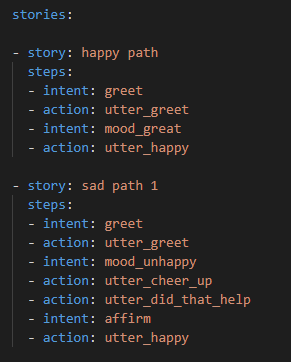
> 训练数据 Story (Markdown 格式)

#### 4.2.5 Rasa SDK

- Action：Action是对用户输入的一种回应
  - default actions (action_listen, action_restart, action_default_fallback)
  - utter actions, starting with utter_, which just sends a message to the user.
  - custom actions - any other action, these actions can run arbitrary code

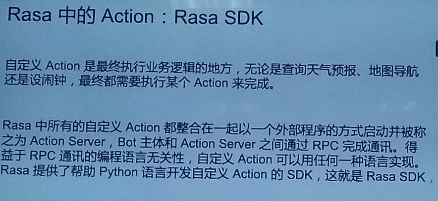

- 自定义Action：最终执行业务逻辑的地方，无论是查询天气预报、地图导航还是设闹钟，最终都需要执行某个Action来完成。

- Rasa SDK 介绍：Rasa中所有的自定义Action都整合在一起以一个外部程序的方式启动并被称之为Action Server，Bot主体和Action Server之间通过RPC完成通讯。得益于RPC通讯的编程语言无关性，自定义Action可以用任何一一种语言实现。Rasa提供了帮助Python语言开发自定义Action的SDK ,这就是Rasa SDK。

#### 4.2.6 Rasa CLI

- rasa init：在指定目录下 创建 一个 Rasa 项目
- rasa train：从训练数据中训练 完整的 Rasa 模型
- rasa run action：启动 Action Server
- rasa run：启动 Rasa 服务器，对外提供服务

## 五、为什么说 Rasa 是工业级产品？

- RPC式组件实现: 有利于多语言多团队合作开发
  - NLU/Action/NLG都可以本地调用也可以远程RPC
- 能可扩展性: 适应复杂多变的业务需求
  - NLU Core组件:可以自定义实现
  - 对外接口可扩展:支持多种客户端协议
- 部署可扩展:支持海量客户
  - tracker store :无状态服务器
  - Locker store :避免乱序
- 中心化管理:
  - manager API从外部管理bot
  - cloud model storage :统的模型存储
- 自动化的端到端测试
- 交互式学习:构造story更容易

## 六、Rasa X 

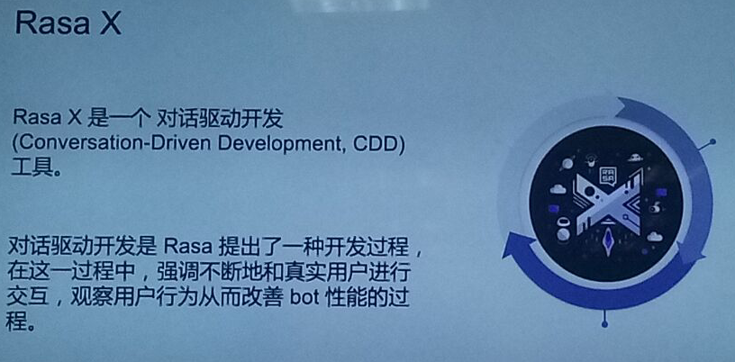

- 对话驱动开发(Conversation-Driven Development, CDD)工具
- 对话驱动开发是Rasa提出了一种开发过程在这一过程中,强调不断地和真实用户进行交互，观察用户行为从而改善bot性能的过程。

## 七、Rasa 架构 带来的启示

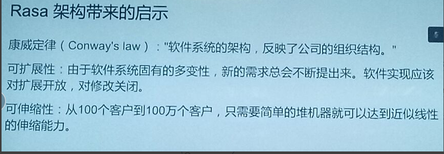
> Rasa 架构 带来的启示

- 康威定律( Conway's law ) :  "软件系统的架构，反映了公司的组织结构。”
- 可扩展性:  由于软件系统固有的多变性，新的需求总会不断提出来。软件实现应该对扩展开放,对修改关闭。
- 可伸缩性: 从100个客户到100万个客户，只需要简单的堆机器就可以达到近似线性的伸缩能力。

## 八、Rasa 3.0

### 8.1 Rasa 3.0 介绍

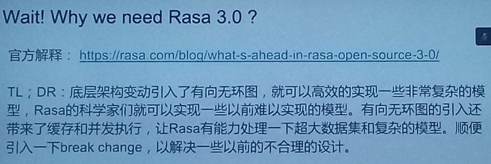

- 官网：https://rasa com/bloq/what-s-ahead-in-rasa-open-source -3-0/
- 介绍：
  - 底层架构变动引入了有向无环图,就可以高效的实现一-些非常复杂的模型，Rasa的科学家们就可以实现-些以前难以实现的模型。
  - 有向无环图的引入还带来了缓存和并发执行，让Rasa有能力处理一下超大数据集和复 杂的模型。
  - 顺便引入一下break change，以解决一些以前的不合理的设计。

### 8.2 Rasa2.0 -> Rasa3.0 你必须知道的事

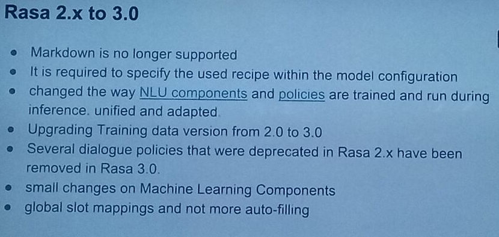

#### 8.2.1 对 普通开发者影响

- Markdown is no longer supported
  - 解决方案: Rasa2.X提供了命令行工具，可以将数据从Markdown格式转换成YAML格式
- It is required to specify the used recipe within the model configuration

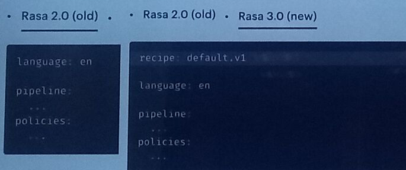

- Upgrading Training data version from2.0 to 3.0
  - 解决方案:直接把训练文件中的version: "2.0"改成version: "3.0"
- Several dialogue policies that were deprecated in Rasa 2.x have been removed in Rasa 30.
  - 解决方案:按照官方文档做迁移就行
- small changes on Machine Learning Components
  - 解决方案:通常情况下改动后的版本效果更好，所以一般情况下不做处理。if not，根据官方文档中，更改配置即可切换回以前的版本。

#### 8.2.2 对 写自定义组件的影响

- global slot mappings and not more auto fill
  - 解读: Rasa 2.0里面的slot mapping是在表单中定义的，现在每个slot的mapping都在slot的配置中指定。原来的slo和实体之间默认是可以进行自动填充的，现在必须显式指定。
  - 解决方案: 按照官方文档来更新配置即可。

#### 8.2.3 对研究 Rasa 代码的人的影响 

- changed the way NLU components and policies are trained and run duringinference. unified and adapted.
  - 解读: 原来是线性的pipeline，现在用的是有向无环图( DAG )。训练和推理的逻辑都发生了变化。内部结构(尤其是底层)变化很多。同时代码逻辑难度增加不少
  - 解决方法：解决办法:建议从入口( entry point )开始读。重点关注配置到图( graph )的转变过程。可以使用程序断点观察实例和验证自己的理解。测试代码可以帮助理解。使用诸如sourcetrial等专业的代码阅读工具。

## 九、Rasa 2.0 小小笔记

### 9.1 学习篇

- [（一）对话机器人概述](https://mp.weixin.qq.com/s/drwKUXIsmMBY_W4-BmMppQ)
- [（二）RASA开源引擎介绍](https://mp.weixin.qq.com/s/d_EtuAax3mJ3eCdIu8YKNQ)
- [（三）RASA NLU语言模型](https://mp.weixin.qq.com/s/Hc0ggnu9Twav4y3p6LLguA)
- [（四）RASA NLU分词器](https://mp.weixin.qq.com/s/E0yWpSEFyQNJW5KI7RuMzg)
- [（五）RASA NLU特征生成器](https://mp.weixin.qq.com/s/pYHJiOWn755uv1KbBkhFlg)
- [（六）RASA NLU意图分类器](https://mp.weixin.qq.com/s/NaF6ugxjwufeA5Ezj0gEHQ)
- [（七）RASA NLU实体提取器](https://mp.weixin.qq.com/s/OxFgOe00L2UjpHoxYHzh_g)
- [（九）RASA自定义pipeline组件](https://mp.weixin.qq.com/s/Q5Z_n9yiLk2YcnpFLGzBqQ)
- [（十）RASA CORE Policy](https://mp.weixin.qq.com/s/YBoGv_IUVZElQMxHZ68Wcw)
- [（十一）RASA CORE Action](https://mp.weixin.qq.com/s/B-RITgn4OagCrEiMZPn_Lw)
- [（十二）RASA Domain](https://mp.weixin.qq.com/s/4O18bSNH-U8kjxRzRn4Mfg)
- [（十三）RASA 训练数据](https://mp.weixin.qq.com/s/2HyQAUV02ziqQ0ZPGvLH7Q)
- [（十四）RASA story](https://mp.weixin.qq.com/s/ovFF8fb1qrxh-MH-R_Namw)
- [（十五）Rasa Rules](https://mp.weixin.qq.com/s/lDDDI1S51gsiXfYkbIYWfQ)
- [（十六）RASA最佳实践](https://mp.weixin.qq.com/s/ork9WzlaIOvtbm0jJro7JQ)
- [（十七）基于RASA开始中文机器人](https://mp.weixin.qq.com/s/4l4ePC-BOzlb8QMgPIZ8Ew)
- [（十八）基于RASA开始中文机器人实现机制](https://mp.weixin.qq.com/s/1mywqJO1AemYghHDquOhjw)
- [（十九）基于知识图谱的问答系统（KBQA）](https://mp.weixin.qq.com/s/MyxvBHzVnepo9jTQ-SlNPQ)
- [（二十）基于阅读理解的问答系统](https://mp.weixin.qq.com/s/SDjGoz8mPQ9yD5alMs9MlA)
- [（二十一）RASA应用常见问题](https://mp.weixin.qq.com/s/c9OdDa0mmyAefRcmcE4CJg)
- [（二十二）RASA的超参数优化](https://mp.weixin.qq.com/s/dk-DpfolasBiGiFfUqcBGg)
- [（二十三）机器人测试与评估](https://mp.weixin.qq.com/s/OK5p2Dbv-VW1QRN7L8GemA)
- [（二十四）利用Rasa Forms创建上下文对话助手](https://mp.weixin.qq.com/s/TN0y7BSGAogOKwceNuOwhw)
- [DIET：Dual Intent and Entity Transformer——RASA论文翻译](https://mp.weixin.qq.com/s/LMgNlxMSnnEpAMoiySMdaw)

### 9.2 实战篇

- [rasa_ch_faq](https://github.com/Dustyposa/rasa_ch_faq)
- [基于 Rasa 的前端项目](https://github.com/Dustyposa/rasa_bot_front)

## 参考

1. [【社区说】一起来聊聊 Rasa 3.0](https://mp.weixin.qq.com/s/7-YxI6eFRL0jqT_1IrTP8Q)

