# 【关于 MSN】 那些你不知道的事

> 作者：杨夕

> 论文名称：Multi-hop Selector Network for Multi-turn Response Selection in Retrieval-based chatbots
> 
> 论文地址：https://www.aclweb.org/anthology/D19-1011.pdf
> 
> 论文项目：https://github.com/chunyuanY/Dialogue
> 
> 项目地址：https://github.com/km1994/nlp_paper_study
> 
> 个人介绍：大佬们好，我叫杨夕，该项目主要是本人在研读顶会论文和复现经典论文过程中，所见、所思、所想、所闻，可能存在一些理解错误，希望大佬们多多指正。

## 目录

- [【关于 MSN】 那些你不知道的事](#关于-msn-那些你不知道的事)
  - [目录](#目录)
  - [一、动机](#一动机)
  - [二、论文方法](#二论文方法)
  - [三、模型介绍](#三模型介绍)
    - [3.1 变量定义](#31-变量定义)
    - [3.2 目标](#32-目标)
    - [3.3 模型介绍](#33-模型介绍)
      - [3.3.1 Attention Module](#331-attention-module)
      - [3.3.2 Context Selector](#332-context-selector)
      - [3.3.3 Context Fusion](#333-context-fusion)
      - [3.3.4 Utterance-Response匹配](#334-utterance-response匹配)
      - [3.3.5 聚合](#335-聚合)
  - [参考](#参考)

## 一、动机

1. 上下文拼接问题：将候选回复与上下文utterance在多粒度级别进行匹配，这种方式忽略了使用过多的上下文信息带来副作用。
2. 根据直接，一般来说距离回复越近的utterance，越能够反应最终轮对话的意图。所以，我们首先使用最后一个utterance作为key去选择word级别和sentence级别上相关的上下文回复。然而，我们发现**许多样本中最后一个utterance都是一些短句并且很多都是无效信息**（比如good, ok）

## 二、论文方法

- 提出一种多跳选择网络（multi-hop selector network, MSN）
  - s1 ：采用 多跳选择器从 上下文集 中 选取最相关的上下文 utterances，并生成 k 个 不同的上下文；
  - s2 : 融合 k 个 上下文 utterance ，并与候选回复做匹配；
  - s3 : 匹配截取，采用 CNN 提取匹配特征，并 用 GRU 学习 utterance 间的临时关系；

## 三、模型介绍

### 3.1 变量定义

- 对于 数据集 D={Ui,ri,yi}，N=1,...,N
  - Ui = {ui1,ui2,..,uiL} ：对话 L 个上下文 utterance，uij = {v1,..,vT}；
  - ri： 候选回复；
  - yi = 0 or 1 ：标签

### 3.2 目标

1. 如何 从 Ui 中 选取 合适的上下文 utterance；
2. 如何将选择的 utterance 融合 得到 更好的 表征；

### 3.3 模型介绍

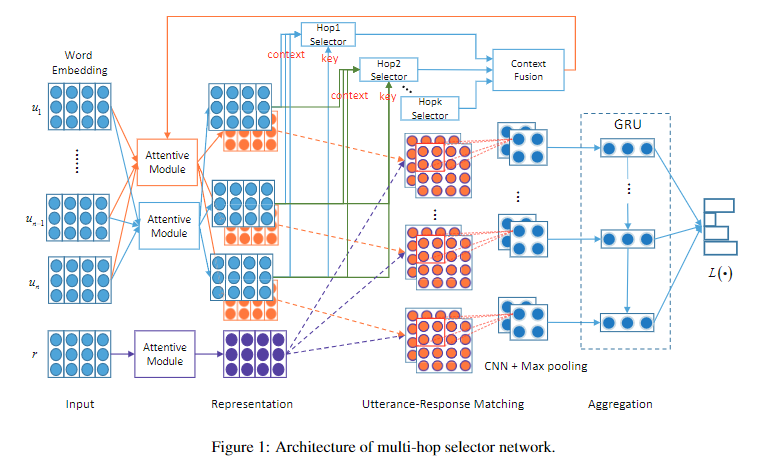

#### 3.3.1 Attention Module 

- 目标：构建 词级别的语义表征；
- 结构：Multi-head Attention的一种变体

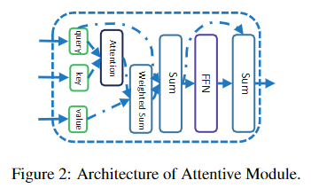

- 思路：

1. 设置 Q、K、V (维度分别为 nq*d、nk*d、nv*d，d 为词向量维度)；
2. Attention 计算

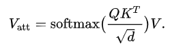

3. 接着对上面的结果进行归一化处理，经过一个使用RELU作为激活函数的FFN，进一步处理融合之后的embeddings

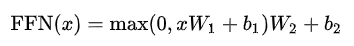

> x 是一个2D矩阵，形状和query Sentence Q 相同；FFN的输出是形状和 x 相同的2D矩阵。

将输出结果使用残差的方式加上 x，经过归一化之后得到最终的输出。

#### 3.3.2 Context Selector

1. 重建 单词表征

给定 Ui={ui1,...,uij,...,uiL}，其中 uij 为 2D 矩阵，表示每个 utterance 中 单词的向量表征，使用 Attention Module 重建单词表征向每一个单词的表征中编码进上下文依赖信息，即：

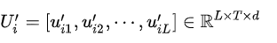

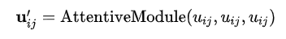

2. Word Selector

- Word Selector：在单词层级上获取最后一句话与其他语句之间的关联

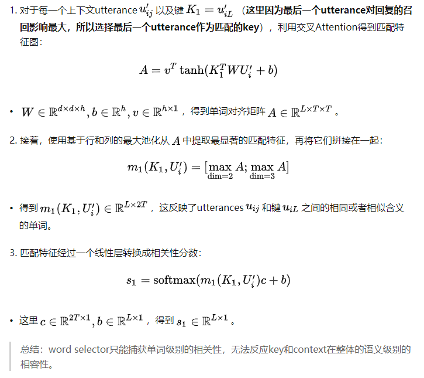

3. Utterance Selector

- Utterance Selector：在句子层级上获取最后一句话与其他语句之间的语义信息

4. Hopk Selector

- Hopk Selector：n是指根据前n个句子的信息对之前的多轮对话进行筛选（虽然复杂，但是很合理）。以1跳选择器为例，仅依赖上一句话

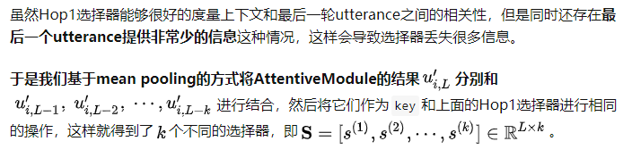

#### 3.3.3 Context Fusion

- 目标：将k个选择器的相似度得分进行整合，选择得分较高的句子
  
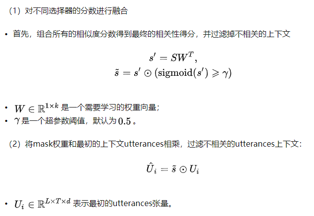

#### 3.3.4 Utterance-Response匹配

- 介绍：将筛选得到的信息和候选响应进行匹配，论文给出三种匹配方法：Origin Matching、Self Matching和Cross Matching。根据前一阶段得到的筛选语句集和候选响应，Origin Matching是直接计算两者在词级别上的点积和余弦相似度；Self Matching如图中橙色线条所示，将多跳选择器的Context Fusion和候选响应再次进行注意力操作，注意，由于经过MSN，此时的Context Fusion已经学习到不同句子之间的词相关性，如此的“回锅肉”操作是会为多轮对话的表示增加更丰富有用的信息，妙啊！之后的操作同之前一样，计算点积和余弦相似度；Cross Matching与Self Matching基本相同，唯一的区别在于多轮对话和候选响应的注意力表示操作是相互之间的，作者说这样是为了学习相互之间的依赖关系，使表示更丰富。

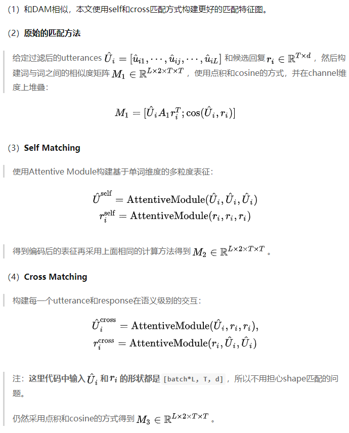

#### 3.3.5 聚合

- 介绍：应用2D CNN和最大池化操抽取配词级别匹配矩阵的特征，将特征输入给GRU，建模多轮对话的上下文时序关联。最后，应用单层感知机计算多轮与候选响应的得分。

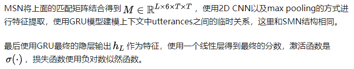

## 参考

1. [[论文] MSN-用于多轮回复召回的多跳选择器网络](https://zhuanlan.zhihu.com/p/94327048)
2. [(Chatbot paper解读)Multi-hop Selector Network for Multi-turn Response Selection in Retrieval-based Chatbots](https://tmylla.github.io/2020/10/16/MSN_Multiturn_Chatbots_EMNLP2019/)