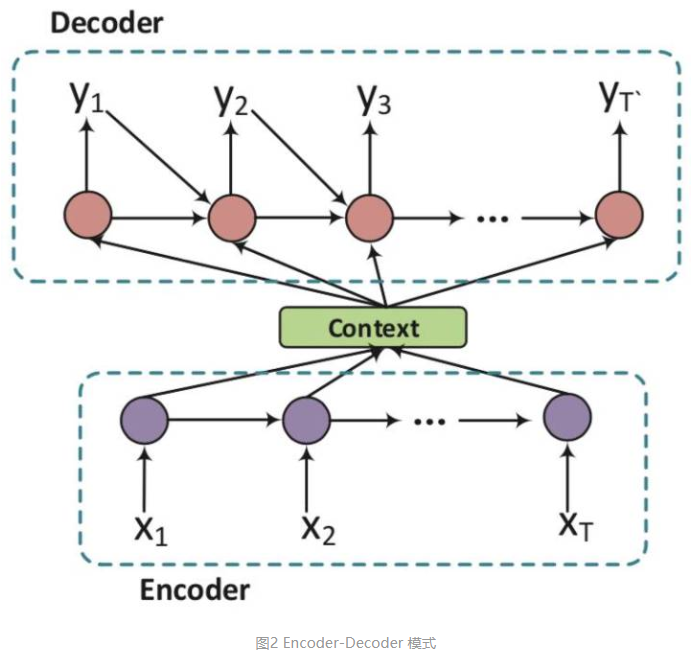

# 对话系统

> 译者：哈工大SCIR本科生 文灏洋（指导老师：车万翔）
> 
> 地址：https://zhuanlan.zhihu.com/p/45210996
> 
> 转载：杨夕
> 
> 地址：https://github.com/km1994/relation_extraction_study/tree/master/QA_study
> 
> 思维导图：https://shimo.im/mindmaps/gN9AlwSxna0iU2JN
> 
> 论文：A Survey on Dialogue Systems: Recent Advances and New Frontiers
> 
> 原文：https://link.zhihu.com/?target=https%3A//arxiv.org/abs/1711.01731v1

## 摘要

对话系统已经越来越引起人们的注意。对话系统的最新进展绝大多数是由深度学习技术所贡献的，这些技术已经被用来强化各类大数据应用，如计算机视觉，自然语言处理和推荐系统。对于对话系统，深度学习技术可以通过利用大规模数据来学习有意义的特征表示和回复生成策略，同时只需要极少量手工特征。在这篇文章中，我们从不同视角，对近期对话系统的进展进行概述，并讨论一些可能的研究方向。具体而言，我们将现有对话系统大致分为了面向任务型与非面向任务型两种模型，然后描述深度学习是如何利用表示算法提升现有性能，最后讨论一些引人注目的、可以带领对话系统研究进入新的高度的研究方向。

## 一、引言

长久以来，拥有一个有着足够智能的虚拟助手或聊天伴侣系统看上去都是虚幻的、是存在于科幻电影中的情节。最近，人机对话因其潜力巨大，诱人的商业价值而备受关注。随着大数据和深度学习技术的发展，创建一个自动人机对话系统作为我们的个人助理或聊天伴侣的目标不再是一种幻想。一方面，我们可以很容易地获取互联网上的对话“大数据”，从而对于（几乎）任何输入学习如何回复。这使我们可以建立数据驱动的，开放域的人机对话系统。另一方面，深度学习技术已经被证明在识别大数据中的复杂模式上是有效的，并且已经驱动了许多研究领域的研究工作，如计算机视觉、自然语言处理和推荐系统。因此，大量的利用深度学习和海量数据来促进对话系统发展的文献涌现出来。

根据其具体应用，对话系统大致可以分为两类：（1）面向任务的系统和（2）非面向任务的系统（也称为聊天机器人）。

**面向任务的系统旨在帮助用户完成某些任务（例如查找产品，预订住宿和餐馆）**。如图1所示，广泛应用于面向任务的对话系统的方法是将对话回复作为一个流水线来处理。
该系统步骤如下：

- 首先理解人类给出的信息，将其表示为一个内部状态；
- 然后根据策略和对话状态选择一些动作；
- 最后把动作转化为自然语言的表达形式。
  
尽管语言理解是通过统计模型来处理的，但是大多数已部署的对话系统仍然使用人工特征或人工编写的规则来处理状态和动作空间的表示，意图检测和槽填充。这不仅使得部署真正的对话系统耗费大量时间，而且还限制了其在其他领域进行使用的能力。最近，许多基于深度学习的算法通过学习高维分布式特征表示来缓解这些问题，并在一些方面取得了显著的进步。此外，还有尝试建立端到端的面向任务的对话系统，这种对话系统可以扩展传统流水线系统中的状态空间表示，并有助于生成任务特定语料库以外的对话。

**非面向任务的系统在与人类交互过程中提供合理的反应和娱乐**。通常，非面向任务的系统致力于在开放域与人交谈。虽然非面向任务的系统似乎在进行闲聊，但是却在许多实际的应用程序中占有一席之地。 

一般而言，针对非面向任务的系统开发了两种主要方法：

（1）生成方法，例如seq2seq模型，其在对话过程中产生适当的回复;

（2）基于检索的方法，学习从数据库中选择当前对话的回复。

近年来大数据和深度学习技术的发展，极大地推动了面向任务型和非面向任务型的对话系统的发展，促进了对话系统中大量的基于深度学习的研究。在这篇文章中，我们的关注点是（1）概述对话系统，尤其利用深度学习的最新进展；（2）讨论可能的研究方向。

文章的剩余部分的组织如下。在第二节中，我们回顾了面向任务的对话系统，包括流水线和端到端的方法。在第三节中，我们首先介绍包括当下流行模型和热门研究课题等的神经生成方法; 然后详细介绍基于检索的方法。在第四部分，我们通过一些研究方向的讨论进行总结。

## 二、面向任务的对话系统

面向任务的对话系统一直是口语对话系统的重要分支。在本节中，我们将回顾面向任务的对话系统的流水线方法和端到端方法。

### 2.1 流水线方法

基于流水线的面向任务的对话系统的典型结构如图1所示。它包含了四个关键部分：

- 语言理解。它被称为自然语言理解（NLU），它把用户话语解析为预定义的语义槽。
- 对话状态跟踪器。它管理每一轮的输入与对话历史，输出当前对话状态。
- 对话策略学习。它根据当前对话状态学习下一步动作。
- 自然语言生成（NLG）。它将选择的动作映射到其表层，生成回复。

在接下来的小节中，我们将详细介绍每个部分的SOTA算法。

#### 2.1.1 语言理解

给定一句话，自然语言理解将其映射到语义槽中。这些槽都是根据不同场景预设而成。表1展示一个自然语言表示的例子，其中“New York”是一个语义槽的值的位置，并且还确定了其领域和意图。通常我们需要进行两种类型的表示。第一种是句子级别的分类，例如用户意图和句子种类。第二种是词级别的信息抽取，例如命名实体识别和槽填充。

**意图检测是用来检测用户的意图的。它把一句话分类为预先设定的意图之一。**深度学习技术已经陆续应用于意图检测[10;73;99]。特别地，[19]采用卷积神经网络（CNN）提取询问向量表示询问分类的特征。这种基于CNN的分类框架也类似于[22]和[64]。相似的方法同样被用于领域的分类中。

**槽填充是口语语言理解的另一个具有挑战性的问题。与意图检测不同，槽填充通常被定义为序列标注问题，其中句子里的词语被标上语义标签。 输入是由一系列单词组成的句子，输出是一个槽/概念的索引序列，每个单词一个。**[11]和[10]使用深度信念网络（DBN），与CRF方法相比取得了优异的结果。

[41;102;56;100]使用RNN进行槽填充。由NLU生成的语义表示由对话管理模块进一步处理。典型的对话管理部分包括两个阶段——对话状态跟踪和策略学习。

#### 2.1.2 对话状态跟踪

**跟踪对话状态是确保对话系统健壮性的核心组成部分。它会在每一次对话中估计用户的目标。对话状态$H_t$表示到时间t为止的对话历史的表示。这种经典的状态结构通常被称为槽填充或语义框架。**在大多数商业实现中被广泛使用的传统方法通常采用手工制定的规则来选择最可能的结果[17]。然而，这些基于规则的系统容易出现频繁的错误，因为最可能的结果并不总是理想的结果[88]。

统计对话系统在有噪声的条件和模糊性下[104]，维护了对真实对话状态的多重假设的分布。在对话状态跟踪挑战（DSTC）[87;86]中，生成结果的形式是每轮对话每个语义槽的值的概率分布。各种统计方法，包括复杂的手工制定规则[80]，条件随机场[28;27;53]，最大熵模型[85]和网络风格排名[88]都出现在了对话状态跟踪挑战（DSTC）的共享任务中。

最近，[20]引入了信念追踪的深度学习。 它使用一个滑动窗口输出任意数量的可能值的一系列概率分布。虽然它是在某一个领域的训练出来的，但它可以很容易地转移到新的领域。[48]开发了多领域RNN对话状态跟踪模型。它首先使用所有可用的数据来训练一个非常泛化的信念跟踪模型，然后对每一个特定领域利用这个泛化模型进行专门化，从而学习领域特定的行为。[49]提出了一个神经信念跟踪器（NBT）来检测槽值对。它将用户输入之前的系统对话动作，用户话语本身以及一个候选的需要判断是否出现的槽-值对作为输入，通过遍历所有的槽-值对来判断哪些已经被用户所表达出来。

#### 2.1.3 策略学习

以从状态跟踪器获得的状态表示作为条件，策略学习将产生下个可用的系统动作。无论是监督学习还是强化学习都可以被用于优化策略学习。通常，基于规则的智能体将被用于热启动系统[86]，然后利用规则生成的动作进行监督学习。在在线购物场景中，如果对话状态是“推荐”，那么“推荐”动作将被触发，系统将会从产品数据库中检索产品。如果状态是“比较”，系统则会比较目标产品/品牌[98]。对话策略可以通过进一步端到端的强化学习进行训练，以引导系统朝着最终性能做出决策。[9]在对话策略中利用深度强化学习，同时学习特征表示和对话策略。该系统超过了包括随机、基于规则和基于监督学习的基线方法。

#### 2.1.4 自然语言生成

自然语言生成将抽象的对话动作转化为自然语言的浅层表达。正如[68]中提到的，一个好的生成器通常依赖于几个因素：充分性、流畅性、可读性和变化性。NLG的传统方法通常采用句子规划。它将输入的语义符号映射为中间形式的表示，利用树状或者模板结构，然后把这些中间结构通过表层实现来转化为最终的回复[77;69]。

[81]和[82]引入了基于神经网络（NN）的NLG方法，其基于LSTM的结构类似于RNNLM [42]。对话动作类型和槽-值对被转化为一个1-hot控制向量，作为附加的输入，来确保生成的句子表达确定的意图。[81]使用一个正向RNN生成器，一个CNN重排器与一个后向RNN重排器。所有的子模块通过共同优化来产生以固定对话动作为条件的句子。为了解决在表层实现中槽信息缺失和重复的问题，[82]使用了额外的控制单元来门控对话动作。[72]通过利用对话动作来选择LSTM的输入向量，扩展了这一方法。这个问题后来通过多步调整扩展到多领域场景[83]。[110]采用基于编码器-解码器的基于LSTM的结构来结合问题信息，语义槽值和对话动作类型来生成正确答案。它使用注意力机制来关注解码器当前解码状态的关键信息。通过编码对话动作类型嵌入，基于神经网络的模型可以生成许多不同动作类型的回复答案。[14]还提出了一种基于seq2seq的自然语言生成器，可以被训练用于利用对话动作输入来产生自然语言和深度语法树。这种方法后来利用之间用户的话语和回复进行了扩展[13]。它使模型能够使用户适应（说话）的方式，从而提供适当的回复。

### 2.2 端到端方法

传统的面向任务的对话系统尽管有许多领域特定的手工操作，但这导致其很难适应新的领域[4]；[107]进一步指出，**面向任务的对话系统的传统流水线方法还有两个主要缺陷。一个是分数分配问题，最终用户的反馈很难会传到上游模块中。第二个问题是处理是相互依赖。每个模块的输入都依赖于另一个模块的输出，当调整一个模块到一个新环境或者用新数据进一步更新，所有其他模块都要进行相对应的调整以保证全局的优化。槽和特征可能也会相对应的改变。这种过程需要大量的人工操作。**

随着近年来端到端生成模型的不断发展，进行了许多端到端可训练的用于面向任务的对话系统的框架的尝试。请注意，当我们介绍非面向任务的系统时，将会关注于神经生成模型的更多细节。**端到端模型不再使用传统的流水线，而是使用一个模块，并使其与结构化的外部数据进行交互。**[84]和[4]引入了一个基于神经网络的端到端可训练的面向任务的对话系统。这个系统将对话系统的学习当做学习一个从对话历史到系统回复的映射，利用编码器-解码器模型训练整个系统。然而，这个系统是以监督学习方式进行训练的——不仅需要大量的训练数据，而且由于缺乏对训练数据中对话控制的探索，也可能无法健壮地找到一个好的策略。[107]首先提出了一个端到端的强化学习方法，在对话管理中共同训练对话状态跟踪和政策学习，以便更好地优化系统动作。在对话中，智能体询问用户一系列是/否问题来找到正确的答案。这种方法在应用于关于猜测用户脑海中想着的名人的面向任务的对话问题时体现出良好效果。[36]将端到端系统作为完成任务神经对话系统，其最终目标是完成一项任务，如电影票预订。

面向任务的系统通常需要在外部知识库上进行查询。之前的系统是通过向知识库产生符号化查询，利用其属性检索相关条目来实现。这种方法通常利用在输入上做语义分析来得到表示智能体对用户目标的信念[84;90;36]。这种方法有两个主要缺点：（1）检索结果不包含任何有关于语义分析不确定性的信息，（2）检索操作是不可导的，因此分析器与对话策略需要分别训练。一旦部署系统，这会使得从用户反馈中进行在线端到端学习变得十分困难。[15]受启发于键-值记忆网络[44]，通过一个在知识库条目上可导的基于注意力的键-值检索机制来增强现有循环神经网络结构。[12]将符号化询问替换为在知识库上一个导出的表达哪些条目用户较感兴趣的“软”后验概率。将软检索过程与强化学习相结合，[89]将RNN与特定领域知识相结合与系统回复模板相结合。

## 3. 非面向任务的聊天系统

与面向任务的对话系统旨在为用户完成特定任务不同，非面向任务的对话系统（也被称作聊天机器人）关注于在开放域上与人类进行交流[54]。一般来说，**聊天机器人是通过生成方法或者基于检索的方法来实现的**。**生成模型**能够产生更加适当的，在语料库中从未出现过的回复；而**基于检索的模型**则有着得到更富有信息与流畅程度的回复的优势[23]，因为它们通过回复选择算法，从存储库中为当前对话选择了一个适当的回复。在接下来的章节中，我们将首先介绍近年来最流行的研究注意之一——神经生成模型，并讨论其缺点和可能的改进。然后，我们介绍在基于检索的模型中深度学习的最新进展。

### 3.1 神经生成模型

如今，Twitter和Reddit等社交媒体网站上可以进行大量的对话交流，提高了构建数据驱动模式的前景。 [54]提出了一种基于短语的统计机器翻译的生成概率模型[105]，以模拟微博上的对话。它将应对问题视为一个翻译问题，需要翻译成一个回复。然而，生成回复被发现翻译语言要困难得多。这可能是由于有大量看似合理的回复同时缺乏与输入之间短语的对齐关系造成的。在机器翻译中深度学习的成功应用，即神经机器翻译，激发了神经生成对话系统研究的热情。

在下面的小节中，我们首先介绍序列到序列（seq2seq）模型，神经生成模型的基础。然后，我们将讨论热门的研究课题，包括结合对话上下文，提高回复的多样性，建模主题和个性，利用外部知识库，交互式学习和评价。

#### 3.1.1 序列到序列模型

给定一个包含T个词的原序列（消息）

$$
X=\left(x_{1}, x_{2}, \ldots, x_{T}\right)
$$

和一个包含T'个词的目标序列（回复）

$$
Y=\left(y_{1}, y_{2}, \ldots, y_{T^{\prime}}\right)
$$

模型需要最大化给定X，生成Y的概率：

$$
p\left(y_{1}, \dots, y_{T} | x_{1}, \ldots, x_{T}\right)
$$

特别地，序列到序列模型（或seq2seq）是一种编码器-解码器结构。图2展示了这种结构。编码器依次读入X个词，利用循环神经网络（RNN）将其表示为一个上下文向量c，然后解码器利用c作为输入估计生成Y的概率。RNN编码器计算上下文向量c可以写做：

$$
\mathbf{h}_{t}=f\left(x_{t}, \mathbf{h}_{t-1}\right)
$$

其中 $h_t$ 是第t时刻的隐藏状态，f是一个非线性方程，比如长短期记忆单元（LSTM）[18]和门循环神经网络（GRU）[7]。c就是最后一个词的隐藏状态$h_t$。解码器是一个标准的RNN语言模型，加上额外的条件上下文向量c。第t时刻候选词的概率分布 $P_t$ 可被计算为：

$$
\mathbf{s}_{t}=f\left(y_{t-1}, \mathbf{s}_{t-1}, \mathbf{c}\right)
$$

$$
\mathbf{p}_{t}=\operatorname{softmax}\left(\mathbf{s}_{t}, y_{t-1}\right)
$$

其中 $\mathcal{S}_t$ 是RNN解码器t时刻的隐藏状态，$y_{t-1}$ 是t-1时刻回复的词。seq2seq的目标函数被定义为：

$$
p\left(\left(y_{1}, \ldots, y_{T^{\prime}} | x_{1}, \ldots, x_{T}\right)=p\left(y_{1} | \mathbf{c}\right) \prod_{t=2}^{T^{\prime}} p\left(y_{t} | \mathbf{c}, y_{1}, \ldots, y_{t-1}\right)\right)
$$

[2]通过加入注意力机制来提高性能。这种方法通过观察每个$Y$中的词与$X$中不同部分的联系，对于$Y$中的每个词生成不同的上下文向量$c$。特别地， $\mathcal{Y}_t$对应一个上下文向量 $\mathcal{c}_t$，而 $\mathcal{c}_t$ 是一个 $\mathbf{h}_1, \dots, \mathbf{h}_T$ 的加权平均：

$$
\mathbf{c}_{i}=\sum_{j=1}^T \alpha_{i j} \mathbf{h}_j
$$

其中g是一个多层感知机。

[61]将循环神经网络编码器-解码器框架[7]应用于生成Twitter风格的微博网站回复，而[74]利用了[40]中相似的模型。总体而言，这些模型利用了神经网络来表示对话历史和生成合适的回复。这些模型可以利用大量数据来学习有意义的自然语言表示和生成策略，同时只需要极少量的领域知识和手工操作。

#### 3.1.2 对话上下文

考虑之前对话的能力是建立可保持对话活跃的对话系统的关键。[67]通过连续表示或单词和短语嵌入来表示整个对话历史（包括当前消息），从而解决了上下文敏感的回复生成的挑战。回复通过RNN语言模型[42]生成，与[7]中的解码器相同。[58]使用层次模型，首先捕捉个别话语的含义，然后将其整合为话语。[96]通过注意机制[2]扩展了分层结构，以倾向于句子内部和之间的重要部分。这分别通过词级别的注意力机制和句子级别的注意力机制得到。[71]在现有的方法（包括非层次和层次模型）之间进行了系统的比较，提出了一个在上下文中利用上下文查询相关性加权的变体。它发现（1）分层循环神经网络通常优于非分层循环神经网络，（2）神经网络具有上下文信息，往往会产生更长，更有意义和多样化的回复。

#### 3.1.3 回复多样性

在当前的序列对话系统中，一个具有挑战性的问题是，它们倾向于产生意义不大的普通或不重要的、普适的回答，而这些回答往往涉及到“我不知道”或者“我很好”这样的高频率短语[67;74;58]。

这种行为可以归因于泛型回答往往有相对较高的频率，例如会话数据集中“我不知道”，而相反，有更多信息的回答相对稀疏。 减轻这种难题的的一个有希望的方法是找到一个更好的目标函数。[30]指出，神经模型在优化极大似然目标函数时，分配高概率给安全的回答时。 他们使用最大相互信息（MMI），这是最初在语音识别领域引入的[3; 5]的优化目标。 它测量了输入和输出之间的相互依赖关系，并考虑了消息回复的逆向依赖性。 [101]结合逆文档频率（IDF）[55]到训练过程来评价回复的多样性。

一些研究认识到解码过程是冗余候选回复的另一个来源。 [62]和[34]认识到beam-search在波束中产生候选时缺乏多样性。 [62]引入了一个随机的beam-search程序，而[34]增加了一个用于beam-search评分的术语来惩罚搜索中同一父节点的同胞扩展。[30;67; 62]进一步执行了具有全局特征的重新排序步骤，以避免产生沉闷或一般的回复。 [47]推测，问题不仅在于解码和回复频率的目标函数，而且消息本身可能也缺乏重放的足够信息。 它提出使用逐点互信息（PMI）来预测名词作为关键词，反映答复的主要依据，然后生成一个包含给定关键字的答复。

另一系列工作着重于通过引入随机隐变量来产生更多不同的输出。 他们表明，自然对话不是确定性的 – 对同一信息的答复可能会因人而异。 但是，当前回复是从确定性编码器 – 解码器模型中采样的。 通过整合隐变量，这些模型的优点是，在生成时，他们可以通过首先对隐变量的分配进行采样，然后确定性地进行解码，从分布中采样回复。 [6]提出了针对一次性对话回复的隐变量模型。 该模型包含一个解码器$P(Y|z,X)$中的随机分量z，其中z遵循变分自编码器框架进行计算[26;25;65]。 [59]将隐变量引入分层对话建模框架[58]。 隐变量的设计是为了做出高层次的决定，如话题或情感。 [57]通过学习一系列隐变量来扩展这种方法，其中下一个话语的隐变量只以先前的隐变量序列为条件。 [63]将隐变量限定在显式属性上，以使隐变量更易于解释。 这些属性可以手动分配，也可以自动检测这些主题和个性。

#### 3.1.4 主题和个性

显式地学习对话的内在属性是改善对话多样性和保持一致性的另一种方法。在不同的属性中，主题和个性被广泛探索。

[95]注意到，人们经常把他们的对话与主题相关的概念联系起来，并根据这些概念创建他们的回复。他们使用Twitter的LDA模型来获得输入的主题，将主题信息和输入表示形式加入联合注意模块中，并产生与主题相关的回复。这个在解码器上的改进在[94]取得了较好的结果。[8]对这个问题做了更全面的泛化。他们将对话中的每个话语分类到一个领域，并据此产生下一个话语的领域和内容。
[109]将情绪嵌入到生成模型中，并在困惑度中取得了良好的表现。[51]给系统一个身份，使系统可以一致地回答个性化问题。[31]进一步考虑用户的信息，以创建一个更现实的聊天机器人。

由于训练数据来自不同的说话者，因此[106]提出了一种两阶段训练方法.该方法使用大规模数据对模型进行初始化，然后对模型进行微调以产生个性化的回复。[45]使用迁移强化学习来消除不一致。

#### 3.1.5 外部知识库

人类对话与对话系统一个重要区别是它是否与现实相结合。结合外部知识库（KB）是一种有可能弥补对话系统与人类之间背景知识差距的方法。

记忆网络是处理利用知识库完成问答任务的经典方法。因此，将其用于对话生成任务中也是比较自然的。[16]在此之上做了尝试，并在开放域对话中取得了不错的成绩。[75]也通过在多模态空间中进行CNN嵌入和RNN嵌入，在有背景知识下展开开放域对话，并在困惑度上取得了进步。根据外部知识产生一个问题的答案是一个类似的任务。与一般方法中在知识库中检索元组不同，[103]将知识库中的词与生成过程中常见的词相结合。实证研究表明，所提出的模型能够通过参考知识库中的事实来产生自然而正确的答案。

#### 3.1.6 交互式对话学习

通过交互来学习是对话系统的最终目标之一。[35]利用两个虚拟智能体模拟对话。它们定义了对描述一个较好的对话的汇报的一个简单的启发式的估计：好的对话是有前瞻性[1]或者交互式的（当前轮为下一轮对话铺垫），是信息丰富的和连贯的。一个RNN的编码器-解码器所有参数定义了一个在无穷大的动作空间上从所有可能的话语中进行选择的策略。智能体是通过策略梯度方法[91]来优化由开发者定义的长期奖励，而不是通过标准seq2seq的MLE目标函数来学习策略。[32]进一步试图提高机器人从交互中学习的能力。通过对文本和数字反馈使用策略学习和前向预测，该模型可以通过（半）在线方式与人进行交互来提高自身性能。

由于大多数人类在对答案并不自信时通常会要求提供一些澄清或者提示，所有机器人拥有这种能力也是相当自然的。[33]定义了机器人在回答问题时遇到问题的三种情况。与不采用提问的实验结果相比，这种方法在一些情况下有了很大的改进。[29]在谈判任务中进行了探索。由于传统的序列到序列模型模拟人类的对话没有优化具体的目标，这项工作采取了面向目标的训练和解码方法，并展示了一个有价值的视角。

#### 3.1.7 评价

评估生成回复的质量也是对话回复生成系统的重要方面之一[37]。面向任务的对话系统可以根据人类生成的监督信号进行评价，如任务完成测试或者用户满意度[76;46;24]，然而，自动评价非面向任务的对话系统的生成回复质量仍然是一个开放的问题。尽管BLEU，METEOR和ROUGE等词汇重叠度量方法被广泛用于评估生成的回复；[37]发现，这些度量以及由Word2Vec[43]等词嵌入模型导出的词嵌入度量方法与人的判断几乎没有联系，尽管词嵌入度量能够在多个数据集之间显著区分基线和SOTA的模型。[70]提出使用两个神经网络模型，通过一系列的每轮对话级别的特征来给对话的成功率打分来进行评估。

### 3.2 基于检索的方法

基于检索的方法即通过从候选回复中选择一个回复。这种方法的重点在于信息-回复的匹配，这样的匹配算法必须能够克服消息与回复之间语义的差异。

#### 3.2.1 单轮回复匹配

早期基于检索的聊天机器人主要是通过在单轮对话中进行回复选择来完成的[78]。具体来说，文本和候选回复被分别编码为向量，然后利用这两个向量来计算匹配分数。假设

是消息的向量表示y是回复的向量表示，在x和y之间进行匹配的函数可以写成一个双线性匹配：

$$
\operatorname{match}(\mathbf{x}, \mathbf{y})=\mathbf{x}^{\mathrm{T}} \mathbf{A} \mathbf{y}
$$

其中A是一个预先设定的矩阵，或者更为复杂。[39]提出了同时结合本地与隐式层次结构信息的一个基于DNN的短文本回复选择模型。[21]利用深度卷积神经网络学习消息与回复的表示，或是直接学习两个句子交互的表示，利用多层感知机计算匹配分数改进了这个模型。[79]提取了依存树的匹配特征，利用这些特征当做one-hot向量的输入，送入前馈神经网络进行文本-回复的匹配。[92]集合Twitter LDA模型生成的主题向量，送入基于CNN的结构来利用富文本提升回复性能。

#### 3.2.2 多轮回复匹配

最近，多轮基于检索的对话引起了越来越多的关注。在多轮回复的选择中，当前消息和之前的对话将被作为输入。模型会选择与整个文本最相关且自然的回复。这样，在之前的对话里识别重要信息、对对话的关系建立合适模型来保证对话一致性就变得十分重要。[38]通过RNN/LSTM的结构，编码了整个上下文（把之前所有的对话和当前用户的话拼接起来）和候选回复，作为上下文向量和回复向量，然后基于这两个向量计算匹配分数。[97]利用不同策略在之前出现的对话中选出一些话语，结合当前消息生成一个重组的上下文。[111]不仅仅在词级别上下文向量中进行上下文-回复匹配，而且还在句子级别的上下文向量中进行。[93]进一步提高了利用对话之间的关系和上下文信息来匹配回复的方法。这种方法通过卷积神经网络，得到多种不同粒度的文本，然后在时序上利用循环神经网络进行累加，来建模句子之间的相关性。

### 3.3 混合方法

结合生成方法和基于检索的方法可以显著提高性能。[66]和[52]尝试结合这两种方法。基于检索的系统通常可以给出一个精准但是不流利的方法，而基于生成的系统则倾向于给出一个流利但是没有什么意义的回复。在集成模型中，通过检索得到的候选回复，与原始消息一起送入基于RNN的回复生成器，再将最终的回复重排。这种方法结合了基于检索和生成的模型，得到了更加优秀的性能。[60]综合了自然语言生成，检索模型，包括基于模板的模型、词袋模型、seq2seq神经网络和隐变量神经网络，应用强化学习学习众包数据和真实世界用户的交互从而从集成模型中选择一个合适的回复。

## 4. 讨论和结论

深度学习已经变成了对话系统的基础技术。研究人员将神经网络应用于传统的面向任务的对话系统的不同模块，包括自然语言理解，自然语言生成，对话状态跟踪。近年来，端到端框架不仅在非面向任务的聊天对话系统中，而且在面向任务的对话框架中也变得流行起来。深度学习能够充分利用大量数据，并有望建立统一的智能对话系统。它正在模糊面向任务的对话系统和非面向任务的系统之间的界限。特别的，聊天对话由序列到序列模型直接建模。任务完成模型也正朝着端到端可训练方式发展，通过强化学习表示整个状态-动作空间，并结合整个流水线。

值得注意的是，目前的端到端模型还远未完善。尽管有上述成就，但问题依然存在。接下来，我们讨论一些可能的研究方向：

- 迅速热身。虽然端到端模型已经吸引了最近绝大部分的研究注意力，但是在实际的对话工程中，尤其是在新领域的预热阶段，我们仍需要依靠传统的流水线方法。日常对话数据是相当“大”的，但是对于特定领域的对话数据是相当有限的。此外，特定领域的对话数据的收集和对话系统的构建都是十分耗费人力的。基于神经网络的模型在利用大量数据方面表现更好。我们需要新的方式来弥合热身阶段的不足。值得注意的是对话智能体有能力自己从与人的交互中进行学习。
  
- 深度理解。目前基于神经网络的对话系统主要依赖于大量不同类型的注释数据，结构化的知识库和对话数据。它们通过一次又一次模仿一个回复来学习说话，就像婴儿一样，这导致回复缺乏多样性，而且有时是没有意义的。因此，对话智能体应当通过对语言和现实世界的深度理解来更加有效地学习。具体来说，一项很有潜力的工作是，对话智能体能够从人的指导中学习，摆脱反复的训练。由于互联网上有大量的知识，如果对话智能体更聪明一些，就够利用这种非结构化的知识资源来理解。最后但依然很重要的一点，对话智能体应该能够做出合理的推论，找到新的东西，分享跨领域的知识，而不是像鹦鹉一样重复这个词。

- 隐私保护。许多的对话系统应用服务于大量的人。而值得注意的是，我们所有人正在使用同一个对话助手。通过交互、理解和推理来学习的能力，对话助手可能会不经意地隐式地储存一些敏感信息[50]。因此，在建立更好的对话系统的同时保护用户隐私也是一个十分重要的问题。

## 参考资料

[对话系统综述：新进展新前沿](https://zhuanlan.zhihu.com/p/45210996)