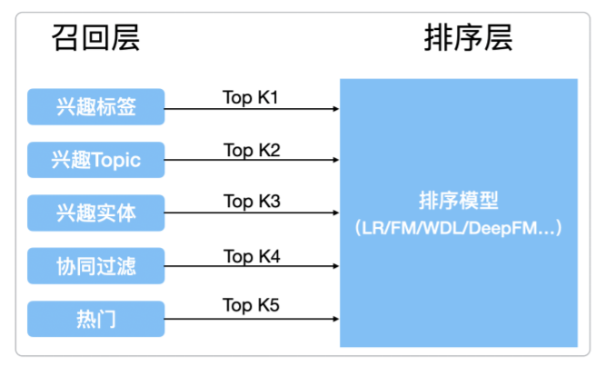

# 【关于 召回】那些你不知道的事

> 笔者：杨夕
>
> 项目地址：https://github.com/km1994/nlp_paper_study
> 
> 个人介绍：大佬们好，我叫杨夕，该项目主要是本人在研读顶会论文和复现经典论文过程中，所见、所思、所想、所闻，可能存在一些理解错误，希望大佬们多多指正。

## 整体框架图

## 动机

1. 如何从大规模的数据集中快速的筛选出有效信息？
2. 如何筛选特征？
3. 如何选取简单模型？

## 目标

- 召回阶段负责将海量的候选集快速缩小为几万到几千的规模；
- 排序层则负责对缩小后的候选集进行精准排序

## 特点

1. 召回层：待计算的候选集合大、计算速度快、模型简单、特征较少，尽量让用户感兴趣的物品在这个阶段能够被快速召回，即保证相关物品的召回率
2. 排序层：首要目标是得到精准的排序结果。需要处理的物品数量少，可以利用较多的特征，使用比较复杂的模型。

> 在设计召回层时，“计算速度”和“召回率”其实是矛盾的两个指标，为**提高“计算速度”，需要使召回策略尽量简单一些**；而为了**提高“召回率”，要求召回策略尽量选出排序模型所需要的候选集，这也就要求召回策略不能过于简单**。在权衡计算速度和召回率后，目前工业界主流的召回方法是采用多个简单策略叠加的“多路召回策略”

## 多路召回

- 介绍：指采用不同的策略、特征或简单模型，分别召回一部分候选集，然后把候选集混合在一起供后续排序模型使用；
- 优点：各种简单策略保证候选集的快速召回，从不同角度设计的策略保证召回率接近理想的状态，不至于损伤排序效果。

> 上图只是一个多路召回的例子，也就是说可以使用多种不同的策略来获取用户排序的候选商品集合，而具体使用哪些召回策略其实是与业务强相关的，针对不同的任务就会有对于该业务真实场景下需要考虑的召回规则。例如视频推荐，召回规则可以是“热门视频”、“导演召回”、“演员召回”、“最近上映“、”流行趋势“、”类型召回“等等。

- 问题：
  - 对于每一路召回都会从商品集合中拉回K个商品，这里的K是一个超参数，对于K的选择一般需要通过离线评估加线上的A/B测试来确定合理的K值。
  - 对于不同的任务具体策略的选择也是人工基于经验的选择，选择的策略之间的信息是割裂的，无法总和考虑不同策略对一个物品的影响。

