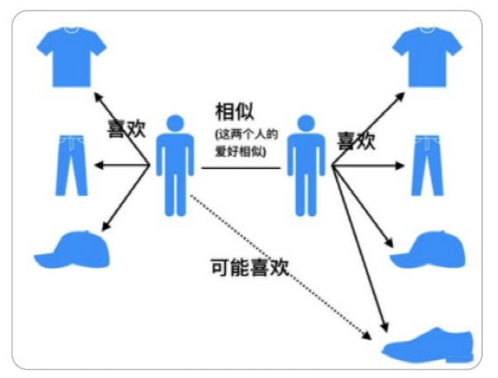
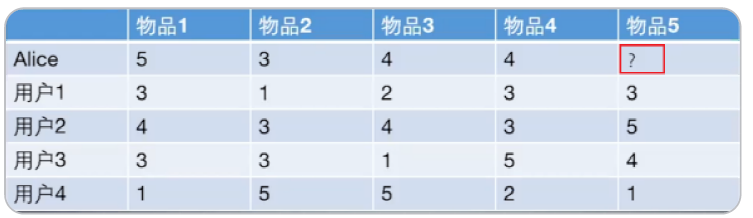
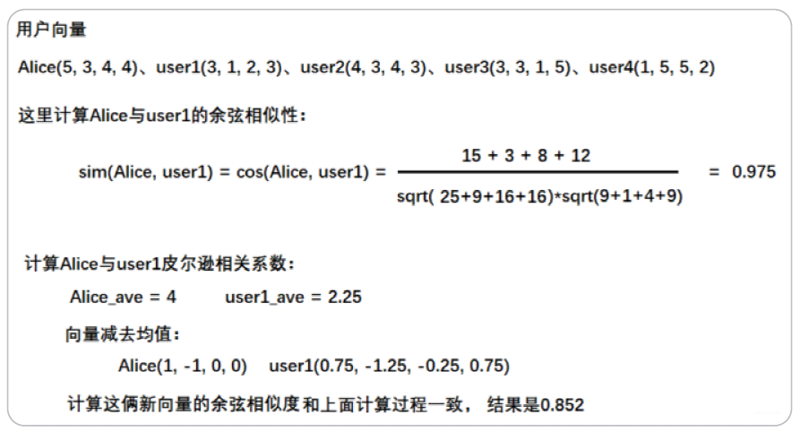
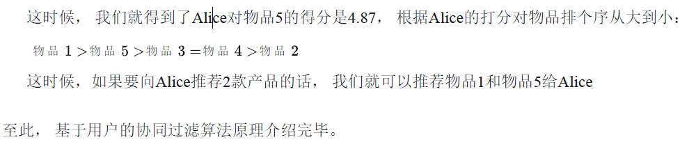

# 【关于 协同过滤】那些你不知道的事

> 笔者：杨夕
>
> 项目地址：https://github.com/km1994/nlp_paper_study
> 
> 个人介绍：大佬们好，我叫杨夕，该项目主要是本人在研读顶会论文和复现经典论文过程中，所见、所思、所想、所闻，可能存在一些理解错误，希望大佬们多多指正。

## 整体框架图

## 基本介绍

- 基本思想：**根据用户之前的喜好以及其他兴趣相近的用户的选择来给用户推荐物品**(基于对用户历史行为数据的挖掘发现用户的喜好偏向， 并预测用户可能喜好的产品进行推荐)，一般是仅仅基于用户的行为数据（评价、购买、下载等）,而不依赖于项的任何附加信息（物品自身特征）或者用户的任何附加信息（年龄，性别等）

## 常用算法

- 基于邻域的方法
  - 基于用户的协同过滤算法(UserCF): 给用户推荐和他兴趣相似的其他用户喜欢的产品；
  - 基于物品的协同过滤算法(ItemCF): 给用户推荐和他之前喜欢的物品相似的物品；

## 相似性度量方法

### 杰卡德(Jaccard)相似系数

- 公式介绍： 两个用户和交互商品交集的数量占这两个用户交互商品并集的数量的比例
- 缺点：无法反映具体用户的评分喜好信息， 所以常用来评估用户是否会对某商品进行打分， 而不是预估用户会对某商品打多少分。

### 余弦相似度

- 介绍：衡量了两个向量的夹角，夹角越小越相似

#### 集合的角度

#### 向量的角度

- 介绍：令矩阵为用户-商品交互矩阵(因为是TopN推荐并不需要用户对物品的评分，只需要知道用户对商品是否有交互就行)，即矩阵的每一行表示一个用户对所有商品的交互情况，有交互的商品值为1没有交互的商品值为0，矩阵的列表示所有商品。若用户和商品数量分别为的话，交互矩阵就是一个行列的矩阵。

### 皮尔逊相关系数

- 介绍：首先对于上述的余弦相似度的计算公式写成求和的形式,其中$r_{ui}$，$r_{vi}$分别表示用户u和用户v对商品是否有交互(或者具体的评分值)：

## 基于用户的协同过滤 UserCF

- 基本思想：，当一个用户A需要个性化推荐的时候，我们可以先找到和他有相似兴趣的其他用户，然后把那些用户喜欢的，而用户A没有听说过的物品推荐给A

### 步骤

- step 1：找到和目标用户兴趣相似的集合；
  - 目标：基于前面给出的相似性度量的方法找出与目标用户兴趣相似的用户
- step 2：找到这个集合中的用户喜欢的， 且目标用户没有听说过的物品推荐给目标用户。
  - 目标：如何基于相似用户喜欢的物品来对目标用户进行推荐呢？

### 举例

1. 计算Alice与其他用户的相似度（这里使用皮尔逊相关系数）

2. 根据相似度用户计算Alice对物品5的最终得分

用户1对物品5的评分是3， 用户2对物品5的打分是5， 那么根据上面的计算公式， 可以计算出Alice对物品5的最终得分是

3. 根据用户评分对用户进行推荐

## 优缺点

1. 数据稀疏性：一个大型的电子商务推荐系统一般有非常多的物品，用户可能买的其中不到1%的物品，不同用户之间买的物品重叠性较低，导致算法无法找到一个用户的邻居，即偏好相似的用户。这导致UserCF不适用于那些正反馈获取较困难的应用场景(如酒店预订， 大件商品购买等低频应用)
2. 算法扩展性：基于用户的协同过滤需要维护用户相似度矩阵以便快速的找出Topn相似用户， 该矩阵的存储开销非常大，存储空间随着用户数量的增加而增加，不适合用户数据量大的情况使用。

## 基于物品的协同过滤 ItemCF

- 基本思想：预先根据所有用户的历史偏好数据计算物品之间的相似性，然后把与用户喜欢的物品相类似的物品推荐给用户。比如物品a和c非常相似，因为喜欢a的用户同时也喜欢c，而用户A喜欢a，所以把c推荐给用户A;
- 特点：并不利用物品的内容属性计算物品之间的相似度，主要通过分析用户的行为记录计算物品之间的相似度，该算法认为，物品a和物品c具有很大的相似度是因为喜欢物品a的用户大都喜欢物品c。

### 步骤

1. 首先计算一下物品5和物品1， 2， 3， 4之间的相似性(它们也是向量的形式， 每一列的值就是它们的向量表示， 因为ItemCF认为物品a和物品c具有很大的相似度是因为喜欢物品a的用户大都喜欢物品c， 所以就可以基于每个用户对该物品的打分或者说喜欢程度来向量化物品)
2. 找出与物品5最相近的n个物品
3. 根据Alice对最相近的n个物品的打分去计算对物品5的打分情况

## 协同过滤算法的问题分析

