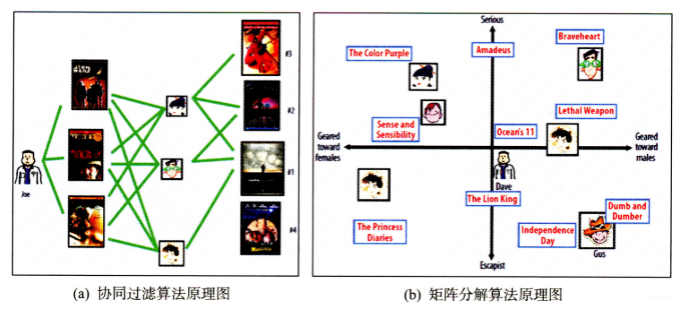
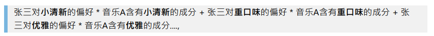
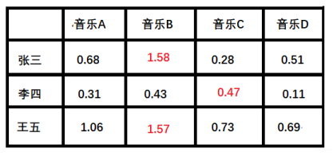

# 【关于 矩阵分解】那些你不知道的事

> 笔者：杨夕
>
> 项目地址：https://github.com/km1994/nlp_paper_study
> 
> 个人介绍：大佬们好，我叫杨夕，该项目主要是本人在研读顶会论文和复现经典论文过程中，所见、所思、所想、所闻，可能存在一些理解错误，希望大佬们多多指正。

## 整体框架图

## 动机

- 协同过滤算法
  - 特点：完全没有利⽤到物品本⾝或者是⽤户⾃⾝的属性， 仅仅利⽤了⽤户与物品的交互信息就可以实现推荐，是⼀个可解释性很强， 非常直观的模型；
  - 问题：
    - 第⼀个就是处理稀疏矩阵的能⼒比较弱；
- 矩阵分解模型(Matrix Factorization,MF)：
  - 目的：为了使得协同过滤更好处理稀疏矩阵问题， 增强泛化能⼒；
  - 思路：从协同过滤中衍⽣出矩阵分解模型(Matrix Factorization,MF)或者叫隐语义模型, 两者差不多说的⼀个意思， 就是在协同过滤共现矩阵的基础上， 使⽤更稠密的隐向量表⽰⽤户和物品， 挖掘⽤户和物品的隐含兴趣和隐含特征， 在⼀定程度上弥补协同过滤模型处理稀疏矩阵能⼒不⾜的问题。

##  隐语义模型

- 核心思想：通过隐含特征（latent factor）联系⽤户兴趣和物品（item）， 基于⽤户的⾏为找出潜在的主题和分类， 然后对item进⾏⾃动聚类，划分到不同类别/主题(⽤户的兴趣)。

> 举例一

> 举例二

> 举例三 
> 假设每个⽤户都有⾃⼰的听歌偏好， 比如A喜欢带有⼩清新的， 吉他伴奏的， 王菲的歌曲，如果⼀⾸歌正好是王菲唱的， 并且是吉他伴奏的⼩清新， 那么就可以将这⾸歌推荐给这个⽤户。 也就是说是⼩清新， 吉他伴奏， 王菲这些元素连接起了⽤户和歌曲。

### 双矩阵

- 原因：当然每个⽤户对不同的元素偏好不同， 每⾸歌包含的元素也不⼀样；

####  潜在因⼦—— ⽤户矩阵Q

- 介绍：⽰不同⽤户对于不同元素的偏好程度， 1代表很喜欢， 0代表不喜欢

#### 潜在因⼦——⾳乐矩阵P

- 介绍：每种⾳乐含有各种元素的成分；

> 举例:⾳乐A是⼀个偏⼩清新的⾳乐， 含有⼩清新的Latent Factor的成分是0.9， 重⼝味的成分是0.1， 优雅成分0.2.....

#### 举例分析【计算张三对⾳乐A的喜欢程度】

> 根据隐向量其实就可以得到张三对⾳乐A的打分，即： $0.6 * 0.9 + 0.8 * 0.1 + 0.1 * 0.2 + 0.1 * 0.4 + 0.7 * 0 =
0.69$ 按照这个计算⽅式， 每个⽤户对每⾸歌其实都可以得到这样的分数， 最后就得到了我们的评分矩阵：

#### 问题

- 问题：真实的情况下我们其实是没有上⾯那两个矩阵的，只有该矩阵
  

> 矩阵特点：稀疏，如果直接基于⽤户相似性或者物品相似性去填充这个矩阵是不太容易的， 并且很容易出现⻓尾问题

##  矩阵分解

### 动机

基于这个评分矩阵去找到上⾯例⼦中的那两个矩阵

### 思路

用两个矩阵表示⽤户兴趣和物品的隐向量表达， 然后就把这个评分矩阵分解成Q和P两个矩阵乘积的形式， 这时候就可以基于这两个矩阵去预测某个⽤户对某个物品的评分了。 然后基于这个评分去进⾏推荐

### 原理

- 原理：在矩阵分解的算法框架下， 我们就可以通过分解协同过滤的共现矩阵来得到用户和物品的隐向量， 就是上面的用户矩阵Q和物品矩阵P

> 矩阵分解算法将m\times nm×n维的共享矩阵RR分解成m \times km×k维的用户矩阵UU和k \times nk×n维的物品矩阵VV相乘的形式。 其中mm是用户数量， nn是物品数量， kk是隐向量维度， 也就是隐含特征个数， 只不过这里的隐含特征变得不可解释了， 即我们不知道具体含义了， 要模型自己去学。kk的大小决定了隐向量表达能力的强弱， kk越大， 表达信息就越强， 理解起来就是把用户的兴趣和物品的分类划分的越具体。

### 优缺点

- 优点：
    * 泛化能力强： 一定程度上解决了稀疏问题
    * 空间复杂度低： 由于用户和物品都用隐向量的形式存放， 少了用户和物品相似度矩阵， 空间复杂度由$n^2$降到了$(n+m)*f$
    * 更好的扩展性和灵活性：矩阵分解的最终产物是用户和物品隐向量， 这个深度学习的embedding思想不谋而合， 因此矩阵分解的结果非常便于与其他特征进行组合和拼接， 并可以与深度学习无缝结合。

- 缺点：
    - 矩阵分解算法依然是只用到了评分矩阵， 没有考虑到用户特征， 物品特征和上下文特征， 这使得矩阵分解丧失了利用很多有效信息的机会；
    - 在缺乏用户历史行为的时候， 无法进行有效的推荐。  所以为了解决这个问题， **逻辑回归模型及后续的因子分解机模型**， 凭借其天然的融合不同特征的能力， 逐渐在推荐系统领域得到了更广泛的应用。 

### 8. 参考资料

* 王喆 - 《深度学习推荐系统》
* 项亮 - 《推荐系统实战》
* [奇异值分解(SVD)的原理详解及推导](https://blog.csdn.net/wuzhongqiang/article/details/108168238)
* [Matrix factorization techniques for recommender systems论文](https://ieeexplore.ieee.org/stamp/stamp.jsp?tp=&arnumber=5197422&tag=1)
* [隐语义模型(LFM)和矩阵分解(MF)](https://blog.csdn.net/wuzhongqiang/article/details/108173885)

