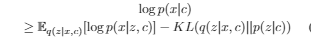

# 【关于 SLCVAE 安装 】那些你不知道的事

> 作者：杨夕
> 
> 项目地址：https://github.com/km1994/nlp_paper_study
> 
> 个人介绍：大佬们好，我叫杨夕，该项目主要是本人在研读顶会论文和复现经典论文过程中，所见、所思、所想、所闻，可能存在一些理解错误，希望大佬们多多指正。
> 
> 论文名称：Improve Diverse Text Generation by Self Labeling Conditional Variational Auto Encoder
> 
> 论文地址：chrome-extension://ikhdkkncnoglghljlkmcimlnlhkeamad/pdf-viewer/web/viewer.html?file=https%3A%2F%2Farxiv.org%2Fpdf%2F1903.10842.pdf
> 
> 论文源码：https://github.com/zhangfangdeng/SLCVAE

## 目录

## 摘要

多样性在许多文本生成应用程序中起着至关重。

近年来，条件变分自动编码器（CVAE）已经显示出用于该任务的有希望的性能。

然而，他们经常遇到所谓的**KL消失问题**。先前的工作通过**启发式方法减轻了这样的问题**，例如在优化CVAE目标函数的同时加强编码器或弱化解码器。然而，这些方法的**优化方向是隐含的**，很难找到应该应用这些方法的适当程度。

在本文中，我们提出了一个明确的优化目标，以补充CVAE，直接摆脱KL消失。实际上，该客观术语指导编码器朝向解码器的“最佳编码器”以增强表现力。引入标记网络来估计“最佳编码器”。它在CVAE的潜在空间中提供连续标签，以帮助在潜在变量和目标之间建立紧密联系。整个提出的方法被命名为Self Labeling CVAE~（SLCVAE）。为了加速不同文本生成的研究，我们还提出了一个大的本地一对多数据集。

对两项任务进行了大量实验，结果表明，与现有算法相比，我们的方法在很大程度上改善了生成多样性，同时实现了可比较的精度。我们还提出了一个大的本地一对多数据集。对两项任务进行了大量实验，结果表明，与现有算法相比，我们的方法在很大程度上改善了生成多样性，同时实现了可比较的精度。我们还提出了一个大的本地一对多数据集。对两项任务进行了大量实验，结果表明，与现有算法相比，我们的方法在很大程度上改善了生成多样性，同时实现了可比较的精度。

## 前言知识

### seq2seq：

- 思路：
  - encoder：从输入中提取语义表示；
  - decoder：根据语义表示生成与 input 相关的句子
- 问题：
  - SEQ2SEQ往往以枯燥而笼统的回应告终。这种情况经常发生在会话系统中，因为诸如“我不知道”或“我很好”这样安全而无意义的响应经常出现，然后被解码器捕获。
  - 无法满足多样性。对多个可能输出的拟合能力不足，对于代表向量，用于产生输出的解码器是固定的，只依赖于输入。这些问题不仅降低了文本生成的精度，而且限制了文本生成的多样性 【eg：对话系统】
- 领域：
  - 开放域对话系统：给定对话历史记录，可能存在语法上正确且语义上有意义的各种响应。 对话机器人应该能够为训练中的相同输入建模这些多个响应，并在预测中给出像人类一样的多种答案。
  - 电子商务推荐系统：对于给定的项目，个性化推荐需要多个卖点和说明。 图1显示了一个示例。 通过大量的推荐文本，可以选择不同的句子以显示给不同的用户，以满足他们的喜好，或者在各种情况下显示给同一用户，这样他/她就不会感到单调。
- 原因：“一个源，多个目标”问题。由于**传统的编解码模型将相同的输入模式编码到相同的唯一代表向量中而不发生任何变化**，因此它们从一个输入生成不同句子的能力受到限制。
- 改进方法：
  - MMI-antiLM算法：
      - 方法：在无条件的高频响应中加入了语言模型惩罚。
      - 优点：成功地解决了一般性的、反应迟钝的问题
      - 缺点：不适用于处理多目标，因为它只考虑一个目标。解码过程中n个最佳输出的波束搜索（BS）方法是机器翻译中常用的方法，可用于文本生成。然而，在同一个词源中，贪婪策略仍然倾向于生成类似的句子。
  - 强化学习
      - 方法：修改BS中使用的策略，使其符合反向行为目标
      - 缺点：可能会降低输出以上方法是基于编解码模型推理阶段的改进策略。但是编码器-译码器模型本身并没有实质性地变得更重要。它们的战略实际上是多样性和连贯性之间的权衡，因此受到限制。

### VAE and CVAE

#### Variational Auto Encoder

- 介绍：

It makes use of a latent variable z sampled from a prior distribution to generate data x. The logarithm likelihood of the data x is optimized by maximizing the evidence lower bound (ELBO):(它利用从先验分布中采样的潜在变量z生成数据x。 通过最大化证据下界（ELBO）来优化数据x的对数似然)

> while both q(z|x) and p(z|x) are parameterized as encoder qφ(z|x) and decoder pθ(z|x). It is obvious that VAE encodes the input x into a probability distribution rather than a fixed vector so that different z could be chosen from the distribution to obtain different outputs x.

#### CVAE

- 改进编码解码器模型：
  - 方法：用一些方法来干扰一个训练有素的编解码器模型的推理阶段，以获得丰富的输出；
  - 缺点：编码结果和解码结果之间的误差是有限的；
- 可变编解码器：
  - 方法：引入了一个中间潜在变量，并假设潜在变量cor的每个配置都响应一个可行的响应。因此，通过对变量进行采样，可以产生不同的响应。
  - 问题：VAE 和 CVAE 都遇到了KL消失的问题，即解码器往往不利用潜在变量来建模目标

## 论文方法

在本文中，我们指出，在优化CVAE的目标过程中，编码器逐渐被拉至先验分布，并失去了目标的判别能力，而解码器甚至在没有编码器帮助的情况下也倾向于拟合数据。因此，KL消失根源于CVAE的目标。当前的方法，要么削弱解码器要么加强编码器以预先隐式地对目标进行补偿，只能缓解该问题，并且难以确定解码器/编码器应具有多弱/强。

与这些努力正交的是，我们为编码器提出了一个明确的优化目标，以朝着更好的表达能力发展以适应当前的解码器。通过该新颖的目的，来自编码器的潜变量分布具有与解码器相对应的适当灵活性的潜力，这自然地协调了编码器和解码器的表示能力，并增强了解码器对潜变量的利用。具体而言，称为“标签网络”的附加模块用于估计当前解码器的“最佳编码器”。测量CVAE潜变量与标记网络预测变量之差的Thena损失被添加到CVAE的原始目标函数中。由于这种损失将编码器拉向标签网络所逼近的“最佳编码器”，同时原始CVAE将编码器拉至先前的编码器，因此将达到平衡，可以避免KL消失。另外，标记网络为每个目标引入一个连续的标记，这基本上反映了潜在空间的结构约束。因此，它保证了潜在空间中的每个z对应于唯一的目标，从而提高了目标空间中各代的覆盖率。我们也可以训练“标签网络”和CVAE结构，并将此模型称为“自标签条件变量自动编码器”（SLCVAE）。

## 论文贡献

- 首先，我们指出，由于缺乏对潜在变量和目标之间联系的明确约束，目前的CVAE目标函数倾向于解决KL消失问题。
- 其次，我们提出了一种新的显式优化目标将译码器与潜在变量连接起来的自标记机制。在这个目标下，编码器同时被拉向由当前解码器和先验分布定义的“最佳编码器”，从而使编码器分布接近先验，同时保持表现力的平衡。因此，KL消失问题是有意义的。
- 此外，大量的实验表明，我们的SLCVAE方法具有更好的多目标建模能力，并且在不损失准确性的情况下提高了文本生成的多样性。第三，构建了一个大规模的数据集degoods，该数据集包含了高质量的一对多文本数据，加快了对文本生成的研究

## 参考

1. [通过自标记条件变分自动编码器，提高文本生成的多样性](https://zhuanlan.zhihu.com/p/60609670)
2. [文本生成9：VAE中KL vanishing 问题的一般解](https://zhuanlan.zhihu.com/p/98797312)