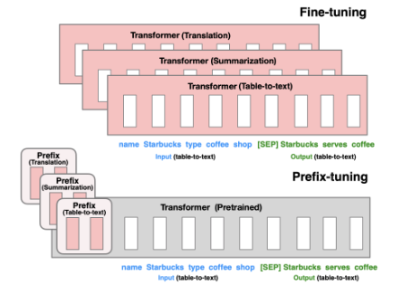

# 【关于 Prefix-Tuning 】 那些你不知道的事

> 作者：杨夕
> 
> 论文：Prefix-Tuning: Optimizing Continuous Prompts for Generation
> 
> 论文地址：https://arxiv.org/pdf/2101.00190.pdf
> 
> github: 
> 
> 项目地址：https://github.com/km1994/nlp_paper_study
> 
> NLP 面经地址：https://github.com/km1994/NLP-Interview-Notes
> 
> 推荐系统 百面百搭：https://github.com/km1994/RES-Interview-Notes
> 
> 个人介绍：大佬们好，我叫杨夕，该项目主要是本人在研读顶会论文和复现经典论文过程中，所见、所思、所想、所闻，可能存在一些理解错误，希望大佬们多多指正。

## 一、摘要

- 动机：Fine-tuning 实际上是利用经过预训练的大型语言模型来执行下游任务的方法。然而，它修改了所有的语言模型参数，因此需要为每个任务存储一个完整的副本。
- 论文方法：论文提出了 前缀调优，这是自然语言生成任务 Fine-tuning 的一种轻量级替代方案，通过冻结语言模型参数，只优化一个小的连续  task-specific vector（称为 prefix ）。受 prompting 启发，Prefix-tuning 允许 后续令牌 将此 prefix 视为“ virtual tokens ”。
- 论文实验结果：论文将 prefix-tuning 应用于GPT-2以生成表到文本，并应用于BART以进行摘要。发现，通过只学习0.1%的参数， Prefix-tuning 在 full data setting 中获得了可比的性能，在低数据设置中优于Fine-tuning，并更好地外推到训练过程中看不见主题的例子。

## 二、动机

- 之前的工作如Prompting主要是人工设计模版或者自动化搜索模版（如上一篇综述所展示了很多模版）来进行预训练的，但人工设计的未知性比较影响模型性能+自动化搜索成本较高，为什么不从离散tokens转向连续的“soft prompt”呢？
- 全参数 Fine-tuning：
  - 思路：对 LM Fine-tuning时， 需要更新和存储LM的所有参数；
  - 存在问题： LM 在部署不同任务时需要存储LM参数的更新副本，导致 需要的 内存巨大；
- Freeze Fine-tuning
  - 思路：对 LM Fine-tuning时，冻结了大多数预训练的参数，并用小的可训练模块扩充模型；
  - 实例：Adapter-tuning：在预先训练的语言模型层之间插入额外的任务特定层,在自然语言理解和生成基准测试方面具有很好的性能，通过微调可以获得相当的性能，同时只添加约2-4%的特定于任务的参数

## 三、Prefix-Tuning 方法

- 思路：Prefix-Tuning 通过冻结语言模型参数，然后将 prompting 映射到 连续空间，在不用one-hot查找的情况下，优化一个小的连续 task-specific vector（称为 prefix）

> Fine-tuning（Top）会更新 full model copy （红色的Transformer框），并需要为每个任务存储一个完整的模型副本。论文提出了 Prefix-Tuning（Prefix-Tuning），它冻结Transformer参数，只优化prefix（红色prefix块）。因此，论文 只需要为每个任务存储 Prefix ，使 Prefix-Tuning 模块化并节省空间。注意，每个垂直块表示一个时间步长的 transformer activations 。

- 核心点：在输入前面【固定位置】添加一个任务名的位置向量，在接入下游任务时，freeze其他部分的参数，训练该位置向量即可

## 四、Prefix-Tuning 技术细节

- 由于 大模型参数量大，如果 只 freeze LM 参数，会导致 Fine-tuning 效率低，毕竟prompt的出现就是要解决大模型少样本的适配；
- 如果直接优化 Prompt 参数，容易导致不稳定，所以 论文在模型中加入了一个更大的MLP，训练完只保存MLP变换后的参数即可；
- 实验证实只加到embedding上的效果不太好，因此作者在每层都加了prompt的参数，改动较大，可能起到了类似残差的效果

## 五、Prefix-Tuning 论文贡献

1. 提出任务特定的trainable前缀prefix，这样直接为不同任务保存不同的前缀即可；
2. 不同任务 Fine-tuning 时，只需要设置不同的Prefix即可，Prefix-Tuning 不用存储不同任务的 LLMs 副本，而只要存储一个大型transformer模型和多个学习的任务特定的prefix参数即可。

## 参考

1. [Prefix-Tuning: Optimizing Continuous Prompts for Generation](https://arxiv.org/pdf/2101.00190.pdf)
2. [Tuning系列论文笔记](https://zhuanlan.zhihu.com/p/600119509)
3. [Prompt-Tuning、Instruction-Tuning和Chain-of-Thought](https://zhuanlan.zhihu.com/p/621480864)
4. [预训练新范式提示学习（Prompt-tuning，Prefix-tuning，P-tuning，PPT，SPoT）](https://blog.csdn.net/qq_39388410/article/details/121036309)
5. [关于大模型实践的一些总结](https://juejin.cn/post/7214318587429961786)

