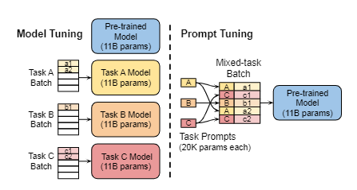

# 【关于 Prompt Tuning】 那些你不知道的事

> 作者：杨夕
> 
> 论文：The Power of Scale for Parameter-Efficient Prompt Tuning
> 
> 论文地址：https://arxiv.org/pdf/2104.08691.pdf
> 
> github: 
> 
> 项目地址：https://github.com/km1994/nlp_paper_study
> 
> NLP 面经地址：https://github.com/km1994/NLP-Interview-Notes
> 
> 推荐系统 百面百搭：https://github.com/km1994/RES-Interview-Notes
> 
> 个人介绍：大佬们好，我叫杨夕，该项目主要是本人在研读顶会论文和复现经典论文过程中，所见、所思、所想、所闻，可能存在一些理解错误，希望大佬们多多指正。

## 一、摘要

- 动机: 
  - 研究 “prompt tuning,”，这是一种简单而有效的学习 “soft prompts” 的机制，用于调节 frozen language models 以执行特定的下游任务；
  - LMs 的共享和服务成本很高，是否 能够将一个 frozen model 重新用于多个下游任务可以减轻这一负担？
- 论文方法：与GPT-3使用的离散文本 prompts 不同，soft prompts 是通过 back-propagation 学习的，并且可以微调为合并来自任何数量的 labeled examples 的 信息。论文的端到端学习方法在很大程度上优于GPT-3的 few-shot learning 。
- 实验结果：通过使用T5对模型尺寸进行 ablations ，论文表明，即时微调随着规模的增加而变得更有竞争力：随着模型超过数十亿个参数，论文的方法 “closes the gap” ，并与模型微调的强大性能相匹配（所有模型权重都经过微调）。

## 二、动机

- 全参数 Fine-tuning：
  - 思路：对 LM Fine-tuning时， 需要更新和存储LM的所有参数；
  - 存在问题： LM 在部署不同任务时需要存储LM参数的更新副本，导致 需要的 内存巨大；
- prefix tuning：
  - 介绍：通过冻结语言模型参数，然后将 prompting 映射到 连续空间，在不用one-hot查找的情况下，优化一个小的连续 task-specific vector（称为 prefix）
  - 问题：每层都加了prompt的参数，改动较大；

## 三、 Prompt Tuning 方法

> Model tuning 需要为每个下游任务制作整个预训练模型的特定任务副本，并且推理必须分批次进行。 只需要为每个任务存储一个小的特定于任务的 prompt ，并使用原始的预训练模型实现 mixed-task inference 。对于T5“XXL”模型， 微调后的模型的每个副本都需要110亿个参数。相比之下，tuned prompts 每个任务只需要20480个参数——假设 prompt 长度为5个令牌，则减少了五个数量级以上。

- 核心：

1. 设计一种 prefix prompt 方法，在输入词嵌入之前添加 prefix prompt； 和 人工构建 prompt 不同，**Prompt Tuning 输入的 prefix 可以 不进行 token 化, 只需要对神经网络直接表征即可**；
2. 在 Fine-tuning 时，可以固定 LLMs 参数，只 Fine-tuning prompt 参数，这种方式的优点在于 对于不同下游任务，只需要额外 Fine-tuning 一个独立的prompt参数即可；

## 四、 Prompt Tuning 论文实验

- prompt 长度 对于 Prompt Tuning 影响：越长的prompt能带来越好的效果，但模型规模足够大，长度影响就很小 【可能是因为越长的prompt对应越长的参数表达空间，效果自然会变好，但模型规模足够大，则这部分的参数占比可能就不明显】；
- Prompt Tuning 初始化策略对于 Prompt Tuning 影响：随机初始化 < 最长词汇初始化 < 标签字符串初始化，但是模型规模变大后，则初始化策略也无关重要【整体上就是大力出奇迹，几乎可以忽略所有的超参数细节】；
- Domain-shit跨域 对于 Prompt Tuning 影响：prompt方法会比微调模型效果更优泛化效果，尤其域间数据差异越大，效果越明显【这主要反映的是prompt方式在下游任务使用中通用性更强，调整下游任务时候，损失的语言模型本身能力较小】

## 四、Prompt Tuning 总结

1. 与prefix-tuning相比，主要是实验的模型架构不同：
   1. prefix-tunin： 每层都加了prompt的参数
   2. Prompt Tuning：只在 输入词嵌入之前添加 prefix prompt
2. 随着模型规模变大，prompt的初始化和长度对效果影响很小，鲁棒性和泛化能力也有比较好的提升 整体论文没啥创新点，主要实验多

## 参考

1. [The Power of Scale for Parameter-Efficient Prompt Tuning](https://arxiv.org/pdf/2104.08691.pdf)
2. [Tuning系列论文笔记](https://zhuanlan.zhihu.com/p/600119509)
3. [Prompt-Tuning、Instruction-Tuning和Chain-of-Thought](https://zhuanlan.zhihu.com/p/621480864)
4. [预训练新范式提示学习（Prompt-tuning，Prefix-tuning，P-tuning，PPT，SPoT）](https://blog.csdn.net/qq_39388410/article/details/121036309)
5. [关于大模型实践的一些总结](https://juejin.cn/post/7214318587429961786)

