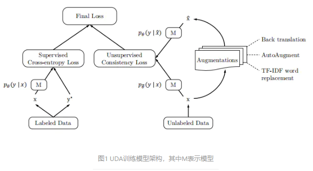

# 【关于 UDA】 那些你不知道的事

> 作者：杨夕
> 
> 论文：UNSUPERVISED DATA AUGMENTATION FOR CONSISTENCY TRAINING
> 
> 论文地址：https://arxiv.org/abs/1904.12848
> 
> 论文源码：https://github.com/google-research/uda
> 
> 项目地址：https://github.com/km1994/nlp_paper_study
> 
> 个人介绍：大佬们好，我叫杨夕，该项目主要是本人在研读顶会论文和复现经典论文过程中，所见、所思、所想、所闻，可能存在一些理解错误，希望大佬们多多指正。

## 目录

## 动机

1.  深度学习的模型训练通常依赖大量的标签数据，在只有少量数据上通常表现不好;
2. 以前的方法通常只是应用高斯噪声和dropout噪声（无法保证一致性）；

## 论文方法

本文提出了一种基于无监督数据的数据增强方式UDA（Unsupervised Data Augmentation）。UDA方法生成无监督数据与原始无监督数据具备分布的一致性，而以前的方法通常只是应用高斯噪声和dropout噪声（无法保证一致性）。UDA方法利用了一种目前为止最优的方法生成更加“真实”的数据。使用这种数据增强方法，在极少量数据集上，六种语言任务和三种视觉任务都得到了明显的提升。

## 实验结果

- IMDb数据分类任务上，仅仅使用20个带标签数据加UDA方法，就超过了25000个带标签数据的训练模型，错误率达到了4.2%。
- 在CIFAR-10 上仅用4000张标签图片就达到了2.7%的错误率。
- 在 SVHN任务上，仅仅用250个标签数据就达到了2.85%的错误率，这相当于用全数据集才能达到的正确率，而它们的数量级差别达到了1或2（差10倍或100倍）。在大量标签数据集上，UDA同样表现优秀，
- 在ImageNet任务上，使用10%带标签数据，UDA方法就将Top1和Top5的准确率分别由55.1%提高到77.3%，68.7提高到88.5%。在全数据集上，则分别由78.3%提高到94.4%，79%提高到94.5%。

## 目标

提出用高质量的数据增强方法代替传统的噪声注入方法，提高训练的一致性。

## 论文方法

### 无监督数据增强

类似VAT，本文使用最小化无标签数据增广数据和无标签数据的KL散度。公式如下：    

> q(x_hat|x)是数据增强变换，θ_hat是当前参数θ的固定副本

为了同时使用带标签数据和无标签数据，作者在计算带标签数据时上加上交叉熵损失和λ为权重的公式1，最终公式如公式2所示，模型结构如图1所示。

 通过最小化一致性损失，UDA能够使得标签信息从标签数据引入无标签数据。对于大多数实验，将λ设置为1，并对标签数据和无标签数据使用不同的批处理大小。并发现，在一些数据集上，对无标签数据使用更大的batch会带来更好的性能。

   相比较于传统的加噪方法，例如：高斯噪声、dropout噪声、或者简单的仿射变换，对不同任务进行针对性的数据增强能够生成更加有效的噪声。它具有以下优点：

（1）扰动的有效性：让增强数据和原始数据使用相同标签在监督学习中取得了良好性能，因此，对于无标签数据的增强也是类似有效的。

（2）扰动的多样性：由于可以对输入数据进行多种方式的改动而不改变数据标签，所以数据增强具有更强的多样性，而例如高斯噪声和贝努力噪声改变了局部信息，因此多样性不好。另外，由于是在一组增强数据集上进行平滑操作，所以数据增强拥有较高的效率。

（3）定向归纳偏差：不同的任务需要不同的归纳偏差。如自动增强，数据增强策略可以直接优化以提高验证性能 每项任务。这种面向性能的增强策略可以学会在原始标记集中找出缺少的或最想要的归纳偏差。虽然自动数据增强策略是应用于监督学习任务中的，但是在本文半监督数据增强中，同样有效。

###  不同任务的增强策略

1. 用于图像分类的自动增强：对于图像分类，“自动增强”，即使用强化学习来搜索图像增强的“最优”组合，其性能明显优于任何人工设计的优化方法。
2. 应用于文本分类的反向翻译：反向翻译能够在保存语义不变的情况下，生成多样的句式。
3. 应用于文本分类的基于TD-IDF的词替代方法：虽然反向翻译能够很好的进行数据扩充，但是它并不能保证扩充的句子包含关键词。

## 参考资料

1. [Unsupervised Data Augmentation for Consistency Training 论文翻译](https://www.jianshu.com/p/5d4e18b8de04)
2. [论文阅读笔记：UDA](https://zhuanlan.zhihu.com/p/92490790)
3. [Google无监督数据增强方法UDA在文本分类上的实验](https://zhuanlan.zhihu.com/p/186211797)

