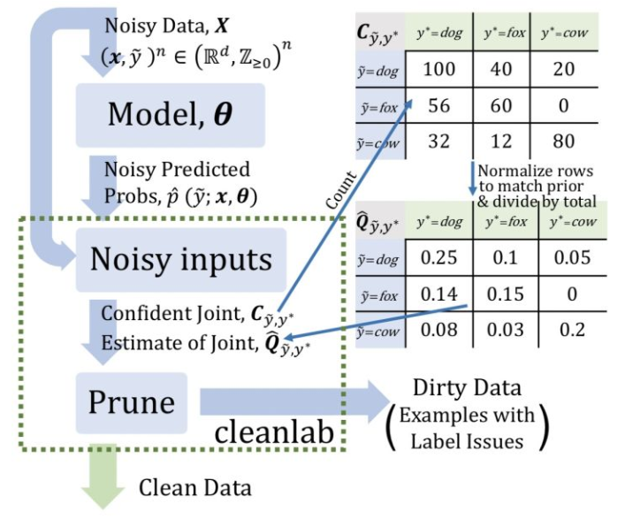

# 【关于 “脏数据”处理】那些你不知道的事

## 目录


## 一、动机

### 1.1 何为“脏数据”？

在 生产中，我们从 标注人员那边 所得到的数据，可能并不是“干净数据”，而有可能存在 一小部分 “脏数据”。

- 那么，何为“脏数据”：
  - 数据标注规范不统一【eg：一开始设定了标注规范，但是标一般之后发现不对，然后修改了规范，但是没有改之前处理的数据，sad!!!】
  - 标注歧义问题 【eg：同一条数据，可能被标注为不同的标签】

### 1.2 “脏数据” 会带来什么后果？

神经网络的成功通常建立在大量、干净的数据上，标注错误过多必然会影响性能表现。

## 二、“脏数据” 处理篇

### 2.1 “脏数据” 怎么处理呢？

- 如何寻找“脏数据”？
  - 人工清洗？ 【眼瞎】
  - 重标？     【标注人员和平相处五项原则】
  - 自己改？   【外号 “算法工程师” 的 “标注工程师”】

- 那有没有好点的方法呢？
  - 置信学习方法
  - ...

### 2.2 置信学习方法篇

#### 2.2.1 什么是 置信学习方法？

- 置信学习方法 其实就是 计算 每一个样本的 标签的置信度，以识别标签错误、表征标签噪声并应用于带噪学习（noisy label learning）。【注：模型找出的置信度低的样本，并不一定就是错误样本，而只是一种不确定估计的选择方法】
- 举例说明：
  - 在某些场景下，对训练集通过交叉验证来找出一些可能存在错误标注的样本，然后交给人工去纠正。

#### 2.2.2 置信学习方法 优点？

- 发现 “可能错误的样本” 【注：这个只能说是相对的，因为模型找出的置信度低的样本，并不一定就是错误样本，而只是一种不确定估计的选择方法】；
- 置信学习开源工具 cleanlab
- 可直接估计噪声标签与真实标签的联合分布，具有理论合理性。
- 不需要超参数，只需使用交叉验证来获得样本外的预测概率。
- 不需要做随机均匀的标签噪声的假设（这种假设在实践中通常不现实）。
- 与模型无关，可以使用任意模型，不像众多带噪学习与模型和训练过程强耦合。

#### 2.2.3 置信学习方法 怎么做？

1. Count：估计噪声标签和真实标签的联合分布；
2. Clean：找出并过滤掉错误样本；
3. Re-Training：过滤错误样本后，重新调整样本类别权重，重新训练；



#### 2.2.4 置信学习方法 怎么用？有什么开源框架？

- 置信学习开源工具： [cleanlab](https://github.com/cgnorthcutt/cleanlab) 
- 使用文档：[cleanlab 操作手册](https://l7.curtisnorthcutt.com/cleanlab-python-package)
- 使用

1. cleanlab在MINIST数据集中找出的错误样本
```s
    from cleanlab.pruning import get_noise_indices
    # 输入
    # s:噪声标签
    # psx: n x m 的预测概率概率，通过交叉验证获得
    ordered_label_errors = get_noise_indices(
        s=numpy_array_of_noisy_labels,
        psx=numpy_array_of_predicted_probabilities,
        sorted_index_method='normalized_margin', # Orders label errors
    )
```

2. 找出错误样本后，clean 点，重新训练

```s
    from cleanlab.classification import LearningWithNoisyLabels
    from sklearn.linear_model import LogisticRegression
    ​
    # 其实可以封装任意一个你自定义的模型.
    lnl = LearningWithNoisyLabels(clf=LogisticRegression()) 
    lnl.fit(X=X_train_data, s=train_noisy_labels) 
    # 对真实世界进行验证.
    predicted_test_labels = lnl.predict(X_test)
```

#### 2.2.5 置信学习方法 的工作原理？

1. 置信学习方法 主要是通过 寻找出 标注数据中的 “脏数据”，然后抛弃掉这些数据后重新训练，也就是直接估计噪声标签和真实标签的联合分布，而不是修复噪声标签或者修改损失权重。

## 参考

1. [标注数据存在错误怎么办？MIT&Google提出用置信学习找出错误标注（附开源实现）](https://zhuanlan.zhihu.com/p/146557232)
2. [Confident Learning: Estimating Uncertainty in Dataset Labels](https://arxiv.org/abs/1911.00068)