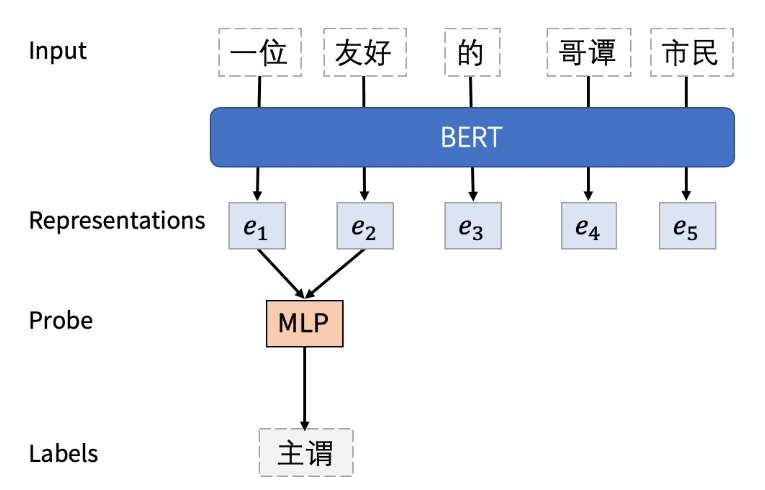

# Perturbed Masking: Parameter-free Probing for Analyzing and Interpreting BERT

> 作者：杨夕
> 
> 项目地址：https://github.com/km1994/nlp_paper_study
> 
> 个人介绍：大佬们好，我叫杨夕，该项目主要是本人在研读顶会论文和复现经典论文过程中，所见、所思、所想、所闻，可能存在一些理解错误，希望大佬们多多指正。
> 
> 论文链接：https://arxiv.org/pdf/2004.14786.pdf
> 
> 代码链接：https://github.com/bojone/perturbed_masking
> 
> 【注：手机阅读可能图片打不开！！！】

## 摘要

By introducing a small set of additional parameters, a probe learns to solve specific linguistic tasks (e.g., dependency parsing) in a supervised manner using feature representations (e.g., contextualized embeddings). The effectiveness of such probing tasks is taken as evidence that the pre-trained model encodes linguistic knowledge. 

However, this approach of evaluating a language model is undermined by the uncertainty of the amount of knowledge that is learned by the probe itself. Complementary to those works, we propose a parameter-free probing technique for analyzing pre-trained language models (e.g., BERT). Our method does not require direct supervision from the probing tasks, nor do we introduce additional parameters to the probing process. 

Our experiments on BERT show that syntactic trees recovered from BERT using our method are significantly better than linguistically-uninformed baselines. We further feed the empirically induced dependency structures into a downstream sentiment classification task and find its improvement compatible with or even superior to a human-designed dependency schema.

通过引入少量的附加参数，probe learns 在监督方式中使用特征表示（例如，上下文嵌入）来 解决特定的语言任务（例如，依赖解析）。这样的probe  tasks 的有效性被视为预训练模型编码语言知识的证据。

但是，这种评估语言模型的方法会因 probe 本身所学知识量的不确定性而受到破坏。作为这些工作的补充，我们提出了一种无参数的 probe 技术来分析预训练的语言模型（例如BERT）。我们的方法不需要 probe 任务的直接监督，也不需要在 probing 过程中引入其他参数。

我们在BERT上进行的实验表明，使用我们的方法从BERT恢复的语法树比语言上不了解的基线要好得多。我们进一步将根据经验引入的依存关系结构输入到下游的情感分类任务中，并发现它的改进与人工设计的依存关系兼容甚至更好。

## 介绍

probe 是简单的神经网络（具有少量附加参数），其使用预先训练的模型（例如，隐藏状态激活，注意权重）生成的特征表示，并经过训练以执行监督任务（例如，依赖性 标签）。 假设所测得的质量主要归因于预先训练的语言模型，则使用 probe 的性能来测量所生成表示的质量。

## 方法介绍

- Perturbed Masking 
  - 介绍：parameter-free probing technique
  - 目标：analyze and interpret pre-trained models，测量一个单词xj对预测另一个单词xi的影响，然后从该单词间信息中得出全局语言属性（例如，依赖树）。

整体思想很直接，句法结构，其实本质上描述的是词和词之间的某种关系，如果我们能从BERT当中拿到词和词之间相互“作用”的信息，就能利用一些算法解析出句法结构。具体的做法可以看下面这张图。

比如说你想知道“谭”这个字对 “哥”这个字有多大影响。

1. 我们先把“哥”从原始的句子中mask掉（左图），然后拿到BERT基于上下文生成的“哥”的向量e6，

2. 接下来我们再次去改动句子，这次我们把“谭”和“哥”同时mask掉（右图）。然后再次拿到“哥”对应的向量表达e6’，

3. 通过计算这两个向量之间的差异，比如向量距离：d(e6,e6’)，我们能够得到这么一个信息：在缺失了“谭”这个字的上下文中，BERT是如何model“哥”这个字的。我们在文中把这个信息称做“谭”对“哥”的影响。

把上面这个过程在每两个字之间重复一遍，我们可以得到一个描述了这个句子中，字和字之间关系的矩阵。之后我们就可以利用一些经典的基于图的parsing算法从这个矩阵里解析出句法结构。通过把我们生成的树和语言学家们标注好的句法树进行比较，我们就可以量化地知道BERT到底学到了什么程度的句法知识。

那么d(e6,,e'6)有什么直观上的解释吗：

想象一下，如果BERT对“友好的哥谭市民”的理解是“友好/的哥/谭市民”，那么d(e6,e6’) 这个距离不会特别大，因为“谭”对于预测“哥”来说不是特别重要，后面完全可以是张市民，李市民，陈市民。而如果BERT将其理解为“友好的/哥谭/市民”，那么显而易见的，缺失了“谭”会对“哥”的向量产生比较大的影响，导致d(e6,e6’) 的增大。

## 参考资料

1. [ACL2020 | 无监督？无监督！你没试过的BERT的全新用法](https://aminer.cn/research_report/5f0d6f7b21d8d82f52e59dab)
2. [无监督分词和句法分析！原来BERT还可以这样用  科学空间](https://kexue.fm/archives/7476)
