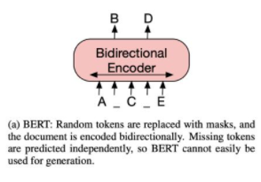
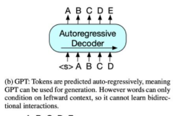
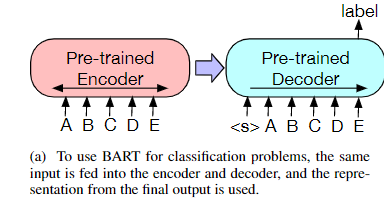
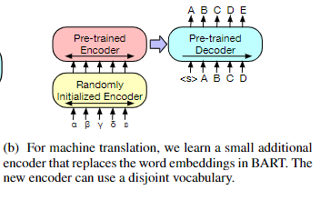

# 【关于 Bart】 那些你不知道的事

> 作者：杨夕
> 
> 论文：Bart: Denoising sequence-to-sequence pre-training for natural language generation, translation, and comprehension
> 
> 来源：Facebook 
> 
> 论文地址：https://mp.weixin.qq.com/s/42rYlyjQsh4loFKRdhJlIg
> 
> 开源代码：https://github.com/renatoviolin/Bart_T5-summarization
> 
> NLP论文学习笔记：https://github.com/km1994/nlp_paper_study
> 
> **[手机版NLP论文学习笔记](https://mp.weixin.qq.com/s?__biz=MzAxMTU5Njg4NQ==&mid=100005719&idx=1&sn=14d34d70a7e7cbf9700f804cca5be2d0&chksm=1bbff26d2cc87b7b9d2ed12c8d280cd737e270cd82c8850f7ca2ee44ec8883873ff5e9904e7e&scene=18#wechat_redirect)**
> 
> 个人介绍：大佬们好，我叫杨夕，该项目主要是本人在研读顶会论文和复现经典论文过程中，所见、所思、所想、所闻，可能存在一些理解错误，希望大佬们多多指正。
> 
> NLP 百面百搭 地址：https://github.com/km1994/NLP-Interview-Notes
> 
> **[手机版NLP百面百搭](https://mp.weixin.qq.com/s?__biz=MzAxMTU5Njg4NQ==&mid=100005719&idx=3&sn=5d8e62993e5ecd4582703684c0d12e44&chksm=1bbff26d2cc87b7bf2504a8a4cafc60919d722b6e9acbcee81a626924d80f53a49301df9bd97&scene=18#wechat_redirect)**
> 
> 推荐系统 百面百搭 地址：https://github.com/km1994/RES-Interview-Notes
> 
> **[手机版推荐系统百面百搭](https://mp.weixin.qq.com/s/b_KBT6rUw09cLGRHV_EUtw)**

## 一、引言

- 论文方法：
  - BART，一种用于预训练序列到序列模型的去噪自动编码器。 
  - BART 通过以下方式进行训练：
    - (1) 使用任意噪声函数破坏文本;
    - (2) 学习模型以重建原始文本。
- 优点：它使用标准的基于 Transformer 的神经机器翻译架构，尽管它很简单，但可以看作是对 BERT（由于双向编码器）、GPT（带有从左到右的解码器）和许多其他最近的预训练方案的泛化.
- 实验结果：
  - 我们评估了许多噪声方法，通过随机打乱原始句子的顺序和使用新颖的填充方案来找到最佳性能，其中文本的跨度被替换为单个掩码标记。 BART 在针对文本生成进行微调时特别有效，但也适用于理解任务。
  - 它将 RoBERTa 的性能与 GLUE 和 SQuAD 上的可比训练资源相匹配，在一系列抽象对话、问答和总结任务上取得了最新的最新成果，增益高达 6 ROUGE。 
  - BART 还为机器翻译提供了 1.1 BLEU 比反向翻译系统增加了 1.1 BLEU，只有目标语言预训练。
  - 报告了在 BART 框架内复制其他预训练方案的消融实验，以更好地衡量哪些因素对最终任务性能影响最大。

## 二、动机

1. BERT：用掩码替换随机 token，双向编码文档。由于缺失 token 被单独预测，因此 BERT 较难用于生成任务;

2. GPT：使用自回归方式预测 token，这意味着 GPT 可用于生成任务。但是，该模型仅基于左侧上下文预测单词，无法学习双向交互

## 三、Bart 模型介绍

### 3.1 Bart 处理 逻辑

BART：编码器输入与解码器输出无需对齐，即允许任意噪声变换。使用掩码符号替换文本段，从而破坏文本。使用双向模型编码被破坏的文本（左），然后使用自回归解码器计算原始文档的似然（右）。至于微调，未被破坏的文档是编码器和解码器的输入，研究者使用来自解码器最终隐藏状态的表征。

### 3.2 Bart 与 BERT 的 区别

1. 解码器的每个层对编码器最终隐藏层额外执行 cross-attention（和 Transformer 序列到序列模型一样）；
2. BERT 在词预测之前使用了额外的前馈网络，而 BART 没有。
3. BART 相比同等规模的 BERT 模型大约多出 10% 的参数。

### 3.3 BART 预训练 

BART 是**通过破坏文档再优化重建损失**（即解码器输出和原始文档之间的交叉熵）训练得到的。

与目前仅适合特定噪声机制的去噪自编码器不同，BART 可应用于任意类型的文档破坏。极端情况下，当源文本信息全部缺失时，BART 也等同于语言模型。

- 破坏原始文本的噪声方法：
  - Token Masking（token 掩码）：按照 BERT 模型，BART 采样随机 token，并用 [MASK]标记 替换它们；
  - Sentence Permutation（句子排列变换）：按句号将文档分割成多个句子，然后以随机顺序打乱这些句子；
  - Document Rotation（文档旋转）：随机均匀地选择 token，旋转文档使文档从该 token 开始。该任务的目的是训练模型识别文档开头；
  - Token Deletion（token 删除）：从输入中随机删除 token。与 token 掩码不同，模型必须确定缺失输入的位置；
  - Text Infilling（文本填充）：采样多个文本段，文本段长度取决于泊松分布 (λ = 3)。用单个掩码 token 替换每个文本段。长度为 0 的文本段对应掩码 token 的插入；

### 3.4 BART 微调 

#### 3.4.1 Sequence Classification Task 序列分类任务

对于序列分类任务，将相同的输入，输入到encoder和decoder中，最后将decoder的最后一个隐藏节点作为输出，输入到分类层（全连接层）中，获取最终的分类的结果。

> 注：其中，decoder的最后一个隐藏节点是一个特殊标记，相当于BERT模型中的[CLS]。

#### 3.4.2 Token Classification Task 序列分类任务

对于 token 分类任务，将完整文档输入到编码器和解码器中，使用解码器最上方的隐藏状态作为每个单词的表征。该表征的用途是分类 token。

#### 3.4.3 Sequence Generation Task 序列生成任务

由于 BART 具备自回归解码器，因此它可以针对序列生成任务进行直接微调，如抽象问答和摘要。在这两项任务中，信息复制自输入但是经过了处理，这与去噪预训练目标紧密相关。这里，编码器的输入是输入序列，解码器以自回归的方式生成输出。

#### 3.4.4 Machine Translation 机器翻译

将BART的encoder端的embedding层替换成randomly initialized encoder，新的encoder也可以用不同的vocabulary。通过新加的Encoder，我们可以将新的语言映射到BART能解码到English(假设BART是在English的语料上进行的预训练)的空间。具体的finetune过程分两阶段:

1. 第一步只更新randomly initialized encoder + BART positional embedding + BART的encoder第一层的self-attention 输入映射矩阵。
2. 第二步更新全部参数，但是只训练很少的几轮。

## 参考

1. [Lewis, Mike, et al. "Bart: Denoising sequence-to-sequence pre-training for natural language generation, translation, and comprehension." arXiv preprint arXiv:1910.13461 (2019)](https://arxiv.org/abs/1910.13461)
2. [多项NLP任务新SOTA，Facebook提出预训练模型BART​](https://zhuanlan.zhihu.com/p/90173832)
3. [【论文精读】生成式预训练之BART](https://zhuanlan.zhihu.com/p/173858031)
4. [回顾BART模型](https://zhuanlan.zhihu.com/p/399169880)
5. [BART原理简介与代码实战](https://zhuanlan.zhihu.com/p/121788986)
