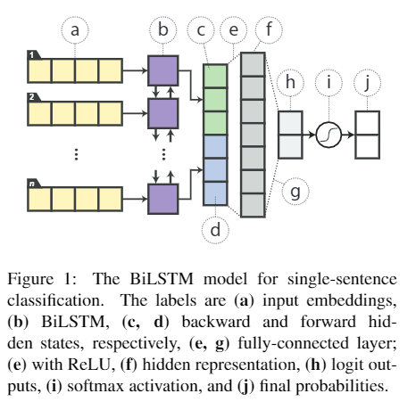
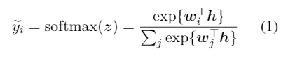
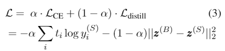

# 【关于 Distilling Task-Specific Knowledge from BERT into Simple Neural Networks】那些你不知道的事

> 作者：杨夕
> 
> 论文：Distilling Task-Specific Knowledge from BERT into Simple Neural Networks
> 
> 论文地址：https://arxiv.org/abs/1903.12136
> 
> 项目地址：https://github.com/km1994/nlp_paper_study
>
> 【注：手机阅读可能图片打不开！！！】

## 一、动机

- 随着 BERT 的横空出世，意味着 上一代用于语言理解的较浅的神经网络（RNN、CNN等） 的 过时？
- BERT模型是真的大，计算起来太慢了？
- 是否可以将BERT（一种最先进的语言表示模型）中的知识提取到一个单层BiLSTM 或 TextCNN 中？

## 二、论文思路

1. 确定 Teacher 模型（Bert） 和 Student 模型（TextCNN、TextRNN）;
2. 蒸馏的两个过程：
   1. 第一，在目标函数附加logits回归部分；
   2. 第二，构建迁移数据集，从而增加了训练集，可以更有效地进行知识迁移。

## 三、模型框架讲解【以单句分类任务为例】

### 3.1 Teacher 模型（Bert） 微调

1. Bert 模型 模型构建

构建 Bert 模型，然后将 Bert 输出的句子的向量表示过dense层和softmax层，得到logits输出，代码如下：

- 代码实现：
```python
    class BertClassification(BertPreTrainedModel):
        def __init__(self, config, num_labels=2):
            super(BertClassification, self).__init__(config)
            self.num_labels = num_labels
            self.bert = BertModel(config)
            self.dropout = nn.Dropout(config.hidden_dropout_prob)
            self.classifier = nn.Linear(config.hidden_size, num_labels)
            self.init_weights()

        def forward(self, input_ids, input_mask, label_ids):
            _, pooled_output = self.bert(input_ids, None, input_mask)
            pooled_output = self.dropout(pooled_output)
            logits = self.classifier(pooled_output)
            if label_ids is not None:
                loss_fct = CrossEntropyLoss()
                return loss_fct(logits.view(-1, self.num_labels), label_ids.view(-1))
            return logits
```

2. Bert 模型微调

- 代码实现：
```python
    def main(model_type="bert",bert_model='bert-base-chinese', cache_dir=None,
            max_seq=128, batch_size=16, num_epochs=10, lr=2e-5):
        processor = Processor()
        train_examples = processor.get_train_examples('data/hotel')
        label_list = processor.get_labels()
        tokenizer = BertTokenizer.from_pretrained(bert_model, do_lower_case=True)
        if model_type=="bert":
            model = BertClassification.from_pretrained(bert_model, cache_dir=cache_dir, num_labels=len(label_list))
        else:
            model = BertTextCNN.from_pretrained(bert_model,cache_dir=cache_dir,num_labels=len(label_list))
        model.to(device)
        param_optimizer = list(model.named_parameters())
        no_decay = ['bias', 'LayerNorm.bias', 'LayerNorm.weight']
        optimizer_grouped_parameters = [
            {'params': [p for n, p in param_optimizer if not \
                any(nd in n for nd in no_decay)], 'weight_decay': 0.01},
            {'params': [p for n, p in param_optimizer if \
                        any(nd in n for nd in no_decay)], 'weight_decay': 0.00}]
        print('train...')
        num_train_steps = int(len(train_examples) / batch_size * num_epochs)
        optimizer = AdamW(optimizer_grouped_parameters, lr=lr)
        train_features = convert_examples_to_features(train_examples, label_list, max_seq, tokenizer)
        all_input_ids = torch.tensor([f.input_ids for f in train_features], dtype=torch.long)
        all_input_mask = torch.tensor([f.input_mask for f in train_features], dtype=torch.long)
        all_label_ids = torch.tensor([f.label_id for f in train_features], dtype=torch.long)
        train_data = TensorDataset(all_input_ids, all_input_mask, all_label_ids)
        train_sampler = RandomSampler(train_data)
        train_dataloader = DataLoader(train_data, sampler=train_sampler, batch_size=batch_size)
        model.train()
        for _ in trange(num_epochs, desc='Epoch'):
            tr_loss = 0
            for step, batch in enumerate(tqdm(train_dataloader, desc='Iteration')):
                input_ids, input_mask, label_ids = tuple(t.to(device) for t in batch)
                loss = model(input_ids, input_mask, label_ids)
                loss.backward()
                optimizer.step()
                optimizer.zero_grad()
                tr_loss += loss.item()
            print('tr_loss', tr_loss)
        print('eval...')
        eval_examples = processor.get_dev_examples('data/hotel')
        eval_features = convert_examples_to_features(eval_examples, label_list, max_seq, tokenizer)
        eval_input_ids = torch.tensor([f.input_ids for f in eval_features], dtype=torch.long)
        eval_input_mask = torch.tensor([f.input_mask for f in eval_features], dtype=torch.long)
        eval_label_ids = torch.tensor([f.label_id for f in eval_features], dtype=torch.long)
        eval_data = TensorDataset(eval_input_ids, eval_input_mask, eval_label_ids)
        eval_sampler = SequentialSampler(eval_data)
        eval_dataloader = DataLoader(eval_data, sampler=eval_sampler, batch_size=batch_size)
        model.eval()
        preds = []
        for batch in tqdm(eval_dataloader, desc='Evaluating'):
            input_ids, input_mask, label_ids = tuple(t.to(device) for t in batch)
            with torch.no_grad():
                logits = model(input_ids, input_mask, None)
                preds.append(logits.detach().cpu().numpy())
        preds = np.argmax(np.vstack(preds), axis=1)
        print(compute_metrics(preds, eval_label_ids.numpy()))
        torch.save(model, f'data/cache/{model_type}_model')
```

### 3.2 Student 模型（TextCNN、TextRNN）构建

#### 3.2.1 TextRNN 模型构建

- 模型结构：sentence -> Embedding Layer -> Word Embeddings -> BiLSTM -> Hidden States (Bidirection) -> dense -> Relu -> dense -> logits ->softmax


> 单句子分类的BiLSTM模型。标签分别是（a）输入 emb，（b）BiLSTM，（c，d）向后和向前 hidden 状态，（e，g）全连接层，（e）带ReLU，（f）隐藏表示，（h）logit outputs，（i）softmax 激活函数，和（j）最终概率

- 代码实现：
```python
    class RNN(nn.Module):
        def __init__(self, x_dim, e_dim, h_dim, o_dim):
            super(RNN, self).__init__()
            self.h_dim = h_dim
            self.dropout = nn.Dropout(0.2)
            self.emb = nn.Embedding(x_dim, e_dim, padding_idx=0)
            self.lstm = nn.LSTM(e_dim, h_dim, bidirectional=True, batch_first=True)
            self.fc = nn.Linear(h_dim * 2, o_dim)
            self.softmax = nn.Softmax(dim=1)
            self.log_softmax = nn.LogSoftmax(dim=1)

        def forward(self, x, lens):
            embed = self.dropout(self.emb(x))
            out, _ = self.lstm(embed)
            hidden = self.fc(out[:, -1, :])
            return self.softmax(hidden), self.log_softmax(hidden)
```

#### 3.2.2 TextCNN 模型构建

- 模型结构：sentence -> Embedding Layer -> Word Embeddings -> dropout -> Conv -> Relu -> max_pool1d -> cat -> dropout -> dense -> logits ->softmax

- 代码实现：
```python
    class CNN(nn.Module):
        def __init__(self, x_dim, e_dim, h_dim, o_dim):
            super(CNN, self).__init__()
            self.emb = nn.Embedding(x_dim, e_dim, padding_idx=0)
            self.dropout = nn.Dropout(0.2)
            self.conv1 = nn.Conv2d(1, h_dim, (3, e_dim))
            self.conv2 = nn.Conv2d(1, h_dim, (4, e_dim))
            self.conv3 = nn.Conv2d(1, h_dim, (5, e_dim))
            self.fc = nn.Linear(h_dim * 3, o_dim)
            self.softmax = nn.Softmax(dim=1)
            self.log_softmax = nn.LogSoftmax(dim=1)

        def forward(self, x, lens):
            embed = self.dropout(self.emb(x)).unsqueeze(1)
            c1 = torch.relu(self.conv1(embed).squeeze(3))
            p1 = torch.max_pool1d(c1, c1.size()[2]).squeeze(2)
            c2 = torch.relu(self.conv2(embed).squeeze(3))
            p2 = torch.max_pool1d(c2, c2.size()[2]).squeeze(2)
            c3 = torch.relu(self.conv3(embed).squeeze(3))
            p3 = torch.max_pool1d(c3, c3.size()[2]).squeeze(2)
            pool = self.dropout(torch.cat((p1, p2, p3), 1))
            hidden = self.fc(pool)
            return self.softmax(hidden), self.log_softmax(hidden)
```

### 3.3  Distillation Objective

在 3.1、3.2 节，我们分别介绍了 Teacher 模型（Bert）和 Student 模型（TextCNN、TextRNN），那么现在问题来了：“**如何 才能将 Teacher 模型 的知识迁移到Student 模型中呢？**”

在 论文中，作者主要将 Teacher 模型的 logits 输出作为 Student 模型的 Distillation Objective，通过这种方式 **将 Teacher 模型 的知识迁移到 Student 模型中**，公式如下所示：


> Teacher 模型的 logits 输出


> Student 网络的 logits 与 Teacher logits 之间的均方误差（MSE）损失<br/>
> 其中：$z^{B}$ 为 Teacher logits，$z^{S}$ 为 Student logits


> Loss函数 <br/>
> 注：t 为真实标签，如果迁移集不带标签，那么t是通过大模型softmax输出转换得到的ont-hot向量；$y$ 是小模型的softmax输出

- 代码实现：

1. Teacher 模型的 logits 输出 
```python
    class Teacher(object):
        def __init__(self, bert_model='bert-base-chinese', max_seq=128):
            self.max_seq = max_seq
            self.tokenizer = BertTokenizer.from_pretrained(
                bert_model, do_lower_case=True)
            self.model = torch.load('./data/cache/model')
            self.model.eval()

        def predict(self, text):
            tokens = self.tokenizer.tokenize(text)[:self.max_seq]
            input_ids = self.tokenizer.convert_tokens_to_ids(tokens)
            input_mask = [1] * len(input_ids)
            padding = [0] * (self.max_seq - len(input_ids))
            input_ids = torch.tensor([input_ids + padding], dtype=torch.long).to(device)
            input_mask = torch.tensor([input_mask + padding], dtype=torch.long).to(device)
            logits = self.model(input_ids, input_mask, None)
            return F.softmax(logits, dim=1).detach().cpu().numpy()
```

2. Distillation目标函数
```python
    model = RNN(v_size, 256, 256, 2)
    # model = CNN(v_size,256,128,2)
    if USE_CUDA: model = model.cuda()
    opt = optim.Adam(model.parameters(), lr=lr)
    ce_loss = nn.NLLLoss()
    mse_loss = nn.MSELoss()
    for epoch in range(epochs):
        losses = []
        accu = []
        model.train()
        for i in range(0, len(x_tr), b_size):
            model.zero_grad()
            bx = Variable(LTensor(x_tr[i:i + b_size]))
            by = Variable(LTensor(y_tr[i:i + b_size]))
            bl = Variable(LTensor(l_tr[i:i + b_size]))
            bt = Variable(FTensor(t_tr[i:i + b_size]))
            py1, py2 = model(bx, bl)
            loss = alpha * ce_loss(py2, by) + (1-alpha) * mse_loss(py1, bt)  # in paper, only mse is used
            loss.backward()
            opt.step()
            losses.append(loss.item())
        for i in range(0, len(x_de), b_size):
            model.zero_grad()
            bx = Variable(LTensor(x_de[i:i + b_size]))
            bl = Variable(LTensor(l_de[i:i + b_size]))
            bt = Variable(FTensor(t_de[i:i + b_size]))
            py1, py2 = model(bx, bl)
            loss = mse_loss(py1, bt)
            if teach_on_dev:
                loss.backward()             
                opt.step()                       # train only with teacher on dev set
            losses.append(loss.item())
```

## 四、Data Augmentation for Distillation

- 动机：在上文中，我们介绍了 如何 **将 Teacher 模型 的知识迁移到Student 模型中**，但是对于小数据集而言，在 Distillation 过程中，容易出现**无法完全表达大模型的知识问题，导致模型出现过拟合**，那有没有比较好的解决方法呢？
- 方法：数据增强。即 利用数据增强的方法认为扩充数据集，来防止过拟合
- 思路：
  - Masking：以一定的概率，用[MASK]标签来取代句子中的某个单词；
  - POS-guided word replacement：以一定的概率，用同词性的词来取代当前词。根据原始训练集中同词性词语的词频来确定取代词；
  - n-gram sampling：以一定的概率，用n-gram来取代原始的句子。n的取值范围是[1,5]。这个操作相当于dropout，是升级版的Masking。
- 步骤：
  1. 先遍历句子中的每个单词，对每个单词产生一个平均分布的[0,1]区间的概率。根据概率落在的区间，选择用Masking还是POS方式替换当前词；
  2. 遍历完成后，以一定的概率选择是否进行n-gram sampling；
  3. 对每个句子，进行 $n_{iter}$ 次增强，产生 $n_{iter}$ 个伪数据。对句对匹配任务，固定第一个句子、第二个句子、两个句子都不固定，进行3 $n_{iter}$ 次数据增强。

## 五、单句分类任务 实验结果分析

### 5.1 数据集介绍

本文所用的数据集 为 一个 关于酒店的二分类数据，该数据样式如下：

```s
    1	闹中取静的一个地方，在窗前能看到不错的风景。酒店价格的确有些偏高
    0	房价要四百多，但感到非常失望，陈旧，脏，比锦江之星还差。以后肯定不会再去了。这样的硬件设施和服务怎么吸引客人呢。
    1	酒店总体感觉不错，很适合外宾入住，大堂的氛围整个就像是一个外国人的社区。房间很舒服，携程搞活动，还加送了红酒和水果，很不错，下次还会考虑入住。只是停车场比较麻烦，来宾进停车场之前还要有狼狗绕车检查，感觉不舒服。
    0	好小的门面，没有电梯，房间也不是很一致！豪华房居然要400多，马桶还是坏的！酒店太自作主张了。。。。
    0	房间以次充好，提出异议后才调整，调整后还是较差的房间
    0	面前就是高架，实在是太吵了，一晚上没睡！
    ...
```

### 5.2 实验结果分析

<table>
    <tr>
        <td>模型</td><td>Acc</td><td>F1</td><td>速度</td>
    </tr>
    <tr>
        <td>Bert</td><td>0.9</td><td>0.9051458382736542</td><td>0.24132323265075684 s</td>
    </tr>
    <tr>
        <td>TextCNN</td><td>0.8263671882450581</td><td>0.8271728271728271</td><td>0.001s</td>
    </tr>
    <tr>
        <td>Bert->TextCNN</td><td>0.88125</td><td>0.8883666274970623</td><td>0.004960536956787109 s</td>
    </tr>
</table>

## 六、总结

1. Bert->TextCNN 模型 虽然 效果 低于 Bert，但是 比 直接用 TextCNN 高很多；
2. Bert->TextCNN 模型 虽然 推理速度 低于 TextCNN，但是 比 直接用 Bert 高很多；

## 参考资料

1. [基于BERT的蒸馏实验](https://github.com/qiangsiwei/bert_distill)
2. [知识蒸馏论文选读（二）](https://zhuanlan.zhihu.com/p/89420539)
3. [知识蒸馏（Knowledge Distillation）简述（二）](https://zhuanlan.zhihu.com/p/82129871)
