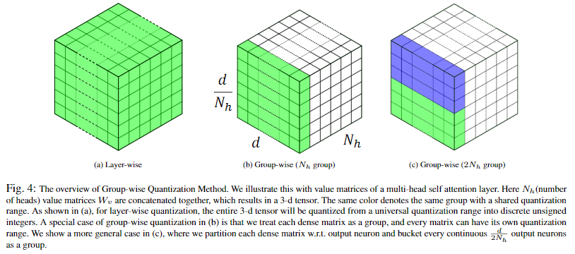
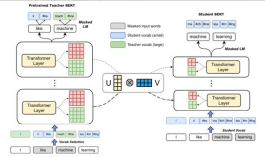
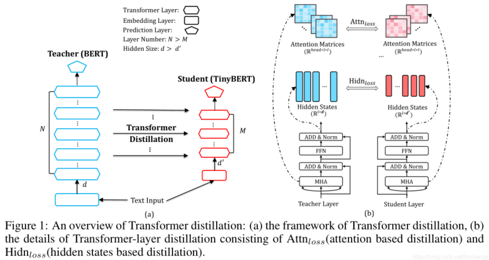

# 【关于 Bert 压缩】 那些你不知道的事

> 作者：杨夕
> 
> 项目地址：https://github.com/km1994/nlp_paper_study
> 
> 个人介绍：大佬们好，我叫杨夕，该项目主要是本人在研读顶会论文和复现经典论文过程中，所见、所思、所想、所闻，可能存在一些理解错误，希望大佬们多多指正。
> 

## 目录

- [【关于 Bert 压缩】 那些你不知道的事](#关于-bert-压缩-那些你不知道的事)
  - [目录](#目录)
  - [动机](#动机)
  - [对比表](#对比表)
  - [模型压缩方法介绍](#模型压缩方法介绍)
  - [论文介绍](#论文介绍)
    - [ALBERT: A Lite Bert for self-supervisedLearning of Language Representations【低秩因式分解 + 跨层参数共享】](#albert-a-lite-bert-for-self-supervisedlearning-of-language-representations低秩因式分解--跨层参数共享)
    - [Q-BERT: Hessian Based Ultra Low Precision Quantization of BERT 【量化】](#q-bert-hessian-based-ultra-low-precision-quantization-of-bert-量化)
    - [Extreme Language Model Compression withOptimal Subwords and Shared Projections 【蒸馏】](#extreme-language-model-compression-withoptimal-subwords-and-shared-projections-蒸馏)
    - [DistilBERT, a distilled version of BERT: smaller, faster, cheaper and lighter 【蒸馏】](#distilbert-a-distilled-version-of-bert-smaller-faster-cheaper-and-lighter-蒸馏)
    - [FastBERT: a Self-distilling BERT with Adaptive Inference Time 【蒸馏】](#fastbert-a-self-distilling-bert-with-adaptive-inference-time-蒸馏)
    - [TinyBERT: Distilling BERT for Natural Language Understanding 【蒸馏】](#tinybert-distilling-bert-for-natural-language-understanding-蒸馏)
  - [个人总结](#个人总结)
  - [参考](#参考)

## 动机

- Bert 优点：
  - 对下游任务进行微调后，显著提高了模型的表现；
- Bert 缺点：
  - 内存占用；
  - 功耗过高；
  - 带来很高的延迟；
  - 限制了 Bert 系列模型在移动和物联网等嵌入式设备上的部署；

## 对比表

<table>
    <tr>
        <td>论文</td>
        <td>剪枝</td>
        <td>低秩因式分解</td>
        <td>知识蒸馏</td>
        <td>参数共享</td>
        <td>量化</td>
        <td>预训练</td>
        <td>微调</td>
    </tr>
    <tr>
        <td>ALBERT: A Lite Bert for self-supervisedLearning of Language Representations</td>
        <td></td>
        <td>1</td>
        <td></td>
        <td>1</td>
        <td></td>
        <td>1</td>
        <td></td>
    </tr>
    <tr>
        <td>Q-BERT: Hessian Based Ultra Low Precision Quantization of BERT</td>
        <td></td>
        <td></td>
        <td></td>
        <td></td>
        <td>1</td>
        <td>1</td>
        <td>1</td>
    </tr>
    <tr>
        <td>Extreme Language Model Compression withOptimal Subwords and Shared Projections</td>
        <td></td>
        <td></td>
        <td>1</td>
        <td></td>
        <td></td>
        <td>1</td>
        <td></td>
    </tr>
    <tr>
        <td>DistilBERT, a distilled version of BERT: smaller, faster, cheaper and lighter</td>
        <td></td>
        <td></td>
        <td>1</td>
        <td></td>
        <td></td>
        <td>1</td>
        <td></td>
    </tr>
    <tr>
        <td>FastBERT: a Self-distilling BERT with Adaptive Inference Time</td>
        <td></td>
        <td></td>
        <td>1</td>
        <td></td>
        <td></td>
        <td></td>
        <td>1</td>
    </tr>
    <tr>
        <td>TinyBERT: Distilling BERT for Natural Language Understanding</td>
        <td></td>
        <td></td>
        <td>1</td>
        <td></td>
        <td></td>
        <td>1</td>
        <td>1</td>
    </tr>
</table>

## 模型压缩方法介绍

- BERT 瘦身来提升速度
  - trick：
    - 低秩因式分解：在输入层和输出层使用嵌入大小远小于原生Bert的嵌入大小，再使用简单的映射矩阵使得输入层的输出或者最后一层隐藏层的输出可以通过映射矩阵输入到第一层的隐藏层或者输出层；
    - 跨层参数共享：隐藏层中的每一层都使用相同的参数，用多种方式共享参数，例如只共享每层的前馈网络参数或者只共享每层的注意力子层参数。默认情况是共享每层的所有参数；
    - 剪枝：剪掉多余的连接、多余的注意力头、甚至LayerDrop[1]直接砍掉一半Transformer层
    - 量化：把FP32改成FP16或者INT8；
    - 蒸馏：用一个学生模型来学习大模型的知识，不仅要学logits，还要学attention score；
  - 问题：
    - 精度的下降
      - 低秩因式分解 and 跨层参数共享 计算量并没有下降；
      - 剪枝会直接降低模型的拟合能力；
      - 量化虽然有提升但也有瓶颈；
      - 蒸馏的不确定性最大，很难预知你的BERT教出来怎样的学生；

## 论文介绍

### ALBERT: A Lite Bert for self-supervisedLearning of Language Representations【低秩因式分解 + 跨层参数共享】

- 论文地址：https://openreview.net/forum?id=H1eA7AEtvS
- 论文源码：https://github.com/google-research/ALBERT
- 收录期刊：ICLR 2020 spotlight presentation收录
- 模型压缩方法：低秩因式分解 + 跨层参数共享
- 模型压缩方法介绍：
  - 低秩因式分解：
    - 动机：Bert的参数量大部分集中于模型的隐藏层架构上，在嵌入层中只有30,000词块，其所占据的参数量只占据整个模型参数量的小部分；
    - 方法：将输入层和输出层的权重矩阵分解为两个更小的参数矩阵；
    - 思路：在输入层和输出层使用嵌入大小远小于原生Bert的嵌入大小，再使用简单的映射矩阵使得输入层的输出或者最后一层隐藏层的输出可以通过映射矩阵输入到第一层的隐藏层或者输出层；
    - 优点：在不显著增加词嵌入大小的情况下能够更容易增加隐藏层大小；
  - 参数共享【跨层参数共享】：
    - 动机：隐藏层 参数 大小 一致；
    - 方法：隐藏层中的每一层都使用相同的参数，用多种方式共享参数，例如只共享每层的前馈网络参数或者只共享每层的注意力子层参数。默认情况是共享每层的所有参数；
    - 优点：防止参数随着网络深度的增加而增大；
- 其他改进策略：
  - **句子顺序预测损失(SOP)**代替**Bert中的下一句预测损失(NSP)**：
    - 动机：通过实验证明，Bert中的下一句预测损失(NSP) 作用不大；
    - 介绍：用预测两个句子是否连续出现在原文中替换为两个连续的句子是正序或是逆序，用于进一步提高下游任务的表现
- 优点：参数量上有所降低；
- 缺点：其加速指标仅展示了训练过程，由于ALBERT的隐藏层架构**采用跨层参数共享策略并未减少训练过程的计算量**，加速效果更多来源于低维的嵌入层；

### Q-BERT: Hessian Based Ultra Low Precision Quantization of BERT 【量化】

- 论文地址：https://arxiv.org/abs/1909.05840
- 论文源码：
- 收录期刊：AAAI 2020 收录
- 模型压缩方法：量化

> 量化技术介绍：通过减少用于表示每个权重值的精度来压缩模型。例如模型使用float32标准定义参数的精度进行训练，然后我们可以使用量化技术选择float16，甚至int8表示参数的精度用于压缩模型。

- 模型压缩方法介绍：
  - 混合精确量化：
    - 介绍：由于不同的编码器层负责不同的语义表示，预计他们表现出不同的灵敏度。因此该工作为更敏感的层分配更高的精度以保证模型表现。通过海森关注量化(HAWQ)计算每一层参数的海森频谱(例如特征值)，具有更高海森频谱的网络层是对量化更敏感的，需要更高的精度；
    - 思路：
      - step 1：在执行海森关注量化时对于不同的训练数据获得每一层的平均最大特征值和其方差作为指标来决定每一层的量化精度；
      - step 2：然后根据所选的精度设置执行量化包括每一层的参数和激活函数，并微调模型
  - 分组量化：
    - 介绍：在编码器层中的每一个自注意力头有四个参数矩阵，即和输出权重矩阵。将此四个矩阵作为一个具有相同量化范围的整体直接量化会显著降低模型准确性。该工作将每个自注意力头对应的四个权重矩阵作为一个组，所以有12个组(12个自注意力头)。此外，在每一组中，将顺序的输出神经元分组，比如每一自注意力子层有4*12*64=3072个神经元，其中64为输出神经元，每6个输出神经元为一个子组，所以总共有12×64/6= 128个子组，每个子组可以有自己的量化范围。分层量化以及分组量化可由下图阐述。

### Extreme Language Model Compression withOptimal Subwords and Shared Projections 【蒸馏】

- 论文地址：https://openreview.net/forum?id=S1x6ueSKPr
- 模型压缩方法：知识蒸馏
- 模型压缩方法介绍：
  - 减少学生模型的词汇表中词块的数量：
    - 动机：训练词汇量过大；
    - 方法：使学生模型在蒸馏的过程中学习到一个更小的词汇表；
    - 思路：
      - 对偶训练：在蒸馏过程中，对于给定的输入到教师模型的训练序列，该工作混合使用教师词汇表和学生词汇表。通过从序列中随机选择部分单词，使用学生词汇表来分割，对于其它单词使用教师词汇表来分割，这鼓励根据老师和学生的词汇表来对齐同一单词的表示形式。这也是通过掩码语言建模任务来实现的该策略的效果。需要注意的是我们仅对教师模型执行对偶训练。在使用掩码语言建模训练时，模型针对老师和学生的词汇表使用不同的softmax层，具体取决于需预测的单词使用了哪一个词汇表来分割。
  - 减少隐藏层大小：
    - 动机：尽量不损害模型性能，仅仅依靠教师模型的输出去训练学生模型并不具备高泛化能力；
    - 思路：
      - 共享映射：将教师模型和隐藏层大小较小的学生模型的参数投影到相同的空间再最小化两者的信息损失。详细地，该工作将教师模型的每一层中的每个可训练变量投影为与学生模型中相应变量相同的形状，记为向下映射，并计算2-范式损失，相似地，将学生模型的每一层中的每个可训练变量投影为与教师模型中相应变量相同的形状，记为向上映射，并计算2-范式损失，最后将损失相加作为目标函数的一部分，另外一部分为掩码语言建模预测损失。

### DistilBERT, a distilled version of BERT: smaller, faster, cheaper and lighter 【蒸馏】

- 论文地址：https://arxiv.org/abs/1910.01108
- 模型压缩方法：知识蒸馏
- 模型压缩方法介绍：
  - 通过知识蒸馏（在 logits，hidden_states 上计算学生与教师的 loss）训练一个小（主要是层数）模型实现和大模型类似的效果;
- 损失函数

> $t_i$ 老师的概率估计
> $s_i$ 学生的概率估计

- 使用了 softmax-temperature：

> T 控制输出分布的平滑程度，推理时设置为 1 变为标准的 Softmax;
> $z_i$ 表示类别 i 的分数。

最终的损失函数是 Lce 和 masked language modeling loss Lmlm 的线性组合，另外作者发现添加余弦嵌入损失（Lcos）有利于使学生和教师隐藏状态向量的方向一致。

- 学生架构
  - 具有和老师一般的体系结构；
  - 移除了 Token type embedding 和 pooler；
  - 层数减少为 1/2：作者调查发现改变隐层维度对计算效率的影响比其他因素的变化要小（比如层数）。

从老师的两层中选择一层来初始化学生。蒸馏应用了Liu et al. [2019] 提出的 BERT 模型训练最佳实践。语料和 Bert 使用的一致。

### FastBERT: a Self-distilling BERT with Adaptive Inference Time 【蒸馏】

- 论文地址：https://arxiv.org/pdf/2004.02178
- 模型压缩方法：知识蒸馏
- 模型压缩方法介绍：
  - 样本自适应机制（Sample-wise adaptive mechanism）
    - 思路：
      - 在每层Transformer后都去预测样本标签，如果某样本预测结果的置信度很高，就不用继续计算了，就是自适应调整每个样本的计算量，容易的样本通过一两层就可以预测出来，较难的样本则需要走完全程。
    - 操作：
      - 给每层后面接一个分类器，毕竟分类器比Transformer需要的成本小多了
  - 自蒸馏（Self-distillation）
    - 思路：
      - 在预训练和精调阶段都只更新主干参数；
      - 精调完后freeze主干参数，用分支分类器（图中的student）蒸馏主干分类器（图中的teacher）的概率分布
    - 优点：
      - 非蒸馏的结果没有蒸馏要好
      - 不再依赖于标注数据。蒸馏的效果可以通过源源不断的无标签数据来提升

### TinyBERT: Distilling BERT for Natural Language Understanding 【蒸馏】

- 论文地址：https://arxiv.org/pdf/1909.10351.pdf
- 模型压缩方法：知识蒸馏
- tinybert的创新点：学习了teacher Bert中更多的层数的特征表示；
- 模型压缩方法介绍：
  - 基于transformer的知识蒸馏模型压缩
    - 学习了teacher Bert中更多的层数的特征表示；
    - 特征表示：
      - 词向量层的输出；
      - Transformer layer的输出以及注意力矩阵；
      - 预测层输出(仅在微调阶段使用)；
  - bert知识蒸馏的过程
    - 左图：整体概括了知识蒸馏的过程
      - 左边：Teacher BERT；
      - 右边：Student TinyBERT
      - 目标：将Teacher BERT学习到的知识迁移到TinyBERT中
    - 右图：描述了知识迁移的细节；
      - 在训练过程中选用Teacher BERT中每一层transformer layer的attention矩阵和输出作为监督信息

## 个人总结

上述的各项对BERT进行模型压缩的工作都在该领域取得一定的进展，例如参数效率都取得很好的成果，但每一项工作还是有的各种限制，例如训练与推断速度在多种场景下也是极其重要的，所幸的是，以上所介绍的方法并不完全互相冲突，在工业界应用中尝试将多种方法协同使用也是不错的选择。除此之外，上述工作的共有限制是由经验老道的作者针对BERT模型的各项缺点进行定向分析来提出模型压缩的办法，即以手动的启发式或者规则的方法，这种方式往往是次优的。那么能不能由机器去自动学习如何压缩和加速模型，这可以从AutoML等领域研究，我们期待并努力着。

## 参考

1. [关于BERT的模型压缩简介](https://zhuanlan.zhihu.com/p/110934513)
