# 【关于 ChineseBERT 】那些你不知道的事

> 作者：杨夕
>
> 论文名称：ChineseBERT: Chinese Pretraining Enhanced by Glyph and Pinyin Information
> 
> 会议： ACL2021
>
> 论文地址：https://arxiv.org/abs/2106.16038
> 
> 论文源码地址：https://github.com/ShannonAI/ChineseBert
> 
> 模型下载：https://huggingface.co/hfl/chinese-bert-wwm-ext/tree/main
> 
> 个人介绍：大佬们好，我叫杨夕，该项目主要是本人在研读顶会论文和复现经典论文过程中，所见、所思、所想、所闻，可能存在一些理解错误，希望大佬们多多指正。

## 一、摘要

- 动机：最近的中文预训练模型忽略了中文特有的两个重要方面：字形和拼音，它们为语言理解携带重要的句法和语义信息。
- 论文工作：提出了 ChineseBERT，它将汉字的 {\it glyph} 和 {\it pinyin} 信息合并到语言模型预训练中。
  - 字形嵌入是基于汉字的不同字体获得的，能够从视觉特征中捕捉字符语义；
  - 拼音嵌入表征汉字的发音，处理了汉语中非常普遍的异音现象（同一个字不同的读音，不同的意思）。
- 实验结果：在大规模未标记的中文语料库上进行预训练，提出的 ChineseBERT 模型在训练步骤较少的情况下显着提高了基线模型的性能。 porpsoed 模型在广泛的中文 NLP 任务上实现了新的 SOTA 性能，包括机器阅读理解、自然语言推理、文本分类、句子对匹配和命名实体识别中的竞争性能。
- 论文贡献：
  - 提出将汉字的字形与拼音信息融入到中文预训练模型中，增强模型对中文语料的建模能力；
  - 在中文机器阅读理解等 6 个任务上取得显著的效果提升，在小数据上取得更好的结果；
  - 开源 Base 版本与 Large 版本的预训练模型，供学界使用。

## 二、动机

1. 中文与英文不同，其包含 字形 和 拼音：

- 字形：在 汉字中 字形 包含一些特殊的语义信息，而这些语义信息能够增强 中文自然语言处理任务模型的表达能力。

> eg：“液”、“河”和“湖”都有“氵”，表示这些字符都与“水”的语义相关；

- 拼音：利用 拼音 的 方式表示 汉字发音，在建模语义和语法信息是至关重要的；

> 同样的汉字在不同的读音下，有着不同的涵义。例如： “乐”字，读“yuè”时表示音乐，读“lè” 时表示快乐;  
> 形近字发音类似。例如：“博” 和 “搏” 等；

## 三、方法介绍

### 3.1 模型整体架构介绍

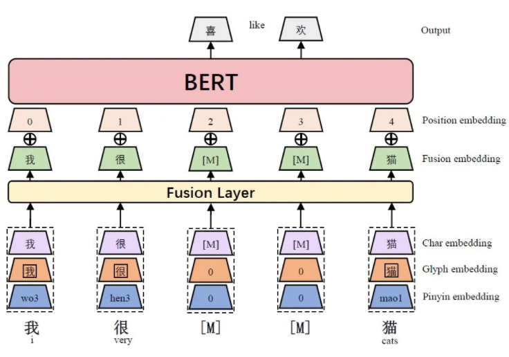

1. embedding 层：将 字符嵌入（char embedding）、字形嵌入（glyph embedding）和拼音嵌入（pinyin embedding） 做拼接；
2. Fusion Layer 层：将 拼接后的 embedding 向量 做 Fusion 得到 一个 d 维的 Fusion embedding;
3. 位置拼接：将 Fusion embedding 和 位置嵌入（position embedding）、片段嵌入（segment embedding）相加；
4. Transformer-Encoder层

### 3.2 模型改进点介绍

1. 在底层的融合层（Fusion Layer）融合了除字嵌入（Char Embedding）之外的字形嵌入（Glyph Embedding）和拼音嵌入（Pinyin Embedding），得到融合嵌入（Fusion Embedding），再与位置嵌入相加，就形成模型的输入；
2. 抛弃预训练任务中的NSP任务。 由于预训练时没有使用NSP任务，因此模型结构图省略了片段嵌入（segment embedding）。实际上下游任务输入为多个段落时（例如：文本匹配、阅读理解等任务），是采用了segment embedding；

### 3.3 模型介绍

#### 3.3.1 embedding 层介绍

##### 3.3.1.1 字形嵌入（Glyph Embedding）

字形嵌入使用不同字体的汉字图像得到。每个图像都是 24*24 的大小，将**仿宋、行楷和隶书这三种字体的图像向量化，拼接之后再经过一个全连接** ，就得到了汉字的字形嵌入。

> 介绍图
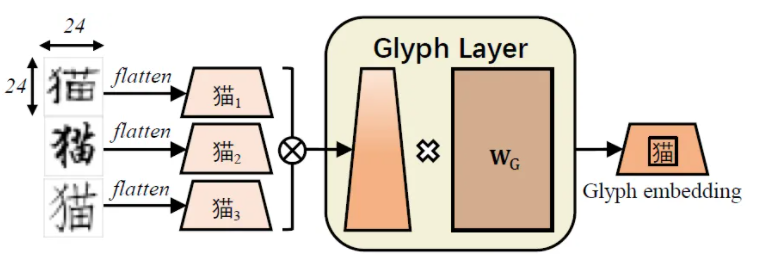

##### 3.3.1.2 拼音嵌入（Pinyin Embedding）

- 思路

1. 首先使用 pypinyin 将每个汉字的拼音转化为罗马化字的字符序列，其中也包含了音调。

> eg：对汉字“猫”，其拼音字符序列就是“mao1”。对于多音字如“乐”，pypinyin能够非常准确地识别当前上下文中正确的拼音，因此ChineseBERT 直接使用 pypinyin 给出的结果。

2. 在获取汉字的拼音序列后，再对该序列使用宽度为 2 的 CNN 与最大池化，得到最终的拼音序列。

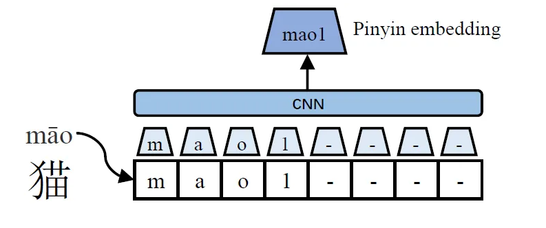

> 注意：每个字符的拼音序列长度固定为8，当不满足长度时，使用“-”进行padding。

##### 3.3.1.3 字嵌入（Char Embedding）

字嵌入（Char Embedding） 与原始BERT模型中的token embedding一致，仅在字符粒度上进行embedding。

#### 3.3.2 Fusion Layer 层

- 思路

1. 将字符对应的字符嵌入、符号嵌入和拼音嵌入拼接起来；
2. 然后通过一个全连接层，最终得到融合嵌入。 

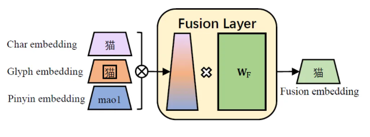

#### 3.3.3 Pretraining 预训练

##### 3.3.3.1 数据来源

预训练数据来自 [CommonCrawl](https://commoncrawl.org/)，在经过数据清洗后，用于预训练 ChineseBERT 的数据规模为约 4B 个汉字。我们使用 LTP toolkit 识别词的边界。

##### 3.3.3.2 Masking 操作

预训练的一大关键步骤是确定如何掩码（Masking）输入文本。ChineseBERT 综合使用两种掩码策略：全词掩码（Whole Word Masking, WWM）与字掩码（Char Masking, CM）。

- 字掩码（Char Masking, CM）：最简洁最直观的掩码方法，以单个汉字为单位进行掩码。
- 全词掩码（Whole Word Masking, WWM）：以词为单位，将词中的所有字掩码。注意基本的输入单元依然是字，只是一个词包含的所有汉字都被掩码。比如，“我喜欢紫禁城”在掩码词“紫禁城”之后就是“我喜欢[M][M][M]”，而非“我喜欢[M]”。

使用两种掩码方式易于模型从不同的角度融合字、字形、拼音及上下文信息。

##### 3.3.3.3 预训练细节

由于 ChineseBERT 结构与原始 BERT 在输入层的结构不同，所以 ChineseBERT 从头开始预训练而不用 BERT 初始化。

为了习得短期上下文与长期上下文，ChineseBERT 在 Packed Input 与 Single Input 之间交替训练：

- Packed Input 是将模型的输入扩展到最大长度 512，作为输入的概率为 0.9；
- Single Input 则将单个句子作为输入，Single Input 作为输入的概率是 0.1。

无论是 Packed Input 还是 Single Input，都在 90% 的时间使用 WWM，在 10% 的时间使用 CM。除此之外，ChineseBERT 还使用了动态掩码策略，避免重复的预训练语料。

> Base与Large模型的层数与原始BERT一致，分别是12层和24层，输入维度和头数分别为768/12和1024/16。Base模型训练了500K步，学习率为1e-4，warmup步数为20k，batch大小为3.2K。Base模型训练280K步，学习率为3e-4，warmup步数为90k，batch大小为8K。

## 四、实验结果

### 4.1 机器阅读理解

数据集介绍：

- CMRC 2018 是抽取式机器阅读理解任务；
- CJRC 则额外包含了“无答案”问题。

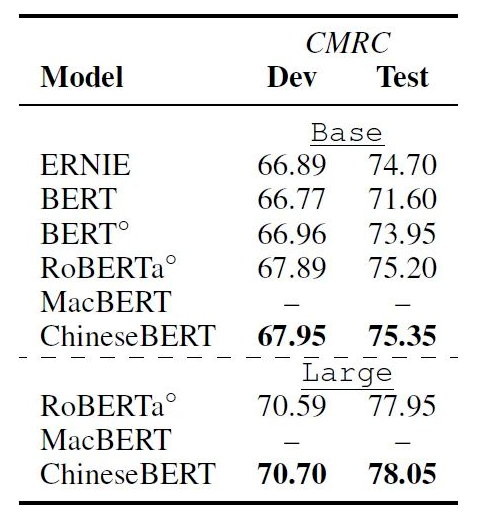

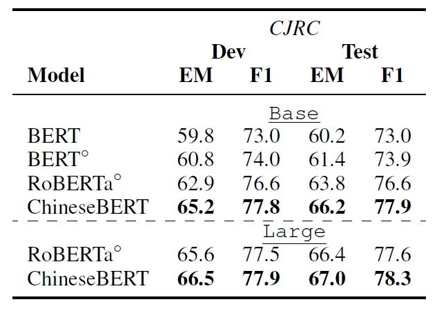

### 4.2 自然语言推理

> 自然语言推理数据集为 XNLI，包含了 2.5K 的验证数据和 5K 的测试数据

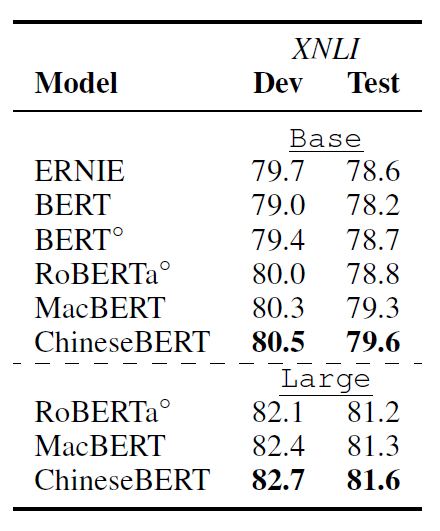

### 4.3 文本分类

文本分类数据集：

- THUC-News；
- ChnSentiCorp；
- TNEWS

> 前两个数据集较为简单，即使是 vanilla BERT 模型都能取得超过 95% 的准确率，而 TNEW 数据集则是一个 15 类短文本新闻分类数据集，难度更大。

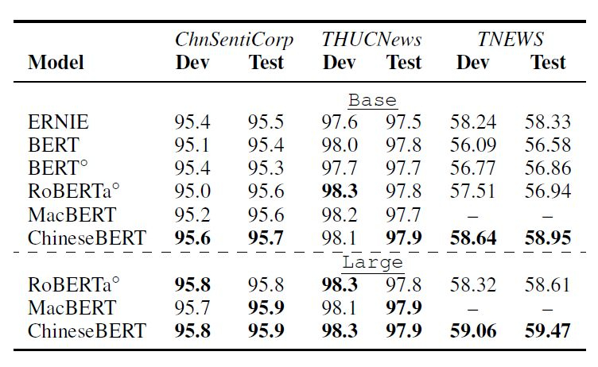

### 4.4 句对匹配

句对匹配数据集:

- LCQMC 
- BQ Corpus，

每条数据给出两个句子，需要判断它们是否有语义相关性。

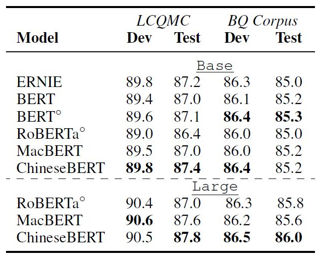

### 4.5 命名实体识别

命名实体识别数据集:

- OntoNotes 4.0 包括 18 种实体类别
- Weibo。包括 4 种实体类别。

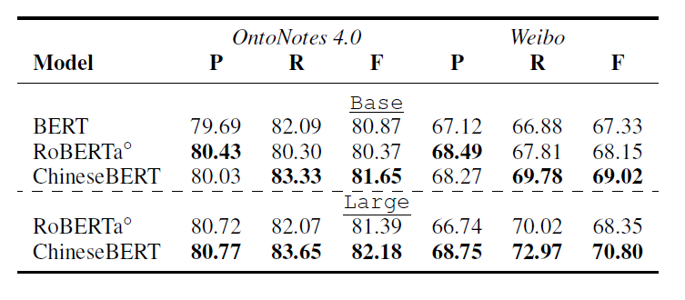

### 4.6 中文分词

中文分词数据集:

- MSRA 
- PKU

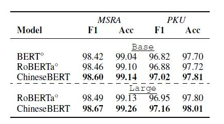

## 五、Ablation Studies

### 5.1 The Effect of Glyph Embeddings andPinyin Embeddings

首先我们探究字形嵌入和拼音嵌入是否对下游任务有效。我们在命名实体识别数据集 OntoNotes 4.0 上实验。我们分别去掉字形嵌入、拼音嵌入以及二者，检验它们在测试集上的效果。

结果如下表所示。可以看到，不管是移除字形嵌入还是拼音嵌入，都会严重损害模型效果：移除字形嵌入使 F1 值降低 1.52，移除拼音嵌入使模型 F1 值下降 1.17，而移除两者导致模型 F1 值下降 1.89。以上结果表明了，字形嵌入和拼音嵌入具备一定的信息增益效果。

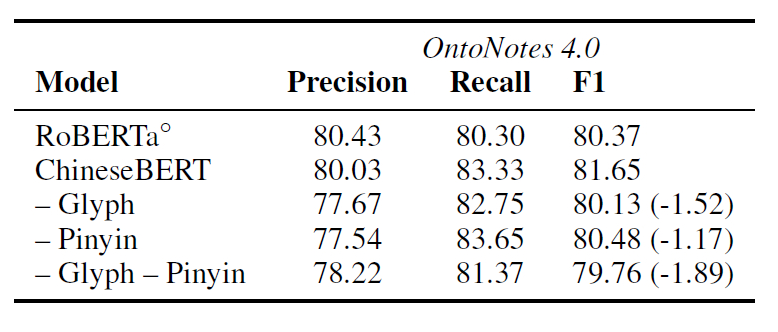

### 5.2  The Effect of Training Data Size

因为引入了字形与拼音信息，我们猜测在更小的下游任务训练数据上，ChineseBERT 能有更好的效果。为此，我们随机从 OntoNotes 4.0 训练集中随机选择 10%~90% 的训练数据，并保持其中有实体的数据与无实体的数据的比例。

结果如下表所示。ChineseBERT 在小数据下的确具有更好的效果，尤其是当训练数据 >30% 时，ChineseBERT 的效果提升更加显著。这是因为，好的字形嵌入和拼音嵌入需要一定的训练数据才能习得，不充分的训练数据会使这二者不能得到充分训练。

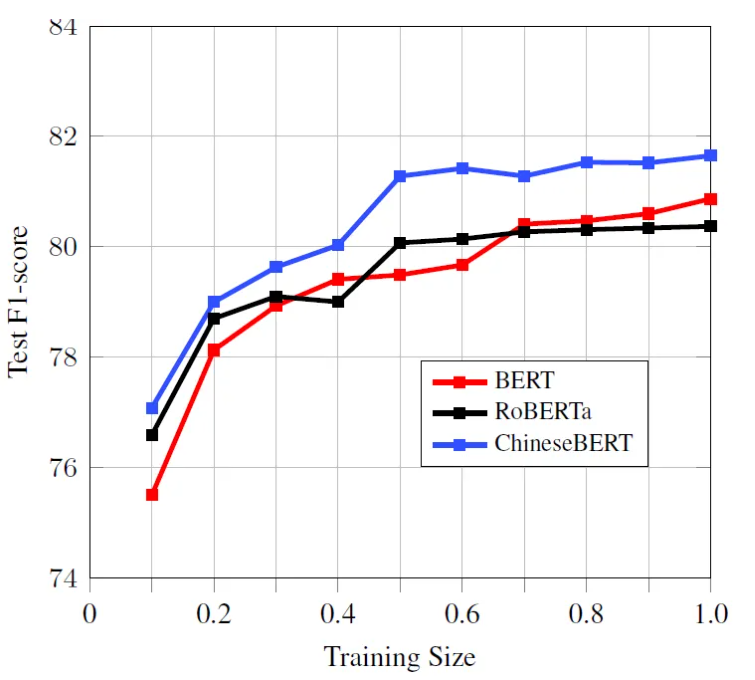

## 参考

1. [ChineseBERT: Chinese Pretraining Enhanced by Glyph and Pinyin Information](https://arxiv.org/abs/2106.16038)
2. [ChineseBert github](https://github.com/ShannonAI/ChineseBert)
3. [ACL 2021 | ChineseBERT：香侬科技提出融合字形与拼音信息的中文预训练模型](https://tianguoguo.fun/2021/07/10/ACL-2021-ChineseBERT-香侬科技提出融合字形与拼音信息的中文预训练模型/)
4. [ACL2021论文之ChineseBERT：融合字形与拼音信息的中文预训练模型](https://zhuanlan.zhihu.com/p/393617564)

