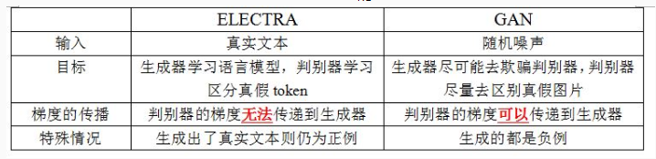
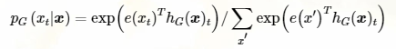
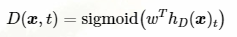
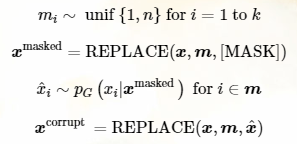
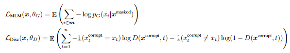
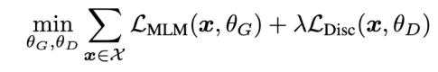

# 【关于 ELECTRA 】 那些的你不知道的事

> 作者：杨夕
> 
> 个人github：https://github.com/km1994/nlp_paper_study
> 
> 论文链接：https://openreview.net/pdf?id=r1xMH1BtvB
> 
> 代码链接：https://github.com/google-research/bert
> 
> 【注：手机阅读可能图片打不开！！！】

## 目录

- [【关于 ELECTRA 】 那些的你不知道的事](#关于-electra--那些的你不知道的事)
  - [目录](#目录)
  - [摘要](#摘要)
  - [动机](#动机)
  - [核心任务](#核心任务)
  - [判别器 & 生成器](#判别器--生成器)
    - [算法流程](#算法流程)
    - [Electra 与 GAN 不同 的原因](#electra-与-gan-不同-的原因)
    - [具体介绍](#具体介绍)
  - [参考](#参考)

## 摘要

Masked language modeling (MLM) pre-training methods such as BERT corruptthe input by replacing some tokens with[MASK]and then train a model to re-construct the original tokens.
诸如BERT之类的掩码语言建模（MLM）预训练方法通过用[MASK]替换一些标记来破坏输入，然后训练模型以重建原始标记。

While they produce good results when transferredto downstream NLP tasks, they generally require large amounts of compute to beeffective. As an alternative, we propose a more sample-efficient pre-training taskcalled replaced token detection.  
虽然它们在转移到下游NLP任务时会产生良好的结果，但是它们通常需要大量计算才能有效。

Instead of masking the input, our approach corrupts it by replacing some tokens with plausible alternatives sampled from a small generator network.   Then,  instead of training a model that predicts the original identities of the corrupted tokens, we train a discriminative model that predicts whether each token in the corrupted input was replaced by a generator sampleor not.  
作为替代方案，我们提出了一种更有效的样本预训练任务，称为替换令牌检测。我们的方法不是掩盖输入，而是通过使用从 small generator network 采样的合理替代物替换一些令牌来破坏输入。然后，我们训练一个判别模型，该模型预测损坏的输入中的每个标记是否被生成器采样器代替，而不是训练一个预测损坏的令牌的原始身份的模型。

Thorough experiments demonstrate this new pre-training task is more ef-ficient than MLM because the task is defined over alli nput tokens rather than just the small subset that was masked out.  As a result, the contextual representations learned by our approach substantially outperform the ones learned by BERT given the same model size, data, and compute.  The gains are particularly strongfor  small  models;  for  example,  we  train  a  model  on  one  GPU  for  4  days  that outperforms GPT (trained using 30x more compute) on the GLUE natural lan-guage understanding benchmark. Our approach also works well at scale, where itperforms comparably to RoBERTa and XLNet while using less than 1/4 of their compute and outperforms them when using the same amount of compute.
全面的实验表明，这种新的预训练任务比MLM更有效，因为该任务是定义为整体输入标记，而不是仅被掩盖的较小子集。结果，在模型大小，数据和计算相同的情况下，我们的方法所学习的上下文表示大大优于BERT所学习的上下文表示。小型机型的收益尤为明显。例如，我们在一个GPU上训练了4天的模型，该模型在GLUE自然语言理解基准上胜过GPT（使用30倍的计算能力进行训练）。我们的方法在规模上也行之有效，在使用少于1/4的计算时，其性能与RoBERTa和XLNet相当，而在使用相同数量的计算时，其性能则优于RoBERTa和XLNet。

## 动机

在训练Bert的时候，在输入上操作把15%的词语给替换成Mask，然后这其中有80%是Mask，有10%是替换成其他词语，最后剩下10%保持原来的词语。

可以看到，Bert的训练中，每次相当于只有15%的输入上是会有loss的，而其他位置是没有的，这就导致了每一步的训练并没有被完全利用上，导致了训练速度慢。换句话说，就是模型只学习到 15%的 token 信息；

## 核心任务

- 核心：将生成式的Masked language model(MLM)预训练任务改成了判别式的Replaced token detection(RTD)任务，判断当前token是否被语言模型替换过；
- 思路：利用一个基于MLM的Generator来替换example中的某些个token，然后丢给Discriminator来判别

## 判别器 & 生成器

如下图所示，首先会训练一个生成器来生成假样本，然后Electra去判断每个token是不是被替换了。

### 算法流程

1. Generator G:
   1. 输入经过随机选择设置为[MASK];
   2. 输入给 G，G 负责把[MASK]变成替换过的词;
2. Discriminator D:
   1. 预测 输入的句子 每个位置上的词语是否被替换过；
   
> 注： 
> 1. Discriminator是训练完之后我们得到的预训练模型，Generator在训练完之后就没有用了

### Electra 与 GAN 不同 的原因

1. D 的 loss 没有反向传播到 G：Generator并不像对抗神经网络那样需要等Discriminator中传回来的梯度，而是像Bert一样那样去尝试预测正确的词语，从而计算损失（Electra不是GAN的根本原因）；
2. 如果 G 生成的 sample 是原始的 token，这个 token 将被看作 “real” 而不是 “fake”；
3. G 用极大似然法训练而不是对抗方法去迷惑 D
4. G 的 input 不是 GAN 中的噪声向量

### 具体介绍

- 训练 两个 网络： 生成器 G 和 判别器 D，均包含了一个 Transformer 的 encoder（将 input 的序列表示成隐向量表示）
-  生成器 G：给定位置 t，G 接 softmax 生成 xt：

> e 表示 token embedding

- 判别器 D：对给定位置 t，D 判断 xt 来自 G 还是原始的数据分布：

- G 用来执行 MLM，给定输入序列 X（x1…xn），首先随机选择一组（15%）mask 的位置，这些位置的 token 被替换为 [MASK]，G 要学习最大化 masked-out tokens 的似然，D 要区分被 G 生成的 sample 替换的 token。具体而言，通过替换 masked-out tokens 为 generator samples 创建损坏的 X 序列，然后训练判别器来识别 X 中的 tokens 和原始的 input 序列是否匹配：

- 损失函数

## 参考

1. [ELECTRA 论文笔记](https://yam.gift/2019/12/08/Paper/2019-12-08-ELECTRA-Paper/)
2. [Electra: 判别还是生成，这是一个选择](https://wemp.app/posts/54be8907-4c1e-4583-9219-0b2474ea3a29)

 

